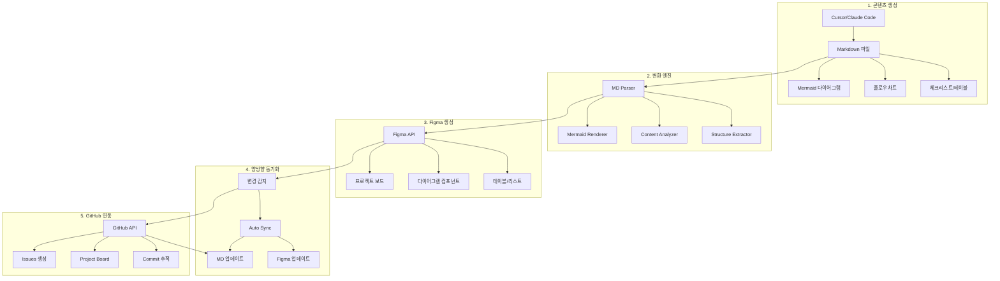
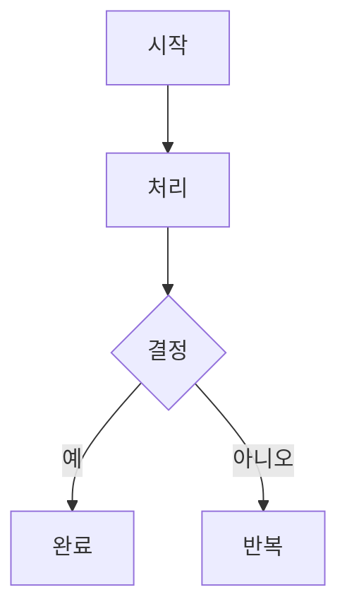
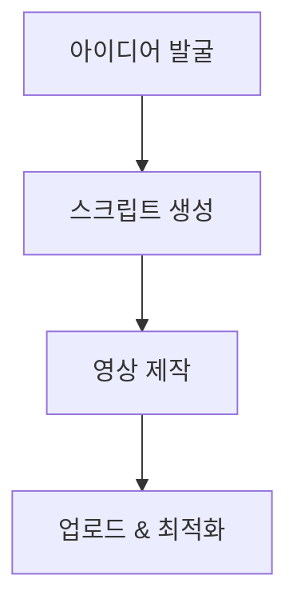

# 📋 MD-to-Figma 프로젝트 보드 자동화 PRD

## 📊 Executive Summary

**문제점**: 커서/Claude Code로 작성한 Markdown 기획 문서(Mermaid, 플로우차트)를 Figma로 수동 이전하는 과정이 비효율적이며, PM-개발자-디자이너 간 동기화가 어려움

**솔루션**: MD 파일을 자동으로 파싱하여 Figma 프로젝트 보드로 변환하고, 양방향 동기화를 통해 실시간 협업 환경 구축

**목표**: 기획 문서 작성부터 제품 개발까지의 전체 프로세스를 하나의 통합 워크플로우로 자동화

---

## 🎯 프로젝트 개요

### 비즈니스 배경

#### 현재 워크플로우의 문제점
1. **매체 단절**: MD 파일(기획) ↔ Figma(시각화) ↔ GitHub(개발) 간 수동 이전
2. **버전 불일치**: 각 도구에서 별도 관리되어 최신 버전 추적 어려움
3. **커뮤니케이션 오버헤드**: 변경사항을 각 팀에 수동으로 전달
4. **시각화 재작업**: Mermaid/플로우차트를 Figma에서 다시 그려야 함

#### 이상적인 워크플로우
```
Cursor/Claude Code (MD 작성)
    ↓ [자동 변환]
Figma 프로젝트 보드 (시각화)
    ↓ [양방향 동기화]
GitHub Issues/Projects (개발 관리)
    ↓ [진행 상황 반영]
MD 파일 자동 업데이트
```

### 핵심 가치 제안

**PM을 위한 가치**
- 기획 문서를 한 번만 작성하면 자동으로 시각화
- 팀 전체가 보는 단일 진실 공급원(Single Source of Truth)
- 실시간 프로젝트 진행 상황 추적

**개발자를 위한 가치**
- Figma 보드에서 GitHub Issue 자동 생성
- 코드 변경사항이 문서에 자동 반영
- 기술 스펙과 UI가 항상 동기화

**디자이너를 위한 가치**
- 최신 기획 내용이 자동으로 Figma에 반영
- 시스템 아키텍처와 UI 디자인을 한 곳에서 관리
- 개발자와 실시간 협업 가능

---

## 🏗️ 시스템 아키텍처

### 전체 시스템 구조



### 핵심 컴포넌트

#### 1. MD Parser & Analyzer
**기능**
- Markdown 파일 구조 분석
- Mermaid/PlantUML 코드 추출
- 헤딩 계층 구조 파악
- 체크리스트/테이블/리스트 식별

**기술 스택**
- `remark` / `unified` (MD 파싱)
- `mermaid-js` (다이어그램 렌더링)
- `gray-matter` (Front matter 추출)

#### 2. Figma Converter
**기능**
- MD 구조를 Figma 페이지/프레임으로 변환
- Mermaid 다이어그램을 Figma 노드/커넥터로 변환
- 테이블을 Figma Auto Layout으로 변환
- 체크리스트를 인터랙티브 컴포넌트로 변환

**기술 스택**
- `figma-api` (REST API)
- `figma-js` (타입 정의)
- Custom rendering engine

#### 3. Sync Engine
**기능**
- 파일 변경 감지 (Watch mode)
- 충돌 해결 로직
- 증분 업데이트 (변경 부분만)
- 버전 히스토리 관리

**기술 스택**
- `chokidar` (파일 감시)
- `diff-match-patch` (변경 감지)
- WebSocket (실시간 동기화)

#### 4. GitHub Integration
**기능**
- Figma 태스크 → GitHub Issue 변환
- Commit/PR 상태 → Figma 보드 반영
- 브랜치별 진행 상황 시각화

**기술 스택**
- `@octokit/rest` (GitHub API)
- Webhook 리스너

---

## 🎨 Figma 프로젝트 보드 템플릿 구조

### 1. 페이지 계층 구조

```
📁 프로젝트명 (Root)
├── 📄 Overview (개요)
│   ├── 프로젝트 요약
│   ├── 타임라인
│   └── 팀 구성
│
├── 📄 System Architecture (시스템 아키텍처)
│   ├── High-level 구조도
│   ├── 데이터 플로우
│   └── 기술 스택
│
├── 📄 User Flow (사용자 플로우)
│   ├── 사용자 여정
│   ├── 상태 다이어그램
│   └── 인터랙션 시나리오
│
├── 📄 Features (기능 명세)
│   ├── Feature 1
│   │   ├── 설명
│   │   ├── 플로우차트
│   │   └── 체크리스트
│   ├── Feature 2
│   └── ...
│
├── 📄 API Specification (API 명세)
│   ├── 엔드포인트 목록
│   ├── 요청/응답 포맷
│   └── 에러 핸들링
│
├── 📄 Database Schema (데이터베이스)
│   ├── ERD
│   ├── 테이블 정의
│   └── 관계도
│
├── 📄 UI Components (UI 컴포넌트)
│   ├── 컴포넌트 라이브러리
│   ├── 디자인 시스템
│   └── 프로토타입
│
└── 📄 Development Roadmap (개발 로드맵)
    ├── Sprint 보드
    ├── 마일스톤
    └── 진행 상황
```

### 2. 컴포넌트 라이브러리

#### 다이어그램 컴포넌트
```
🔷 노드 (Node)
├── 시작/종료 (Rounded Rectangle)
├── 프로세스 (Rectangle)
├── 의사결정 (Diamond)
└── 데이터 (Parallelogram)

➡️ 커넥터 (Connector)
├── 일반 플로우 (Arrow)
├── 데이터 플로우 (Dashed Arrow)
└── 조건부 (Labeled Arrow)

📦 컨테이너 (Container)
├── 시스템 경계 (Frame)
├── 모듈 그룹 (Section)
└── 레이어 (Layer)
```

#### 리스트/테이블 컴포넌트
```
☑️ 체크리스트 아이템
├── 미완료 (Checkbox)
├── 진행 중 (Progress)
└── 완료 (Checked)

📊 테이블 셀
├── 헤더 (Header)
├── 데이터 (Data)
└── 액션 (Action Button)
```

#### 상태 인디케이터
```
🟢 완료 (Completed)
🟡 진행 중 (In Progress)
🔴 블로킹 (Blocked)
⚪ 대기 (Pending)
```

### 3. 인터랙티브 요소

#### 클릭 가능한 요소
- **체크박스**: 클릭 시 상태 변경 + MD 파일 업데이트
- **노드**: 클릭 시 상세 정보 패널 표시
- **링크**: 관련 GitHub Issue/PR로 이동

#### 실시간 업데이트
- **진행률 바**: GitHub 진행 상황 자동 반영
- **타임스탬프**: 마지막 업데이트 시간 표시
- **작업자 아바타**: 현재 작업 중인 팀원 표시

---

## 🔄 MD-to-Figma 변환 규칙

### Markdown 요소별 변환 매핑

#### 1. 헤딩 (Headers)
```markdown
# H1 → Figma 페이지 (Page)
## H2 → Figma 섹션 (Section Frame)
### H3 → Figma 프레임 (Frame)
#### H4 → Figma 그룹 (Group)
```

#### 2. Mermaid 다이어그램
```markdown

↓
Figma: 노드 + 커넥터로 구성된 플로우차트
- A → 둥근 사각형 (Start/End)
- B → 사각형 (Process)
- C → 마름모 (Decision)
- D, E → 둥근 사각형
- 화살표 → 자동 연결 라인
```

#### 3. 체크리스트
```markdown
- [ ] 기능 A 개발
- [x] 기능 B 개발
- [ ] 기능 C 개발
↓
Figma: 인터랙티브 체크박스 리스트
- 미완료: ⚪ + 텍스트
- 완료: ✅ + 취소선 텍스트
```

#### 4. 테이블
```markdown
| 기능 | 우선순위 | 담당자 | 상태 |
|------|---------|--------|------|
| 로그인 | High | Alice | 완료 |
| 대시보드 | Medium | Bob | 진행중 |
↓
Figma: Auto Layout 테이블
- 헤더: 볼드 텍스트 + 배경색
- 데이터: 일반 텍스트
- 상태: 컬러 태그 컴포넌트
```

#### 5. 코드 블록
```markdown
```typescript
interface User {
  id: string;
  name: string;
}
```
↓
Figma: 코드 스타일 프레임
- 폰트: Monospace
- 배경: 어두운 색
- 문법 강조 유지
```

#### 6. 리스트 (순서 있음/없음)
```markdown
1. 첫 번째 단계
2. 두 번째 단계
   - 세부 사항 A
   - 세부 사항 B
↓
Figma: 계층적 리스트 레이아웃
- 숫자/불릿 포인트
- 들여쓰기 표현
- Auto Layout 사용
```

---

## 🛠️ 기술 구현 방안

### Phase 1: 핵심 변환 엔진 (MVP)

#### 1.1 MD Parser 구현
```typescript
// 주요 기능
interface MDParser {
  parseFile(filePath: string): Document;
  extractMermaid(content: string): MermaidDiagram[];
  extractMetadata(content: string): Metadata;
  buildStructure(ast: Node): DocumentStructure;
}

// 사용 예시
const parser = new MDParser();
const doc = parser.parseFile('project-prd.md');
console.log(doc.structure); // 문서 계층 구조
console.log(doc.diagrams);  // Mermaid 다이어그램들
```

#### 1.2 Figma Renderer 구현
```typescript
// 주요 기능
interface FigmaRenderer {
  createPage(title: string): PageNode;
  renderMermaid(diagram: MermaidDiagram): FrameNode;
  renderTable(table: TableData): FrameNode;
  renderChecklist(items: ChecklistItem[]): FrameNode;
}

// 사용 예시
const renderer = new FigmaRenderer(figmaApiKey);
const page = renderer.createPage('System Architecture');
const diagram = renderer.renderMermaid(doc.diagrams[0]);
```

#### 1.3 변환 파이프라인
```typescript
// 전체 파이프라인
async function convertMDToFigma(mdFilePath: string, figmaFileKey: string) {
  // 1. MD 파일 파싱
  const parser = new MDParser();
  const doc = parser.parseFile(mdFilePath);

  // 2. Figma 파일 생성/로드
  const figma = new FigmaClient(apiKey);
  const file = await figma.getFile(figmaFileKey);

  // 3. 변환 및 렌더링
  const renderer = new FigmaRenderer(figma);

  for (const section of doc.sections) {
    const page = renderer.createPage(section.title);

    for (const diagram of section.diagrams) {
      await renderer.renderMermaid(diagram, page);
    }

    for (const table of section.tables) {
      await renderer.renderTable(table, page);
    }
  }

  // 4. 메타데이터 저장
  await figma.setMetadata(file.id, {
    sourceFile: mdFilePath,
    lastSync: new Date(),
    version: doc.version
  });

  return file.id;
}
```

### Phase 2: 양방향 동기화

#### 2.1 파일 감시 시스템
```typescript
import chokidar from 'chokidar';

class SyncEngine {
  private watcher: chokidar.FSWatcher;
  private figmaClient: FigmaClient;

  startWatching(mdFilePath: string, figmaFileKey: string) {
    this.watcher = chokidar.watch(mdFilePath, {
      persistent: true,
      ignoreInitial: true
    });

    this.watcher.on('change', async (path) => {
      console.log(`File ${path} changed`);
      await this.syncToFigma(path, figmaFileKey);
    });
  }

  async syncToFigma(mdPath: string, figmaKey: string) {
    // 변경된 부분만 감지
    const diff = this.detectChanges(mdPath);

    // 증분 업데이트
    for (const change of diff.changes) {
      await this.updateFigmaNode(figmaKey, change);
    }
  }
}
```

#### 2.2 Figma Webhook 수신
```typescript
import express from 'express';

const app = express();

// Figma에서 변경 사항 수신
app.post('/figma-webhook', async (req, res) => {
  const event = req.body;

  if (event.event_type === 'FILE_UPDATE') {
    const fileKey = event.file_key;
    const mdPath = await getMDPathForFigma(fileKey);

    // Figma → MD 역방향 동기화
    await syncFigmaToMD(fileKey, mdPath);
  }

  res.sendStatus(200);
});
```

### Phase 3: GitHub 연동

#### 3.1 Issue 자동 생성
```typescript
class GitHubIntegration {
  async createIssuesFromChecklist(
    checklist: ChecklistItem[],
    repo: string
  ) {
    const octokit = new Octokit({ auth: githubToken });

    for (const item of checklist) {
      if (!item.completed && !item.hasIssue) {
        const issue = await octokit.issues.create({
          owner: 'username',
          repo: repo,
          title: item.text,
          body: `자동 생성된 이슈\n\n소스: ${item.sourceFile}`,
          labels: ['auto-generated', item.priority]
        });

        // MD 파일에 Issue 번호 추가
        await this.linkIssueToMD(item, issue.data.number);
      }
    }
  }
}
```

#### 3.2 진행 상황 자동 반영
```typescript
// GitHub Webhook으로 상태 업데이트 수신
app.post('/github-webhook', async (req, res) => {
  const event = req.body;

  if (event.action === 'closed' && event.issue) {
    const issueNumber = event.issue.number;

    // MD 파일에서 해당 체크리스트 완료 처리
    await markChecklistComplete(issueNumber);

    // Figma 보드 업데이트
    await updateFigmaCheckbox(issueNumber, true);
  }

  res.sendStatus(200);
});
```

---

## 📦 제품 명세

### 3가지 사용 모드

#### 모드 1: CLI 도구 (개발자용)
```bash
# 일회성 변환
md-to-figma convert project.md --figma-file ABC123

# 실시간 동기화 (Watch 모드)
md-to-figma watch project.md --figma-file ABC123 --auto-sync

# GitHub 연동
md-to-figma sync project.md --figma-file ABC123 --github owner/repo
```

#### 모드 2: VS Code 확장 (PM/개발자용)
```
기능:
- MD 파일 우클릭 → "Sync to Figma"
- 실시간 미리보기 패널
- Figma 링크 자동 삽입
- 충돌 알림 및 해결
```

#### 모드 3: Web Dashboard (팀 전체용)
```
URL: dashboard.md-to-figma.com

기능:
- 프로젝트 목록 관리
- 실시간 동기화 상태 모니터링
- 팀원 권한 관리
- 변경 이력 추적
- 충돌 해결 UI
```

### 핵심 기능 명세

#### 1. 자동 변환 기능
| 기능 | 설명 | 우선순위 |
|------|------|---------|
| Mermaid → Figma | 플로우차트/시퀀스 다이어그램 자동 변환 | P0 |
| 체크리스트 → 인터랙티브 | 클릭 가능한 체크박스 생성 | P0 |
| 테이블 → Auto Layout | 정렬된 테이블 레이아웃 | P1 |
| 코드 블록 → 코드 프레임 | 문법 강조 유지 | P1 |
| 링크 → 하이퍼링크 | 클릭 가능한 링크 | P2 |

#### 2. 동기화 기능
| 기능 | 설명 | 우선순위 |
|------|------|---------|
| 단방향 (MD→Figma) | MD 변경 시 Figma 자동 업데이트 | P0 |
| 양방향 동기화 | Figma 변경도 MD 반영 | P1 |
| 충돌 감지 | 동시 수정 시 경고 | P1 |
| 버전 관리 | 변경 이력 추적 | P2 |

#### 3. GitHub 연동
| 기능 | 설명 | 우선순위 |
|------|------|---------|
| Issue 생성 | 체크리스트 → GitHub Issue | P1 |
| 상태 동기화 | Issue 완료 → 체크박스 완료 | P1 |
| PR 연결 | Figma 노드 → PR 링크 | P2 |
| Commit 추적 | 코드 변경 → 문서 업데이트 | P2 |

---

## 🎨 Figma 템플릿 디자인

### 템플릿 1: "프로젝트 킥오프" 템플릿

```
📄 페이지 구성:
1. Cover (표지)
   - 프로젝트명
   - 버전
   - 작성일/수정일
   - 팀원 아바타

2. Overview (개요)
   - 프로젝트 요약 (3줄)
   - 주요 목표 (불릿 포인트)
   - 타임라인 (간트 차트)
   - 핵심 지표

3. System Architecture (시스템 구조)
   - High-level 다이어그램
   - 기술 스택 카드
   - 데이터 플로우

4. Features (기능 목록)
   - 기능별 섹션
   - 각 기능마다:
     * 설명
     * 플로우차트
     * 체크리스트
     * 관련 Issue 링크
```

### 템플릿 2: "API 문서" 템플릿

```
📄 페이지 구성:
1. API Overview
   - Base URL
   - 인증 방식
   - 공통 헤더

2. Endpoints (엔드포인트별)
   - HTTP 메서드 + 경로
   - 요청 파라미터 테이블
   - 응답 포맷 (JSON 구조)
   - 에러 코드 테이블
   - 예시 요청/응답

3. Data Models
   - 엔티티 다이어그램 (ERD)
   - 스키마 정의 테이블
```

### 템플릿 3: "스프린트 보드" 템플릿

```
📄 페이지 구성:
1. Sprint Overview
   - 스프린트 번호/기간
   - 목표
   - 팀 속도 (Velocity)

2. Backlog
   - To Do (대기)
   - In Progress (진행 중)
   - Review (리뷰)
   - Done (완료)

   각 칼럼:
   - 카드 (GitHub Issue와 연결)
   - 담당자 아바타
   - 예상 시간
   - 라벨/태그

3. Burndown Chart
   - 남은 작업량 그래프
   - 예상 vs 실제 추이
```

---

## 🚀 개발 로드맵

### Phase 1: MVP (2개월)

**Week 1-2: 기초 파서 구현**
- [ ] Markdown 파싱 라이브러리 선정
- [ ] Mermaid 추출 로직 구현
- [ ] 헤딩 구조 분석 기능
- [ ] Front matter 메타데이터 추출

**Week 3-4: Figma API 연동**
- [ ] Figma REST API 인증 구현
- [ ] 페이지/프레임 생성 기능
- [ ] 기본 노드 렌더링 (사각형, 텍스트)
- [ ] 레이아웃 자동 정렬

**Week 5-6: Mermaid → Figma 변환**
- [ ] Mermaid 파싱 (graph, flowchart)
- [ ] 노드 타입별 Figma 컴포넌트 매핑
- [ ] 커넥터(화살표) 자동 연결
- [ ] 레이블 텍스트 배치

**Week 7-8: CLI 도구 & 테스트**
- [ ] CLI 인터페이스 구현
- [ ] 설정 파일 지원 (config.json)
- [ ] 에러 핸들링
- [ ] 통합 테스트 (실제 MD → Figma)

### Phase 2: 자동화 & 동기화 (1개월)

**Week 9-10: Watch 모드 구현**
- [ ] 파일 감시 시스템 (chokidar)
- [ ] 변경 감지 로직
- [ ] 증분 업데이트 (변경 부분만)
- [ ] 디바운스 처리 (과도한 업데이트 방지)

**Week 11-12: 양방향 동기화**
- [ ] Figma Webhook 설정
- [ ] Figma → MD 역변환 로직
- [ ] 충돌 감지 및 해결 UI
- [ ] 버전 히스토리 관리

### Phase 3: GitHub 연동 (1개월)

**Week 13-14: Issue 연동**
- [ ] GitHub API 인증
- [ ] 체크리스트 → Issue 자동 생성
- [ ] Issue 번호 MD에 자동 삽입
- [ ] Issue 상태 → 체크박스 동기화

**Week 15-16: Project Board 연동**
- [ ] GitHub Projects v2 API 연동
- [ ] Figma 보드 → GitHub Project 동기화
- [ ] 칸반 보드 자동 업데이트
- [ ] PR/Commit 링크 추적

### Phase 4: UI/UX 개선 (1개월)

**Week 17-18: VS Code 확장**
- [ ] 확장 프로그램 기본 구조
- [ ] 우클릭 메뉴 "Sync to Figma"
- [ ] 미리보기 패널 (WebView)
- [ ] 상태 바 인디케이터

**Week 19-20: Web Dashboard**
- [ ] Next.js 대시보드 구축
- [ ] 프로젝트 목록 관리
- [ ] 실시간 동기화 상태 표시
- [ ] 팀원 권한 관리

---

## 💰 비즈니스 모델

### 타겟 고객

**Primary Target**
- 스타트업 (5-20명 규모)
- 제품 팀 (PM + 개발자 + 디자이너)
- 원격 협업이 많은 팀

**Secondary Target**
- 프리랜서 기획자/개발자
- 에이전시 (클라이언트 프로젝트 관리)
- 오픈소스 프로젝트 관리자

### 가격 정책

#### Free Tier
- 월 3개 프로젝트
- 기본 MD → Figma 변환
- 커뮤니티 지원

#### Pro Tier ($19/월)
- 무제한 프로젝트
- 실시간 동기화
- GitHub 연동
- 우선 지원

#### Team Tier ($49/월, 5명)
- Pro 기능 전체
- 팀 워크스페이스
- 권한 관리
- SSO (Single Sign-On)
- 전담 지원

#### Enterprise Tier (협의)
- 온프레미스 배포
- 커스텀 템플릿 개발
- API 접근
- SLA 보장

### 수익 예상

| 시점 | Free 사용자 | Pro 사용자 | Team | 월 매출 |
|------|------------|-----------|------|---------|
| 3개월 | 100 | 10 | 2 | $288 |
| 6개월 | 500 | 50 | 10 | $1,440 |
| 12개월 | 2,000 | 200 | 50 | $6,250 |

**Year 1 ARR**: ~$75,000

---

## 🎯 성공 지표 (KPI)

### 제품 지표
- **변환 정확도**: 95% 이상 (사용자 만족도 기준)
- **동기화 지연**: 5초 이내
- **Figma 렌더링 속도**: 1페이지당 10초 이내
- **오류율**: 1% 미만

### 사용자 지표
- **MAU**: 500명 (6개월)
- **유료 전환율**: 10%
- **주간 활성 프로젝트**: 프로젝트당 평균 3회 동기화
- **유지율**: 3개월 60%

### 비즈니스 지표
- **MRR**: $6,000 (12개월)
- **CAC**: $30
- **LTV**: $180 (평균 10개월 구독)
- **LTV/CAC**: 6:1

---

## 🛡️ 리스크 & 대응

### 기술적 리스크

**리스크 1: Figma API 제약**
- **문제**: API Rate Limit, 기능 제한
- **대응**:
  - 캐싱 전략으로 API 호출 최소화
  - 배치 처리로 효율성 향상
  - Figma Plugin API 병행 활용

**리스크 2: Mermaid 복잡도**
- **문제**: 복잡한 다이어그램 변환 어려움
- **대응**:
  - 단계별 지원 (간단한 것부터)
  - 수동 조정 옵션 제공
  - 커뮤니티 피드백으로 개선

**리스크 3: 동기화 충돌**
- **문제**: 동시 편집 시 충돌
- **대응**:
  - 명확한 충돌 감지 로직
  - 사용자 선택 UI (내 변경 vs 다른 사람 변경)
  - 자동 머지 불가 시 수동 해결 유도

### 비즈니스 리스크

**리스크 1: 시장 검증**
- **문제**: 실제 수요 불확실
- **대응**:
  - 베타 테스터 30명 확보 (지인 + 커뮤니티)
  - 무료 티어로 사용자 확보 후 전환
  - Product Hunt 등 플랫폼 활용

**리스크 2: 경쟁사**
- **문제**: 유사 도구 출현 가능
- **대응**:
  - 빠른 MVP 출시 (First Mover)
  - 틈새 시장 집중 (한국어 지원, YouTube 컨텐츠 제작자)
  - 커뮤니티 구축

**리스크 3: Figma API 정책 변경**
- **문제**: API 접근 제한, 가격 인상
- **대응**:
  - 대안 플랫폼 검토 (Miro, FigJam)
  - 로컬 파일 기반 백업
  - 독립적인 웹 뷰어 개발

---

## 🔧 기술 스택 상세

### Backend
```typescript
- Runtime: Node.js 20+
- Language: TypeScript 5+
- Framework: Fastify (고성능 REST API)
- Parser: unified, remark, remark-parse
- Mermaid: mermaid-js, @mermaid-js/mermaid-cli
- Figma: figma-api, @figma/rest-api-spec
- GitHub: @octokit/rest, @octokit/webhooks
- File Watch: chokidar
- Diff: diff-match-patch
```

### Frontend (Dashboard)
```typescript
- Framework: Next.js 14 (App Router)
- UI: shadcn/ui, Tailwind CSS
- State: Zustand
- Forms: React Hook Form + Zod
- Charts: Recharts
- WebSocket: Socket.io-client
```

### CLI
```typescript
- CLI Framework: Commander.js
- Progress: ora, chalk, inquirer
- Config: cosmiconfig
```

### VS Code Extension
```typescript
- Extension API: @types/vscode
- WebView: React
- Language: TypeScript
```

### Infrastructure
```typescript
- Hosting: Vercel (Dashboard), Railway (API)
- Database: PostgreSQL (Supabase)
- Cache: Redis
- Queue: BullMQ
- Storage: AWS S3 (캐시된 이미지)
- Monitoring: Sentry, LogRocket
```

---

## 💡 다음 단계

### 이번 주 (즉시 실행)
1. **기술 검증 POC**
   - Mermaid → Figma 간단한 변환 프로토타입
   - Figma API 인증 테스트
   - GitHub API 연동 테스트

2. **사용자 인터뷰**
   - PM/개발자/디자이너 각 5명씩 인터뷰
   - 현재 워크플로우 Pain Point 파악
   - 기능 우선순위 검증

3. **경쟁 분석**
   - 유사 도구 조사 (Figma plugins, Miro apps)
   - 차별화 포인트 구체화

### 1개월 내
1. MVP 개발 착수
2. 베타 테스터 30명 모집
3. 첫 번째 YouTube 컨텐츠 (프로젝트 소개 영상)

### 3개월 내
1. MVP 베타 출시
2. Product Hunt 론칭
3. 첫 10명의 유료 고객 확보

---

## 📎 부록

### A. 샘플 MD 파일 구조
```markdown
---
title: YouTube Contents Factory
version: 1.0
figma_file: ABC123XYZ
github_repo: username/youtube-factory
---

# YouTube Contents Factory

## 시스템 아키텍처



## 개발 로드맵

### Phase 1: MVP
- [ ] 스크립트 자동 생성 (Issue #1)
- [ ] 썸네일 생성 (Issue #2)
- [x] 업로드 자동화 (Issue #3)

### Phase 2: 확장
- [ ] A/B 테스트 자동화
- [ ] 성과 분석 대시보드
```

### B. 생성되는 Figma 구조 예시
```
📁 YouTube Contents Factory v1.0
├── 📄 Cover
│   ├── 제목: "YouTube Contents Factory"
│   ├── 버전: "1.0"
│   └── 링크: GitHub, 마지막 동기화 시간
│
├── 📄 시스템 아키텍처
│   └── 🔷 Mermaid 다이어그램
│       ├── 노드: 아이디어 발굴
│       ├── 노드: 스크립트 생성
│       ├── 노드: 영상 제작
│       └── 노드: 업로드 & 최적화
│
└── 📄 개발 로드맵
    ├── 섹션: Phase 1
    │   ├── ☑️ 스크립트 자동 생성 → GitHub #1
    │   ├── ☑️ 썸네일 생성 → GitHub #2
    │   └── ✅ 업로드 자동화 → GitHub #3 (완료)
    └── 섹션: Phase 2
        ├── ☑️ A/B 테스트 자동화
        └── ☑️ 성과 분석 대시보드
```

---

**문서 작성일**: 2025년 10월
**버전**: v1.0
**작성자**: Product Team
**다음 검토일**: 2025년 11월

---

## 🔗 관련 문서
- [자동화 & 컨텐츠 팩토리 통합 PRD](./자동화_컨텐츠_팩토리_통합_PRD.md)
- [YouTube Contents Factory 마스터 플랜](../Contents%20Factory/Process_Automation/YouTube-Content-Automation-Master-Plan.md)
