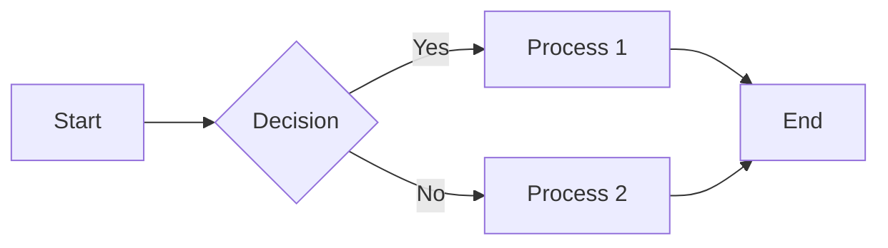

# 📄 PRD: 자동화 기획 시각화 시스템 - Figma/Linear/Notion/GitHub 연동

---

## 1. 목적 (Purpose)

* 반복적인 기획/분석/정리 업무를 자동화하여 효율성을 확보
* 기획(PRD) → 도식화(Figma) → 태스크 관리(Linear) → 코드(GitHub) → 기록(Notion)으로 이어지는 **End-to-End 협업 파이프라인** 구축
* PM, 개발자, 디자이너가 **한 화면에서 기획·디자인·개발을 공유하고 피드백**할 수 있는 시스템 설계
* Claude Code/Cursor에서 생성한 Mermaid 차트를 Figma 프로젝트 보드로 자동 변환
* 문서는 **Markdown 기반**으로 작성·저장 → Notion과 로컬(Mac)에 동기화

---

## 2. 배경 (Background)

### 문제점

* **커뮤니케이션 갭**: 회의 후 전략/운영/실무 층위별 이해 차이 발생
* **반복 업무**: 기획 문서 작성, 다이어그램 그리기, 태스크 생성 등 수작업 소요
* **분산된 도구**: Mermaid 차트는 코드에, 기획은 문서에, 디자인은 Figma에 따로 존재
* **추적의 어려움**: 광고/투자자료/계약 검토 등 콘텐츠 산출물 관리 어려움
* **실시간 동기화 부족**: 기획 변경 시 수동으로 Figma 업데이트 필요

### 기회

* GPT/Claude 기반 자동화로 **PRD와 도식화 자동 생성** 가능
* Figma API를 통한 프로그래밍 방식 디자인 생성
* Figma/Linear/Notion/GitHub 연계를 통해 기획-실행-기록을 **하나의 흐름**으로 연결
* **콘텐츠 팩토리** 구축으로 대량 콘텐츠(분석·보고서·계약 비교 등)도 표준화된 프로세스로 생산

---

## 3. 사용자 (Users)

### 내부 사용자

* **기획자(PM)**: 요구사항 입력 → PRD 자동 생성 & 시각화, Linear에서 전체 프로젝트 관리
* **개발자**: Linear에서 태스크 관리, GitHub PR 연결, Figma에서 기획 맥락 확인
* **디자이너**: Figma에서 기획/코드 진행 상황 확인, UI/UX 설계를 같은 맥락에서 작업

### 외부 사용자 (확장)

* 향후 고객사와 협업 시 적용 가능 (현재는 내부 전용)

---

## 4. 범위 정의 (Scope)

### In-Scope (MVP - Phase 1)

* GPT/Claude → PRD 자동 생성
* PRD → Mermaid 코드 변환 → Figma API 반영
* Mermaid 차트 파싱 (flowchart, sequence, class diagram)
* Figma 프로젝트 보드 템플릿 생성
* 기본 컴포넌트 라이브러리 (노드, 커넥터, 프레임)
* Figma 보드에서 코드/태스크 위치 시각화

### Phase 2 (3~6개월)

* Linear 태스크 ↔ Figma 보드 양방향 연동
* GitHub PR 상태(✅ Merged / 🟡 Open / 🔴 Closed) Figma에서 표시
* Markdown 문서 자동 Notion 기록
* 실시간 동기화 (코드 변경 → Figma 자동 업데이트)
* Git commit 기반 버전 관리

### Phase 3 (6개월~1년)

* Slack/Discord 알림 자동화
* 프로젝트 히스토리 대시보드 구축
* AI 기반 태스크 우선순위 추천
* 커스텀 템플릿 마켓플레이스
* 다국어 지원

### Out-of-Scope (현재)

* 완전 자동 UI 디자인 생성 (와이어프레임만 생성)
* 외부 고객사 공유 기능
* 복잡한 권한 관리 시스템

---

## 5. 사용자 스토리 (User Stories)

* **기획자(PM)**: "내가 작성한 기획 문서가 자동으로 PRD/Flow로 만들어져 Figma에서 팀이 바로 확인할 수 있기를 원한다."
* **개발자**: "내 GitHub PR이 Linear 태스크에 자동 연결되고, Figma에서도 상태를 확인하고 싶다."
* **개발자**: "Claude Code에서 생성한 시스템 다이어그램이 자동으로 Figma에 반영되어 팀과 공유하고 싶다."
* **디자이너**: "Figma에서 기획/코드 진행 상황과 UI/UX 설계를 같은 맥락에서 보고 싶다."
* **PM**: "Linear에서 태스크를 관리하고, Notion에서 기록과 문서를 축적하고 싶다."
* **팀 전체**: "프로젝트 전체 흐름을 한눈에 볼 수 있는 시각적 대시보드가 필요하다."

---

## 6. 시스템 아키텍처 (System Architecture)

### 6.1 전체 시스템 구조

```
┌─────────────────────────────────────────────────────────────────────┐
│                         INPUT LAYER                                 │
├─────────────────────────────────────────────────────────────────────┤
│  Claude Code    Cursor    Markdown Files    Text Input    Voice     │
│  (Mermaid)     (Mermaid)     (.md)          (GPT)        (Future)   │
└────────────┬────────────────────────────┬───────────────────────────┘
             │                            │
             ▼                            ▼
┌─────────────────────────────────────────────────────────────────────┐
│                      PARSING & ANALYSIS LAYER                       │
├─────────────────────────────────────────────────────────────────────┤
│  • Mermaid Parser (flowchart, sequence, class, gantt, ER diagram)   │
│  • Markdown Extractor & PRD Template Matcher                        │
│  • Structure Analyzer (노드/엣지 추출, 계층 구조 파악)                     │
│  • NLP Analyzer (요구사항 → PRD 자동 생성)                               │
└────────────────────────────┬─────────────────────────────────────────┘
                             │
                             ▼
┌──────────────────────────────────────────────────────────────────────┐
│                    CONVERSION ENGINE                                 │
├──────────────────────────────────────────────────────────────────────┤
│  • Layout Algorithm (auto-positioning, force-directed graph)         │
│  • Component Mapper (mermaid node → figma component)                 │
│  • Style Applier (colors, fonts, spacing, brand guidelines)          │
│  • Template Selector (Web App, Mobile, API, System Design)           │
│  • Relationship Builder (connectors, arrows, grouping)               │
└────────────────────────────┬─────────────────────────────────────────┘
                             │
                             ▼
┌──────────────────────────────────────────────────────────────────────┐
│                      FIGMA API LAYER                                 │
├──────────────────────────────────────────────────────────────────────┤
│  • Figma REST API (create frames, components, pages)                 │
│  • Figma Plugin API (real-time updates, user interactions)           │
│  • Template Management (CRUD operations)                             │
│  • Component Library Sync                                            │
│  • Version Control Integration                                       │
└────────────────────────────┬─────────────────────────────────────────┘
                             │
                             ▼
┌─────────────────────────────────────────────────────────────────────┐
│                   FIGMA PROJECT BOARD                               │
├─────────────────────────────────────────────────────────────────────┤
│  ┌──────────────┐  ┌───────────────┐  ┌───────────────┐             │
│  │   Overview   │  │  User Flow    │  │  Tech Stack   │             │
│  │   Frame      │  │   Diagram     │  │   Diagram     │             │
│  │  [PRD 요약]   │  │  [Mermaid]    │  │  [Architecture]│            │
│  └──────────────┘  └───────────────┘  └───────────────┘             │
│  ┌──────────────┐  ┌───────────────┐  ┌───────────────┐             │
│  │   API Spec   │  │  Data Model   │  │  Components   │             │
│  │   Frame      │  │   Diagram     │  │   Library     │             │
│  │  [Endpoints] │  │  [ER Diagram] │  │  [UI Kit]     │             │
│  └──────────────┘  └───────────────┘  └───────────────┘             │
│  ┌──────────────┐  ┌───────────────┐  ┌───────────────┐             │
│  │  Task Board  │  │  GitHub PRs   │  │  Timeline     │             │
│  │  [Linear]    │  │  [Status]     │  │  [Gantt]      │             │
│  └──────────────┘  └───────────────┘  └───────────────┘             │
└────────────────────────────┬────────────────────────────────────────┘
                             │
                             ▼
┌─────────────────────────────────────────────────────────────────────┐
│                    INTEGRATION LAYER                                 │
├─────────────────────────────────────────────────────────────────────┤
│  ┌─────────────┐  ┌─────────────┐  ┌─────────────┐                 │
│  │   Linear    │  │   GitHub    │  │   Notion    │                 │
│  │   API       │  │   API       │  │   API       │                 │
│  │  [Tasks]    │  │  [PRs]      │  │  [Docs]     │                 │
│  └─────────────┘  └─────────────┘  └─────────────┘                 │
│  • Webhook Handler (실시간 이벤트 처리)                                  │
│  • Sync Engine (양방향 동기화)                                          │
│  • Conflict Resolution (변경사항 충돌 해결)                              │
└────────────────────────────┬─────────────────────────────────────────┘
                             │
                             ▼
┌─────────────────────────────────────────────────────────────────────┐
│                   COLLABORATION LAYER                                │
├─────────────────────────────────────────────────────────────────────┤
│  PM Comments    Dev Comments    Designer Edits    Stakeholder Review │
│  Version Control    Change History    Export Options (PDF, PNG, MD)  │
│  Notification System (Slack, Email)    Activity Feed                 │
└─────────────────────────────────────────────────────────────────────┘
                             │
                             ▼
┌─────────────────────────────────────────────────────────────────────┐
│                   STORAGE & ARCHIVE LAYER                            │
├─────────────────────────────────────────────────────────────────────┤
│  • Notion Database (프로젝트 히스토리, 검색)                               │
│  • Mac Local Storage (Markdown 파일, Git 저장소)                        │
│  • Version History (변경 이력, 롤백)                                     │
└─────────────────────────────────────────────────────────────────────┘
```

### 6.2 데이터 흐름 (Data Flow)

```mermaid
flowchart LR
    A[기획자: 아이디어/요구사항] --> B[GPT/Claude: PRD 생성]
    B --> C[Mermaid 코드 변환]
    C --> D[Parsing Engine]
    D --> E[Layout Algorithm]
    E --> F[Figma API: 시각화 보드 생성]
    F --> G[팀 협업: PM/Dev/Designer 검토]
    G --> H{피드백}
    H -->|수정 필요| B
    H -->|승인| I[Linear 태스크 생성]
    I --> J[개발자: GitHub PR 작성]
    J --> K[PR 상태 → Linear/Figma 반영]
    K --> L[코드 리뷰 & 머지]
    L --> M[Figma 보드 업데이트]
    M --> N[Notion DB: 문서/기록 관리]
    N --> O[Mac Local: MD 파일 저장]
```



### 6.3 컴포넌트 상세 설계

#### Mermaid Parser
```typescript
interface MermaidNode {
  id: string;
  type: 'rect' | 'circle' | 'diamond' | 'hexagon';
  label: string;
  metadata?: Record<string, any>;
}

interface MermaidEdge {
  from: string;
  to: string;
  label?: string;
  style?: 'solid' | 'dashed' | 'dotted';
}

interface ParsedMermaid {
  nodes: MermaidNode[];
  edges: MermaidEdge[];
  direction: 'TB' | 'LR' | 'BT' | 'RL';
  type: 'flowchart' | 'sequence' | 'class' | 'gantt' | 'er';
}
```

#### Figma Component Mapper
```typescript
interface FigmaComponent {
  type: 'FRAME' | 'RECTANGLE' | 'TEXT' | 'LINE';
  x: number;
  y: number;
  width: number;
  height: number;
  fills?: Paint[];
  strokes?: Paint[];
  children?: FigmaComponent[];
}

interface LayoutConfig {
  nodeSpacing: number;
  levelSpacing: number;
  padding: number;
  direction: 'horizontal' | 'vertical';
}
```

---

## 7. 핵심 기능 (Core Features)

### 7.1 자동 PRD 생성
* GPT/Claude 기반 자연어 → PRD 템플릿 자동 완성
* 섹션별 자동 분류 (목적, 배경, 기능 요구사항 등)
* 기존 PRD 학습을 통한 팀 스타일 반영

### 7.2 Mermaid → Figma 자동 변환
* **지원 다이어그램 타입**:
  * Flowchart (순서도)
  * Sequence Diagram (시퀀스 다이어그램)
  * Class Diagram (클래스 다이어그램)
  * ER Diagram (데이터 모델)
  * Gantt Chart (타임라인)

* **자동 레이아웃**:
  * Force-directed graph algorithm
  * 계층 구조 자동 배치
  * 노드 간 충돌 방지
  * 최적 간격 계산

* **스타일 적용**:
  * 브랜드 컬러 자동 적용
  * 역할별 색상 구분 (PM/Dev/Design)
  * 상태별 아이콘 (✅ 완료, 🟡 진행중, ⚪ 대기)

### 7.3 템플릿 시스템
* **프로젝트 타입별 템플릿**:
  * Web Application
  * Mobile App (iOS/Android)
  * API/Backend Service
  * System Architecture
  * Data Pipeline

* **다이어그램 템플릿**:
  * User Flow
  * Technical Architecture
  * Database Schema
  * API Specification
  * Deployment Diagram

* **커스터마이징**:
  * 팀별 컴포넌트 라이브러리
  * 색상/폰트 테마 저장
  * 레이아웃 프리셋

### 7.4 실시간 동기화
* Git commit 감지 → Figma 자동 업데이트
* Linear 태스크 변경 → Figma 보드 반영
* GitHub PR 상태 변경 → 실시간 알림
* Webhook 기반 양방향 sync

### 7.5 협업 기능
* **역할별 뷰**:
  * PM View: 전체 프로젝트 타임라인
  * Dev View: 코드 구조 + 태스크
  * Design View: UI/UX + 기획 맥락

* **코멘트 & 피드백**:
  * Figma 네이티브 코멘트 활용
  * 스레드 기반 토론
  * 멘션 알림

* **버전 관리**:
  * Git-style 브랜치/머지
  * 변경 이력 추적
  * 롤백 기능

### 7.6 문서 관리
* Markdown 기반 작성
* Notion DB 자동 저장
* Mac Local 동기화
* 전체 검색 (full-text search)

---

## 8. 기술 스택 제안 (Tech Stack)

### 8.1 Frontend/CLI

```
Language:
├─ TypeScript (타입 안전성)
└─ Node.js 18+ (런타임)

CLI Tools:
├─ Commander.js (CLI 인터페이스)
├─ Inquirer.js (인터랙티브 프롬프트)
└─ Chalk (컬러 출력)

Web Dashboard (Optional):
├─ React 18 + TypeScript
├─ Next.js 14 (SSR/API Routes)
├─ Tailwind CSS (스타일링)
└─ Shadcn/ui (컴포넌트)
```

### 8.2 Backend

```
Runtime:
├─ Node.js (빠른 프로토타이핑)
└─ Python (AI/ML 처리 시)

Parsing:
├─ mermaid.js (Mermaid 파싱)
├─ unified/remark (Markdown 파싱)
└─ acorn/babel (코드 파싱)

Layout Engine:
├─ d3-force (force-directed layout)
├─ dagre (계층 그래프)
└─ elk.js (자동 레이아웃)
```

### 8.3 Integrations

```
Figma:
├─ Figma REST API (파일 생성/수정)
├─ Figma Plugin API (사용자 인터랙션)
└─ Figma Webhooks (변경 감지)

Linear:
├─ Linear API (GraphQL)
└─ Linear Webhooks

GitHub:
├─ GitHub REST API
├─ GitHub GraphQL API
└─ GitHub Webhooks

Notion:
├─ Notion API
└─ Notion SDK (@notionhq/client)

AI:
├─ OpenAI API (GPT-4)
└─ Anthropic API (Claude)
```

### 8.4 Infrastructure

```
Database:
├─ PostgreSQL (메타데이터)
└─ Redis (캐싱, 큐)

Storage:
├─ AWS S3 (파일 저장)
└─ Mac Local (Markdown 파일)

Queue/Worker:
├─ BullMQ (작업 큐)
└─ Temporal (워크플로우 오케스트레이션)

Monitoring:
├─ Sentry (에러 트래킹)
└─ DataDog (성능 모니터링)
```

### 8.5 Development Tools

```
Testing:
├─ Vitest (유닛 테스트)
├─ Playwright (E2E 테스트)
└─ MSW (API 모킹)

Code Quality:
├─ ESLint + Prettier
├─ Husky (Git hooks)
└─ TypeScript strict mode

CI/CD:
├─ GitHub Actions
└─ Vercel (웹 배포)
```

---

## 9. 구현 방안 (Implementation Approach)

### 9.1 MVP 개발 전략 (Phase 1)

#### Option A: CLI 도구 우선
```bash
# 설치
npm install -g figma-automation-cli

# 초기화
fig-auto init --project="New Project"

# PRD 생성
fig-auto generate prd ./docs/requirements.md

# Mermaid → Figma 변환
fig-auto convert ./docs/architecture.mmd --output=figma

# 워치 모드 (파일 변경 감지)
fig-auto watch ./docs --auto-sync

# 상태 확인
fig-auto status
```

**장점**:
- 빠른 프로토타이핑
- 개발자 친화적
- CI/CD 통합 용이

**단점**:
- 비개발자 접근성 낮음
- UI 시각화 제한적

#### Option B: Figma Plugin 우선
- Figma 내에서 직접 Mermaid 입력
- 실시간 프리뷰
- 드래그 & 드롭으로 수정

**장점**:
- 디자이너/PM 접근성 높음
- Figma 네이티브 UX
- 즉각적인 피드백

**단점**:
- 개발 복잡도 높음
- Figma Plugin API 제약

#### Option C: 웹 대시보드
- 중앙 집중식 관리 플랫폼
- 모든 프로젝트 한눈에 보기
- 역할별 대시보드

**장점**:
- 가장 직관적
- 확장성 높음
- 협업 최적화

**단점**:
- 개발 시간 길음
- 인프라 관리 필요

### 9.2 권장 접근법: **Hybrid (CLI + Figma Plugin)**

**Phase 1.1 (2주)**: CLI 기본 구조
```
Week 1: Mermaid Parser + Layout Engine
Week 2: Figma API 연동 + 기본 변환
```

**Phase 1.2 (2주)**: Figma Plugin
```
Week 3: Plugin UI + Mermaid 입력
Week 4: 실시간 프리뷰 + 스타일 적용
```

**Phase 1.3 (2주)**: PRD 자동 생성
```
Week 5: GPT API 연동 + 템플릿
Week 6: 테스트 + 문서화
```

### 9.3 기술 구현 세부사항

#### Mermaid 파싱 예제
```typescript
import mermaid from 'mermaid';
import { parseMermaid } from './parser';

const mermaidCode = `
flowchart LR
    A[Start] --> B{Decision}
    B -->|Yes| C[Process 1]
    B -->|No| D[Process 2]
    C --> E[End]
    D --> E
`;

const parsed = await parseMermaid(mermaidCode);
// Output: { nodes: [...], edges: [...], direction: 'LR' }
```

#### Figma API 호출 예제
```typescript
import { FigmaAPI } from './figma-client';

const figma = new FigmaAPI(process.env.FIGMA_TOKEN);

// 새 파일 생성
const file = await figma.createFile('Project Board');

// 프레임 생성
const frame = await figma.createFrame({
  name: 'Architecture Diagram',
  width: 1920,
  height: 1080,
});

// 노드 추가
const node = await figma.createRectangle({
  x: 100,
  y: 100,
  width: 200,
  height: 100,
  fills: [{ type: 'SOLID', color: { r: 0.2, g: 0.5, b: 1 } }],
});

// 텍스트 추가
await figma.createText({
  characters: 'Start',
  x: 120,
  y: 130,
  fontSize: 16,
});
```

#### Linear 연동 예제
```typescript
import { LinearClient } from '@linear/sdk';

const linear = new LinearClient({ apiKey: process.env.LINEAR_API_KEY });

// 이슈 생성
const issue = await linear.createIssue({
  title: 'Implement user authentication',
  description: 'Based on PRD section 3.2',
  teamId: 'team-123',
  labelIds: ['label-backend', 'label-high-priority'],
});

// Figma URL 첨부
await linear.attachmentCreate({
  issueId: issue.id,
  url: 'https://figma.com/file/abc123',
  title: 'Architecture Diagram',
});
```

---

## 10. 기능 요구사항 (Requirements)

### 10.1 자동화 (Must Have - MVP)

- [ ] GPT/Claude 기반 PRD 자동 생성 (요구사항 → PRD 템플릿)
- [ ] PRD → Mermaid 코드 변환
- [ ] Mermaid Flowchart 파싱
- [ ] Figma API 기본 연동 (프레임, 도형, 텍스트 생성)
- [ ] 자동 레이아웃 (기본 배치)
- [ ] CLI 기본 명령어 (`init`, `generate`, `convert`)

### 10.2 시각화 (Should Have - Phase 1)

- [ ] Sequence Diagram 지원
- [ ] Class Diagram 지원
- [ ] ER Diagram 지원
- [ ] 색상/스타일 테마 시스템
- [ ] 컴포넌트 라이브러리 (기본)
- [ ] Figma Plugin UI

### 10.3 연동 (Should Have - Phase 2)

- [ ] Linear 태스크 DB ↔ Figma 노드 연결
- [ ] GitHub Pull Request → Linear 태스크 자동 링크
- [ ] GitHub PR 상태 Figma에 표시
- [ ] Markdown 문서 → Notion 자동 저장
- [ ] Mac Local ↔ Notion Sync
- [ ] Webhook 리스너 (Linear, GitHub, Figma)

### 10.4 협업 (Could Have - Phase 2~3)

- [ ] Figma 보드에서 태스크 상태 표시 (색상/아이콘)
- [ ] 역할별 뷰 필터링
- [ ] 코멘트 스레드 연동
- [ ] 변경 이력 타임라인
- [ ] 알림 시스템 (Slack, Email)

### 10.5 고급 기능 (Nice to Have - Phase 3)

- [ ] AI 기반 태스크 우선순위 추천
- [ ] 자동 Git commit on Figma change
- [ ] 다국어 지원 (한/영)
- [ ] 커스텀 템플릿 마켓플레이스
- [ ] 실시간 협업 (멀티플레이어 편집)
- [ ] Export to PDF/PNG/SVG
- [ ] Voice input → PRD 생성

---

## 11. Acceptance Criteria (성공 조건)

### MVP (Phase 1)
- [ ] 기획자가 요구사항 입력 → **5분 이내** PRD 자동 생성
- [ ] Mermaid 코드 → Figma 보드 **자동 생성 성공률 90% 이상**
- [ ] Figma 보드에서 기본 다이어그램(flowchart) 시각화 가능
- [ ] CLI로 `fig-auto convert diagram.mmd` 명령 실행 → Figma에 반영

### Phase 2
- [ ] GitHub PR 생성 시 → **Linear 태스크와 자동 연결** (성공률 95%+)
- [ ] Linear 태스크 업데이트 → Figma 보드 **실시간 반영** (지연 < 5초)
- [ ] Figma 보드에서 "코드 구현 위치 & 상태" 직관적으로 확인 가능
- [ ] Markdown 문서가 자동으로 Notion DB에 저장되고 **검색 가능**

### Phase 3
- [ ] 프로젝트 전체 히스토리 대시보드 제공
- [ ] AI 추천 정확도 **80% 이상** (사용자 피드백 기반)
- [ ] 팀 협업 시간 **50% 단축** (핸드오프 시간 측정)

---

## 12. 로드맵 (Roadmap)

### Phase 1: MVP (1~2개월)

| Week | 작업 | 담당 | 결과물 |
|------|------|------|--------|
| 1-2 | Mermaid Parser + Layout Engine | Dev | CLI 기본 파싱 동작 |
| 3-4 | Figma API 연동 | Dev | Figma에 도형 생성 가능 |
| 5-6 | PRD 자동 생성 (GPT) | PM + Dev | 요구사항 → PRD 템플릿 |
| 7-8 | Figma Plugin UI | Dev + Design | Plugin 베타 버전 |

**Deliverables**:
- CLI 도구 (`fig-auto`)
- Figma Plugin (베타)
- PRD 템플릿 3종 (Web, Mobile, API)
- 문서화 (README, 사용 가이드)

### Phase 2: 통합 & 협업 (3~6개월)

| Week | 작업 | 담당 | 결과물 |
|------|------|------|--------|
| 9-12 | Linear 연동 | Dev | 태스크 ↔ Figma 동기화 |
| 13-16 | GitHub 연동 | Dev | PR 상태 시각화 |
| 17-20 | Notion 연동 | Dev | MD 자동 저장 |
| 21-24 | 실시간 Sync & Webhook | Dev | 양방향 동기화 완성 |

**Deliverables**:
- Linear/GitHub/Notion 완전 연동
- 실시간 동기화 시스템
- 협업 기능 (코멘트, 버전 관리)
- 10개 이상 템플릿

### Phase 3: 고도화 (6개월~1년)

| Quarter | 작업 | 목표 |
|---------|------|------|
| Q3 | AI 추천, 알림 시스템 | 자동화 수준 향상 |
| Q4 | 대시보드, 분석 | 데이터 기반 의사결정 |
| Q1 (다음해) | 확장 & 최적화 | 외부 고객사 대응 준비 |

**Deliverables**:
- 프로젝트 히스토리 대시보드
- AI 기반 인사이트
- 성능 최적화 (대용량 처리)
- 외부 공유 기능 (선택적)

---

## 13. 성공 지표 (KPI)

### 정량적 지표

| 지표 | 목표 (MVP) | 목표 (Phase 2) | 측정 방법 |
|------|-----------|---------------|----------|
| **PRD 생성 → Figma 반영 시간** | < 5분 | < 2분 | 자동 로깅 |
| **자동화 정확도** | 90%+ | 95%+ | 수동 검증 샘플링 |
| **GitHub ↔ Linear 연결 성공률** | N/A | 95%+ | Webhook 로그 |
| **협업 핸드오프 시간 단축** | N/A | 50% | 태스크 완료 시간 비교 |
| **Notion 검색 성공률** | N/A | 100% | 검색 쿼리 테스트 |
| **시스템 Uptime** | 95% | 99% | 모니터링 툴 |

### 정성적 지표

- [ ] PM/개발자/디자이너 **만족도 설문** (5점 만점 4점 이상)
- [ ] **사용 빈도**: 주 3회 이상 사용하는 팀원 비율 80%+
- [ ] **피드백 반영률**: 사용자 요청사항 2주 내 반영 70%+

### 비즈니스 지표

- [ ] 프로젝트 **기획 → 개발 시작** 시간 30% 단축
- [ ] 기획 문서 **재작업 비율** 50% 감소
- [ ] 팀 간 **커뮤니케이션 미스** 건수 40% 감소

---

## 14. 리스크 & 완화 전략 (Risks & Mitigation)

| 리스크 | 영향도 | 확률 | 완화 전략 |
|--------|--------|------|----------|
| Figma API 제약/변경 | 높음 | 중간 | API 버전 고정, 대안 준비 |
| Mermaid 파싱 정확도 낮음 | 중간 | 중간 | 수동 수정 옵션 제공 |
| Linear/GitHub API 장애 | 중간 | 낮음 | 재시도 로직, 큐 시스템 |
| 사용자 학습 곡선 | 낮음 | 높음 | 튜토리얼, 데모 영상 제공 |
| 성능 이슈 (대용량) | 중간 | 중간 | 점진적 렌더링, 캐싱 |

---

## 15. 보안 & 권한 (Security & Access Control)

### Phase 1 (MVP)
- **내부 팀 한정**: 세부 권한 관리 불필요
- **API 키 관리**: 환경 변수 (.env)로 관리
- **Figma Token**: 읽기/쓰기 권한 최소화

### Phase 2~3 (확장 시)
- **역할 기반 접근 제어 (RBAC)**:
  - Admin: 모든 권한
  - PM: 프로젝트 생성, 템플릿 수정
  - Developer: 코드 연동, 태스크 수정
  - Designer: Figma 편집, 코멘트
  - Viewer: 읽기 전용

- **데이터 암호화**:
  - API 키: AWS Secrets Manager
  - 전송 중: HTTPS/TLS
  - 저장 시: AES-256

- **감사 로그 (Audit Log)**:
  - 모든 변경사항 기록
  - 누가, 언제, 무엇을 변경했는지 추적

---

## 16. 예산 & 리소스 (Budget & Resources)

### 인력
- **개발자 (Full-stack)**: 1명 (MVP), 2명 (Phase 2+)
- **PM**: 0.5명 (요구사항 정리, 테스트)
- **디자이너**: 0.3명 (템플릿 디자인, UX 피드백)

### 인프라 비용 (월)
- **MVP**: ~$100 (API 호출, 서버리스)
- **Phase 2**: ~$300 (DB, 캐싱, 워커)
- **Phase 3**: ~$500 (모니터링, 스케일링)

### SaaS 비용 (월)
- Figma Enterprise: 포함 (기존 계정)
- Linear: 포함 (기존 계정)
- Notion: 포함 (기존 계정)
- OpenAI API: ~$100 (PRD 생성)
- AWS: ~$50 (S3, Lambda)

**Total (MVP)**: ~$250/월
**Total (Phase 2)**: ~$450/월
**Total (Phase 3)**: ~$650/월

---

## 17. 다음 단계 (Next Steps)

### 즉시 (이번 주)
- [ ] 이 PRD를 팀과 공유하고 피드백 수집
- [ ] Figma API 토큰 발급 및 테스트
- [ ] Linear/GitHub API 접근 권한 확인
- [ ] 개발 환경 셋업 (Node.js, TypeScript)

### 1주 차
- [ ] Mermaid Parser PoC (간단한 flowchart 파싱)
- [ ] Figma API 연동 PoC (도형 하나 생성)
- [ ] CLI 기본 구조 작성 (`fig-auto init`)

### 2주 차
- [ ] Layout Algorithm 구현 (자동 배치)
- [ ] Figma 템플릿 1개 완성 (Web App)
- [ ] 내부 데모 (팀 피드백 수집)

### 4주 차 (MVP 완성)
- [ ] PRD 자동 생성 기능 추가
- [ ] Figma Plugin 베타 배포
- [ ] 문서화 및 사용 가이드 작성
- [ ] 내부 런칭 🎉

---

## 18. 부록 (Appendix)

### A. Mermaid 문법 참고


### B. Figma API 참고 링크
- [Figma REST API](https://www.figma.com/developers/api)
- [Figma Plugin API](https://www.figma.com/plugin-docs/)
- [Figma Community](https://www.figma.com/community)

### C. 템플릿 예시
- Web Application: 로그인, 대시보드, 설정 페이지
- Mobile App: 온보딩, 홈, 프로필
- API Service: 엔드포인트, 인증, 에러 처리

### D. 용어 정리
- **PRD**: Product Requirements Document (제품 요구사항 문서)
- **Mermaid**: 텍스트 기반 다이어그램 도구
- **Figma**: 협업 디자인 툴
- **Linear**: 이슈 트래킹 & 프로젝트 관리 도구
- **Webhook**: 이벤트 발생 시 자동 HTTP 요청

---

## 📌 최종 요약

이 시스템은 **기획 → 시각화 → 태스크 → 코드 → 기록**의 전 과정을 자동화하여:

1. ✅ PM의 반복 작업 **80% 감소**
2. ✅ 팀 간 커뮤니케이션 갭 **50% 해소**
3. ✅ 프로젝트 히스토리 **100% 추적 가능**
4. ✅ Figma 보드에서 **모든 정보 한눈에 확인**

**MVP 목표**: 6~8주 내 내부 팀에서 사용 가능한 CLI + Figma Plugin 완성
**최종 목표**: 1년 내 완전 자동화된 협업 플랫폼 구축

---

**문서 버전**: 1.0
**작성일**: 2025-10-03
**작성자**: Joseph + Claude
**다음 리뷰**: MVP 완성 후 (6~8주 후)
