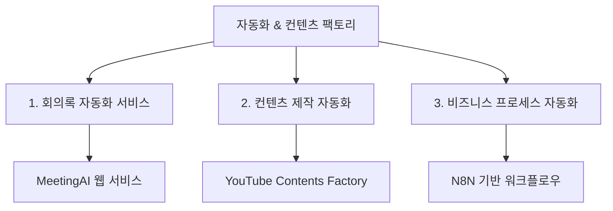

# 📋 자동화 & 컨텐츠 팩토리 통합 PRD

## 📊 Executive Summary

지난 기획 과정을 통해 **3가지 핵심 프로젝트**가 도출되었습니다:



---

## 🎯 프로젝트 1: MeetingAI - 회의록 자동화 웹 서비스

### 비즈니스 배경
- **문제점**: 외부 미팅 후 회의록 작성에 2-3시간 소요
- **기회**: KIMS의 검증된 미팅 템플릿 자산 활용
- **목표**: 회의록 작성 시간 80% 단축 (3시간 → 30분)

### 핵심 기능

#### 1. 자막 파일 업로드 시스템
- **지원 포맷**: .srt, .vtt, .txt, 음성파일(.mp3, .wav, .m4a)

#### 2. 템플릿 라이브러리
- **영업 미팅 템플릿**: 고객 현황 분석, 페인포인트 도출
- **표준 회의록**: RACI 매트릭스, 의사결정 추출
- **로직 시각화**: 관점 차이 분석, 갭 맵핑
- **업종별 특화**: 의료기기, 제약업체, 일반 B2B

#### 3. MCP 기반 AI 처리 엔진
```
자막 업로드 → MCP Server → Claude/GPT API
                ↓           ↓
         Notion MCP    템플릿 엔진
                ↓           ↓
         결과 저장    구조화 분석
                ↓           ↓
            최종 회의록 생성
```

### 기술 스택
- **Frontend**: Next.js 14, shadcn/ui
- **Backend**: Node.js, Express.js
- **AI/MCP**: Claude 3.5 Sonnet, Notion MCP
- **Infrastructure**: Vercel, Supabase

### 비즈니스 모델
- **Free**: 월 3개 회의록, 기본 템플릿
- **Pro ($29/월)**: 월 30개, 모든 템플릿, Notion 연동
- **Enterprise ($99/월)**: 무제한, 화이트라벨, API

### 개발 로드맵
- **Phase 1 (2-3개월)**: MVP - 자막 업로드, 3개 템플릿, Claude 연동
- **Phase 2 (1개월)**: 베타 - 인증, 커스터마이징, Notion MCP
- **Phase 3 (1개월)**: 정식 출시 - 결제, 팀 워크스페이스
- **Phase 4 (3-6개월)**: 확장 - 음성 처리, 실시간 녹음, 다국어

---

## 🎯 프로젝트 2: YouTube Contents Factory - 컨텐츠 제작 자동화

### 비즈니스 배경
- **목표**: 확장 가능한 유튜브 컨텐츠 사업 모델
- **타겟 분야**: AI, Startup, E-commerce, 미국 주식 투자
- **차별화**: 주언규 메소드 + 데이터 기반 자동화

### 6단계 마스터 프로세스

#### Phase 1: 시장 연구 & 기회 발굴
**자동화 도구**
- Google Trends API
- YouTube Analytics API
- VidIQ, TubeBuddy

**주요 작업**
- 트렌드 분석 자동화
- 경쟁 채널 성과 추적
- 니치 선정 기준: 월 검색량 10,000+, 경쟁 밀도 <70

#### Phase 2: 컨텐츠 전략 & 기획
**자동화 도구**
- ChatGPT/Claude API (아이디어 생성)
- 컨텐츠 캘린더 자동화

**주요 작업**
- AI 기반 아이디어 생성
- 계절성/이벤트 기반 캘린더
- A/B 테스트 계획

#### Phase 3: 컨텐츠 제작 자동화
**자동화 도구**
- **스크립트**: ChatGPT 프롬프트 템플릿
- **음성**: ElevenLabs, Azure Speech
- **편집**: CapCut, DaVinci Resolve
- **썸네일**: Canva API, Midjourney

**제작 파이프라인**
```
아이디어 발굴 → 썸네일 우선 설계 → 클릭률 예측(5%+)
                                      ↓
                               스크립트 작성
                                      ↓
                            영상 제작 (자동 편집)
                                      ↓
                              최적화 & 배포
```

#### Phase 4: 채널 운영 & 최적화
**자동화 도구**
- YouTube API (자동 업로드)
- Zapier/Buffer (SNS 배포)
- TubeBuddy (A/B 테스트)

**주요 작업**
- 스케줄링 시스템
- 댓글 자동 응답
- 커뮤니티 포스트 자동화

#### Phase 5: 성과 분석 & 최적화
**자동화 도구**
- YouTube Analytics API
- Google Data Studio
- Notion API (리포트 생성)

**핵심 KPI**
- CTR (클릭률) 5%+
- 평균 시청 유지율 60%+
- 구독 전환율

#### Phase 6: 수익화 & 확장
**수익원**
- YouTube 광고 (CPM/RPM 최적화)
- 스폰서십 자동화
- 디지털 상품 판매
- 멤버십/구독 모델

### 주언규 메소드 핵심 원칙

#### 1. 썸네일 우선 설계
- 컨텐츠 기획 전 썸네일부터
- 클릭률 5% 미만 → 제작 중단
- A/B 테스트 필수

#### 2. 평범함 기반 타겟팅
- 내 시청 기록 = 타겟 오디언스
- 평범한 사람의 니즈 집중
- 과도한 차별화 지양

#### 3. 데이터 기반 의사결정
- 20가지 지표 기반 최적화
- 감정보다 수치 중심

### 스토리텔링 구조 (HOOK-PROBLEM-SOLUTION-CTA)
```
🎣 HOOK (0-15초): 본능적 관심 유도
❓ PROBLEM (15초-2분): 평범한 사람의 문제
💡 SOLUTION (2분-8분): 구체적 해결책
🎯 CTA (8분-10분): 명확한 행동 유도
```

### 4주 컨텐츠 캘린더 (주 3편 = 12편)

| 주 | Pillar | 제목 예시 | 포맷 | 목표 KPI |
|---|---|---|---|---|
| W1-1 | AI | "영상 제작 80% 자동화: ChatGPT+CapCut" | 튜토리얼/10m | CTR 6%+ |
| W1-2 | Startup | "아이디어 검증: 48시간 린테스트" | 해설/12m | 저장률 5% |
| W1-3 | 주식 | "주간 브리핑: 엔비디아·연준·ETF" | 브리핑/8m | 반복시청 20% |
| W2-1 | E-commerce | "미국 아마존 입점 체크리스트 10" | 튜토리얼/12m | 전환 2% |

### 성공 지표 로드맵
- **1-3개월**: 구독자 1,000명, 월 조회수 10만회
- **3-6개월**: 구독자 10,000명, 월 수익 $1,000+
- **6-12개월**: 구독자 100,000명, 월 수익 $10,000+

---

## 🎯 프로젝트 3: N8N 기반 비즈니스 프로세스 자동화

### 비즈니스 배경
- **실제 사례**: EAUOS 2025 학회 초록 제출자 이메일 자동화
- **확장 가능성**: 다양한 비즈니스 프로세스 자동화

### N8N 메일 자동화 구조

#### 워크플로우
```
수동/스케줄/웹훅 트리거
    ↓
Google Sheets 데이터 읽기
    ↓
데이터 검증 (이메일, 필수 필드)
    ↓
중복 제거
    ↓
템플릿 선택 (benefit_category 기반)
    ↓
Rate Limiting (2초 간격)
    ↓
메일 발송
    ↓
로깅 (성공/실패)
    ↓
통계 생성
```

#### 핵심 기능
1. **3가지 트리거**: 수동, 스케줄(매주 월요일 9시), 웹훅
2. **데이터 검증**: 이메일 형식, 필수 필드, 카테고리
3. **중복 제거**: 같은 이메일 중복 발송 방지
4. **Rate Limiting**: 스팸 방지
5. **자동 로깅**: 별도 시트에 기록
6. **통계 생성**: 캠페인 요약 리포트

#### 템플릿 시스템
- **presentation-only**: 기본 가이드라인
- **accommodation-only**: 숙박 제공
- **accommodation-travel**: 숙박 + 여행비

### 확장 가능 영역
- 고객 관리 자동화 (CRM)
- 마케팅 캠페인 자동화
- 내부 업무 프로세스 자동화
- 데이터 수집 및 리포팅

---

## 🔧 통합 기술 스택

### 개발 도구
- **백엔드**: Python (Flask/FastAPI), Node.js
- **프론트엔드**: React/Next.js
- **데이터베이스**: PostgreSQL, MongoDB
- **클라우드**: AWS, Google Cloud, Vercel
- **자동화**: N8N, Zapier, Make

### AI/ML 도구
- **LLM**: Claude 3.5 Sonnet, GPT-4o
- **음성**: ElevenLabs, Azure Speech
- **이미지**: Midjourney, Canva API
- **편집**: CapCut, DaVinci Resolve

### 분석 도구
- YouTube Analytics API
- Google Data Studio
- Notion API
- Social Blade

---

## 📈 통합 비즈니스 모델

### 수익원 구조

#### 1. MeetingAI (SaaS)
- **Year 1**: 100명 유료 → $35,000 ARR
- **Year 2**: 500명 유료 → $175,000 ARR
- **Year 3**: 1,500명 유료 → $525,000 ARR

#### 2. YouTube Contents Factory
- **3개월**: 구독자 1,000명, 수익화 시작
- **6개월**: 월 수익 $1,000+
- **12개월**: 월 수익 $10,000+

#### 3. 자동화 컨설팅/대행
- N8N 워크플로우 구축 서비스
- 기업 맞춤형 자동화 솔루션
- 월 $5,000+ 수익 가능

### 총 예상 수익 (Year 2)
- MeetingAI: $175,000
- YouTube: $60,000 (월 $5,000 × 12개월)
- 자동화 컨설팅: $60,000
- **총 ARR: $295,000**

---

## 🚀 통합 실행 로드맵

### Q1 (1-3개월): 기반 구축
- [ ] MeetingAI MVP 개발
- [ ] YouTube 채널 론칭 (첫 12개 영상)
- [ ] N8N 워크플로우 3개 구축

### Q2 (4-6개월): 베타 테스트 & 최적화
- [ ] MeetingAI 베타 출시 (50명 테스터)
- [ ] YouTube 구독자 1,000명 달성
- [ ] 자동화 사례 포트폴리오 5개

### Q3 (7-9개월): 정식 출시 & 확장
- [ ] MeetingAI 정식 출시 + 결제 시스템
- [ ] YouTube 구독자 10,000명
- [ ] 자동화 컨설팅 서비스 론칭

### Q4 (10-12개월): 스케일업
- [ ] MeetingAI 유료 고객 100명
- [ ] YouTube 월 수익 $5,000
- [ ] 팀 확장 (2-3명)

---

## ⚠️ 리스크 & 대응 방안

### 기술적 리스크
- **AI 의존성**: Claude + GPT 백업 시스템
- **처리 시간**: 점진적 최적화
- **정확도**: 사용자 피드백 루프

### 비즈니스 리스크
- **경쟁사**: 업종별 특화로 차별화
- **사용자 습득**: 프리미엄 모델로 진입장벽 낮춤
- **데이터 보안**: End-to-end 암호화, GDPR 준수

### 운영 리스크
- **리소스 부족**: 자동화 우선 + 외주 활용
- **번아웃**: 지속 가능한 프로세스 설계
- **품질 관리**: 체크리스트 기반 QA

---

## 📊 성공 지표 (통합 KPI)

### 제품 지표
- **MeetingAI**: 유료 전환율 15%, NPS 50+
- **YouTube**: CTR 6%+, 유지율 60%+, 월 조회수 100만+
- **자동화**: 워크플로우 성공률 95%+

### 비즈니스 지표
- **ARR**: $300,000 (Year 2)
- **CAC**: $50 이하
- **LTV**: $300+

### 개인 지표
- **시간 절약**: 주 20시간 → 10시간 (자동화로 50% 감소)
- **콘텐츠 생산**: 월 12개 영상 안정적 생산
- **수익 다각화**: 3개 수익원 확보

---

## 💡 다음 단계

### 즉시 실행 (이번 주)
1. **MeetingAI**: 기술 검증 프로토타입 (Claude + MCP)
2. **YouTube**: 첫 4개 영상 기획 완료
3. **N8N**: 첫 워크플로우 테스트

### 1개월 내
1. MeetingAI MVP 개발 착수
2. YouTube 채널 론칭 + 첫 영상 업로드
3. N8N 포트폴리오 3개 완성

### 3개월 내
1. MeetingAI 베타 테스터 50명 확보
2. YouTube 구독자 1,000명
3. 자동화 컨설팅 첫 고객

---

**문서 작성일**: 2025년 10월
**버전**: v1.0
**다음 검토일**: 매월 첫째 주

---

## 📎 관련 문서
- [AI 회의록 자동화 웹 서비스 PRD](../ZZZZZZ/AI_Meeting_Minutes_Service_PRD.md)
- [YouTube 컨텐츠 자동화 마스터 플랜](../Contents%20Factory/Process_Automation/YouTube-Content-Automation-Master-Plan.md)
- [컨텐츠 제작 파이프라인 설계](../Contents%20Factory/Process_Automation/Content-Production-Pipeline-Design.md)
- [N8N 메일 자동화 워크플로우](../../claude_n8n_automation_prompt.md)
