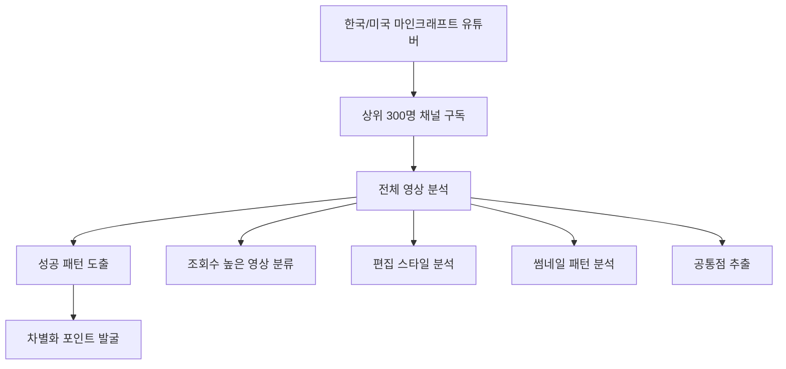

# 유튜브 초고속 성장 실전 가이드라인
## 스토리 채널의 30일 68만 구독자 달성 전략 완벽 복기

> **기반**: 165만 구독자 스토리 채널이 완전 새로운 게임 채널로 30일만에 68만 구독자 달성한 실제 사례 분석

---

## 🎯 **프로젝트 개요 및 목표 설정**

### **최종 성과**
- **30일차 결과**: 구독자 30만명
- **45일차 최종**: 구독자 68만명, 총 조회수 6천만회, 수익 1천만원+
- **핵심 지표**: 평균 조회수 270만회, 최고 조회수 500만회
- **수익화**: 27일차 수익 창출 승인 완료

### **초기 목표 설정**
```
🎯 30일 목표:
1. 구독자 1만명 달성
2. 조회수 100만회 넘는 영상 1개 제작
3. 수익 1원이라도 발생시키기

⚠️ 현실성 체크:
- 본인도 1만명 달성 확신 없었음
- 실제로는 목표의 30배 초과 달성
- 운 + 실력의 완벽한 조합
```

---

## 📊 **Phase 1: 전략적 기반 구축 (1-3일차)**

### **🔍 Step 1: 철저한 시장 조사 (1-2일차)**

#### **경쟁자 분석 프로세스**


#### **실전 분석 체크리스트**
```
📋 분석해야 할 요소들:

✅ 콘텐츠 분석:
- 어떤 주제의 영상이 조회수가 높은가?
- 영상 길이는 얼마나 되는가?
- 어떤 키워드가 자주 사용되는가?
- 댓글 반응이 좋은 영상의 특징은?

✅ 기술적 분석:
- 편집 스타일 (빠른 컷, 이펙트, 음악)
- 썸네일 구성 (색감, 폰트, 레이아웃)
- 제목 작성 패턴
- 업로드 주기 및 시간대

✅ 시청자 분석:
- 주요 시청층 연령대
- 댓글 분위기 및 반응
- 구독자와 크리에이터의 소통 방식
- 트렌드 변화 패턴

✅ 경쟁 강도 분석:
- 포화된 영역 vs 블루오션 영역
- 신규 진입자 성공 사례
- 기존 크리에이터들의 약점
```

#### **핵심 인사이트 도출**
```
💡 스토리가 발견한 핵심 인사이트:

1. 실험형 콘텐츠의 높은 성과
   - "무엇을 1000개 하면?" 형태의 호기심 자극
   - 예측 불가능한 결과에 대한 궁금증

2. 쇼츠의 폭발적 잠재력
   - 긴 영상 대비 알고리즘 진입 장벽 낮음
   - 빠른 피드백과 바이럴 가능성

3. 신생 채널만의 차별화 가능성
   - 기존 유명 유튜버와 경쟁하지 않는 포지셔닝
   - "성장하는 과정" 자체를 콘텐츠화
```

### **🎨 Step 2: 브랜딩 및 채널 설계 (3일차)**

#### **채널명 선정 전략**
```
🏷️ 채널명 결정 과정:

1차 시도: 랜덤 닉네임 생성기 활용
→ 너무 의미없는 결과

2차 시도: "ebo" 후보
→ 기존 가수와 중복 발견

최종 결정: "이비온"
→ 기억하기 쉽고 고유한 이름

💡 채널명 선정 팁:
- 의미보다는 기억하기 쉬운 음성
- 검색했을 때 유일성 확보
- 발음하기 쉬운 단어 조합
- 향후 확장 가능성 고려
```

#### **비주얼 브랜딩 전략**
```
🎨 브랜딩 요소 설계:

기본 컬러: 노란색
이유: 
- 눈에 잘 띄는 색상
- 게임 콘텐츠와 잘 어울림
- 기억에 남기 쉬움
- 다른 채널과 차별화

적용 영역:
✅ 채널 프로필 사진
✅ 채널 배너
✅ 썸네일 일관성
✅ 영상 내 그래픽 요소

일관성 유지:
- 모든 시각적 요소에 노란색 활용
- 깔끔하고 단순한 디자인
- 브랜드 인식도 향상
```

---

## 🚀 **Phase 2: 초기 성장 동력 확보 (3-7일차)**

### **🎬 Step 3: 첫 영상 전략 수립**

#### **플랫폼 선택: 쇼츠 vs 긴 영상**
```
⚖️ 쇼츠 선택 이유:

장점:
✅ 빠른 피드백 루프 (몇 시간 내 결과 확인)
✅ 알고리즘 진입 장벽 낮음
✅ 제작 시간 단축 (하루 1개 제작 가능)
✅ 바이럴 확산 가능성 높음
✅ 실험과 학습 속도 빠름

단점:
❌ 수익화 어려움 (긴 영상 필요)
❌ 깊이 있는 콘텐츠 제한
❌ 구독자의 긴 영상 전환율 낮음

결론: 초기 성장은 쇼츠, 수익화는 긴 영상 병행
```

#### **첫 영상 제작 공식**
```
🎯 성공하는 첫 영상 공식:

제목: "엔더진주 천개를 동시에 던지면 어떻게 될까"

구성 요소 분석:
1. 대중적 호기심 자극
   - 마인크래프트 플레이어라면 한번쯤 궁금해할 내용
   - 구체적인 숫자 (천개) 제시로 임팩트 증대

2. 즉시 본론 진입
   - 인트로, 인사말 등 일체 제거
   - 첫 장면부터 바로 실험 시작

3. 자극적인 초반 화면
   - 가장 임팩트 있는 장면을 앞쪽에 배치
   - 시청자 이탈 방지

4. 빠른 템포 편집
   - 재시청 유도 목적
   - 집중도 유지
   - 지루함 방지

결과: 5시간 만에 조회수 800회, 구독자 8명
```

#### **첫 영상 제작 상세 가이드**
```
📝 제작 프로세스:

1. 기획 단계 (30분)
   - 실험 설계: 엔더진주 1000개 준비
   - 예상 결과 시나리오 작성
   - 촬영 각도 및 장면 구성 계획

2. 촬영 단계 (1시간)
   - 여러 각도에서 동시 촬영
   - 임팩트 있는 순간 반복 촬영
   - 결과 장면 클로즈업

3. 편집 단계 (2시간)
   - 빠른 컷 편집 (0.5초 단위)
   - 임팩트 효과음 추가
   - 자막을 통한 상황 설명

4. 썸네일 제작 (30분)
   - 가장 임팩트 있는 장면 캡처
   - 노란색 베이스 디자인
   - 간단한 텍스트 오버레이

총 제작 시간: 4시간
```

### **📈 Step 4: 초기 성장 모니터링 (4-7일차)**

#### **알고리즘 반응 패턴 분석**
```
📊 4일차 성장 분석:

자기 전 (자정): 조회수 2,000회
기상 후: 조회수 5,000회, 구독자 50명

분석:
- 자정~1시 사이 알고리즘 급상승
- 수면 시간 동안 지속적 성장
- 첫 영상 대비 두 번째 영상 저조 (정상)

교훈:
✅ 알고리즘 타이밍이 예측 불가능
✅ 꾸준한 업로드로 기회 창출
✅ 첫 영상 성공이 후속 영상에 도움
```

#### **성장 그래프 패턴 이해**
```
📈 신생 쇼츠 채널의 전형적 패턴:

1단계: 급상승 → 급하락 (블록 튀어나온 그래프)
특징:
- 업로드 직후 폭발적 상승
- 몇 시간 후 급격한 하락
- 초보자들이 좌절하는 구간

2단계: 물결 그래프 (올라갔다 내려갔다)
특징:
- 상승과 하락 반복
- 점진적인 바닥선 상승
- 데이터 축적 구간

3단계: 지속적 상승 그래프 (이상적)
특징:
- 올라간 후 내려가지 않음
- 지속적인 상승세 유지
- 알고리즘 완전 정착

현실적 기대치:
- 1-2단계는 필수 통과 과정
- 좌절하지 말고 꾸준히 업로드
- 3단계 도달까지 최소 2주 소요
```

---

## 💡 **Phase 3: 혁신적 차별화 전략 (8-14일차)**

### **🔄 Step 5: 알고리즘 침체기 극복 (8-12일차)**

#### **침체기 현상 분석**
```
📉 8일차 침체 현상:

증상:
- 구독자 증가 완전 중단 (405명에서 정체)
- 조회수 급격한 감소
- 새 영상 반응 저조

원인 분석:
1. 알고리즘의 채널 재평가 과정
2. 초기 호기심 효과 소진
3. 콘텐츠 차별화 부족

대응 전략:
✅ 침체는 정상 과정으로 인식
✅ 새로운 포맷 실험 준비
✅ 꾸준한 업로드 지속
❌ 조급해하거나 포기하지 않기
```

#### **돌파구 마련: 역발상 마케팅**
```
💡 11일차 혁신적 아이디어:

기존 관점:
"신생 채널이라서 불리하다"

역발상:
"신생 채널이라서 유리하다"

논리 구조:
1. 시청자들은 보통 유명 유튜버만 시청
2. 신인 유튜버를 굳이 찾아보지 않음
3. 그렇다면 "신인"이라는 것 자체가 차별점
4. "미래의 100만 유튜버를 지금 발견하는 특권"

메시지 전략:
"이 채널은 떡상할 거니까 속는 셈 치고 구독해라"
"나중에 100만 유튜버가 되면 너는 초창기 구독자"
"지켜봤는데 떡상 안 하면 취소해도 좋다"
```

### **🎯 Step 6: 차별화 콘텐츠 개발**

#### **3번째 영상: 구독 유도 혁신**
```
🎬 "떡상 예고" 영상 전략:

콘텐츠 구성:
1. 현재 상황 설명 (신생 채널, 구독자 적음)
2. 미래 예측 (이 채널은 떡상할 것)
3. 제안 (속는 셈 치고 구독)
4. 보장 (안 되면 언제든 취소 가능)

심리학적 요소:
✅ FOMO (Fear of Missing Out)
✅ 투자 심리 (초기 참여의 특권)
✅ 리스크 제거 (언제든 취소 가능)
✅ 호기심 (정말 떡상할까?)

결과:
- 563명 시청 중 91명 구독 (16% 전환율)
- 기존 영상들도 연쇄 상승
- 채널의 "밥줄" 역할 수행

제작 팁:
- 진정성 있게 전달 (뻔뻔하지 않게)
- 구체적인 근거 제시
- 자신감 있는 톤앤매너
- 시청자 입장에서 메리트 강조
```

---

## 🔥 **Phase 4: 폭발적 성장 가속화 (14-22일차)**

### **📊 Step 7: 성장 곡선 분석 및 최적화**

#### **성장 패턴 예측**
```
📈 성장 곡선 분석:

1주차: 360명
2주차: 720명 (2배 증가)

착각하기 쉬운 예측:
3주차: 1,080명 (일직선 증가)

실제 떡상 채널의 패턴:
지수적 증가 (exponential growth)

이유:
- 알고리즘의 신뢰도 축적
- 기존 영상들의 연쇄 상승
- 구독자 증가가 더 많은 구독자 유입
- 커뮤니티 형성 효과
```

#### **구독 유도 기법 고도화**
```
🎯 진화된 구독 유도 전략:

Level 1: 기본형
❌ "구독과 좋아요 부탁드려요"
문제점: 무지성, 이유 없음, 효과 낮음

Level 2: 이유 제공형
✅ "구독자 1천 명이 코앞입니다"
개선점: 구체적 상황, 참여 의식

Level 3: 경쟁 자극형
✅ "이게 빠를까요? 여러분이 구독 누르는게 빠를까요?"
특징: 게임화, 재미 요소, 자연스러운 유도

Level 4: 시각적 유도형
✅ 영상 내 구독자 카운트 노출
✅ "구독자가 오를 때마다 몬스터 스폰"
효과: 실시간 피드백, 직관적 이해

핵심 원칙:
- 거부감 없이 자연스럽게
- 영상 콘텐츠와 유기적 결합
- 시청자에게 명확한 이유 제공
- 재미 요소 포함
```

### **🎮 Step 8: 콘텐츠 다각화 전략**

#### **새로운 포맷 실험: 마인크래프트 버**
```
🌍 글로벌 트렌드 현지화:

해외 트렌드 분석:
- 마인크래프트 "버" 영상 유행
- 짧은 건축/인테리어 영상
- 한국에는 쇼츠 형태로 미진입

현지화 전략:
1. 한국어 자막 추가
2. 한국 시청자 취향 반영
3. 쇼츠 최적화 편집

법적/윤리적 고려:
- 형식 차용 vs 표절 구분
- 마인크래프트 버는 하나의 장르
- 원작자 특정 불가능한 범용 포맷
- 음악의 장르와 같은 개념

제작 과정:
1. 해외 인기 영상 10개 분석
2. 한국적 요소 추가
3. 20초 vs 40초 길이 테스트
4. 시청자 반응 비교 분석

결과:
- 기존 영상과 차별화 성공
- 새로운 시청자층 유입
- 채널 다양성 확보
```

### **⚡ Step 9: 폭발적 성장 트리거 (19-20일차)**

#### **떡상 영상의 조건 분석**
```
🚀 10번째 영상 폭발 요인:

제목: [몬스터 1000배 증가 실험]

성공 요인:
1. 검증된 포맷 (첫 영상과 유사)
2. 스케일 업 (진주 → 몬스터)
3. 시각적 임팩트 강화
4. 완벽한 타이밍 (채널 성장 궤도)

알고리즘 반응:
- 업로드 즉시 떡상 그래프
- 20분만에 1,400뷰 돌파
- 시간당 6만뷰 (분당 1,000뷰)
- 5시간만에 10만뷰 달성
- 게임 카테고리 급상승 2위

분석:
✅ 알고리즘 혈맥 완전 개통
✅ 채널 신뢰도 임계점 도달
✅ 바이럴 확산 시작
✅ 브랜드 인지도 급상승
```

#### **폭발적 성장 관리 전략**
```
📈 떡상 후 관리 포인트:

즉시 해야 할 것:
1. 다음 영상 퀄리티 극대화
   - 이전 기록 넘어야 함 (6시간 12만뷰)
   - 알고리즘에 지속 성장 신호 전송
   - 기회 놓치면 다시 침체 가능

2. 업로드 타이밍 최적화
   - 주말/연휴 활용
   - 피크 시간대 공략
   - 연속 히트 전략

3. 커뮤니티 관리
   - 댓글 적극 소통
   - 긍정적 분위기 유지
   - 화제성 지속

피해야 할 것:
❌ 조급한 연속 업로드
❌ 퀄리티 타협
❌ 기존 성공 공식 포기
❌ 자만이나 방심
```

---

## 💎 **Phase 5: 수익화 및 브랜드 확립 (22-30일차)**

### **💰 Step 10: 수익화 전략 실행**

#### **수익화 조건 분석**
```
📊 유튜브 수익화 요구사항:

쇼츠 기반 조건:
- 구독자 1,000명 이상 ✅
- 최근 90일간 쇼츠 조회수 1,000만회 ✅

일반 영상 기반 조건:
- 구독자 1,000명 이상 ✅
- 최근 12개월간 시청시간 4,000시간 ❌

현실:
- 쇼츠로 모은 구독자의 긴 영상 시청률 저조
- 6분 영상 → 6시간만에 760뷰 (참담)
- 알림 설정 비율 극히 낮음 (쇼츠 구독자 특성)

해결책:
1. 긴 영상 지속 업로드
2. 쇼츠에서 긴 영상 유도
3. 시청 시간 축적 기다림
4. 병행 전략으로 수익화 달성
```

#### **긴 영상 제작 전략**
```
🎬 6분 영상 기획 과정:

주제 선정:
"마인크래프트에서 가장 강한 몬스터 순위"

구성:
1. 약한 몬스터부터 시작
2. 단계적 상승 구조
3. 시청 지속 시간 최적화
4. 예상외 결과로 마무리

제작 고려사항:
- 쇼츠 시청자 → 긴 영상 전환 어려움
- 높은 이탈률 예상
- 알림 설정률 낮음
- 시간 투자 대비 조회수 저조

결과:
- 예상보다 저조한 성과
- 하지만 수익화 조건 충족에 기여
- 장기적 채널 다각화 기반 마련
```

### **🏆 Step 11: 브랜드 확립 및 기록 경신**

#### **연속 1위 달성 전략**
```
👑 인기 급상승 1위 연속 달성:

23일차: 27만뷰 (6시간), 급상승 1위
24일차: 1위 유지, 10만 구독자 돌파
25일차: 100만뷰 영상 첫 달성
26일차: 연속 1위, 실버버튼 코드 수령
27일차: 수익화 승인
28일차: 실시간 조회수 500만 돌파
29일차: 자기 기록 경신 (자신이 자신을 넘는 구조)

핵심 전략:
"저를 넘을 수 있는 건 이제 저밖에 없습니다"

시스템화된 성장:
1. 매 영상마다 이전 기록 분석
2. 약점 보완, 강점 극대화
3. 새로운 시도와 검증된 공식 조합
4. 지속적 자기 혁신
```

#### **수익 최적화 전략**
```
💵 수익화 성과 분석:

27일차: 수익화 승인 (일반적으로 며칠 소요)
→ 성장세로 인한 우선 처리

45일차 기준:
- 총 수익: 1,000만원+
- 구독자: 68만명
- 총 조회수: 6,000만회
- 평균 조회수: 270만회/영상

수익 구조:
1. 광고 수익 (주요)
2. 채널 멤버십 (보조)
3. 슈퍼챗/슈퍼땡스 (미미)

최적화 포인트:
- 높은 조회수 = 높은 광고 수익
- 지속적인 업로드로 안정성 확보
- 브랜드 가치 상승으로 간접 수익 기회
```

---

## 📋 **실전 적용 가이드라인**

### **🗓️ 30일 완벽 로드맵**

#### **Week 1: 기반 구축 및 시장 진입**
```
Day 1-2: 시장 조사 및 분석
□ 타겟 분야 상위 300개 채널 구독
□ 성공 영상 패턴 분석 (조회수, 편집, 썸네일)
□ 차별화 포인트 3가지 이상 도출
□ 경쟁 강도 및 진입 장벽 평가

Day 3: 채널 설계 및 브랜딩
□ 기억하기 쉬운 채널명 결정
□ 일관된 색상/디자인 시스템 구축
□ 프로필 사진, 배너 제작
□ 초기 콘텐츠 5개 기획

Day 4-7: 콘텐츠 제작 및 업로드
□ 매일 1개씩 영상 제작
□ 쇼츠 위주 전략 (30-60초)
□ 즉시 본론, 빠른 템포 편집
□ 알고리즘 반응 모니터링

목표: 구독자 100-500명, 조회수 패턴 파악
```

#### **Week 2: 성장 동력 확보 및 차별화**
```
Day 8-10: 침체기 극복
□ 알고리즘 침체 현상 분석
□ 새로운 콘텐츠 포맷 실험
□ 꾸준한 업로드 지속
□ 커뮤니티 반응 관찰

Day 11-14: 혁신적 차별화
□ 역발상 마케팅 콘텐츠 제작
□ 구독 유도 기법 적용
□ 글로벌 트렌드 현지화
□ 시청자 참여 유도 콘텐츠

목표: 구독자 1,000-5,000명, 차별화 포인트 확립
```

#### **Week 3: 폭발적 성장 및 바이럴**
```
Day 15-18: 성장 가속화
□ 구독 유도 고도화 (경쟁, 시각적 요소)
□ 검증된 포맷 + 스케일업 전략
□ 주말/연휴 타이밍 활용
□ 연속 히트 콘텐츠 준비

Day 19-21: 바이럴 달성
□ 폭발적 조회수 영상 제작
□ 인기 급상승 진입
□ 알고리즘 완전 정착
□ 미디어/커뮤니티 화제

목표: 구독자 10,000-50,000명, 100만뷰 영상 달성
```

#### **Week 4: 수익화 및 브랜드 확립**
```
Day 22-25: 수익화 준비
□ 긴 영상 제작 시작
□ 수익화 조건 충족
□ 다각화된 콘텐츠 포트폴리오
□ 커뮤니티 관리 시스템

Day 26-30: 브랜드 확립
□ 연속 기록 경신
□ 수익화 승인 및 최적화
□ 장기 전략 수립
□ 확장 계획 준비

목표: 구독자 100,000명+, 수익 창출, 브랜드 확립
```

### **🛠️ 제작 도구 및 리소스**

#### **필수 도구**
```
🎬 영상 제작:
- 게임 녹화: OBS Studio (무료)
- 편집 소프트웨어: DaVinci Resolve (무료) / Adobe Premiere Pro
- 썸네일 제작: Canva (무료) / Photoshop
- 음악/효과음: YouTube Audio Library

📊 분석 도구:
- YouTube Analytics (기본)
- Social Blade (구독자 추이)
- VidIQ / TubeBuddy (키워드, 최적화)
- Google Trends (트렌드 분석)

🎨 디자인 리소스:
- 무료 폰트: Google Fonts
- 무료 이미지: Unsplash, Pixabay
- 아이콘: Flaticon
- 색상 팔레트: Coolors.co
```

#### **콘텐츠 기획 템플릿**
```
📝 영상 기획서 템플릿:

제목: [구체적이고 호기심 자극하는 제목]
길이: [30초 / 60초 / 6분 등]
목표: [조회수 목표, 구독자 증가 목표]

구성:
1. 훅 (0-3초): [시청자 주의 끌기]
2. 본론 (3-50초): [핵심 내용 전달]
3. 마무리 (50-60초): [구독 유도, 다음 영상 예고]

차별화 포인트:
- [기존 영상과 다른 점]
- [시청자에게 제공하는 가치]
- [예상 반응 및 댓글]

제작 계획:
- 촬영 시간: [시간]
- 편집 시간: [시간]
- 업로드 예정일: [날짜, 시간]
```

### **📊 성과 측정 및 최적화**

#### **핵심 지표 (KPI) 모니터링**
```
📈 일일 체크 지표:

성장 지표:
□ 구독자 수 및 증가율
□ 총 조회수 및 일일 조회수
□ 영상별 조회수 비교
□ 구독 전환율 (조회수 대비 구독자 증가)

참여 지표:
□ 좋아요/싫어요 비율
□ 댓글 수 및 반응
□ 공유 횟수
□ 시청 지속 시간

알고리즘 지표:
□ 실시간 조회수 그래프 패턴
□ 인기 급상승 순위
□ 추천 영상 노출 빈도
□ 검색 순위
```

#### **A/B 테스트 체크리스트**
```
🧪 지속적 최적화 실험:

썸네일 테스트:
□ 색상 배경 (노란색 vs 다른 색)
□ 텍스트 유무 및 크기
□ 캐릭터/오브젝트 배치
□ 감정 표현 (놀람, 호기심 등)

제목 테스트:
□ 길이 (짧은 제목 vs 긴 제목)
□ 숫자 사용 (구체적 vs 추상적)
□ 질문형 vs 선언형
□ 감정 어휘 포함 여부

콘텐츠 테스트:
□ 영상 길이 (30초 vs 60초)
□ 편집 템포 (빠름 vs 보통)
□ 구독 유도 위치 및 방식
□ 음악/효과음 사용
```

### **⚠️ 주의사항 및 리스크 관리**

#### **흔한 실수 방지**
```
❌ 피해야 할 실수들:

초기 단계:
- 완벽주의로 인한 업로드 지연
- 트렌드만 쫓아가는 전략
- 너무 많은 포맷 동시 실험
- 조회수에만 매몰된 콘텐츠

성장 단계:
- 알고리즘 침체기에 포기
- 성공 공식 무시하고 급격한 변화
- 구독자 수에 비해 과도한 자신감
- 댓글 관리 소홀

확장 단계:
- 수익만을 위한 콘텐츠 제작
- 초심 잃고 퀄리티 타협
- 시청자와의 소통 단절
- 장기 전략 없는 단발성 기획
```

#### **법적/윤리적 가이드라인**
```
⚖️ 준수해야 할 원칙들:

저작권:
✅ 음악: YouTube Audio Library 활용
✅ 이미지: 무료 라이센스 또는 직접 제작
✅ 게임: 스트리밍 허용 게임 확인
❌ 타인의 영상/음악 무단 사용

콘텐츠 윤리:
✅ 사실 기반 정보 제공
✅ 건전한 경쟁 및 비교
✅ 시청자 연령대 고려한 내용
❌ 허위 정보나 과장된 클레임

커뮤니티:
✅ 긍정적이고 건설적인 소통
✅ 다양성 존중 및 포용
✅ 피드백에 열린 자세
❌ 혐오 표현이나 차별적 언행
```

### **🚀 확장 전략 및 장기 비전**

#### **30일 이후 확장 계획**
```
📅 장기 로드맵:

2개월차: 안정화 및 다각화
□ 긴 영상 비중 확대 (30%)
□ 시리즈 콘텐츠 시작
□ 커뮤니티 포스트 활용
□ 라이브 스트리밍 실험

3-6개월차: 브랜드 확장
□ 다른 게임으로 확장
□ 콜라보레이션 시작
□ 상품화 가능성 탐색
□ 멀티 플랫폼 진출

6개월-1년차: 비즈니스 모델 확립
□ 안정적 수익 구조 구축
□ 팀 확장 (편집자, 기획자)
□ 교육 콘텐츠 진출
□ 개인 브랜드 확립
```

#### **성공 지표 재정의**
```
🎯 단계별 성공 기준:

생존 단계 (1-30일):
- 구독자 1만명 이상
- 월 수익 100만원 이상
- 안정적인 조회수 확보

성장 단계 (2-6개월):
- 구독자 10만명 이상
- 월 수익 500만원 이상
- 인지도 및 브랜드 가치 확립

확장 단계 (6개월-1년):
- 구독자 50만명 이상
- 월 수익 1,000만원 이상
- 다각화된 수익 모델 구축

지속 단계 (1년 이후):
- 안정적이고 지속가능한 성장
- 업계 내 인플루언서 지위
- 후배 양성 및 생태계 기여
```

---

## 🎓 **핵심 인사이트 및 교훈**

### **💡 스토리가 증명한 핵심 원리**

#### **1. 유튜브는 실력이다**
```
🏆 운 vs 실력 논쟁 종결:

운의 요소:
- 알고리즘 타이밍
- 트렌드 부합도
- 외부 환경 (연휴 등)

실력의 요소:
- 체계적인 시장 분석
- 전략적 콘텐츠 기획
- 지속적인 최적화
- 심리학적 접근

결론:
운은 기회를 제공하지만,
실력이 그 기회를 잡고 지속시킨다.

"사람들은 유튜브가 레드오션이라고 하지만,
보셨다시피 불가능이란 없습니다.
여러분도 할 수 있습니다."
```

#### **2. 역발상의 힘**
```
🔄 기존 관념 뒤집기:

전통적 사고:
- 신생 채널은 불리하다
- 유명해져야 구독자가 온다
- 완벽한 준비 후 시작해야 한다

역발상 사고:
- 신생이라서 차별화된다
- 성장 과정 자체가 콘텐츠다
- 빠른 실행과 개선이 핵심이다

적용 방법:
1. 업계 통념 리스트업
2. 각각의 반대 상황 가정
3. 그 반대가 장점이 될 수 있는지 분석
4. 실험을 통한 검증
```

#### **3. 시스템적 접근의 중요성**
```
⚙️ 체계적 성장 시스템:

개별 영상 차원:
- 각 영상의 명확한 목적
- 데이터 기반 개선
- 이전 영상 대비 발전

채널 차원:
- 일관된 브랜딩
- 전략적 콘텐츠 믹스
- 장기 로드맵

생태계 차원:
- 알고리즘과의 협력
- 커뮤니티 구축
- 업계 트렌드 활용

핵심:
개별적 노력이 아닌
시스템적 접근이 지속적 성장의 열쇠
```

### **📚 실무자를 위한 최종 체크리스트**

#### **시작 전 준비사항**
```
✅ 기본 준비:
□ 장비: 게임 가능한 PC, 녹화 프로그램
□ 소프트웨어: 편집 프로그램, 썸네일 제작 도구
□ 시간: 하루 최소 4시간 (촬영 1시간, 편집 2시간, 기획 1시간)
□ 예산: 월 10만원 (음악, 툴, 기타 리소스)

□ 마인드셋 준비:
□ 30일 일일 업로드 각오
□ 침체기 극복 의지
□ 데이터 기반 사고
□ 지속적 학습 자세

□ 전략적 준비:
□ 타겟 분야 충분한 이해
□ 경쟁 채널 분석 완료
□ 차별화 포인트 3개 이상 확보
□ 초기 콘텐츠 10개 기획 완료
```

#### **진행 중 점검사항**
```
📊 주간 점검 (매주 일요일):

성장 지표:
□ 구독자 증가율이 목표 대비 어떤가?
□ 조회수 패턴에 변화가 있는가?
□ 댓글 반응이 긍정적인가?
□ 알고리즘 추천이 늘어나고 있는가?

콘텐츠 질:
□ 이번 주 최고/최저 성과 영상 분석
□ 시청자 피드백 반영 여부
□ 새로운 시도의 효과
□ 브랜딩 일관성 유지

개선 계획:
□ 다음 주 시도할 새로운 실험
□ 보완이 필요한 부분
□ 확대할 성공 요소
□ 제거할 비효율적 요소
```

#### **성공 후 주의사항**
```
⚠️ 성공 후 함정들:

자만의 함정:
- 초기 성공에 안주
- 데이터 분석 소홀
- 시청자 피드백 무시
- 새로운 시도 중단

번아웃 위험:
- 과도한 업로드 압박
- 퀄리티 타협
- 개인 시간 부족
- 스트레스 누적

대응 방안:
✅ 꾸준한 자기 객관화
✅ 지속가능한 작업 루틴
✅ 팀 확장 고려
✅ 장기 비전 유지
```

---

## 🎯 **맞춤형 적용 가이드**

### **분야별 적용 전략**

#### **게임 채널**
```
🎮 게임 채널 특화 전략:

콘텐츠 타입:
- 실험형: "○○를 1000개 하면?"
- 순위형: "가장 강한/약한 ○○ TOP 10"
- 도전형: "○○로만 생존하기"
- 비교형: "○○ vs ○○ 누가 이길까?"

성공 포인트:
✅ 게임별 트렌드 파악
✅ 시각적 임팩트 극대화
✅ 예측 불가능한 결과
✅ 시청자 참여 유도

주의사항:
- 게임사 정책 확인
- 연령등급 고려
- 실시간 트렌드 반영
```

#### **교육/정보 채널**
```
📚 교육 채널 특화 전략:

콘텐츠 구조:
- 문제 제기 (3초)
- 핵심 정보 (30초)
- 실용적 팁 (20초)
- 행동 유도 (7초)

차별화 요소:
✅ 복잡한 개념의 쉬운 설명
✅ 실제 사례 중심
✅ 즉시 적용 가능한 팁
✅ 단계별 가이드

성공 지표:
- 높은 시청 완료율
- 댓글 질문 및 토론
- 구독 후 시청 지속
```

#### **엔터테인먼트 채널**
```
🎭 엔터테인먼트 특화 전략:

포맷 다양화:
- 리액션: 화제 영상/뉴스 반응
- 챌린지: 트렌드 챌린지 참여
- 패러디: 인기 콘텐츠 재해석
- 일상: 특별한 일상 에피소드

바이럴 요소:
✅ 강한 감정 반응 (웃음, 놀람)
✅ 밈(meme) 활용
✅ 시의성 있는 주제
✅ 공감대 형성

지속성 확보:
- 개성 있는 캐릭터
- 시그니처 요소
- 커뮤니티 문화
```

### **예산별 실행 계획**

#### **무예산 시작 (0원)**
```
💸 무료 리소스 최대 활용:

필수 도구:
- OBS Studio (녹화)
- DaVinci Resolve (편집)
- Canva (썸네일)
- YouTube Audio Library (음악)

콘텐츠 전략:
- 창의성으로 장비 한계 극복
- 무료 게임 위주 선택
- 지식/정보 콘텐츠 병행
- 커뮤니티 중심 성장

성장 방식:
- 순수 유기적 성장
- 입소문 마케팅
- 다른 크리에이터와 교류
```

#### **소규모 예산 (월 50만원)**
```
💰 효율적 예산 분배:

장비 업그레이드 (30만원):
- 마이크 (10만원)
- 조명 (10만원)
- 캠 (10만원)

소프트웨어/서비스 (15만원):
- Adobe Creative Suite
- 음악 라이센스
- 분석 도구

마케팅 (5만원):
- 소셜미디어 광고
- 인플루언서 협업
- 이벤트/기획
```

#### **본격 투자 (월 200만원 이상)**
```
💎 전문가 수준 셋업:

팀 구성 (150만원):
- 편집자 (100만원)
- 기획자 (50만원)

고급 장비 (30만원):
- 전문 카메라/마이크
- 조명 시스템
- 촬영 공간

마케팅/홍보 (20만원):
- 온라인 광고
- PR 에이전시
- 이벤트 기획
```

---

## 🏁 **결론: 성공의 재현성**

### **스토리 실험의 핵심 메시지**

#### **"불가능이란 없다"**
```
🚀 증명된 사실들:

✅ 2024년에도 유튜브 성공 가능
✅ 개인도 기업과 경쟁 가능
✅ 게임 채널도 여전히 기회 있음
✅ 30일만에 의미있는 성과 달성 가능
✅ 체계적 접근으로 운을 실력으로 전환 가능

핵심 원리:
"시장은 여전히 열려있다.
 필요한 것은 올바른 전략과 실행력이다."
```

#### **재현 가능성의 조건**
```
🔄 성공 재현을 위한 필수 요소:

1. 철저한 준비:
   - 시장 분석
   - 경쟁자 연구
   - 차별화 전략

2. 일관된 실행:
   - 매일 업로드
   - 품질 유지
   - 데이터 분석

3. 유연한 개선:
   - 피드백 수용
   - 실험 정신
   - 지속적 최적화

4. 장기적 관점:
   - 브랜드 구축
   - 커뮤니티 형성
   - 확장 계획
```

### **마지막 조언**

#### **시작하려는 사람들에게**
```
💪 실행을 위한 마인드셋:

"완벽한 준비는 없다":
- 80% 준비되면 시작하라
- 실행하면서 배우고 개선하라
- 실패는 학습의 기회다

"일관성이 재능을 이긴다":
- 천재적 아이디어보다 꾸준한 실행
- 작은 개선의 누적 효과
- 시간이 가장 큰 경쟁 우위

"데이터가 답을 준다":
- 감정보다 숫자를 믿어라
- 시청자가 원하는 것을 만들어라
- 가설을 세우고 실험으로 검증하라
```

#### **성공 확률을 높이는 마지막 팁**
```
🎯 최종 성공 공식:

시장 기회 × 실행력 × 지속성 = 성공

시장 기회:
- 충분한 시청자 존재
- 차별화 가능한 포지션
- 성장 가능한 분야

실행력:
- 일정한 업로드 주기
- 높은 콘텐츠 품질
- 빠른 개선 속도

지속성:
- 침체기 극복 의지
- 장기적 비전
- 꾸준한 자기 투자

"유튜브는 실력이니까요."
- 스토리 (165만 구독자, 30일만에 68만 구독자 달성)
```

---

**이 가이드라인을 통해 여러분도 스토리와 같은 성공을 만들어가시길 바랍니다. 
중요한 것은 시작하는 것입니다. 지금 바로 첫 번째 영상을 기획해보세요!**

---

*"사람들은 유튜브가 이제 레드오션이라고, 일반인은 가망이 없다고, 지금 시작하기엔 너무 늦다고 합니다. 아니요. 보셨다시피 불가능이란 없습니다. 여러분도 할 수 있습니다. 지금 시작해도 전혀 늦지 않습니다."*

📊 **최종 통계 (45일차)**
- 구독자: 680,000명 (일평균 15,111명 증가)
- 총 조회수: 60,000,000회 (영상당 평균 2,700,000회)  
- 수익: 10,000,000원+ (월환산 약 6,600,000원)
- 성공률: 목표 대비 6,800% 달성 (목표 1만명 → 실제 68만명)
