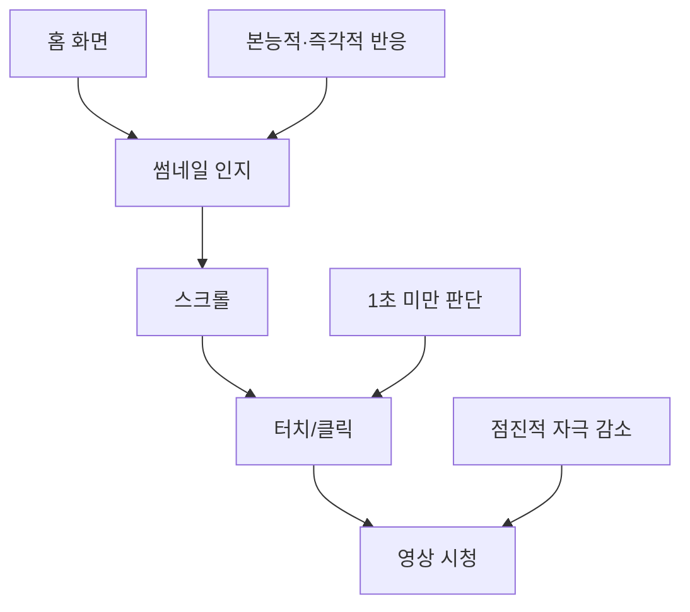

# 주언규 - 15분으로 유튜브 채널 빠르게 성장시키는 실전 가이드
## 평범한 사람만이 할 수 있는 차별화 전략 완벽 분석

> **기반**: 10만명 교육 경험을 가진 주언규의 15분 일일 유튜브 성장 훈련법

---

## 🎯 **핵심 인사이트: 평범함이 최대 장점이다**

### **평범함의 역설**
```
💡 주언규의 핵심 논리:

기존 관념:
❌ "나는 너무 평범해요"
❌ "수많은 30대 남자 중 한 명일 뿐"
❌ "아무것도 특별할 게 없어요"

새로운 관점:
✅ 평범한 사람만이 가진 기가막힌 능력이 있다
✅ 나와 비슷한 사람이 많다 = 타겟 시청자가 많다
✅ 평범함을 활용한 차별화가 가능하다
```

### **평범함 vs 극단값 분석**
```
📊 크리에이터 스펙트럼:

극단값 (뛰어남/특이함):
- 차별화: 쉬움
- 타겟 시청자: 적음 (특이한 케이스)
- 시청자 모으기: 어려움
- 지속성: 불안정

평범함 (일반적):
- 차별화: 어려움 (하지만 가능)
- 타겟 시청자: 많음 (나와 비슷한 사람들)
- 시청자 모으기: 쉬움 (공감대 형성)
- 지속성: 안정적

결론: 평범함은 시청자로서의 최대 장점
```

---

## 📱 **유튜브 사용자 행동 패턴 분석**

### **시청자 여정 (User Journey)**


### **썸네일 vs 영상 내용의 기억 패턴**
```
🧠 기억 메커니즘 분석:

영상 내용:
✅ 시청 후 기억에 남음
✅ 검색할 때 내용으로 찾음
✅ 의식적 기억

썸네일:
❌ 거의 기억나지 않음
❌ 봤던 영상 찾기 어려움
❌ 무의식적 반응

핵심: 썸네일은 본능적·즉각적 영역에 호소해야 함
```

### **자극 강도 변화 패턴**
```
📈 시청 과정별 자극 반응:

홈화면 썸네일: 10점 (최고 자극)
영상 시작: 9점
영상 중반: 7-6점  
영상 후반: 5-4점

결론: 
- 썸네일이 가장 중요한 관문
- 영상이 길어질수록 직각적 자극 감소
- 첫 인상이 모든 것을 결정
```

---

## 🎬 **썸네일의 절대적 중요성**

### **유튜브 수익 구조와 썸네일의 관계**
```
💰 유튜브 광고 수익 분석:

광고 유형별 효과:
1. 프리롤 광고 (시작 즉시)
   - 클릭만 하면 즉시 재생
   - 시청시간과 무관하게 수익 발생
   - 유튜브에게 가장 중요한 수익원

2. 미드롤 광고 (중간)
   - 좋은 내용이어야 시청 지속
   - 이탈률 높음

3. 엔드롤 광고 (끝)
   - 극소수만 시청
   - 수익 기여도 낮음

시청자 수 패턴:
시작 (최대) → 점진적 감소 → 끝 (최소)

결론: 썸네일 클릭이 수익의 핵심
```

### **유튜브 비즈니스 모델 관점**
```
🏢 유튜브 입장에서의 우선순위:

수익 극대화 공식:
클릭 수 × 광고 단가 = 총 수익

내용의 가치 vs 썸네일의 가치:
- 내용: 시청 지속에 영향 (미드롤/엔드롤)
- 썸네일: 클릭 발생에 영향 (프리롤)

유튜브 알고리즘 우선순위:
1위: 클릭률 (썸네일 효과)
2위: 시청 지속률 (내용 효과)

핵심: 내용보다 썸네일이 수익에 더 직접적 영향
```

---

## 🏋️ **15분 일일 훈련법: 썸네일 마스터하기**

### **Step 1: 시청 기록 활용법**
```
📋 준비 단계:

1. 시청 기록 접근:
   - 유튜브 → 내 데이터 → 시청 기록
   - 컴퓨터: 좌측 메뉴 → 시청 기록
   - 핸드폰: 라이브러리 → 시청 기록

2. 평범함 확인:
   ✅ 나와 비슷한 사람이 많은가?
   ✅ 특이한 취향이 아닌가?
   ✅ 대중적인 콘텐츠를 주로 보는가?

3. 훈련 가능성 판단:
   - 평범함: 이 방법 적용 가능
   - 특이함: 별도 방법 필요 (고급 과정)
```

### **Step 2: 썸네일 캡처 및 분석**
```
🎯 실행 과정:

매일 15분 루틴:

1. 썸네일 캡처 (5분):
   - 어제 본 영상들의 썸네일 스크린샷
   - 최소 5-10개 수집
   - 다양한 장르 포함

2. 클릭 이유 분석 (10분):
   - 각 썸네일 옆에 클릭 이유 기록
   - 무의식적 반응을 의식화
   - 구체적이고 솔직하게 작성

예시 분석:
"비타민C 영상 클릭 → 감기 걸려서 → 건강 정보 필요"
"잘생긴 남자 나와서 → 본능적 호감 → 시각적 매력"
"궁금한 제목 → 호기심 자극 → 정보 욕구"
```

### **Step 3: 무의식의 의식화 과정**
```
🧠 심층 분석 기법:

표면적 이유 배제:
❌ "심심해서 봤어요" (유튜브 자체 이유)
❌ "그냥 재밌을 것 같아서" (추상적)

구체적 이유 발굴:
✅ "남들이 다 보니까 → FOMO 심리"
✅ "킹받는 댓글 보고 싶어서 → 대리만족"
✅ "당장 필요한 정보라서 → 실용적 니즈"

분석 깊이 단계:
1. 1차: 겉으로 드러난 이유
2. 2차: 숨겨진 심리적 동기
3. 3차: 근본적 인간의 욕구

목표: 나 대표 집단의 심층 썸네일 니즈 파악
```

---

## 📊 **성과 측정 및 목표 설정**

### **현실적 목표 설정**
```
🎯 단계별 성취 목표:

6개월 목표:
- 클릭률 10% 한 번 달성
- 주 1회 업로드 기준
- 안정적 썸네일 퀄리티 확보

1년 목표:
- 구독자 1만명 달성
- 평균 클릭률 5% 이상 유지
- 나 같은 사람들의 충성 시청자 확보

장기 목표:
- 썸네일 감각 내재화
- 자동적 반응 패턴 이해
- 확장 가능한 기반 구축
```

### **훈련 효과 측정**
```
📈 진전도 체크리스트:

초급 단계 (1-2개월):
□ 내 시청 패턴 명확히 파악
□ 썸네일 분석 습관 형성
□ 기본적 클릭 심리 이해

중급 단계 (3-4개월):
□ 다른 사람 반응 예측 가능
□ 썸네일 제작 시 의식적 고려
□ 클릭률 개선 효과 체감

고급 단계 (5-6개월):
□ 직관적 썸네일 평가 능력
□ 장르별 최적 패턴 파악
□ 안정적 성과 도출
```

### **한계 인식 및 확장 전략**
```
⚠️ 방법론의 한계:

수치적 한계:
- 구독자 1만명까지는 가능
- 그 이상은 추가 전략 필요
- 수익성 아직 높지 않음

확장 필요 시점:
- 1만 구독자 달성 후
- 안정적 조회수 확보 후
- 수익화 본격 고려 시

고도화 방향:
- 썸네일 → 전체 콘텐츠 전략
- 개인 감각 → 데이터 기반 접근
- 소규모 → 대중적 어필
```

---

## 🔧 **실전 적용 도구 및 팁**

### **분석 템플릿**
```
📝 일일 분석 양식:

날짜: ____년 __월 __일

썸네일 분석:
1. 영상 제목: ________________
   썸네일 특징: _______________
   클릭 이유: _________________
   감정/상황: _________________

2. 영상 제목: ________________
   썸네일 특징: _______________
   클릭 이유: _________________
   감정/상황: _________________

[5-10개 반복]

오늘의 인사이트:
- 가장 강한 클릭 유발 요소: ________
- 내 성향 발견: ___________________
- 다음 실험해볼 요소: _____________
```

### **카테고리별 분석 기준**
```
🎨 썸네일 요소 분류:

시각적 요소:
- 색상 (밝음/어두움/대비)
- 인물 (표정/포즈/성별/연령)
- 텍스트 (크기/색상/내용)
- 배경 (복잡함/단순함)

심리적 요소:
- 호기심 (의문형/예고형)
- 감정 (놀람/분노/기쁨/슬픔)
- 이익 (정보/팁/돈/건강)
- 사회성 (트렌드/이슈/관계)

상황적 요소:
- 개인 상태 (컨디션/기분/필요)
- 외부 환경 (시간/장소/상황)
- 사회적 맥락 (이슈/이벤트)
```

### **주의사항 및 함정**
```
⚠️ 피해야 할 실수:

분석 과정:
❌ 너무 이성적으로 접근
❌ 사회적으로 바람직한 이유만 기록
❌ 표면적 이유에만 머무름
❌ 일관성 없는 분석

실행 과정:
❌ 매일 하지 않고 몰아서
❌ 다른 사람 의견에 흔들림
❌ 즉시 결과 요구
❌ 분석만 하고 적용 안 함

확장 과정:
❌ 한계 인정하지 않음
❌ 무작정 규모 확대
❌ 기초 무시하고 고급 기법 추구
```

---

## 🚀 **고급 확장 전략**

### **1만 구독자 이후 전략**
```
📈 다음 단계 준비:

내용 개선:
- 썸네일로 모은 시청자 유지
- 콘텐츠 퀄리티 업그레이드
- 시청 지속률 개선

채널 다각화:
- 썸네일 + 제목 최적화
- 시리즈 콘텐츠 개발
- 커뮤니티 형성

수익화 준비:
- 광고 수익 최적화
- 부가 수익원 개발
- 브랜드 파트너십
```

### **데이터 기반 접근법**
```
📊 고도화 도구:

분석 툴 활용:
- YouTube Analytics 심화 활용
- 써드파티 분석 도구
- A/B 테스트 시스템

전문 교육 고려:
- 주언규 비즈니스 PT
- 전문 유튜브 교육 과정
- 멘토링 프로그램

협업 네트워크:
- 비슷한 크리에이터와 교류
- 전문가 자문
- 업계 트렌드 공유
```

---

## 💡 **핵심 성공 원칙**

### **주언규의 핵심 메시지**
```
🎯 성공의 3원칙:

1. 평범함을 인정하고 활용하라
   - 약점이 아닌 강점으로 인식
   - 나와 같은 사람들이 타겟
   - 공감대 기반 콘텐츠 제작

2. 무의식을 의식화하라
   - 본능적 반응을 분석하라
   - 감정과 이유를 구분하라
   - 패턴을 찾아 체계화하라

3. 꾸준함이 재능을 이긴다
   - 매일 15분 투자
   - 3개월 이상 지속
   - 점진적 개선 추구
```

### **장기적 관점**
```
🌟 지속가능한 성장:

단기 (6개월):
- 썸네일 감각 개발
- 기본 시청자 확보
- 채널 방향성 확립

중기 (1-2년):
- 안정적 조회수 확보
- 수익화 기반 구축
- 브랜드 아이덴티티 형성

장기 (3년+):
- 업계 인지도 확보
- 다양한 수익원 개발
- 후배 양성 및 생태계 기여
```

---

## 📋 **실행 체크리스트**

### **시작 전 준비**
```
✅ 기본 준비사항:
□ 유튜브 시청 기록 접근 방법 숙지
□ 스크린샷 도구 준비
□ 분석 노트/파일 준비
□ 매일 15분 시간 확보

□ 마인드셋 점검:
□ 평범함을 장점으로 인정
□ 장기적 관점 수용
□ 꾸준함의 중요성 인식
□ 즉시 결과 기대 금지
```

### **주간 점검사항**
```
📊 주간 리뷰 (매주 일요일):

분석 품질:
□ 매일 5-10개 썸네일 분석 완료
□ 구체적이고 솔직한 이유 기록
□ 패턴 발견 및 인사이트 도출

성장 지표:
□ 클릭 예측 정확도 개선
□ 분석 깊이 향상
□ 새로운 패턴 발견

다음 주 계획:
□ 부족한 영역 보완
□ 새로운 실험 설계
□ 추가 학습 계획
```

### **월간 평가**
```
📈 월간 성과 측정:

정량적 지표:
□ 분석한 썸네일 총 개수
□ 발견한 패턴 수
□ 클릭 예측 정확률

정성적 발전:
□ 썸네일 보는 눈 향상
□ 내 취향 명확화
□ 타겟 시청자 이해도 증가

조정 사항:
□ 방법론 개선점
□ 추가 필요한 학습
□ 다음 단계 준비사항
```

---

## 🎓 **결론: 평범함의 혁명**

### **주언규 방법론의 혁신성**
```
💫 기존 관념 vs 새로운 패러다임:

기존:
- 특별해야 성공한다
- 재능이 있어야 한다
- 완벽한 준비 후 시작한다

새로운:
- 평범함이 최대 강점이다
- 훈련으로 감각을 기를 수 있다
- 매일 조금씩 실행하면 된다

핵심: 평범한 99%를 위한 현실적 성장 전략
```

### **실행의 힘**
```
⚡ 성공 공식:

평범함 인정 × 무의식 의식화 × 꾸준한 실행 = 유튜브 성공

핵심 메시지:
"나로부터 출발하는 방법이 
평범한 사람만이 할 수 있는 조건입니다."

최종 목표:
나와 같은 사람들의 마음을 읽는 전문가가 되기
```

---

**이 가이드라인을 통해 평범한 당신도 유튜브에서 특별한 성공을 만들어가시길 바랍니다. 
중요한 것은 평범함을 인정하고 활용하는 것입니다. 지금 바로 첫 번째 썸네일 분석을 시작해보세요!**

---

*"여러분들이 평범한 사람만 갖고 있는 정말 기가막힌 능력이 있습니다. 그걸 활용하게 됐을 때 차별화를 만들 수가 있다는 거죠."*

📊 **방법론 요약**
- 대상: 평범한 사람 (나와 비슷한 사람이 많은 경우)
- 시간: 매일 15분
- 방법: 시청기록 → 썸네일 분석 → 무의식 의식화
- 목표: 6개월 내 클릭률 10% 달성, 1년 내 구독자 1만명
- 확장: 전문 교육 과정 고려
