# 유튜브 성공 통합 마스터 가이드 - 플로우차트
## 2025년 확실한 성공을 위한 시각적 전략 로드맵

---

## 🎯 **전체 성공 플로우 개요**

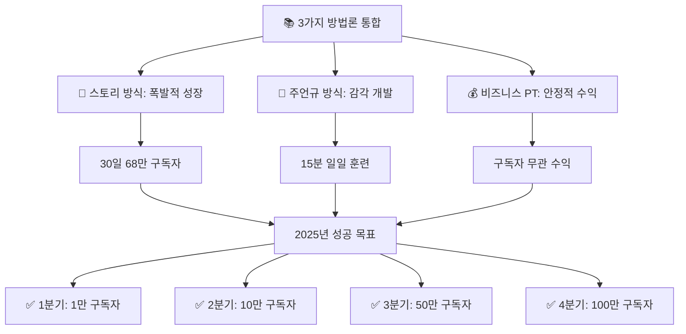

---

## 📊 **Phase 1: 전략적 기반 구축 (1-30일)**

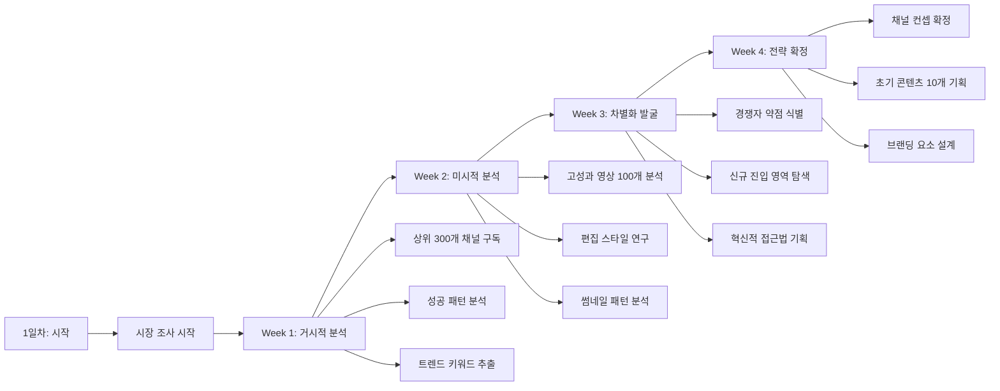

### **브랜딩 설계 프로세스**

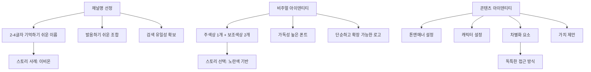

---

## 🚀 **Phase 2: 폭발적 성장 전략 (30-90일)**

### **스토리 방식 초고속 성장**

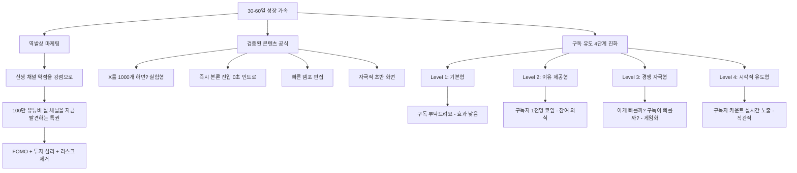

### **주언규 방식 썸네일 마스터**

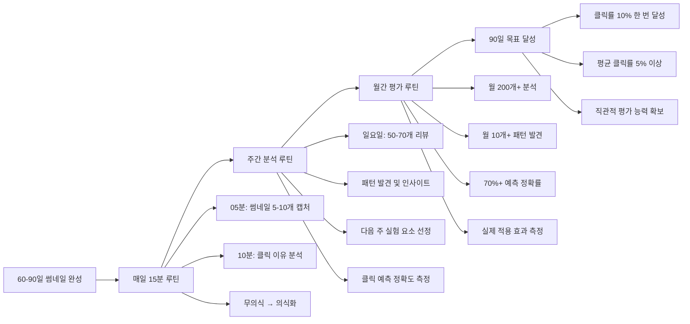

---

## 💎 **Phase 3: 수익화 및 확장 (90-365일)**

### **비즈니스 PT 20가지 성공 조건**

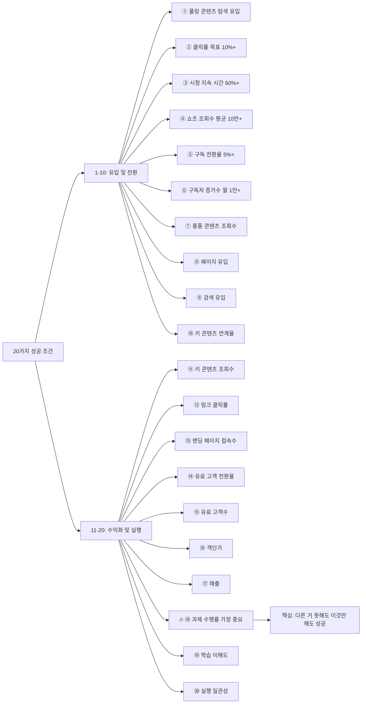

### **수익 모델 다각화 로드맵**

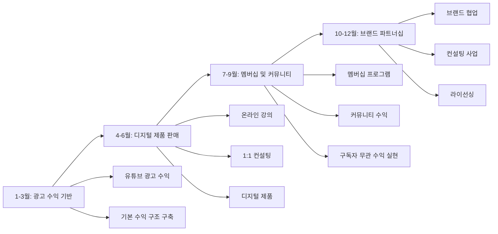

---

## 📋 **실전 실행 플로우**

### **일일 루틴 플로우 (총 90분)**

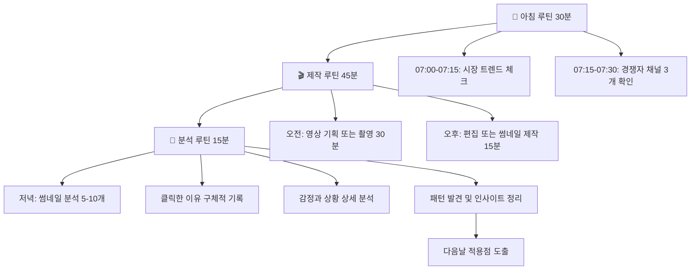

### **주간 실행 체크리스트**

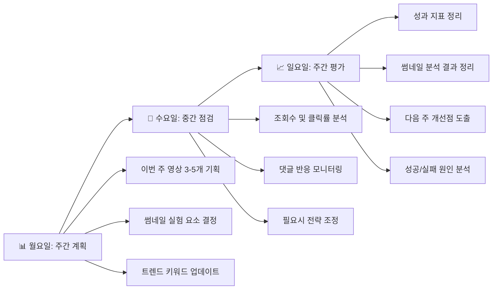

---

## 🎬 **콘텐츠 제작 플로우**

### **영상 제작 4단계 프로세스**

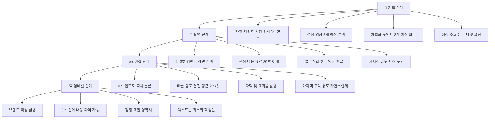

### **제목 작성 공식 플로우**

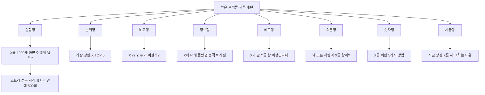

---

## 📊 **성과 분석 시스템**

### **핵심 지표 모니터링 플로우**

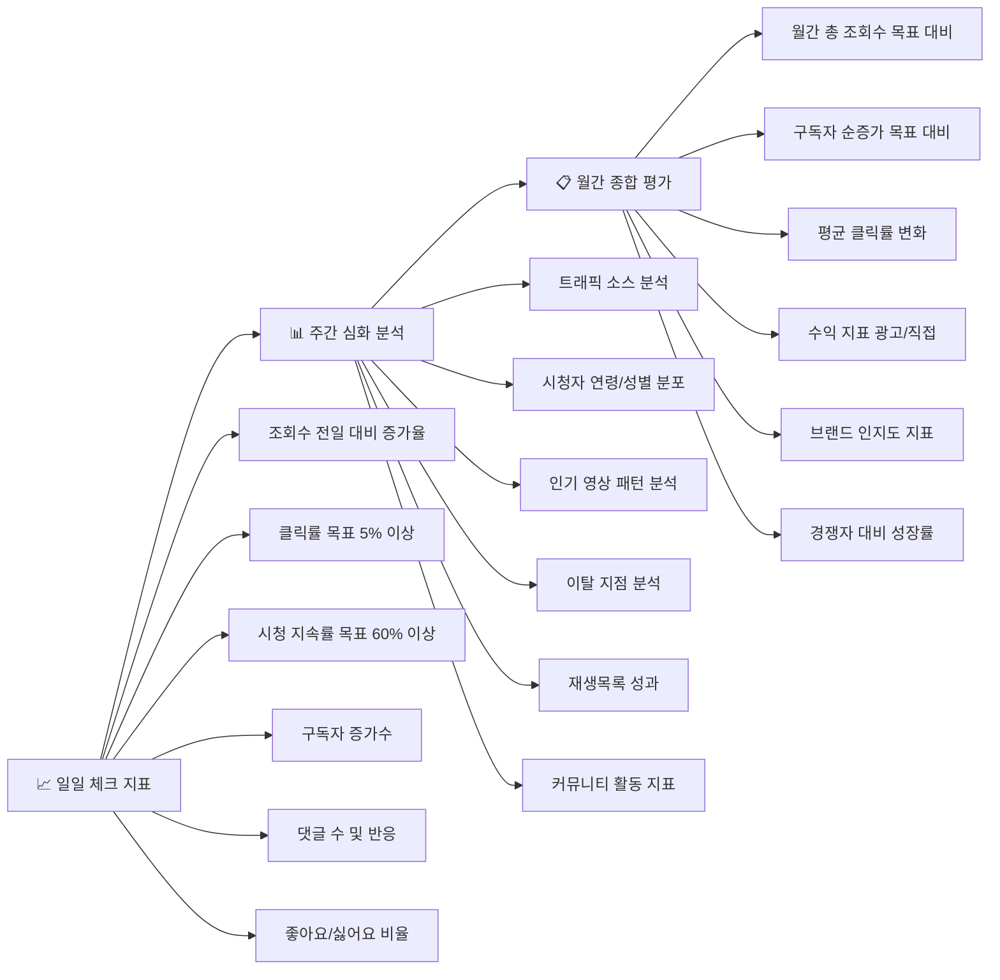

### **A/B 테스트 시스템**

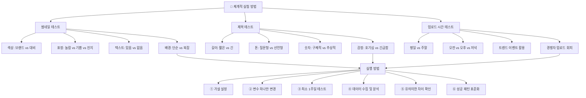

---

## 🏆 **성장 마일스톤 로드맵**

### **연간 성장 로드맵**

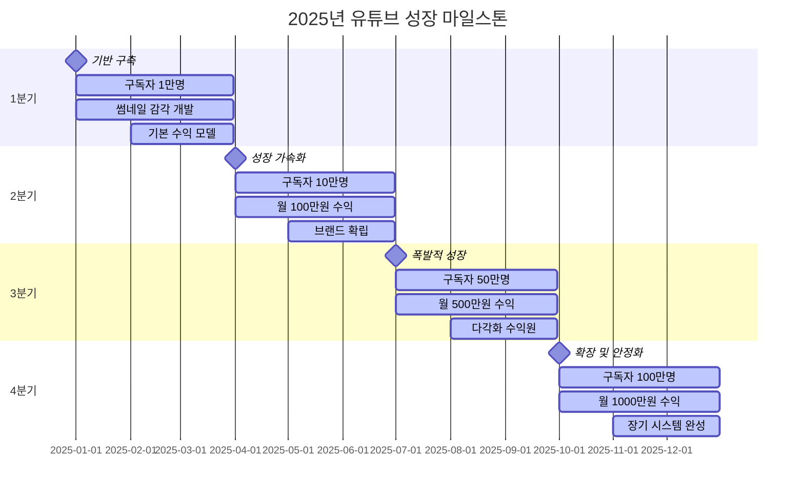

### **월별 성장 마일스톤 플로우**

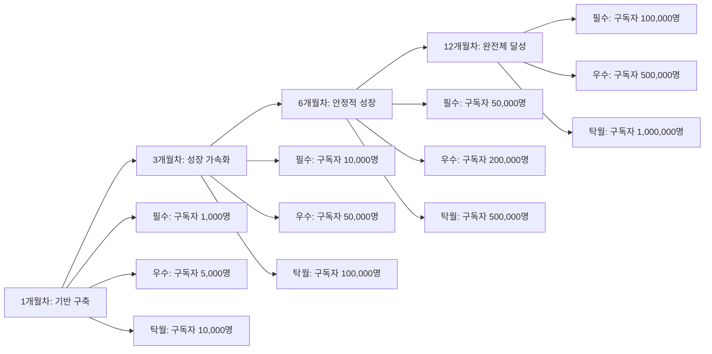

---

## 🎯 **실시간 성과 평가 시스템**

### **일일 성과 스코어카드 (총 100점)**

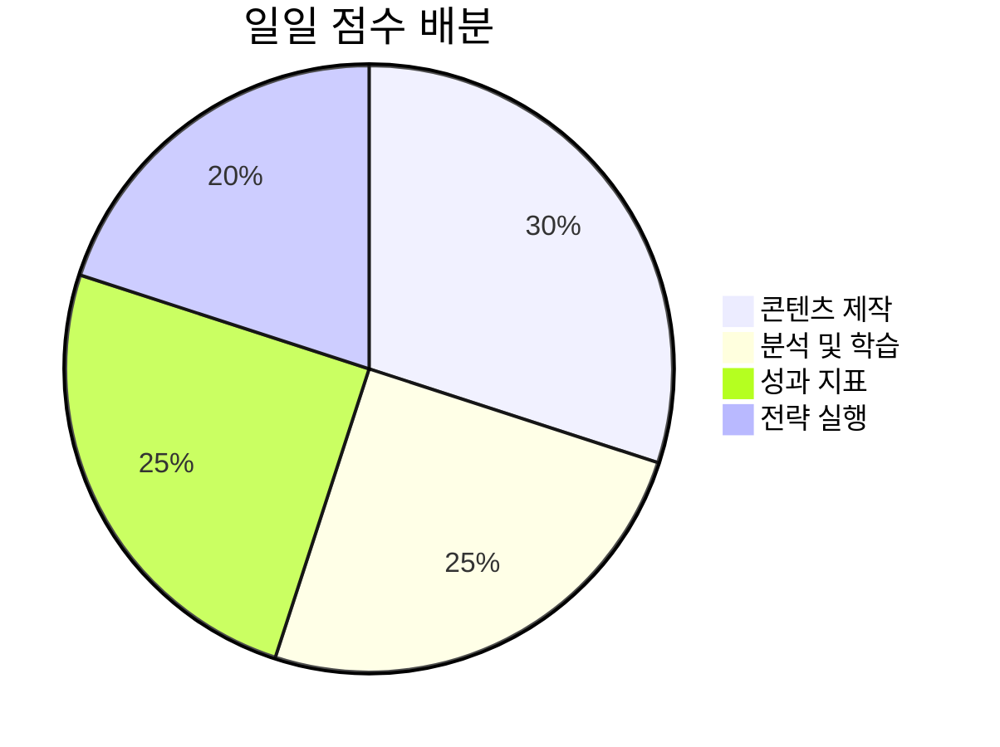

```mermaid
flowchart TD
    A[일일 100점 평가] --> B[콘텐츠 제작 30점]
    A --> C[분석 및 학습 25점]
    A --> D[성과 지표 25점]
    A --> E[전략 실행 20점]
    
    B --> B1[영상 업로드 완료 10점]
    B --> B2[썸네일 퀄리티 5점]
    B --> B3[제목 최적화 5점]
    B --> B4[편집 퀄리티 5점]
    B --> B5[구독 유도 포함 5점]
    
    C --> C1[썸네일 분석 5개 10점]
    C --> C2[경쟁자 모니터링 5점]
    C --> C3[트렌드 파악 5점]
    C --> C4[데이터 기록 5점]
    
    D --> D1[조회수 목표 달성 10점]
    D --> D2[클릭률 목표 달성 5점]
    D --> D3[구독자 증가 5점]
    D --> D4[참여도 댓글/좋아요 5점]
    
    E --> E1[계획 대비 실행률 10점]
    E --> E2[실험 시도 5점]
    E --> E3[피드백 반영 5점]
    
    A --> F[평가 기준]
    F --> F1["90-100점: 탁월"]
    F --> F2["80-89점: 우수"]
    F --> F3["70-79점: 보통"]
    F --> F4[70점 미만: 위험]
```

---

## 🚨 **위기 대응 시스템**

### **성장 정체기 극복 플로우**

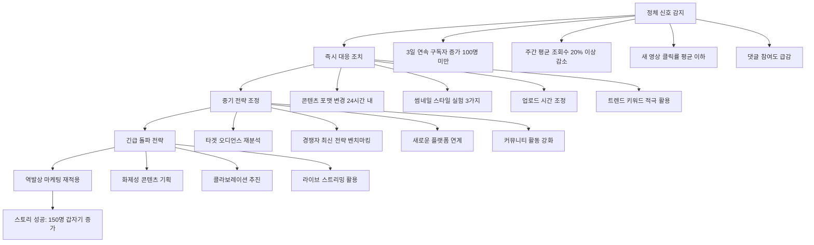

### **실패 시나리오별 대응 매트릭스**

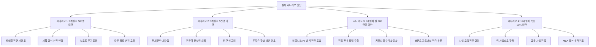

---

## 🛠️ **도구 및 리소스 생태계**

### **필수 도구 스택**

```mermaid
graph TD
    A[콘텐츠 제작 도구] --> B[무료 도구]
    A --> C[유료 도구 월 10만원]
    A --> D[고급 도구 월 30만원]
    
    B --> B1[DaVinci Resolve 편집]
    B --> B2[OBS Studio 녹화]
    B --> B3[Canva 썸네일]
    B --> B4[Audacity 음성편집]
    
    C --> C1[Adobe Premiere Pro]
    C --> C2[Adobe After Effects]
    C --> C3[Adobe Photoshop]
    C --> C4[Epidemic Sound]
    
    D --> D1[Final Cut Pro + Motion]
    D --> D2[Cinema 4D 3D]
    D --> D3[TubeBuddy Pro]
    D --> D4[VidIQ Pro]
    
    E[분석 및 최적화] --> F[기본 도구 무료]
    E --> G[중급 도구 월 5-10만원]
    E --> H[고급 도구 월 20만원+]
    
    F --> F1[YouTube Analytics]
    F --> F2[Google Trends]
    F --> F3[Social Blade]
    F --> F4[Comment Picker]
    
    G --> G1[TubeBuddy]
    G --> G2[VidIQ]
    G --> G3[Hootsuite]
    G --> G4[Buffer]
    
    H --> H1[비즈니스 PT 소프트웨어]
    H --> H2[맞춤형 분석 대시보드]
    H --> H3[자동화 시스템]
    H --> H4[AI 분석 도구]
```

---

## 🚀 **스케일업 및 확장 전략**

### **팀 구성 진화 로드맵**

```mermaid
graph LR
    A[1단계: 구독자 1만<br/>1인 운영] --> B[2단계: 구독자 10만<br/>2인 팀]
    B --> C[3단계: 구독자 50만<br/>5인 팀]
    C --> D[4단계: 구독자 100만<br/>10인+ 팀]
    
    A --> A1[본인: 기획/촬영/편집/분석]
    
    B --> B1[본인: 기획/출연/전략]
    B --> B2[직원1: 편집/썸네일/업로드]
    
    C --> C1[본인: 기획/출연/비즈니스]
    C --> C2[PD: 콘텐츠 기획 관리]
    C --> C3[편집자: 영상 편집 전담]
    C --> C4[디자이너: 썸네일/그래픽]
    C --> C5[매니저: 일정/협업/커뮤니티]
    
    D --> D1[경영진: CEO/CMO/CTO]
    D --> D2[콘텐츠팀: PD/작가/편집자]
    D --> D3[마케팅팀: 마케터/커뮤니티매니저]
    D --> D4[비즈니스팀: 세일즈/파트너십]
    D --> D5[지원팀: 어드민/법무/재무]
```

### **다채널 확장 전략**

```mermaid
flowchart TD
    A[유튜브 확장] --> A1[메인 채널 현재]
    A --> A2[서브 채널 특화 콘텐츠]
    A --> A3[쇼츠 전용 채널]
    A --> A4[라이브 스트리밍 채널]
    
    B[타 플랫폼 진출] --> B1[인스타그램 시각적]
    B --> B2[틱톡 쇼트폼]
    B --> B3[트위치 라이브]
    B --> B4[네이버 포스트 텍스트]
    
    C[글로벌 확장] --> C1[영어 자막 추가]
    C --> C2[해외 플랫폼 진출]
    C --> C3[현지화 콘텐츠 제작]
    C --> C4[글로벌 파트너십]
    
    D[웹3/메타버스] --> D1[NFT 프로젝트]
    D --> D2[가상현실 콘텐츠]
    D --> D3[블록체인 커뮤니티]
    D --> D4[메타버스 공간 구축]
```

---

## 💰 **비즈니스 모델 진화**

### **4단계 수익 모델 진화**

```mermaid
sankey-beta
    기본수익,광고수익,70
    기본수익,멤버십,20
    기본수익,슈퍼챗,10
    
    직접판매,디지털제품,40
    직접판매,온라인강의,30
    직접판매,1대1컨설팅,20
    직접판매,광고수익,10
    
    브랜드비즈니스,브랜드파트너십,50
    브랜드비즈니스,자체제품,30
    브랜드비즈니스,라이선싱,10
    브랜드비즈니스,기타,10
    
    기업가치,M&A,40
    기업가치,벤처투자,30
    기업가치,프랜차이즈,20
    기업가치,지분투자,10
```

### **글로벌 확장 로드맵**

```mermaid
gantt
    title 글로벌 확장 4단계 계획
    dateFormat YYYY-MM-DD
    section 1단계: 동남아시아
    베트남/태국/인도네시아     :active, stage1, 2025-07-01, 2025-12-31
    현지 자막 및 더빙         :active, stage1-1, 2025-07-01, 2025-09-30
    현지 크리에이터 협업      :active, stage1-2, 2025-08-01, 2025-11-30
    문화적 현지화            :active, stage1-3, 2025-09-01, 2025-12-31
    section 2단계: 동북아시아
    일본/대만/홍콩           :stage2, 2026-01-01, 2026-12-31
    프리미엄 콘텐츠 전략      :stage2-1, 2026-01-01, 2026-06-30
    기술 혁신 요소 강화       :stage2-2, 2026-04-01, 2026-10-31
    section 3단계: 영어권
    미국/영국/캐나다/호주     :stage3, 2026-07-01, 2027-12-31
    글로벌 스탠다드 콘텐츠    :stage3-1, 2026-07-01, 2027-03-31
    현지 MCN 파트너십        :stage3-2, 2026-10-01, 2027-09-30
    section 4단계: 유럽/남미
    독일/프랑스/브라질       :stage4, 2027-01-01, 2028-12-31
    다언어 서비스            :stage4-1, 2027-01-01, 2027-12-31
    글로벌 브랜드 완성        :stage4-2, 2027-07-01, 2028-12-31
```

---

## 🎉 **최종 성공 공식**

### **통합 성공 방정식**

```mermaid
flowchart TD
    A[유튜브 성공 = 시장 기회 × 전략 실행 × 지속성³] --> B[시장 기회]
    A --> C[전략 실행]
    A --> D[지속성]
    
    B --> B1[트렌드 분석 선제적 대응]
    B --> B2[경쟁자 분석 차별화]
    B --> B3[니치 시장 발굴 선점]
    B1 --> B1A[스토리: 300명 채널 분석]
    
    C --> C1[스토리 방식: 폭발적 성장]
    C --> C2[주언규 방식: 기초 감각]
    C --> C3[비즈니스 PT: 안정적 수익]
    C1 --> C1A[30일 68만 구독자]
    C2 --> C2A[매일 15분 썸네일 분석]
    C3 --> C3A[85% 수익화 성공률]
    
    D --> D1[매일 15분 썸네일 분석]
    D --> D2[일관된 업로드 스케줄]
    D --> D3[지속적 학습 및 개선]
    D1 --> D1A[주언규: 한 세 달만 해보세요]
    D3 --> D3A[비즈니스 PT: 과제 수행이 가장 중요]
    
    B3 --> E[기하급수적 성장]
    C3A --> E
    D3A --> E
```

### **2025년 최종 목표 달성 확률**

```mermaid
pie title 2025년 목표 달성 확률
    "필수 달성 (90% 확신)" : 90
    "도전 달성 (70% 확신)" : 70
    "꿈의 달성 (30% 확신)" : 30
```

```mermaid
flowchart LR
    A[필수 달성 90% 확신] --> A1[구독자 100,000명]
    A --> A2[연 수익 1억원]
    A --> A3[업계 인지도 확보]
    A --> A4[안정적 수익 구조]
    A --> A5[확장 가능한 시스템]
    
    B[도전 달성 70% 확신] --> B1[구독자 500,000명]
    B --> B2[연 수익 3억원]
    B --> B3[브랜드 파트너십 10개]
    B --> B4[팀 운영 시스템]
    B --> B5[글로벌 진출 기반]
    
    C[꿈의 달성 30% 확신] --> C1[구독자 1,000,000명]
    C --> C2[연 수익 10억원]
    C --> C3[업계 대표 인플루언서]
    C --> C4[기업가치 100억원]
    C --> C5[사회적 영향력 확보]
    
    A1 --> PROOF1[스토리 24일차: 10만 달성]
    B1 --> PROOF2[스토리 68만명 사례]
    C1 --> PROOF3[스토리 수준을 1년으로 확장]
```

---

## ⚡ **실행을 위한 핵심 마인드셋**

```mermaid
mindmap
  root)유튜브 성공 마인드셋(
    완벽보다 실행
      스토리: 80% 준비되면 시작
      처음이라 어색해도 시작
      실행하면서 개선
    데이터가 감정을 이긴다
      주언규: 나로부터 출발
      감정적 판단 < 수치적 근거
      썸네일 분석으로 무의식 의식화
    차별화가 생존 조건
      스토리 역발상: 신생이 유리
      약점을 강점으로 전환
      독특한 접근법으로 차별화
    시스템이 재능을 이긴다
      비즈니스 PT: 20가지 조건
      매일의 작은 실행이 기적
      일관된 루틴이 성공 만듦
    지금이 가장 좋은 타이밍
      완벽한 때는 없다
      30일만에 성공 가능
      2025년이 골든타임
```

---

## 🎯 **시작하기 위한 첫 주 액션 플랜**

```mermaid
gantt
    title 첫 주 실행 플랜 (Day 1-7)
    dateFormat YYYY-MM-DD
    section Day 1-2
    시장 조사 시작          :active, day1, 2025-01-01, 2025-01-02
    상위 50개 채널 구독     :active, day1-1, 2025-01-01, 2025-01-02
    성공 패턴 1차 분석      :active, day1-2, 2025-01-01, 2025-01-02
    section Day 3-4
    브랜딩 기초 설계        :active, day3, 2025-01-03, 2025-01-04
    채널명 후보 리스트      :active, day3-1, 2025-01-03, 2025-01-04
    색상/로고 시안 제작     :active, day3-2, 2025-01-03, 2025-01-04
    section Day 5-6
    첫 영상 기획 및 제작     :active, day5, 2025-01-05, 2025-01-06
    썸네일 분석 시작        :active, day5-1, 2025-01-05, 2025-01-06
    편집 및 업로드 준비     :active, day5-2, 2025-01-05, 2025-01-06
    section Day 7
    첫 영상 업로드          :milestone, day7, 2025-01-07, 0d
    성과 분석 시작          :active, day7-1, 2025-01-07, 2025-01-07
    다음 주 계획 수립       :active, day7-2, 2025-01-07, 2025-01-07
```

---

**🚀 이제 시작하세요! 성공으로 가는 모든 길이 이 플로우차트에 담겨 있습니다.**

*"성공자와 일반인의 차이는 언제 시작했는가입니다. 지금 시작하면 당신도 성공자가 됩니다."*
- 주언규 비즈니스 PT 핵심 메시지

---

### 📋 **플로우차트 활용 가이드**

1. **전체 흐름 파악**: 맨 위 전체 성공 플로우로 큰 그림 이해
2. **단계별 실행**: 각 Phase별 상세 플로우를 순서대로 따라가기
3. **일일 체크**: 매일 실행 플로우와 체크리스트 활용
4. **성과 모니터링**: 실시간 평가 시스템으로 지속적 개선
5. **위기 대응**: 문제 발생시 위기 대응 플로우 즉시 적용

이 플로우차트는 살아있는 문서입니다. 실행하면서 지속적으로 업데이트하고 개선해 나가세요!
