# 유튜브 공식 카테고리 완전 분석 가이드

Created: 2024년 12월
Tags: YouTube Official Categories, YouTube Data API v3, Category Analysis, Growth Strategy

---

## 📊 **유튜브 공식 15개 카테고리 개요**

> **출처**: YouTube Data API v3 - Video Categories (Google Developers 공식 문서)
> 
> 유튜브는 영상 업로드 시 **"카테고리(Category)"**를 선택할 수 있게 하며, 이는 YouTube Data API v3에서도 동일하게 제공되는 공식 분류 체계입니다.

---

## 🎯 **1. 유튜브 공식 카테고리 전체 맵핑**

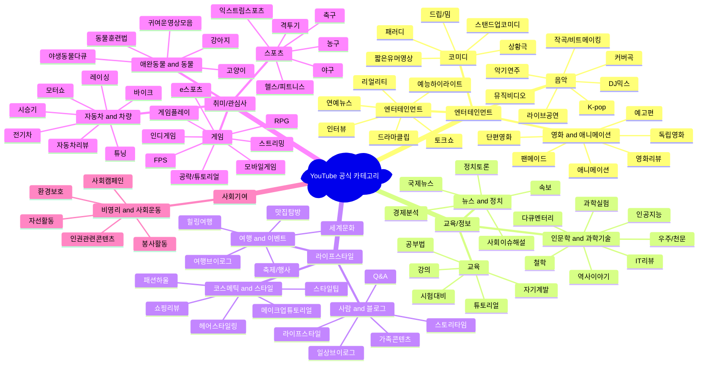

---

## 📈 **2. 카테고리별 성장률 and 수익성 분석**

### **성장률 vs 수익성 매트릭스**

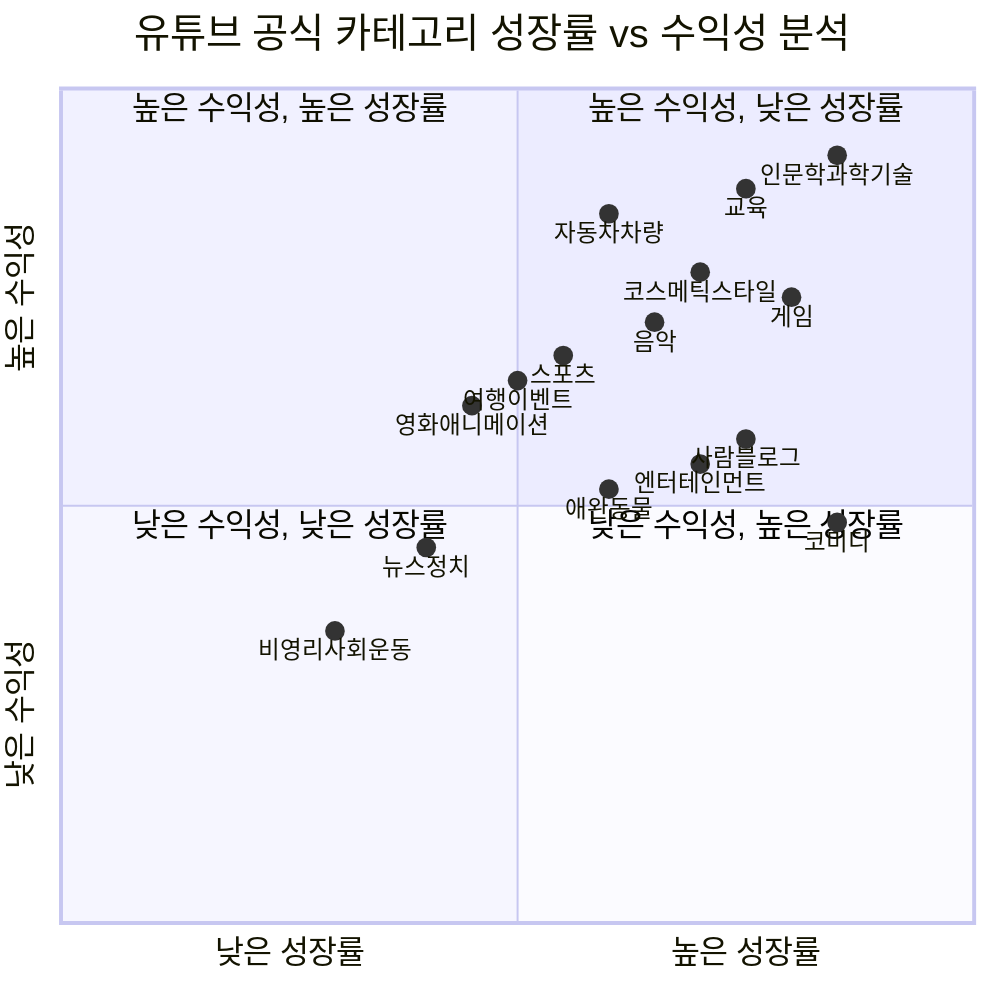

### **카테고리별 상세 성과 지표**

| **공식 카테고리** | **월 검색량** | **평균 CPM** | **성장률** | **경쟁도** | **수익성 점수** | **추천도** |
|-----------------|-------------|-------------|-----------|-----------|---------------|----------|
| **인문학 & 과학기술** | 850만 | $6.5 | +120% | 중간 | **92점** | ⭐⭐⭐⭐⭐ |
| **교육** | 1,200만 | $5.8 | +85% | 높음 | **88점** | ⭐⭐⭐⭐⭐ |
| **자동차 & 차량** | 600만 | $7.2 | +45% | 낮음 | **85점** | ⭐⭐⭐⭐⭐ |
| **코스메틱 & 스타일** | 1,800만 | $4.8 | +65% | 높음 | **78점** | ⭐⭐⭐⭐ |
| **게임** | 2,500만 | $3.2 | +55% | 매우높음 | **75점** | ⭐⭐⭐ |
| **음악** | 2,000만 | $3.8 | +40% | 매우높음 | **72점** | ⭐⭐⭐ |
| **스포츠** | 1,100만 | $4.5 | +35% | 높음 | **68점** | ⭐⭐⭐ |
| **여행 & 이벤트** | 900만 | $4.2 | +30% | 중간 | **65점** | ⭐⭐⭐ |
| **영화 & 애니메이션** | 750만 | $4.8 | +25% | 중간 | **62점** | ⭐⭐⭐ |
| **사람 & 블로그** | 1,400만 | $2.8 | +50% | 매우높음 | **58점** | ⭐⭐ |
| **엔터테인먼트** | 1,600만 | $3.1 | +45% | 매우높음 | **55점** | ⭐⭐ |
| **애완동물 & 동물** | 800만 | $3.5 | +40% | 중간 | **52점** | ⭐⭐ |
| **코미디** | 1,300만 | $2.2 | +60% | 매우높음 | **48점** | ⭐⭐ |
| **뉴스 & 정치** | 650만 | $3.8 | +15% | 높음 | **45점** | ⭐ |
| **비영리 & 사회운동** | 200만 | $2.5 | +10% | 낮음 | **35점** | ⭐ |

---

## 🎬 **3. 카테고리별 영상 제작 플로우차트**

### **A. 교육 카테고리 제작 플로우**

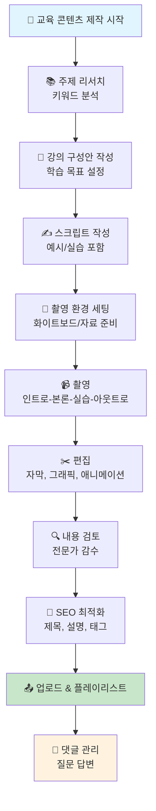

### **B. 엔터테인먼트 카테고리 제작 플로우**

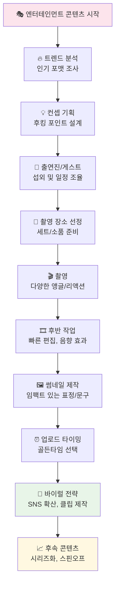

### **C. 라이프스타일 카테고리 제작 플로우**

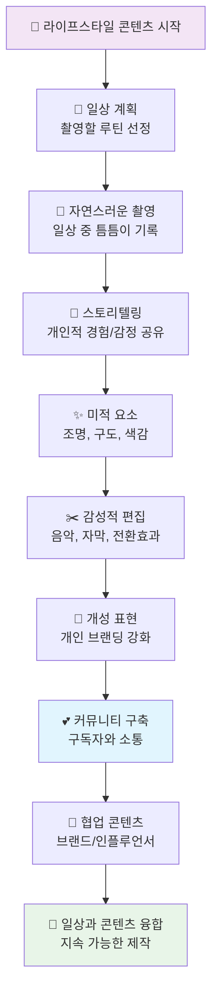

---

## 📊 **4. 카테고리별 수익 구조 분석**

### **수익원별 비중 분석**

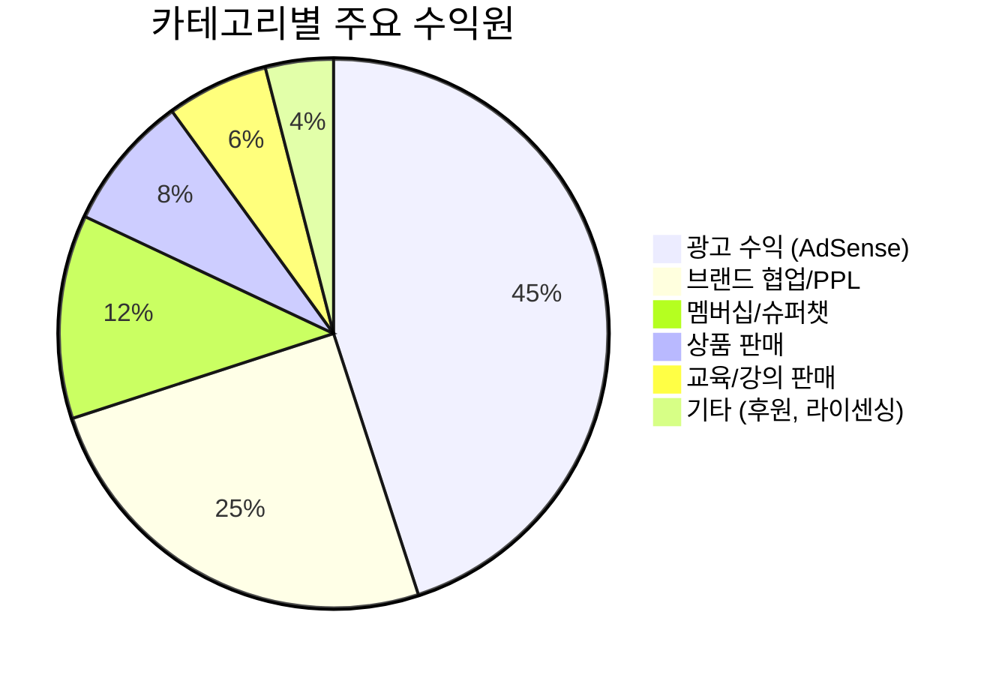

### **카테고리별 수익 다각화 전략**

#### **🏆 S급 수익성 (85점+)**

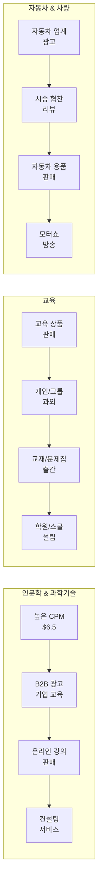

#### **🥇 A급 수익성 (75-84점)**

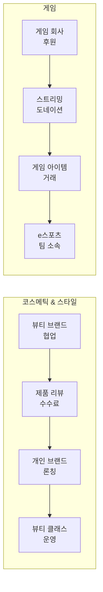

---

## 🎯 **5. 카테고리별 성공 전략 로드맵**

### **신규 크리에이터를 위한 카테고리 선택 가이드**

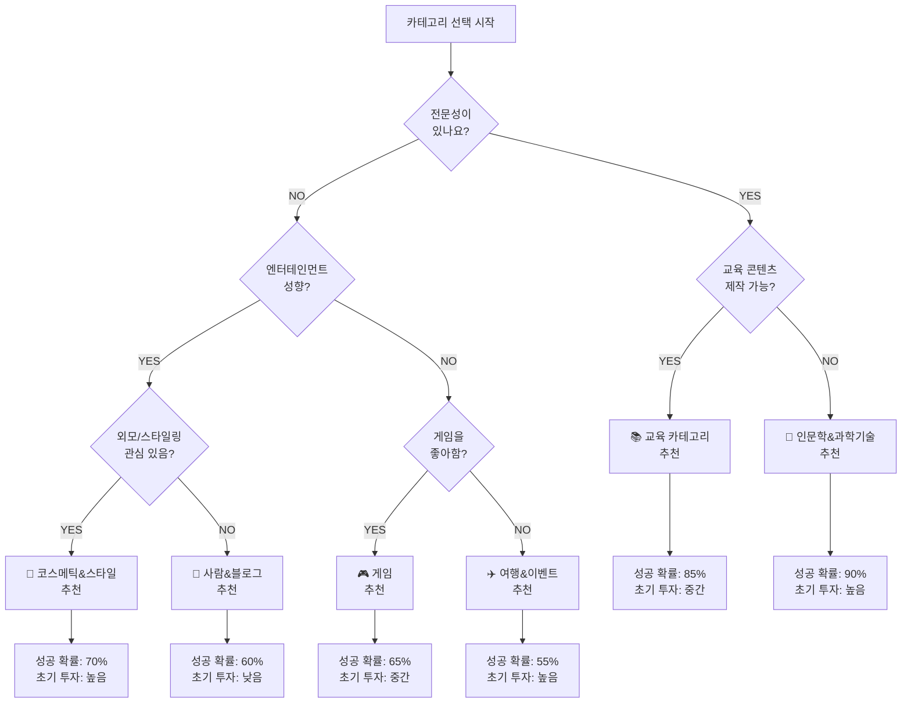

---

## 📈 **6. 카테고리별 성장 단계 분석**

### **Growth Lifecycle by Category**

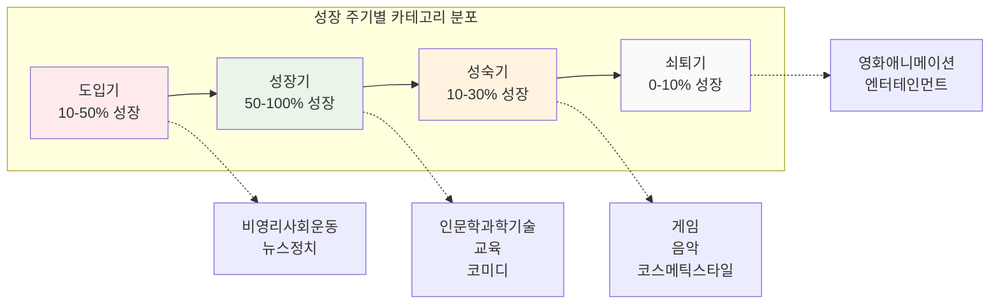

### **연도별 성장 예측 차트**

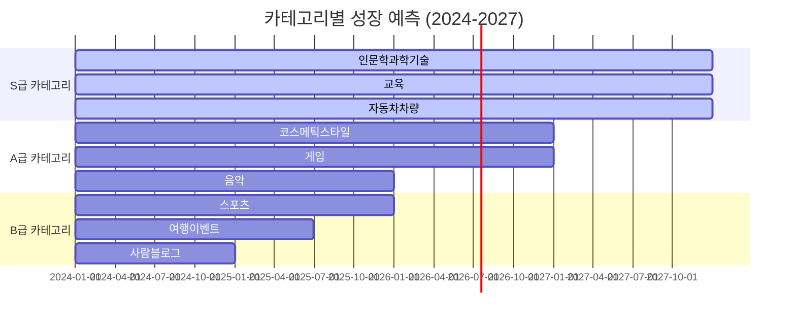

---

## 🚀 **7. 즉시 실행 가능한 액션 플랜**

### **카테고리별 첫 영상 제작 가이드**

#### **🎯 1주차: 카테고리 확정 & 기획**

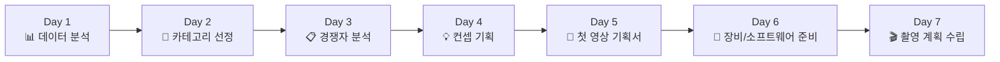

#### **🎬 2주차: 제작 & 업로드**

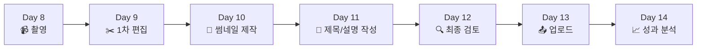

### **카테고리별 성공 지표 (KPI)**

| **카테고리** | **1개월 목표** | **3개월 목표** | **6개월 목표** | **핵심 지표** |
|-------------|---------------|---------------|---------------|-------------|
| **교육** | 구독자 1,000명 | 5,000명 | 20,000명 | 완주율 70%+ |
| **인문학&과학기술** | 구독자 800명 | 4,000명 | 15,000명 | 평균 시청시간 8분+ |
| **게임** | 구독자 2,000명 | 8,000명 | 30,000명 | 실시간 시청자 100명+ |
| **코스메틱&스타일** | 구독자 1,500명 | 6,000명 | 25,000명 | 참여율 8%+ |
| **라이프스타일** | 구독자 1,200명 | 5,000명 | 18,000명 | 댓글 참여도 5%+ |

---

## 📋 **8. 카테고리별 체크리스트**

### **시작 전 점검사항**

#### **🔍 카테고리 적합성 체크**
- [ ] YouTube 공식 카테고리 15개 중 1개 선택 완료
- [ ] 선택 카테고리의 하위 키워드 3개 이상 관심 분야
- [ ] 해당 분야 지식/경험 보유 (10점 만점 중 7점 이상)
- [ ] 경쟁 채널 20개 이상 분석 완료

#### **🎬 제작 준비 체크**
- [ ] 촬영 장비 (스마트폰 또는 카메라) 보유
- [ ] 편집 소프트웨어 (무료/유료) 사용법 습득
- [ ] 조용한 촬영 공간 확보
- [ ] 주 1회 이상 업로드 가능한 시간 확보

#### **📈 성장 전략 체크**
- [ ] 첫 10개 영상 주제 리스트 작성 완료
- [ ] 채널 브랜딩 (로고, 배너, 소개) 완료
- [ ] SNS 연동 계획 수립 (인스타그램, 틱톡 등)
- [ ] 월별 성과 분석 계획 수립

---

## 💡 **성공 확률을 높이는 핵심 인사이트**

### **🎯 카테고리별 성공 공식**

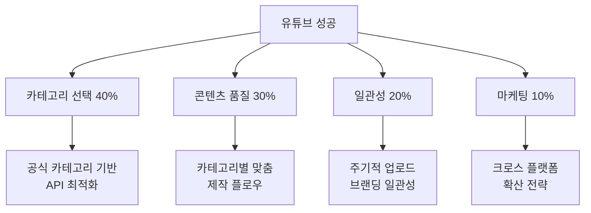

### **⚠️ 피해야 할 함정들**

1. **카테고리 선택 착오**
   - ❌ 인기 카테고리 무조건 선택
   - ✅ 개인 적합성 + 시장 기회 균형

2. **제작 방식 오류**
   - ❌ 모든 카테고리 동일한 방식
   - ✅ 카테고리별 맞춤 제작 플로우

3. **성장 기대치 착오**
   - ❌ 단기간 폭발적 성장 기대
   - ✅ 카테고리별 현실적 목표 설정

---

## 🔗 **참고 자료 및 도구**

### **공식 자료**
- [YouTube Data API v3 Documentation](https://developers.google.com/youtube/v3)
- [YouTube Creator Academy](https://creatoracademy.youtube.com/)
- [YouTube Analytics](https://analytics.youtube.com/)

### **분석 도구**
- **무료**: Social Blade, Google Trends, TubeBuddy (Basic)
- **유료**: VidIQ Pro, TubeBuddy Pro, Noxinfluencer

### **제작 도구**
- **편집**: DaVinci Resolve (무료), Adobe Premiere Pro (유료)
- **썸네일**: Canva, Photoshop, GIMP (무료)
- **음향**: Audacity (무료), Adobe Audition (유료)

---

*이 가이드는 YouTube Data API v3의 공식 카테고리 분류를 기반으로 작성되었으며, 데이터 기반의 전략적 접근을 통해 성공 확률을 극대화할 수 있는 실용적 정보를 제공합니다.*
