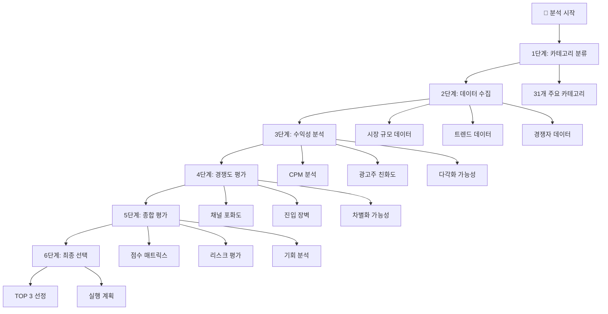
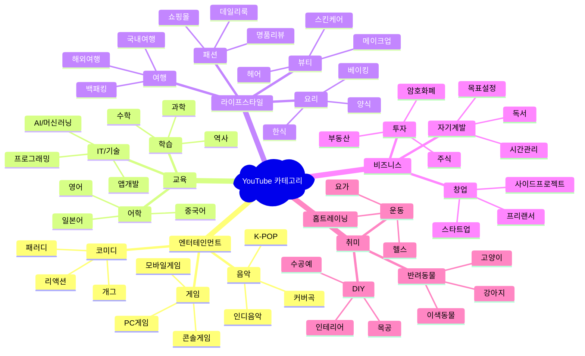
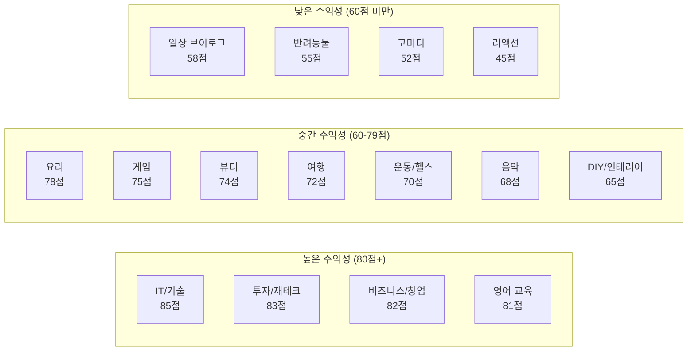
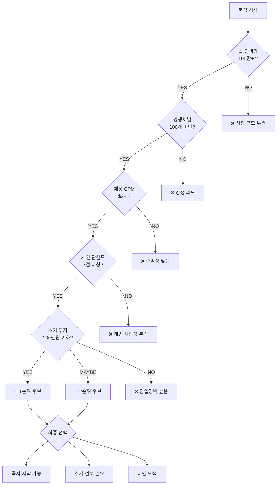
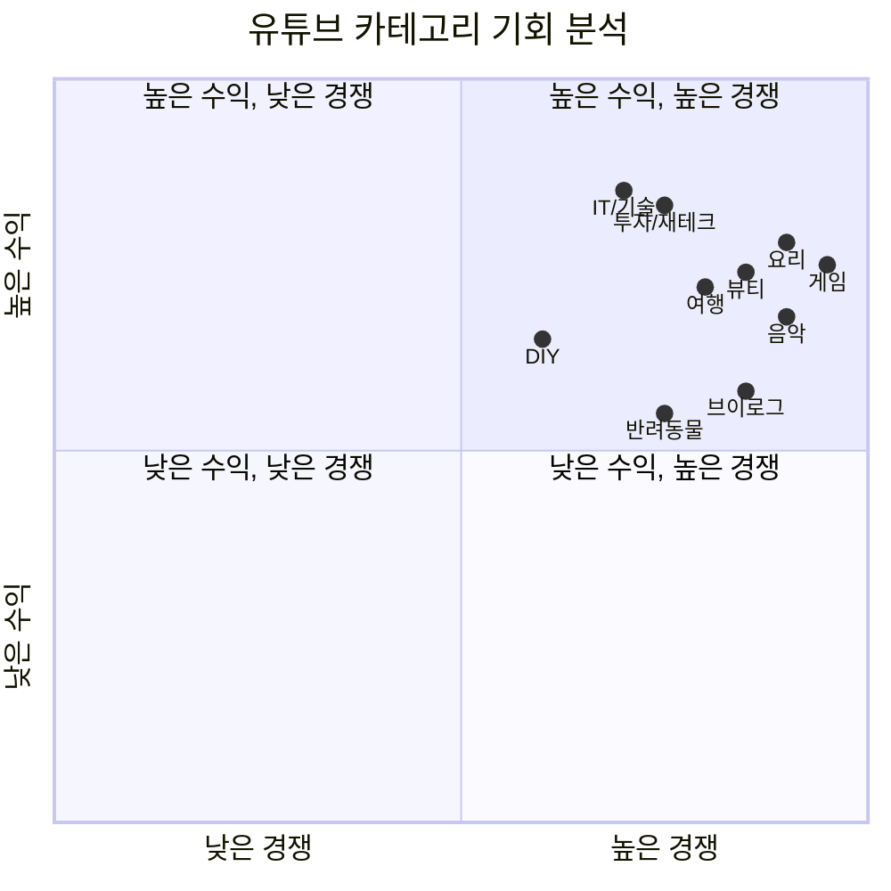
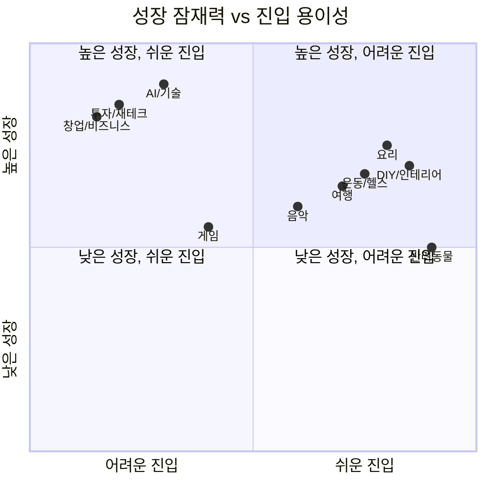
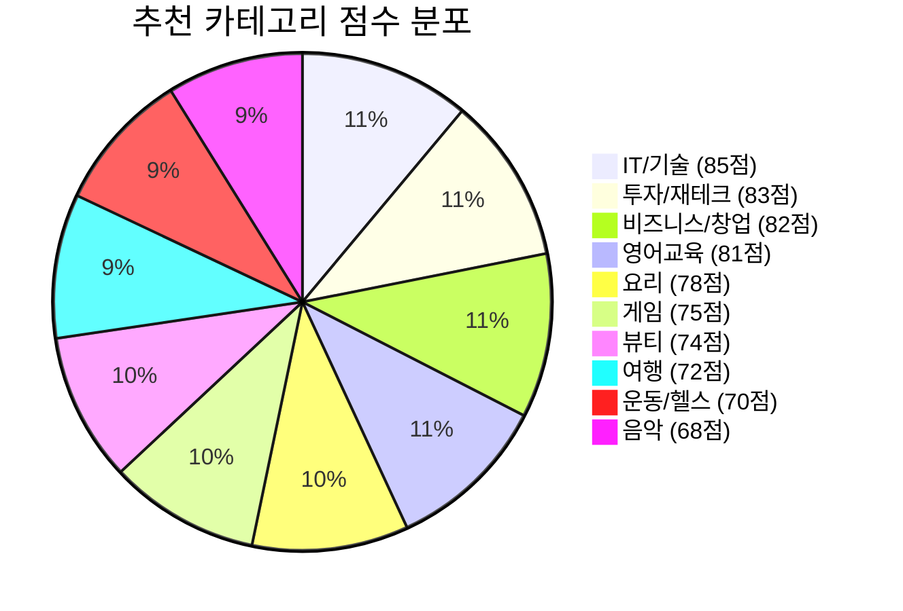
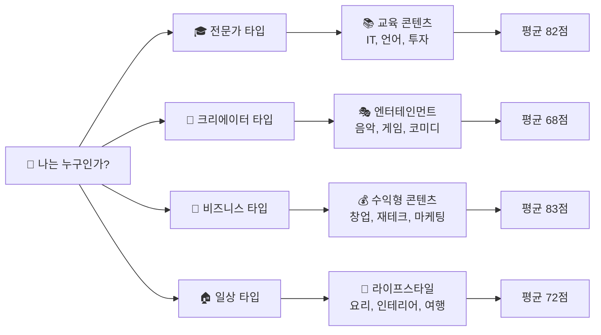
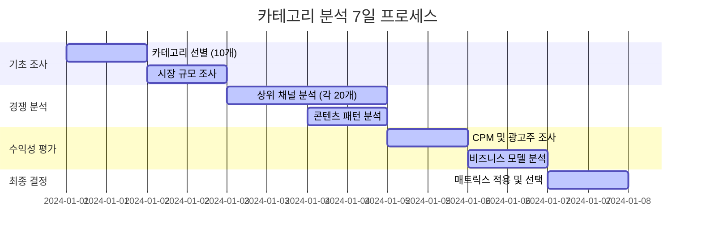
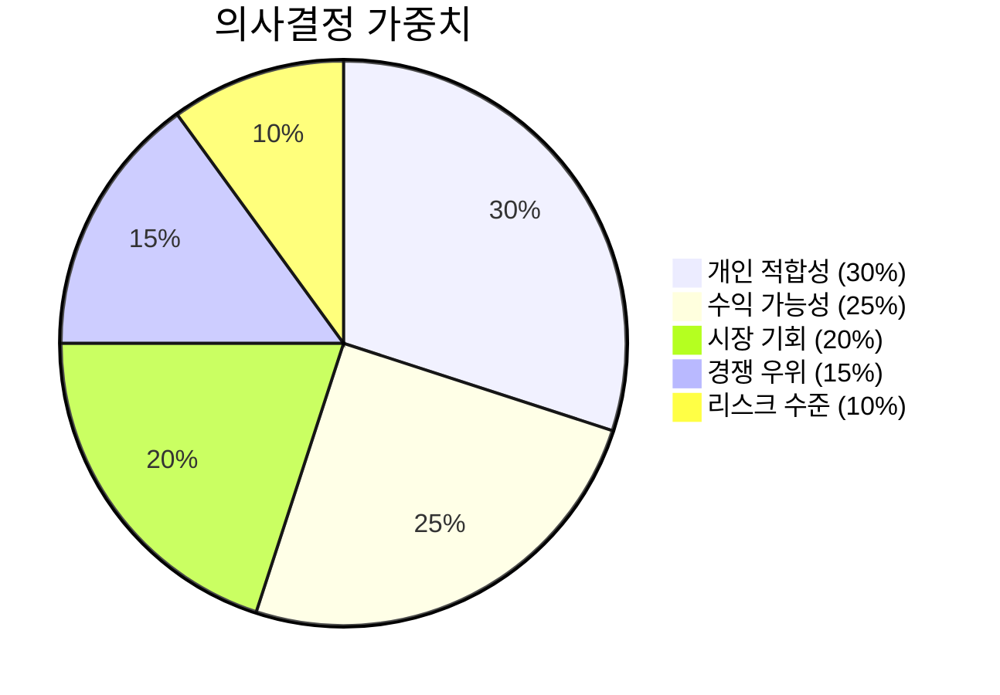

# YouTube 카테고리 분석 프로세스 및 시각화

Created: December 2024
Tags: YouTube Analysis, Category Selection, Data Visualization, Decision Framework

---

## 📊 **전체 분석 프로세스 개요**



---

## 🎯 **1단계: 유튜브 카테고리 전체 분류**

### **주요 31개 카테고리 매핑**



---

## 📈 **2단계: 카테고리별 수익성 매트릭스**

### **수익성 히트맵 분석**



### **카테고리별 상세 분석표**

| **카테고리** | **시장크기** | **경쟁강도** | **수익단가** | **성장가능성** | **진입장벽** | **총점** | **추천도** |
|-------------|-------------|-------------|-------------|-------------|-------------|----------|----------|
| **IT/기술** | 20/25 | 18/20 | 20/20 | 15/15 | 7/10 | **85/100** | ⭐⭐⭐⭐⭐ |
| **투자/재테크** | 22/25 | 15/20 | 19/20 | 15/15 | 8/10 | **83/100** | ⭐⭐⭐⭐⭐ |
| **비즈니스/창업** | 18/25 | 17/20 | 18/20 | 15/15 | 9/10 | **82/100** | ⭐⭐⭐⭐⭐ |
| **요리** | 25/25 | 10/20 | 15/20 | 12/15 | 8/10 | **78/100** | ⭐⭐⭐⭐ |
| **게임** | 25/25 | 8/20 | 18/20 | 10/15 | 6/10 | **75/100** | ⭐⭐⭐ |
| **뷰티** | 23/25 | 12/20 | 16/20 | 11/15 | 8/10 | **74/100** | ⭐⭐⭐ |
| **여행** | 20/25 | 14/20 | 14/20 | 12/15 | 7/10 | **72/100** | ⭐⭐⭐ |

---

## 🎯 **3단계: 의사결정 프로세스 플로우차트**



---

## 📊 **4단계: 상세 분석 대시보드**

### **A. 시장 기회 분석 차트**



### **B. 성장 잠재력 vs 진입 용이성**



---

## 🎲 **5단계: 카테고리 선택 룰렛 & 우선순위**

### **TOP 10 추천 카테고리 (점수순)**



### **개인별 맞춤 선택 가이드**



---

## 🔍 **6단계: 실행 가능한 분석 프로세스**

### **주간 분석 스케줄**



### **체크리스트 기반 평가 시트**

#### **카테고리: ________________**

**📊 시장 데이터 (25점)**
- [ ] 월 검색량 확인 (__만 회)
- [ ] 연관 키워드 수 (__개)
- [ ] 성장 트렌드 (__% 증가/감소)
- [ ] 계절성 여부 (있음/없음)
- [ ] **점수: __/25점**

**🏆 경쟁 환경 (20점)**
- [ ] 상위 10개 채널 분석 완료
- [ ] 평균 구독자 수 (__만명)
- [ ] 신규 채널 성공 사례 (__개)
- [ ] 차별화 가능 영역 발견 (있음/없음)
- [ ] **점수: __/20점**

**💰 수익 가능성 (20점)**
- [ ] 예상 CPM ($___)
- [ ] 광고주 수 (__개 업종)
- [ ] 브랜드 협업 사례 (__건/월)
- [ ] 다각화 수익원 (__개)
- [ ] **점수: __/20점**

**📈 성장 잠재력 (15점)**
- [ ] 연간 성장률 (__%/년)
- [ ] 신기술 연관성 (높음/중간/낮음)
- [ ] 글로벌 확장 가능성 (있음/없음)
- [ ] 롱테일 지속성 (높음/중간/낮음)
- [ ] **점수: __/15점**

**🚪 진입 장벽 (10점)**
- [ ] 초기 투자 비용 (__만원)
- [ ] 필요 장비/소프트웨어 (__개)
- [ ] 요구 전문성 수준 (상/중/하)
- [ ] 제작 시간 (__시간/편)
- [ ] **점수: __/10점**

**🔄 지속 가능성 (10점)**
- [ ] 트렌드 안정성 (안정/보통/불안정)
- [ ] 알고리즘 친화도 (높음/중간/낮음)
- [ ] 콘텐츠 소재 풍부도 (풍부/보통/부족)
- [ ] 번아웃 위험도 (낮음/중간/높음)
- [ ] **점수: __/10점**

#### **종합 평가**
- **총점: ___/100점**
- **등급: S(90+) / A(80-89) / B(70-79) / C(60-69) / D(60 미만)**
- **추천도: ⭐⭐⭐⭐⭐ / ⭐⭐⭐⭐ / ⭐⭐⭐ / ⭐⭐ / ⭐**

---

## 🎯 **최종 의사결정 매트릭스**

### **선택 기준별 가중치**



### **최종 선택 알고리즘**

1. **1차 필터링**: 70점 이상 카테고리만 선별
2. **2차 개인 매칭**: 관심도 + 전문성 + 가용 시간
3. **3차 리스크 평가**: 투자 대비 수익률
4. **최종 선택**: 상위 3개 중 직관적 선택

---

## 📋 **즉시 실행 가능한 액션 플랜**

### **오늘 당장 시작하기**

```mermaid
flowchart LR
    START[🚀 지금 시작] --> STEP1[관심 카테고리<br/>5개 선정<br/>(10분)]
    STEP1 --> STEP2[Social Blade<br/>상위 채널 확인<br/>(30분)]
    STEP2 --> STEP3[Google Trends<br/>검색량 확인<br/>(20분)]
    STEP3 --> STEP4[평가 시트<br/>기본 점수<br/>(30분)]
    STEP4 --> DECISION{70점 이상<br/>카테고리 있음?}
    DECISION -->|YES| SUCCESS[🎉 1차 후보 확정]
    DECISION -->|NO| RETRY[🔄 카테고리 추가 탐색]
```

### **성공 확률 높이는 꿀팁**

💡 **데이터 > 감정**: 좋아하는 것보다 잘될 것 선택
💡 **작은 시장 > 큰 바다**: 틈새시장에서 1등이 되기
💡 **꾸준함 > 완벽함**: 완벽한 카테고리는 없다, 선택 후 실행이 중요
💡 **실험 > 확신**: 3개월 테스트 후 최종 결정

---

*이 프로세스를 따라하면 데이터 기반의 합리적인 카테고리 선택이 가능합니다. 선택이 어려우시면 상위 3개를 모두 테스트해보는 것도 좋은 전략입니다!*
```

<function_calls>
<invoke name="todo_write">
<parameter name="merge">true
