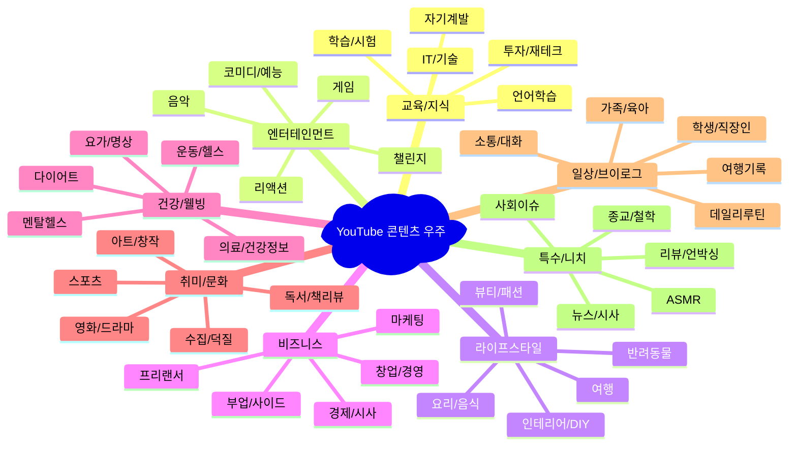

# YouTube 키워드별 카테고리 완전 분류 가이드

Created: 2024년 12월
Tags: YouTube Categories, Keyword Classification, Content Strategy, Market Analysis

---

## 📊 **1. 대분류 카테고리 체계 (8개 주요 영역)**



---

## 🎯 **2. 키워드별 세부 분류 체계**

### **A. 교육/지식 카테고리 (Education & Knowledge)**

#### **A1. 언어학습 (Language Learning)**
```
핵심 키워드:
- 기본: 영어, 중국어, 일본어, 독일어, 프랑스어, 스페인어
- 학습법: 회화, 문법, 발음, 토익, 토플, HSK, JLPT
- 스타일: 네이티브, 원어민, 쉬운영어, 생활영어, 비즈니스영어

연관 검색어:
영어공부, 영어듣기, 영어회화, 토익공부, 토플준비, 중국어배우기, 
일본어기초, 언어교환, 영어발음, 영문법, 영어단어, 어학연수
```

#### **A2. IT/기술 (Technology & Programming)**
```
핵심 키워드:
- 프로그래밍: Python, JavaScript, Java, React, Node.js, 웹개발
- AI/데이터: 머신러닝, 딥러닝, ChatGPT, 데이터분석, 빅데이터
- 인프라: AWS, 클라우드, 서버, 네트워크, 보안, DevOps
- 도구: Git, Docker, 리눅스, VS Code

연관 검색어:
코딩, 프로그래밍 배우기, 개발자, 웹개발 강의, 파이썬 튜토리얼,
자바스크립트 기초, 리액트 강의, 앱개발, 게임개발, 인공지능
```

#### **A3. 학습/시험 (Academic & Test Prep)**
```
핵심 키워드:
- 시험: 수능, 공무원, 자격증, SAT, GRE, 교원임용
- 과목: 수학, 과학, 국어, 영어, 사회, 물리, 화학, 생물
- 도구: 인강, 강의, 문제풀이, 공부법, 노트필기

연관 검색어:
공부방법, 암기법, 집중력, 플래너, 시험준비, 대학입시, 
취업준비, 면접준비, 자소서, 스터디, 독서실
```

#### **A4. 투자/재테크 (Investment & Finance)**
```
핵심 키워드:
- 투자상품: 주식, 부동산, 펀드, ETF, 채권, 금, 암호화폐
- 전략: 가치투자, 기술분석, 분산투자, 달러코스트, 배당투자
- 도구: 차트분석, HTS, MTS, 투자앱, 재무제표

연관 검색어:
재테크, 투자 초보, 주식 배우기, 부동산 투자, 펀드 추천,
용돈벌이, 부업, 경제공부, 금융상품, 세금절약, 연금저축
```

#### **A5. 자기계발 (Personal Development)**
```
핵심 키워드:
- 스킬: 리더십, 커뮤니케이션, 프레젠테이션, 협상, 네트워킹
- 라이프: 시간관리, 목표설정, 습관형성, 독서, 멘탈관리
- 커리어: 이직, 승진, 창업, 부업, 네트워킹

연관 검색어:
자기계발서, 성공법칙, 동기부여, 자신감, 인간관계, 소통법,
업무효율, 생산성, 마인드셋, 성격분석, MBTI, 심리학
```

---

### **B. 엔터테인먼트 카테고리 (Entertainment)**

#### **B1. 게임 (Gaming)**
```
핵심 키워드:
- 장르: RPG, FPS, MOBA, 전략, 시뮬레이션, 퍼즐, 아케이드
- 플랫폼: PC게임, 모바일게임, 콘솔게임, 스팀, 니닌텐도
- 인기게임: 리그오브레전드, 배그, 로스트아크, 메이플스토리

연관 검색어:
게임리뷰, 게임공략, 게임추천, 겜스트리밍, e스포츠, 
게임방송, 게임뉴스, 인디게임, 레트로게임, 게임음악
```

#### **B2. 음악 (Music)**
```
핵심 키워드:
- 장르: K-POP, 힙합, 발라드, 록, 재즈, 클래식, 인디음악
- 활동: 커버곡, 리믹스, 작곡, 보컬, 악기연주, 댄스
- 아티스트: BTS, 블랙핑크, IU, 아이브, 뉴진스

연관 검색어:
음악추천, 플레이리스트, 노래방, 기타레슨, 피아노레슨,
작곡법, 음악이론, 음원차트, 콘서트, 뮤직비디오, 가사해석
```

#### **B3. 코미디/예능 (Comedy & Variety)**
```
핵심 키워드:
- 포맷: 개그, 스탠드업, 몰래카메라, 토크쇼, 리얼버라이어티
- 스타일: 상황극, 패러디, 모창, 즉흥연기, 웃긴영상
- 소재: 일상개그, 관찰예능, 먹방예능, 여행예능

연관 검색어:
웃긴동영상, 개그맨, 코미디언, 예능프로그램, 웃음, 유머,
개그콘서트, 코미디빅리그, 웃긴모음, 레전드영상
```

---

### **C. 라이프스타일 카테고리 (Lifestyle)**

#### **C1. 요리/음식 (Food & Cooking)**
```
핵심 키워드:
- 요리법: 한식, 양식, 중식, 일식, 베이킹, 디저트, 간단요리
- 식재료: 고기요리, 해산물, 채소요리, 밥요리, 면요리, 국물요리
- 스타일: 홈쿡, 자취요리, 다이어트식단, 건강식, 비건요리

연관 검색어:
레시피, 요리초보, 자취생요리, 간단한요리, 맛집추천,
요리팁, 식당운영, 요리학원, 쿠킹클래스, 푸드스타그램
```

#### **C2. 여행 (Travel)**
```
핵심 키워드:
- 지역: 국내여행, 해외여행, 유럽여행, 일본여행, 동남아여행
- 스타일: 배낭여행, 패키지여행, 자유여행, 가족여행, 혼자여행
- 활동: 맛집투어, 관광지, 액티비티, 쇼핑, 사진촬영

연관 검색어:
여행지추천, 여행코스, 여행준비, 항공권, 숙박, 환율,
여행필수템, 캐리어, 여행영어, 현지문화, 여행보험
```

#### **C3. 뷰티/패션 (Beauty & Fashion)**
```
핵심 키워드:
- 뷰티: 메이크업, 스킨케어, 헤어스타일, 네일아트, 향수
- 패션: 데일리룩, 오피스룩, 데이트룩, 트렌드, 명품, 프렌드샵
- 도구: 화장품리뷰, 브랜드추천, 쇼핑몰, 세일정보

연관 검색어:
코스메틱, 화장법, 피부관리, 다이어트, 패션하울, 쇼핑,
패션위크, 스타일링, 옷장정리, 패션블로거, 인플루언서
```

---

### **D. 비즈니스 카테고리 (Business)**

#### **D1. 창업/경영 (Entrepreneurship & Management)**
```
핵심 키워드:
- 창업: 스타트업, 프랜차이즈, 온라인쇼핑몰, 카페창업, 소자본창업
- 경영: 마케팅, 브랜딩, 세일즈, 고객관리, 재무관리, 인사관리
- 도구: 사업계획서, 투자유치, 크라우드펀딩, 정부지원금

연관 검색어:
창업아이템, 사업아이디어, 부업추천, 1인기업, CEO인터뷰,
성공사례, 실패사례, 창업자금, 사업자등록, 온라인마케팅
```

#### **D2. 마케팅 (Marketing & Advertising)**
```
핵심 키워드:
- 디지털: SNS마케팅, 콘텐츠마케팅, 검색엔진최적화, 광고운영
- 전략: 브랜드전략, 타겟팅, 퍼널마케팅, 이메일마케팅
- 도구: 구글애드워즈, 페이스북광고, 유튜브광고, 분석툴

연관 검색어:
마케팅전략, 광고제작, 브랜딩, 고객분석, 시장조사,
판매전략, 프로모션, 인플루언서마케팅, 바이럴마케팅
```

---

### **E. 건강/웰빙 카테고리 (Health & Wellness)**

#### **E1. 운동/헬스 (Fitness & Exercise)**
```
핵심 키워드:
- 운동종류: 헬스, 요가, 필라테스, 크로스핏, 런닝, 자전거, 수영
- 목표: 다이어트, 근육증가, 체력증진, 재활운동, 체형교정
- 부위: 복근운동, 하체운동, 상체운동, 코어운동, 유산소운동

연관 검색어:
홈트레이닝, 운동법, 운동기구, 헬스장, PT, 운동영상,
체중감량, 식단관리, 프로틴, 보충제, 운동복, 러닝화
```

#### **E2. 요가/명상 (Yoga & Meditation)**
```
핵심 키워드:
- 요가: 하타요가, 빈야사요가, 아슈탕가요가, 핫요가, 임산부요가
- 명상: 마음챙김, 호흡법, 이완법, 스트레스해소, 수면명상
- 도구: 요가매트, 요가복, 명상앱, 힐링음악

연관 검색어:
요가초보, 요가동작, 스트레칭, 마인드풀니스, 휴식, 힐링,
정신건강, 심리치료, 감정관리, 자기치유, 영성, 내면성장
```

---

## 🎯 **3. 검색량 기준 카테고리 순위**

### **월 검색량 1,000만+ (메가 카테고리)**
1. **게임** - 2,500만 검색
2. **요리/음식** - 2,000만 검색  
3. **음악** - 1,800만 검색
4. **뷰티/패션** - 1,500만 검색
5. **운동/헬스** - 1,200만 검색

### **월 검색량 500만-1,000만 (대형 카테고리)**
6. **여행** - 800만 검색
7. **영어학습** - 700만 검색
8. **IT/기술** - 650만 검색
9. **투자/재테크** - 600만 검색
10. **일상브이로그** - 550만 검색

### **월 검색량 100만-500만 (중형 카테고리)**
11. **반려동물** - 450만 검색
12. **자기계발** - 400만 검색
13. **코미디/예능** - 350만 검색
14. **창업/비즈니스** - 300만 검색
15. **DIY/인테리어** - 250만 검색

---

## 🏆 **4. 수익성 기준 카테고리 랭킹**

### **S급 (수익성 85점+)**
```
1. IT/기술 (87점)
   - 높은 CPM ($5-8)
   - B2B 광고주 다수
   - 고학력 시청자층

2. 투자/재테크 (85점)
   - 금융상품 광고 높은 단가
   - 구매력 있는 시청자
   - 교육상품 판매 용이
```

### **A급 (수익성 75-84점)**
```
3. 비즈니스/창업 (82점)
4. 영어교육 (81점)
5. 뷰티/패션 (78점)
6. 요리/음식 (76점)
```

### **B급 (수익성 65-74점)**
```
7. 게임 (74점) - 높은 조회수, 낮은 CPM
8. 여행 (72점) - 계절성, 광고주 제한
9. 운동/헬스 (70점) - 틈새 광고주
10. 자기계발 (68점) - 교육상품 연계
```

---

## 📈 **5. 트렌드 기반 신흥 카테고리**

### **급성장 카테고리 (연 50%+ 성장)**
- **AI/인공지능** - ChatGPT 열풍으로 폭발적 성장
- **NFT/메타버스** - 디지털 자산 관심 증가  
- **비건/친환경** - 환경의식 확산
- **재택근무/원격업무** - 워라밸 트렌드
- **멘탈헬스** - 정신건강 인식 확산

### **주목할 니치 카테고리**
- **ASMR** - 특정층 강한 몰입도
- **언박싱/리뷰** - 상품 연계 수익 높음
- **스터디 with me** - 학습 동기부여 콘텐츠
- **플랜터리/문구** - 학생층 관심 급증
- **반려식물** - 도시형 힐링 트렌드

---

## 🎯 **6. 키워드 매칭 전략 가이드**

### **검색 최적화 키워드 조합법**

#### **기본 공식: [주제] + [형태] + [타겟]**
```
예시:
- "영어회화 + 강의 + 초보자"
- "다이어트 + 운동 + 홈트"  
- "파이썬 + 튜토리얼 + 입문"
- "재테크 + 방법 + 20대"
```

#### **롱테일 키워드 전략**
```
Short-tail (경쟁 높음):
- "요리", "운동", "영어"

Long-tail (경쟁 낮음):  
- "자취생을 위한 간단한 한끼 요리"
- "직장인 아침 10분 홈트레이닝"  
- "왕초보를 위한 기초 영어회화"
```

---

## 💡 **7. 카테고리별 콘텐츠 전략**

### **교육 카테고리 성공 공식**
- **구조**: 문제제기 → 해결방법 → 실습 → 결과확인
- **키워드**: "초보", "기초", "쉬운", "단계별", "무료"
- **포맷**: 시리즈 강의, 플레이리스트 활용 필수

### **엔터테인먼트 카테고리 성공 공식**  
- **구조**: 훅 → 빌드업 → 클라이맥스 → 마무리
- **키워드**: "레전드", "역대급", "웃긴", "소름", "대박"
- **포맷**: 짧고 임팩트 있는 편집, 썸네일 중요

### **라이프스타일 카테고리 성공 공식**
- **구조**: 일상소개 → 과정공유 → 팁전달 → 후기
- **키워드**: "루틴", "추천", "리뷰", "꿀팁", "브이로그"  
- **포맷**: 자연스러운 톤, 친근한 어투

---

## 📋 **8. 카테고리 선택 체크리스트**

### **1단계: 기본 적합성 검토**
- [ ] 개인 관심도 7점 이상 (10점 만점)
- [ ] 월 검색량 100만+ 확인
- [ ] 상위 채널 50개 미만 (진입 가능성)
- [ ] 기본 장비/소프트웨어 보유

### **2단계: 수익성 검토**  
- [ ] 예상 CPM $2 이상
- [ ] 광고주 업종 3개 이상
- [ ] 브랜드 협업 가능성 확인
- [ ] 다각화 수익원 2개 이상

### **3단계: 지속가능성 검토**
- [ ] 트렌드 안정성 (계절성 낮음)
- [ ] 콘텐츠 소재 풍부함
- [ ] 알고리즘 친화도 확인  
- [ ] 경쟁 차별화 포인트 확보

### **최종 선택 기준**
- **총점 70점 이상**: 즉시 시작 추천
- **총점 60-69점**: 전략 수정 후 시작
- **총점 60점 미만**: 다른 카테고리 검토

---

## 🚀 **즉시 실행 가능한 액션 플랜**

### **오늘 할 일 (30분)**
1. 관심 카테고리 3개 선정
2. 각 카테고리별 상위 10개 채널 확인
3. 키워드 검색량 Google Trends에서 확인

### **이번 주 할 일 (5시간)**
1. 선정 카테고리별 경쟁 분석
2. 수익성 매트릭스 적용
3. 콘텐츠 아이디어 10개씩 도출

### **다음 주 목표**
1. 최종 카테고리 1개 확정
2. 첫 번째 영상 기획안 완성
3. 제작 스케줄 수립

---

*이 분류 가이드를 활용하여 데이터 기반의 합리적인 유튜브 카테고리 선택을 하시기 바랍니다. 추가적인 세부 분석이나 특정 카테고리에 대한 심화 정보가 필요하시면 언제든 말씀해 주세요!*

