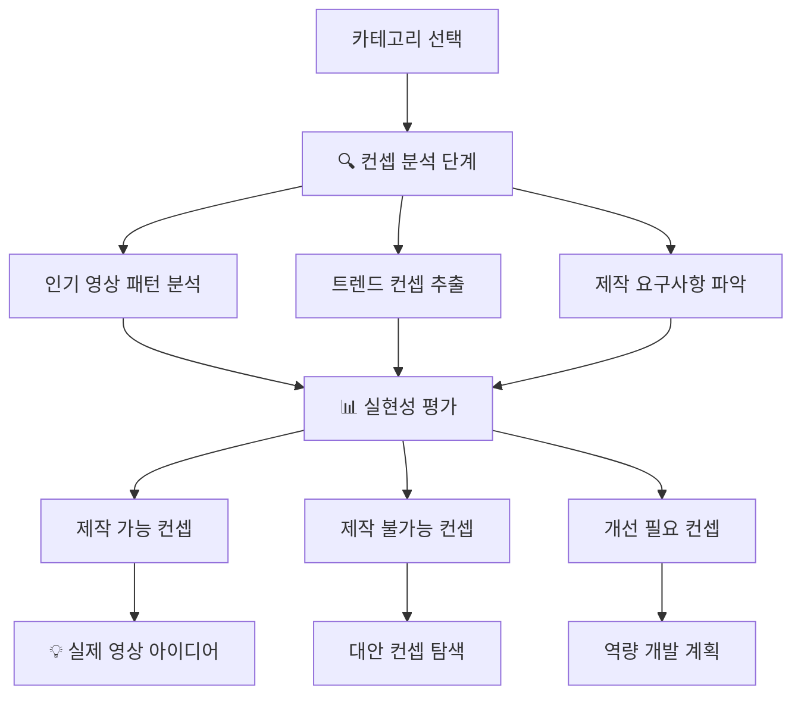
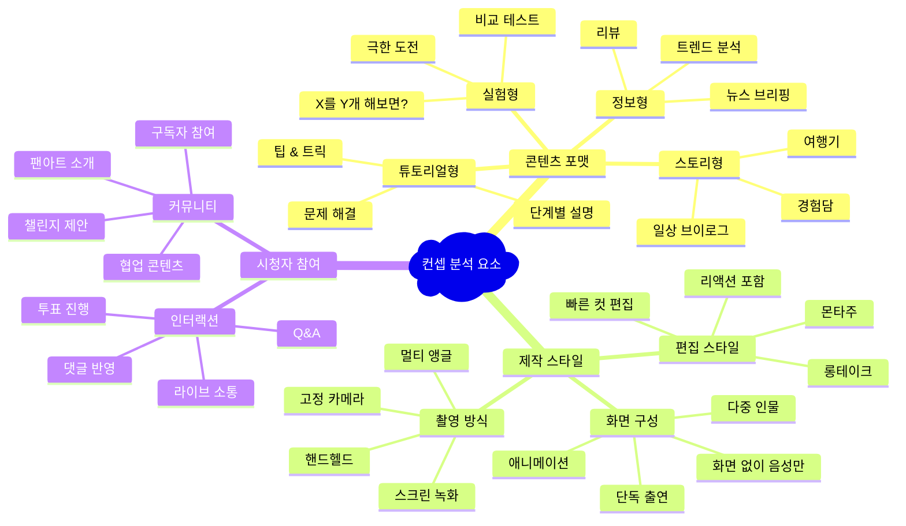
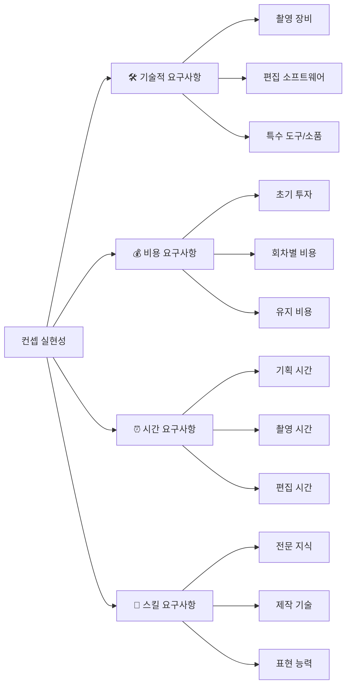
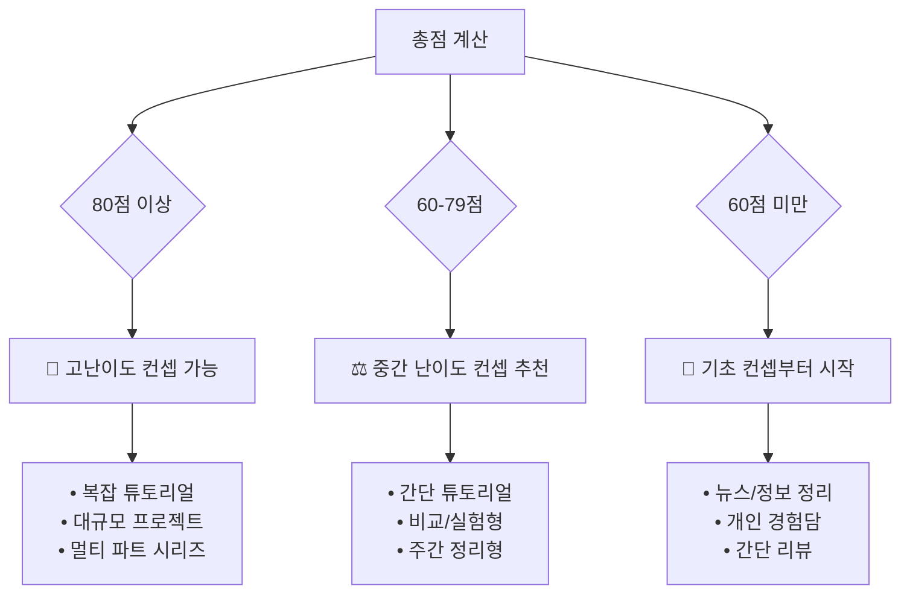
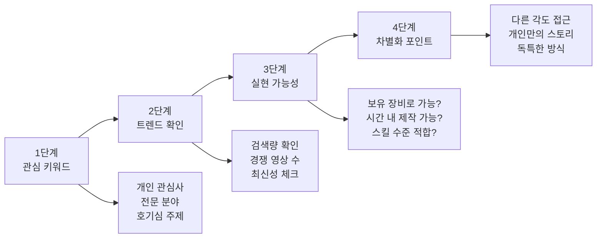
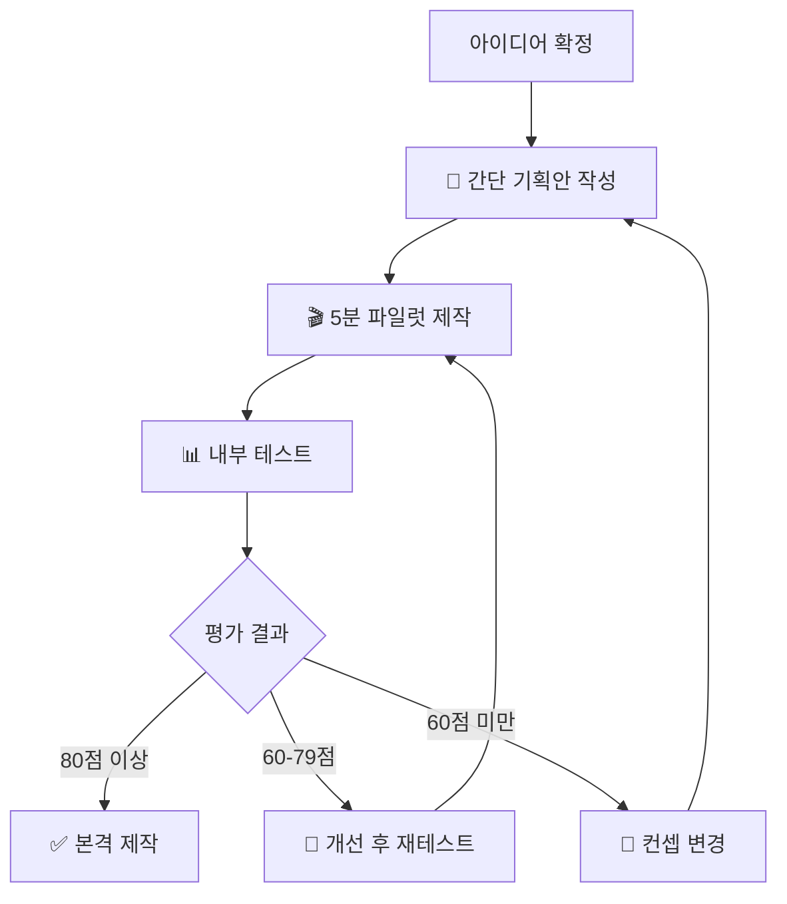
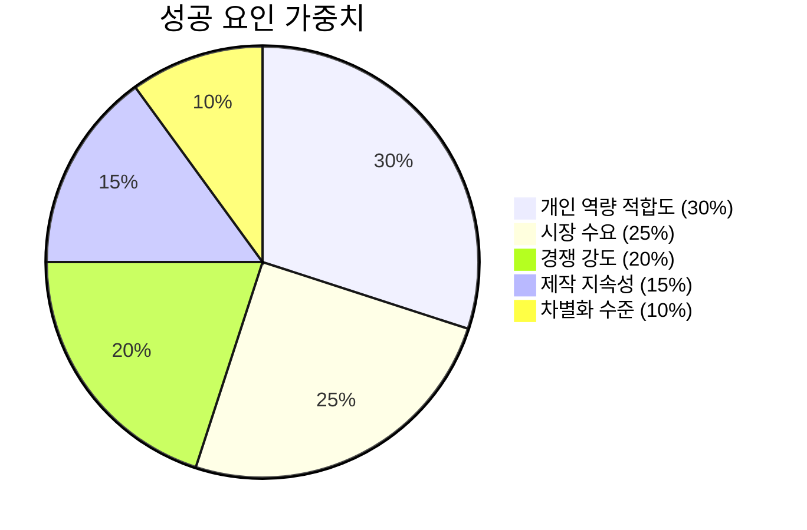

# YouTube 컨셉 분석 및 제작 실현성 평가

Created: December 2024
Tags: Concept Analysis, Content Planning, Production Feasibility, Trend Analysis

---

## 🎯 **개요: 카테고리에서 실제 제작까지**

기존의 카테고리 선택은 시작점일 뿐입니다. **실제로 어떤 영상을 만들 수 있는지**, **나의 역량으로 구현 가능한지**를 판단하는 것이 핵심입니다.



---

## 🔍 **1단계: 카테고리별 인기 컨셉 패턴 분석**

### **컨셉 분석 프레임워크**



### **카테고리별 주요 컨셉 매핑**

#### **IT/기술 카테고리 - 주요 컨셉 분석**

**🔥 인기 컨셉 TOP 5**
1. **"X 언어로 Y 만들기" (튜토리얼형)**
   - 조회수 범위: 50만 - 500만
   - 제작 난이도: ⭐⭐⭐⭐ (높음)
   - 필요 스킬: 실제 코딩 능력, 설명력
   - 예시: "파이썬으로 10분만에 웹사이트 만들기"

2. **"개발자가 X를 써보면?" (리뷰/실험형)**
   - 조회수 범위: 20만 - 200만
   - 제작 난이도: ⭐⭐⭐ (중상)
   - 필요 스킬: 툴 활용 능력, 비교 분석력
   - 예시: "개발자가 ChatGPT로 코딩해보면?"

3. **"X vs Y 개발 도구 비교" (비교형)**
   - 조회수 범위: 30만 - 300만
   - 제작 난이도: ⭐⭐⭐ (중상)
   - 필요 스킬: 다양한 툴 경험, 객관적 평가
   - 예시: "React vs Vue 솔직 비교"

4. **"주니어 개발자가 알아야 할 X" (정보형)**
   - 조회수 범위: 15만 - 150만
   - 제작 난이도: ⭐⭐ (중하)
   - 필요 스킬: 경험 정리, 스토리텔링
   - 예시: "신입 개발자가 절대 하면 안 되는 실수 10가지"

5. **"X 트렌드/뉴스 정리" (뉴스형)**
   - 조회수 범위: 10만 - 100만
   - 제작 난이도: ⭐⭐ (중하)
   - 필요 스킬: 정보 수집, 간결한 정리
   - 예시: "이번 주 개발자가 알아야 할 뉴스 TOP 5"

#### **요리 카테고리 - 주요 컨셉 분석**

**🔥 인기 컨셉 TOP 5**
1. **"X 재료로 Y 만들기" (레시피형)**
   - 조회수 범위: 100만 - 1000만
   - 제작 난이도: ⭐⭐ (중하)
   - 필요 스킬: 요리 실력, 영상 구성력
   - 예시: "계란 하나로 만드는 15가지 요리"

2. **"X 음식 먹방/리뷰" (먹방형)**
   - 조회수 범위: 50만 - 500만
   - 제작 난이도: ⭐ (낮음)
   - 필요 스킬: 표현력, 맛 묘사력
   - 예시: "편의점 신제품 전부 먹어보기"

3. **"X 나라 음식 따라하기" (챌린지형)**
   - 조회수 범위: 80만 - 800만
   - 제작 난이도: ⭐⭐⭐ (중상)
   - 필요 스킬: 다양한 요리 도전 정신
   - 예시: "태국 길거리 음식 집에서 만들어보기"

4. **"X분 안에 만드는 간단 요리" (시간 제약형)**
   - 조회수 범위: 30만 - 300만
   - 제작 난이도: ⭐⭐ (중하)
   - 필요 스킬: 빠른 요리, 편집 실력
   - 예시: "5분 안에 만드는 아침 도시락"

5. **"X 다이어트 요리" (건강형)**
   - 조회수 범위: 40만 - 400만
   - 제작 난이도: ⭐⭐⭐ (중상)
   - 필요 스킬: 영양 지식, 헬시 레시피
   - 예시: "살 안 찌는 야식 만들기"

---

## 📊 **2단계: 컨셉별 제작 실현성 평가 매트릭스**

### **실현성 평가 4대 영역**



### **컨셉별 상세 실현성 분석표**

| **컨셉 유형** | **장비 요구도** | **비용** | **시간** | **스킬** | **총 난이도** | **추천 순위** |
|--------------|---------------|----------|----------|----------|-------------|-------------|
| **뉴스/정보 정리형** | ⭐ (기본) | ⭐ (낮음) | ⭐⭐ (중하) | ⭐⭐ (중하) | **⭐⭐ (쉬움)** | 🥇 1순위 |
| **리뷰/체험형** | ⭐⭐ (중하) | ⭐⭐ (중하) | ⭐⭐ (중하) | ⭐⭐ (중하) | **⭐⭐ (쉬움)** | 🥇 1순위 |
| **간단 튜토리얼** | ⭐⭐ (중하) | ⭐ (낮음) | ⭐⭐⭐ (중상) | ⭐⭐⭐ (중상) | **⭐⭐⭐ (보통)** | 🥈 2순위 |
| **비교/실험형** | ⭐⭐⭐ (중상) | ⭐⭐⭐ (중상) | ⭐⭐⭐ (중상) | ⭐⭐⭐ (중상) | **⭐⭐⭐ (보통)** | 🥈 2순위 |
| **복잡 튜토리얼** | ⭐⭐⭐ (중상) | ⭐⭐ (중하) | ⭐⭐⭐⭐ (높음) | ⭐⭐⭐⭐ (높음) | **⭐⭐⭐⭐ (어려움)** | 🥉 3순위 |
| **대규모 프로젝트** | ⭐⭐⭐⭐ (높음) | ⭐⭐⭐⭐ (높음) | ⭐⭐⭐⭐⭐ (매우높음) | ⭐⭐⭐⭐⭐ (매우높음) | **⭐⭐⭐⭐⭐ (매우어려움)** | ❌ 비추천 |

---

## 🎯 **3단계: 개인 역량 vs 컨셉 매칭 분석**

### **개인 역량 자가 진단 체크리스트**

#### **A. 기술적 역량 (40점)**

**🛠️ 장비 보유 현황 (15점)**
- [ ] 기본 카메라 (스마트폰 포함) - 3점
- [ ] 조명 장비 (링라이트 등) - 3점  
- [ ] 마이크 (핀마이크, USB마이크) - 3점
- [ ] 편집용 컴퓨터 - 3점
- [ ] 특수 장비 (삼각대, 슬라이더 등) - 3점

**💻 소프트웨어 활용 능력 (15점)**
- [ ] 기본 편집 (컷, 자막) - 5점
- [ ] 중급 편집 (색보정, 음향 조정) - 5점
- [ ] 고급 편집 (모션그래픽, 합성) - 5점

**🎨 디자인 역량 (10점)**
- [ ] 썸네일 제작 능력 - 5점
- [ ] 그래픽 디자인 기초 - 5점

#### **B. 콘텐츠 역량 (30점)**

**📚 전문 지식 (15점)**
- [ ] 해당 분야 기초 지식 - 5점
- [ ] 실무/실전 경험 - 5점
- [ ] 최신 트렌드 파악 - 5점

**🎭 표현 역량 (15점)**
- [ ] 카메라 앞 자연스러움 - 5점
- [ ] 설명/스토리텔링 능력 - 5점
- [ ] 유머/재미 요소 - 5점

#### **C. 시간 및 지속성 (30점)**

**⏰ 가용 시간 (15점)**
- [ ] 주 10시간 이상 투자 가능 - 5점
- [ ] 일정한 스케줄 유지 가능 - 5점
- [ ] 촬영/편집 시간 확보 가능 - 5점

**🔄 지속 의지 (15점)**
- [ ] 6개월 이상 지속 의지 - 5점
- [ ] 초기 저조회수 견딜 수 있음 - 5점
- [ ] 개선/학습 의지 - 5점

### **역량별 추천 컨셉 매핑**



---

## 💡 **4단계: 실제 영상 아이디어 도출 프로세스**

### **아이디어 생성 4단계 필터**



### **구체적 아이디어 도출 워크시트**

#### **키워드: ________________**

**📊 트렌드 분석**
- Google Trends 점수: ___/100
- 관련 영상 수: ___개
- 평균 조회수: ___만 회
- 업로드 빈도: ___개/월

**🎯 타겟 영상 분석 (상위 5개)**

| **순위** | **제목** | **조회수** | **업로드일** | **특징/차별점** | **모방 가능성** |
|---------|----------|-----------|-------------|---------------|---------------|
| 1 | | | | | ⭐⭐⭐⭐⭐ |
| 2 | | | | | ⭐⭐⭐⭐ |
| 3 | | | | | ⭐⭐⭐ |
| 4 | | | | | ⭐⭐ |
| 5 | | | | | ⭐ |

**🛠️ 제작 요구사항 체크**
- [ ] 필요 장비: ________________
- [ ] 예상 제작 시간: ___시간
- [ ] 필요 스킬: ________________
- [ ] 예상 비용: ___만원

**💡 나만의 차별화 아이디어**
1. 기존과 다른 접근법: ________________
2. 개인 스토리 연결점: ________________
3. 독특한 포맷/스타일: ________________

---

## 🎬 **5단계: 제작 파일럿 테스트 프로세스**

### **미니 파일럿 제작 과정**



### **파일럿 평가 기준 (100점)**

**🎥 제작 품질 (40점)**
- 영상 화질 및 음질 (15점)
- 편집 퀄리티 (15점)  
- 전체적 완성도 (10점)

**📢 콘텐츠 품질 (40점)**
- 정보의 정확성 (15점)
- 재미/흥미 요소 (15점)
- 시청자 가치 제공 (10점)

**🎯 실현 가능성 (20점)**
- 제작 시간 적정성 (10점)
- 비용 효율성 (5점)
- 지속 가능성 (5점)

### **개선 포인트 체크리스트**

**🔧 기술적 개선**
- [ ] 화질 향상 방법: ________________
- [ ] 음질 개선 방안: ________________  
- [ ] 편집 스킬 보완: ________________

**📝 콘텐츠 개선**
- [ ] 구성 조정 필요: ________________
- [ ] 설명 방식 변경: ________________
- [ ] 재미 요소 추가: ________________

**⚡ 효율성 개선**
- [ ] 제작 시간 단축: ________________
- [ ] 비용 절감 방안: ________________
- [ ] 워크플로우 최적화: ________________

---

## 📈 **6단계: 성공 가능성 예측 모델**

### **컨셉별 성공 확률 계산기**



**성공 확률 = (개인 적합도 × 0.3) + (시장 수요 × 0.25) + (경쟁 우위 × 0.2) + (제작 지속성 × 0.15) + (차별화 × 0.1)**

### **예측 결과별 액션 플랜**

**🔥 높은 성공 확률 (80% 이상)**
→ 즉시 본격 제작 시작
→ 일주일에 2-3편 업로드 목표
→ 초기 3개월 집중 투자

**⚖️ 중간 성공 확률 (60-79%)**  
→ 소규모 테스트 후 판단
→ 주 1편 꾸준히 업로드
→ 3개월 후 성과 재평가

**⚠️ 낮은 성공 확률 (60% 미만)**
→ 컨셉 수정 또는 변경 필요
→ 역량 개발 후 재도전
→ 더 쉬운 컨셉부터 시작

---

## 🎯 **실전 활용 가이드**

### **오늘부터 시작하는 5단계**

```mermaid
flowchart LR
    DAY1[Day 1<br/>관심 카테고리<br/>컨셉 5개 수집<br/>(1시간)] --> DAY2[Day 2<br/>인기 영상<br/>30개 분석<br/>(2시간)]
    
    DAY2 --> DAY3[Day 3<br/>개인 역량<br/>진단 테스트<br/>(30분)]
    
    DAY3 --> DAY4[Day 4<br/>실현 가능한<br/>아이디어 3개 선정<br/>(1시간)]
    
    DAY4 --> DAY5[Day 5<br/>첫 파일럿<br/>영상 제작<br/>(3시간)]
```

### **성공 확률을 높이는 꿀팁**

💡 **작게 시작하기**: 완벽한 영상보다 완성 가능한 영상
💡 **패턴 학습**: 성공한 영상의 공통점 찾기
💡 **피드백 루프**: 매 영상마다 개선점 1개씩 적용
💡 **차별화 포인트**: 나만의 색깔 점진적으로 강화

---

이제 **단순한 카테고리 선택을 넘어서 실제 제작 가능한 구체적인 영상 아이디어**까지 도출할 수 있습니다! 

특정 카테고리나 컨셉에 대한 더 자세한 분석이 필요하시면 언제든 말씀해 주세요.


