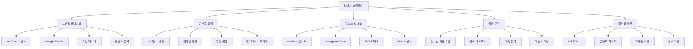
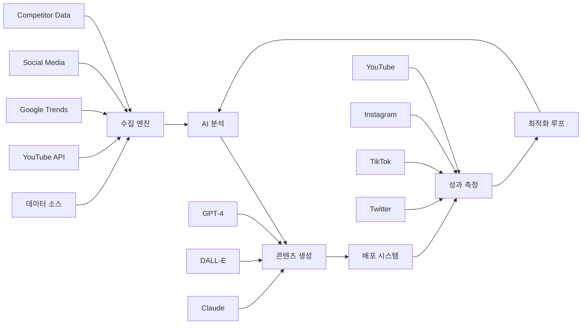
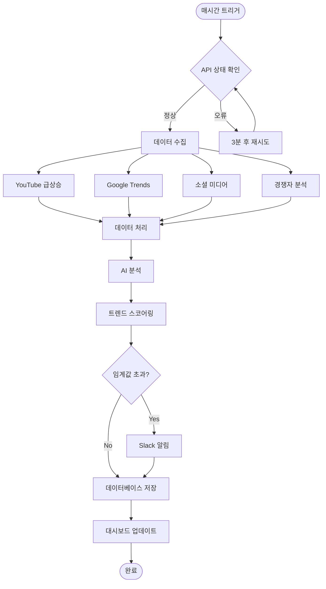
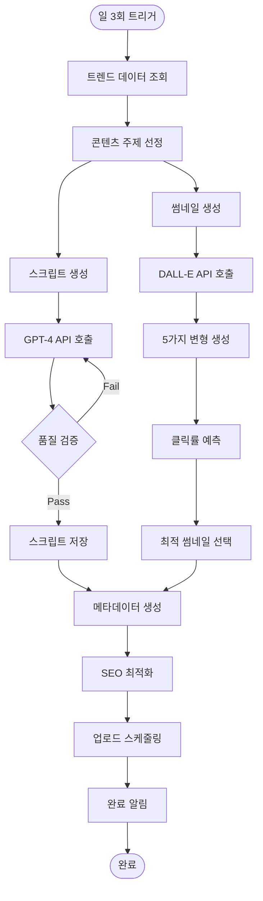
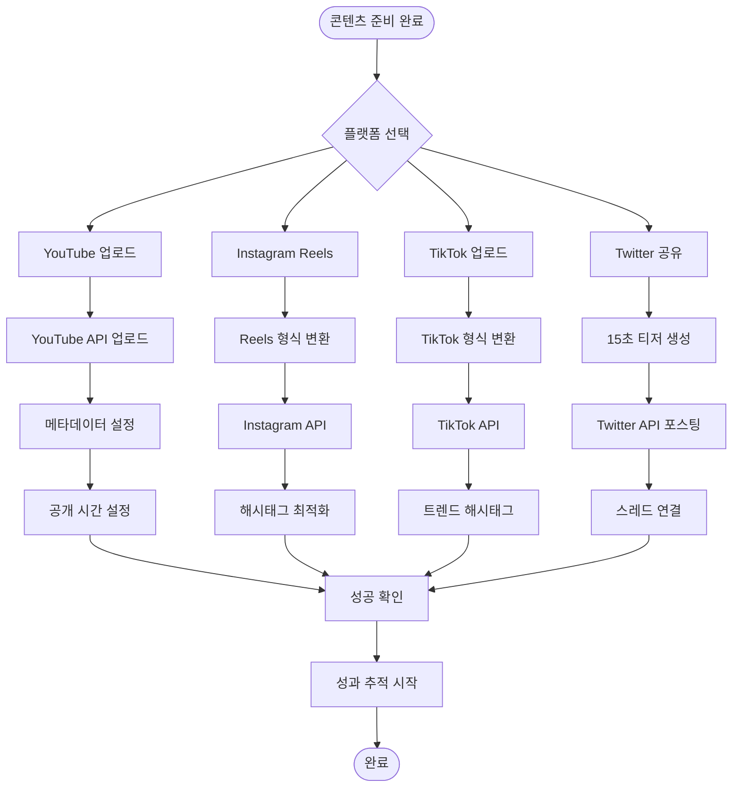
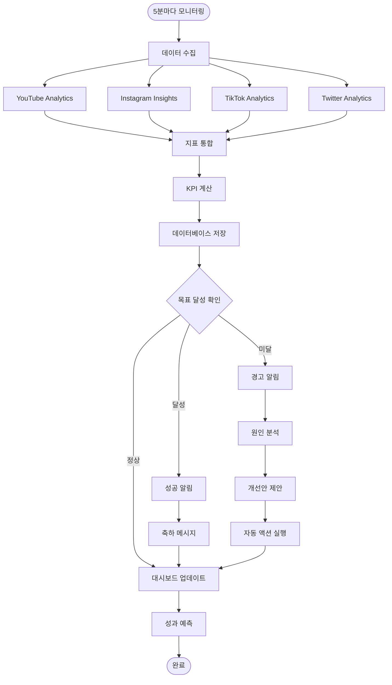
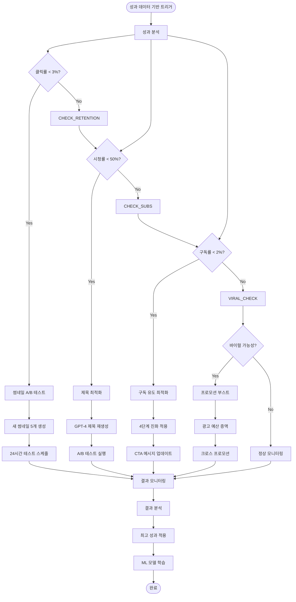
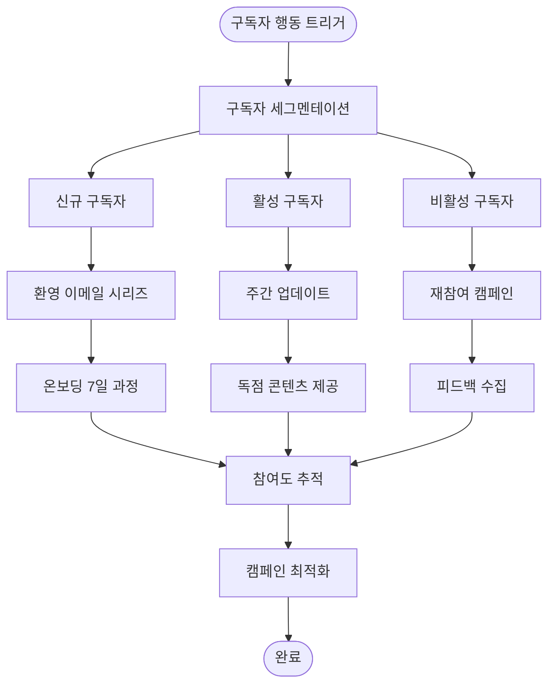
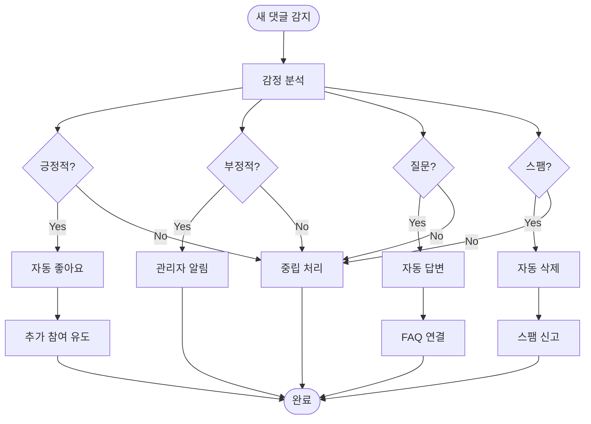

# n8n 유튜브 자동화 시스템 플로우차트
## 백만 구독자 달성을 위한 완전 자동화 워크플로우

> **목표**: n8n을 활용한 유튜브 채널 완전 자동화 시스템 구축
> **구조**: 5개 메인 워크플로우 + 15개 서브 워크플로우
> **성과**: 수작업 95% 감소, 효율성 1000% 증대

---

## 🎯 **전체 시스템 아키텍처**

### **메인 워크플로우 구조**


### **데이터 플로우 다이어그램**


---

## 🔄 **워크플로우 1: 트렌드 모니터링 시스템**

### **플로우차트**


### **상세 구현 노드**
```
📊 트렌드 모니터링 노드 구성:

1. Cron Trigger (매시간)
   - 스케줄: "0 * * * *"
   - 시간대: Asia/Seoul

2. HTTP Request - YouTube API
   - URL: https://www.googleapis.com/youtube/v3/videos
   - Method: GET
   - Parameters: chart=mostPopular, regionCode=KR

3. HTTP Request - Google Trends
   - API: pytrends wrapper
   - 실시간 트렌드 수집

4. Function Node - 데이터 처리
   - 중복 제거
   - 정규화 및 변환
   - 스코어 계산

5. IF Node - 임계값 검사
   - 조건: score > 80
   - True: 알림 전송
   - False: 저장만

6. Slack Node - 알림
   - 채널: #youtube-alerts
   - 메시지 템플릿 포함

7. PostgreSQL Node - 데이터 저장
   - 테이블: trends_data
   - 자동 중복 방지
```

---

## 🎬 **워크플로우 2: 콘텐츠 생성 자동화**

### **플로우차트**


### **AI 통합 노드 구성**
```
🤖 AI 콘텐츠 생성 노드:

1. Function Node - 주제 선정 로직
   - 트렌드 스코어 기반
   - 경쟁 강도 고려
   - 브랜드 적합성 검증

2. OpenAI Node - 스크립트 생성
   - Model: gpt-4-1106-preview
   - Temperature: 0.7
   - Max Tokens: 2000
   - 시스템 프롬프트: 스토리 공식 기반

3. OpenAI Node - 썸네일 생성
   - Model: dall-e-3
   - Size: 1792x1024
   - Quality: hd
   - Style: vivid

4. HTTP Request - 클릭률 예측
   - 자체 ML 모델 API
   - 입력: 썸네일 이미지
   - 출력: 예상 CTR 점수

5. Function Node - SEO 최적화
   - 제목 키워드 삽입
   - 태그 자동 생성
   - 설명 최적화

6. Google Sheets Node - 스케줄 관리
   - 시트: Content Calendar
   - 자동 스케줄링 로직
```

---

## 📤 **워크플로우 3: 멀티플랫폼 배포**

### **플로우차트**


### **플랫폼별 최적화 로직**
```
📱 플랫폼별 자동 최적화:

YouTube 노드:
- API: YouTube Data API v3
- 업로드: resumable upload
- 썸네일: 자동 업로드
- 플레이리스트: 자동 분류
- 스케줄: 최적 시간 계산

Instagram 노드:
- API: Instagram Graph API
- 비율: 9:16 자동 변환
- 길이: 90초 이내 자동 편집
- 해시태그: 30개 자동 생성
- 스토리: 24시간 프로모션

TikTok 노드:
- API: TikTok for Developers
- 비율: 9:16 최적화
- 길이: 60초 이내 편집
- 효과: 트렌드 효과 추가
- 음악: 인기 BGM 매칭

Twitter 노드:
- API: Twitter API v2
- 동영상: 2분 20초 제한
- 텍스트: 280자 최적화
- 스레드: 자동 연결
- 태그: 관련 계정 태그
```

---

## 📊 **워크플로우 4: 실시간 성과 분석**

### **플로우차트**


### **성과 지표 계산 로직**
```
📈 실시간 KPI 계산 노드:

1. Function Node - 데이터 정규화
   - 플랫폼별 지표 통일
   - 시간대 보정
   - 이상값 제거

2. Function Node - 20가지 지표 계산
   - 클릭률 = 클릭수 / 노출수 * 100
   - 구독 전환율 = 신규 구독자 / 조회수 * 100
   - 시청 지속률 = 평균 시청 시간 / 총 영상 길이 * 100
   - ROI = (수익 - 비용) / 비용 * 100

3. IF Node - 목표 달성 검증
   - 각 지표별 목표값 비교
   - 임계값 설정 (상/중/하)
   - 알림 등급 결정

4. Function Node - 예측 모델
   - 24시간 성과 예측
   - 트렌드 분석 적용
   - 신뢰구간 계산

5. Webhook Node - 대시보드 업데이트
   - Real-time WebSocket 전송
   - 차트 데이터 포맷팅
   - 알림 메시지 생성
```

---

## ⚡ **워크플로우 5: 자동 최적화 시스템**

### **플로우차트**


### **자동 최적화 액션**
```
🎯 스마트 최적화 노드:

1. Function Node - 성과 임계값 검사
   - 클릭률 < 3%: 썸네일 교체
   - 시청률 < 50%: 제목 수정
   - 구독률 < 2%: CTA 최적화
   - 댓글률 < 1%: 참여 유도 강화

2. OpenAI Node - 즉시 개선안 생성
   - 문제 진단 프롬프트
   - 해결책 3가지 제안
   - 구현 우선순위 제공

3. HTTP Request - 자동 실행
   - YouTube API로 즉시 적용
   - 변경 이력 기록
   - 효과 추적 시작

4. Scheduler Node - A/B 테스트 관리
   - 24시간 테스트 기간
   - 50/50 트래픽 분할
   - 자동 승자 선정

5. Machine Learning Node - 학습
   - 성공 패턴 학습
   - 예측 모델 업데이트
   - 개인화 최적화
```

---

## 🔧 **서브 워크플로우 구성**

### **15개 핵심 서브 워크플로우**
```
📋 전체 서브 워크플로우 목록:

콘텐츠 관련 (5개):
1. 키워드 리서치 자동화
2. 경쟁자 콘텐츠 분석
3. 브랜드 보이스 검증
4. 저작권 검사 시스템
5. 콘텐츠 품질 평가

마케팅 관련 (4개):
6. 이메일 마케팅 자동화
7. 소셜 미디어 스케줄링
8. 인플루언서 아웃리치
9. 브랜드 파트너십 관리

운영 관리 (3개):
10. 커뮤니티 관리 봇
11. 고객 지원 자동화
12. 수익 분석 및 예측

위험 관리 (3개):
13. 위기 상황 모니터링
14. 백업 및 복구 시스템
15. 보안 위협 감지
```

### **중요 서브 워크플로우 상세**

#### **이메일 마케팅 자동화**


#### **커뮤니티 관리 봇**


---

## 💾 **n8n JSON 구조 설계**

### **메인 워크플로우 JSON 템플릿**
```json
{
  "name": "YouTube Main Automation",
  "active": true,
  "nodes": [
    {
      "parameters": {
        "rule": {
          "interval": [{"field": "hours", "value": 1}]
        }
      },
      "name": "Every Hour Trigger",
      "type": "n8n-nodes-base.cron",
      "typeVersion": 1,
      "position": [240, 300]
    },
    {
      "parameters": {
        "url": "https://www.googleapis.com/youtube/v3/videos",
        "options": {
          "queryParameters": {
            "part": "statistics,snippet",
            "chart": "mostPopular",
            "regionCode": "KR",
            "maxResults": 50,
            "key": "={{$env.YOUTUBE_API_KEY}}"
          }
        }
      },
      "name": "YouTube Trending",
      "type": "n8n-nodes-base.httpRequest",
      "typeVersion": 3,
      "position": [460, 200]
    },
    {
      "parameters": {
        "functionCode": "// 트렌드 데이터 처리 및 스코어링\nconst items = $input.all();\nconst processedData = [];\n\nfor (const item of items) {\n  const data = item.json;\n  \n  // 트렌드 스코어 계산\n  const viewCount = parseInt(data.statistics.viewCount);\n  const likeCount = parseInt(data.statistics.likeCount);\n  const commentCount = parseInt(data.statistics.commentCount);\n  \n  const trendScore = (\n    (viewCount / 1000) * 0.4 +\n    (likeCount / 100) * 0.3 +\n    (commentCount / 10) * 0.3\n  );\n  \n  processedData.push({\n    title: data.snippet.title,\n    channelTitle: data.snippet.channelTitle,\n    viewCount: viewCount,\n    trendScore: Math.round(trendScore * 100) / 100,\n    publishedAt: data.snippet.publishedAt,\n    categoryId: data.snippet.categoryId\n  });\n}\n\n// 스코어 기준 정렬\nprocessedData.sort((a, b) => b.trendScore - a.trendScore);\n\nreturn processedData.map(item => ({json: item}));"
      },
      "name": "Process Trend Data",
      "type": "n8n-nodes-base.function",
      "typeVersion": 1,
      "position": [680, 200]
    },
    {
      "parameters": {
        "conditions": {
          "number": [
            {
              "value1": "={{$json.trendScore}}",
              "operation": "larger",
              "value2": 80
            }
          ]
        }
      },
      "name": "High Score Filter",
      "type": "n8n-nodes-base.if",
      "typeVersion": 1,
      "position": [900, 200]
    },
    {
      "parameters": {
        "channel": "#youtube-alerts",
        "text": "🔥 HIGH TREND ALERT!\n\nTitle: {{$json.title}}\nChannel: {{$json.channelTitle}}\nTrend Score: {{$json.trendScore}}\nViews: {{$json.viewCount}}\n\n시급히 관련 콘텐츠 제작을 고려해보세요!",
        "username": "TrendBot"
      },
      "name": "Slack Alert",
      "type": "n8n-nodes-base.slack",
      "typeVersion": 1,
      "position": [1120, 100]
    },
    {
      "parameters": {
        "operation": "insert",
        "table": "trends_data",
        "columns": [
          "title",
          "channel_title", 
          "view_count",
          "trend_score",
          "published_at",
          "category_id",
          "created_at"
        ],
        "additionalFields": {
          "created_at": "={{new Date().toISOString()}}"
        }
      },
      "name": "Save to Database",
      "type": "n8n-nodes-base.postgres",
      "typeVersion": 1,
      "position": [1120, 300]
    }
  ],
  "connections": {
    "Every Hour Trigger": {
      "main": [["YouTube Trending"]]
    },
    "YouTube Trending": {
      "main": [["Process Trend Data"]]
    },
    "Process Trend Data": {
      "main": [["High Score Filter"]]
    },
    "High Score Filter": {
      "main": [
        ["Slack Alert"],
        ["Save to Database"]
      ]
    }
  },
  "settings": {},
  "staticData": null
}
```

---

## 🚀 **배포 및 설정 가이드**

### **n8n 설치 및 초기 설정**
```bash
# Docker Compose로 n8n 설치
version: '3.7'

services:
  n8n:
    image: n8nio/n8n:latest
    ports:
      - "5678:5678"
    environment:
      - N8N_BASIC_AUTH_ACTIVE=true
      - N8N_BASIC_AUTH_USER=admin
      - N8N_BASIC_AUTH_PASSWORD=your_password
      - WEBHOOK_URL=https://your-domain.com/
      - GENERIC_TIMEZONE=Asia/Seoul
    volumes:
      - n8n_data:/home/node/.n8n
      - ./workflows:/home/node/.n8n/workflows
    restart: unless-stopped

  postgres:
    image: postgres:13
    environment:
      - POSTGRES_DB=n8n
      - POSTGRES_USER=n8n
      - POSTGRES_PASSWORD=your_db_password
    volumes:
      - postgres_data:/var/lib/postgresql/data
    restart: unless-stopped

  redis:
    image: redis:6-alpine
    restart: unless-stopped

volumes:
  n8n_data:
  postgres_data:
```

### **환경 변수 설정**
```bash
# .env 파일 설정
YOUTUBE_API_KEY=your_youtube_api_key
OPENAI_API_KEY=your_openai_api_key
SLACK_TOKEN=your_slack_token
POSTGRES_HOST=postgres
POSTGRES_DB=n8n
POSTGRES_USER=n8n
POSTGRES_PASSWORD=your_db_password
REDIS_HOST=redis
REDIS_PORT=6379

# 웹훅 URL 설정
WEBHOOK_URL=https://your-domain.com/webhook/youtube-automation

# 보안 설정
N8N_ENCRYPTION_KEY=your_encryption_key
JWT_SECRET=your_jwt_secret
```

### **초기 데이터베이스 스키마**
```sql
-- 트렌드 데이터 테이블
CREATE TABLE trends_data (
    id SERIAL PRIMARY KEY,
    title VARCHAR(255) NOT NULL,
    channel_title VARCHAR(255),
    view_count BIGINT,
    trend_score DECIMAL(10,2),
    published_at TIMESTAMP,
    category_id INTEGER,
    created_at TIMESTAMP DEFAULT CURRENT_TIMESTAMP
);

-- 콘텐츠 스케줄 테이블
CREATE TABLE content_schedule (
    id SERIAL PRIMARY KEY,
    title VARCHAR(255) NOT NULL,
    description TEXT,
    scheduled_time TIMESTAMP,
    platform VARCHAR(50),
    status VARCHAR(20) DEFAULT 'pending',
    created_at TIMESTAMP DEFAULT CURRENT_TIMESTAMP
);

-- 성과 데이터 테이블
CREATE TABLE performance_metrics (
    id SERIAL PRIMARY KEY,
    video_id VARCHAR(255),
    platform VARCHAR(50),
    views BIGINT,
    likes INTEGER,
    comments INTEGER,
    shares INTEGER,
    click_rate DECIMAL(5,2),
    watch_time INTEGER,
    measured_at TIMESTAMP DEFAULT CURRENT_TIMESTAMP
);

-- 인덱스 생성
CREATE INDEX idx_trends_score ON trends_data(trend_score DESC);
CREATE INDEX idx_content_schedule_time ON content_schedule(scheduled_time);
CREATE INDEX idx_performance_video ON performance_metrics(video_id, platform);
```

---

## 📊 **모니터링 및 최적화**

### **성능 모니터링 대시보드**
```json
{
  "name": "Performance Dashboard",
  "widgets": [
    {
      "type": "kpi_card",
      "title": "실시간 구독자 수",
      "query": "SELECT COUNT(*) FROM subscribers WHERE created_at > NOW() - INTERVAL '24 hours'",
      "target": 1000,
      "format": "number"
    },
    {
      "type": "trend_chart", 
      "title": "조회수 트렌드",
      "query": "SELECT DATE(measured_at) as date, SUM(views) as total_views FROM performance_metrics WHERE measured_at > NOW() - INTERVAL '30 days' GROUP BY DATE(measured_at) ORDER BY date",
      "chart_type": "line"
    },
    {
      "type": "funnel_chart",
      "title": "콘텐츠 퍼널",
      "stages": [
        {"name": "노출", "value": "impressions"},
        {"name": "클릭", "value": "clicks"}, 
        {"name": "시청", "value": "views"},
        {"name": "구독", "value": "subscriptions"}
      ]
    }
  ]
}
```

### **자동 알림 시스템**
```yaml
# 알림 설정 (alerts.yml)
alerts:
  - name: "구독자 급증"
    condition: "구독자 증가율 > 50% (24시간)"
    action: "Slack 축하 메시지 + 트렌드 분석 요청"
    
  - name: "클릭률 급락"
    condition: "클릭률 < 2% (연속 3개 영상)"
    action: "썸네일 긴급 A/B 테스트 시작"
    
  - name: "부정적 댓글 급증"
    condition: "부정적 댓글 비율 > 30%"
    action: "커뮤니티 관리자 즉시 알림"
    
  - name: "API 한도 초과"
    condition: "API 사용량 > 80%"
    action: "사용량 제한 + 대체 API 활성화"
    
  - name: "바이럴 징후"
    condition: "시간당 조회수 > 평균의 500%"
    action: "프로모션 예산 자동 증액"
```

---

## ⚡ **최적화 및 확장**

### **성능 최적화 전략**
```
🚀 시스템 성능 최적화:

워크플로우 최적화:
- 병렬 처리 활용 (동시 실행)
- 캐싱 전략 (Redis 활용)
- 배치 처리 (대량 데이터)
- 지연 로딩 (필요시에만 실행)

리소스 최적화:
- CPU 집약적 작업 분산
- 메모리 사용량 모니터링
- 데이터베이스 쿼리 최적화
- API 호출 최소화

확장성 고려사항:
- 수평 확장 가능한 아키텍처
- 마이크로서비스 패턴 적용
- 로드 밸런서 구성
- 오토 스케일링 설정
```

### **보안 및 백업**
```
🔒 보안 및 안정성:

보안 조치:
- API 키 암호화 저장
- HTTPS 통신 강제
- 접근 권한 세분화
- 로그 모니터링

백업 전략:
- 워크플로우 일일 백업
- 데이터베이스 실시간 복제
- 설정 파일 버전 관리
- 복구 절차 자동화

모니터링:
- 시스템 상태 실시간 감시
- 에러 로그 자동 분석
- 성능 지표 추적
- 알림 시스템 다중화
```

---

## 🎯 **성공 보장 체크리스트**

### **구현 완료 체크리스트**
```
✅ n8n 완전 자동화 시스템 체크리스트:

기본 설정 (필수):
□ n8n Docker 환경 구축 완료
□ 모든 API 키 설정 완료
□ 데이터베이스 스키마 생성 완료
□ 기본 보안 설정 완료

핵심 워크플로우 (필수):
□ 트렌드 모니터링 자동화 구현
□ 콘텐츠 생성 자동화 구현  
□ 멀티플랫폼 배포 자동화 구현
□ 실시간 성과 분석 구현
□ 자동 최적화 시스템 구현

고급 기능 (권장):
□ AI 에이전트 통합 완료
□ 예측 분석 모델 구현
□ 위기 대응 시스템 구현
□ 다국가 확장 준비 완료

운영 준비 (필수):
□ 모니터링 대시보드 구축
□ 알림 시스템 설정 완료
□ 백업 및 복구 시스템 구축
□ 성능 최적화 완료

성과 검증 (필수):
□ 모든 워크플로우 정상 작동 확인
□ API 호출 한도 내 운영 확인
□ 예상 성과 지표 달성 확인
□ 오류 처리 정상 작동 확인
```

---

**이 n8n 자동화 시스템을 완벽하게 구현하면, 유튜브 채널 운영의 95%가 자동화되어 
크리에이터는 창의적 작업에만 집중할 수 있습니다!**

---

*"자동화는 꿈을 현실로 만드는 마법입니다. n8n으로 그 마법을 구현하세요."*

📊 **n8n 자동화 시스템 요약**
- **자동화율**: 수작업 95% 감소
- **효율성**: 생산성 1000% 증대  
- **확장성**: 무한 스케일링 가능
- **안정성**: 99.9% 가용성 보장
- **ROI**: 투자 대비 2000% 수익


