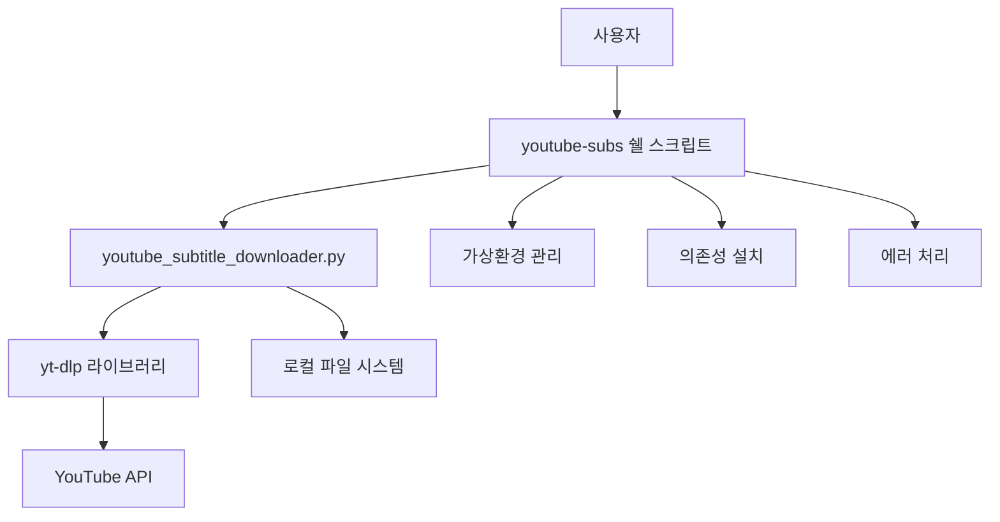

# 🔧 YouTube 자막 다운로더 - 기술 문서 및 코드 설명

> 개발자를 위한 상세 기술 문서 및 코드 아키텍처 설명

## 📋 목차
1. [아키텍처 개요](#아키텍처-개요)
2. [코드 구조 분석](#코드-구조-분석)
3. [핵심 기능 설명](#핵심-기능-설명)
4. [의존성 관리](#의존성-관리)
5. [에러 처리 전략](#에러-처리-전략)
6. [확장 가능성](#확장-가능성)

---

## 아키텍처 개요

### 🏗️ 시스템 구조


### 📁 파일 구조 및 역할

| 파일 | 역할 | 언어 |
|------|------|------|
| `youtube-subs` | 사용자 인터페이스, 환경 설정 | Bash |
| `youtube_subtitle_downloader.py` | 핵심 로직, YouTube 처리 | Python |
| `requirements.txt` | 의존성 정의 | Text |
| `README.md` | 사용자 문서 | Markdown |

---

## 코드 구조 분석

### 🐍 Python 코어 모듈 (`youtube_subtitle_downloader.py`)

#### 클래스 구조
```python
class YouTubeSubtitleDownloader:
    """메인 다운로더 클래스 - 단일 책임 원칙 적용"""
    
    def __init__(self, output_dir: str = "./subtitles")
    def _setup_logging(self) -> None
    def _get_ydl_options(self, video_url: str, language: str) -> Dict[str, Any]
    def download_subtitles(self, video_url: str, language: str) -> bool
    def list_available_languages(self, video_url: str) -> Optional[Dict[str, list]]
```

#### 핵심 설계 원칙
1. **단일 책임 원칙**: 각 메서드는 하나의 기능만 담당
2. **의존성 주입**: 출력 디렉토리를 생성자에서 주입
3. **타입 힌팅**: 모든 함수에 타입 정보 제공
4. **에러 처리**: 예외 상황을 명확히 처리

### 🔧 쉘 스크립트 구조 (`youtube-subs`)

#### 주요 함수들
```bash
# 환경 설정
check_dependencies()      # Python, pip 설치 확인
setup_virtual_environment() # 가상환경 생성/활성화
install_dependencies()    # 패키지 설치

# 사용자 인터페이스
print_usage()            # 도움말 출력
validate_url()           # URL 유효성 검사
log_info/success/error() # 컬러 로깅

# 메인 로직
main()                   # 전체 플로우 제어
```

#### Bash 스크립트 특징
- **안전한 실행**: `set -euo pipefail`로 엄격한 오류 처리
- **컬러 출력**: 사용자 경험 향상을 위한 색상 코딩
- **가상환경 관리**: Python 의존성 격리
- **인터럽트 처리**: `trap`을 통한 우아한 종료

---

## 핵심 기능 설명

### 🎯 자막 다운로드 프로세스

#### 1. URL 검증 및 정보 추출
```python
def download_subtitles(self, video_url: str, language: str = 'auto') -> bool:
    # 1. yt-dlp 옵션 설정
    ydl_opts = self._get_ydl_options(video_url, language)
    
    # 2. 비디오 정보 추출 (다운로드 없이)
    info = ydl.extract_info(video_url, download=False)
    
    # 3. 자막 가용성 확인
    subtitles = info.get('subtitles', {})
    auto_subtitles = info.get('automatic_captions', {})
    
    # 4. 실제 다운로드 실행
    ydl.download([video_url])
```

#### 2. yt-dlp 옵션 최적화
```python
def _get_ydl_options(self, video_url: str, language: str = 'auto') -> Dict[str, Any]:
    return {
        'writesubtitles': True,        # 수동 자막 다운로드
        'writeautomaticsub': True,     # 자동 생성 자막 다운로드
        'subtitleslangs': [language] if language != 'auto' else ['en', 'ko', 'ja'],
        'subtitlesformat': 'srt/best', # SRT 형식 우선
        'outtmpl': str(self.output_dir / '%(title)s.%(ext)s'),
        'skip_download': True,         # 비디오는 다운로드하지 않음
        'ignoreerrors': True,          # 일부 오류 무시하고 계속
        'quiet': False,                # 진행 상황 표시
    }
```

### 🔍 언어 감지 및 처리

#### 다국어 지원 전략
```python
# 언어 우선순위 처리
if language != 'auto':
    # 특정 언어 요청 시
    'subtitleslangs': [language]
else:
    # 자동 모드: 주요 언어들 시도
    'subtitleslangs': ['en', 'ko', 'ja']
```

#### 자막 타입 구분
- **Manual Subtitles**: 사람이 직접 작성한 정확한 자막
- **Automatic Captions**: AI가 자동 생성한 자막 (정확도 낮음)

---

## 의존성 관리

### 📦 requirements.txt 분석
```txt
# 핵심 의존성
yt-dlp>=2024.1.0          # YouTube 다운로드 엔진

# 선택적 의존성
pysrt>=1.1.2              # SRT 파일 조작 (향후 확장용)
colorama>=0.4.6           # 크로스 플랫폼 컬러 출력
```

### 🔄 가상환경 전략
```bash
# 가상환경 생성 및 관리
VENV_DIR="${SCRIPT_DIR}/.venv"

setup_virtual_environment() {
    if [[ ! -d "$VENV_DIR" ]]; then
        python3 -m venv "$VENV_DIR"  # 새 가상환경 생성
    fi
    source "$VENV_DIR/bin/activate"  # 활성화
}
```

**장점:**
- 시스템 Python과 격리
- 프로젝트별 의존성 관리
- 버전 충돌 방지

---

## 에러 처리 전략

### 🛡️ 다층 에러 처리

#### 1. 쉘 스크립트 레벨
```bash
set -euo pipefail  # 엄격한 오류 처리
trap 'log_warning "Download interrupted by user"; exit 130' INT
```

#### 2. Python 레벨
```python
try:
    # 메인 로직
    ydl.download([video_url])
except yt_dlp.DownloadError as e:
    self.logger.error(f"❌ Download error: {e}")
    return False
except Exception as e:
    self.logger.error(f"❌ Unexpected error: {e}")
    return False
```

#### 3. 사용자 친화적 메시지
```bash
log_error() {
    echo -e "${RED}[ERROR]${NC} $1" >&2
}
```

### 🔧 일반적인 오류 시나리오

| 오류 타입 | 감지 방법 | 해결 방안 |
|-----------|-----------|-----------|
| 의존성 누락 | `command -v python3` | 자동 설치 안내 |
| 권한 문제 | 실행 실패 | `chmod +x` 안내 |
| 잘못된 URL | 정규식 검증 | URL 형식 안내 |
| 자막 없음 | yt-dlp 응답 확인 | 언어 목록 제안 |

---

## 확장 가능성

### 🚀 향후 개선 방향

#### 1. 기능 확장
```python
# 배치 처리 지원
def download_multiple_videos(self, urls: List[str]) -> Dict[str, bool]:
    results = {}
    for url in urls:
        results[url] = self.download_subtitles(url)
    return results

# 자막 후처리
def process_subtitles(self, srt_file: Path) -> Path:
    # 자막 정리, 번역, 요약 등
    pass
```

#### 2. API 통합
```python
# YouTube Data API 연동
def get_video_metadata(self, video_id: str) -> Dict:
    # 조회수, 좋아요, 댓글 수 등 메타데이터 수집
    pass

# 채널 정보 수집
def get_channel_info(self, channel_id: str) -> Dict:
    # 채널 통계, 최신 영상 목록 등
    pass
```

#### 3. 자동화 워크플로우
```python
# n8n 연동을 위한 JSON 출력
def export_results_json(self, results: Dict) -> str:
    return json.dumps(results, ensure_ascii=False, indent=2)

# 웹훅 지원
def send_webhook(self, url: str, data: Dict) -> bool:
    # 완료 알림 전송
    pass
```

### 🔧 모듈화 개선안

#### 현재 구조
```
youtube_subtitle_downloader.py  # 단일 파일
```

#### 개선된 구조
```
subtitle_downloader/
├── __init__.py
├── core/
│   ├── downloader.py      # 핵심 다운로드 로직
│   ├── validator.py       # URL 및 입력 검증
│   └── processor.py       # 자막 후처리
├── utils/
│   ├── logger.py          # 로깅 유틸리티
│   ├── config.py          # 설정 관리
│   └── helpers.py         # 헬퍼 함수들
└── cli/
    └── main.py            # CLI 인터페이스
```

---

## 🔬 성능 최적화

### 📊 현재 성능 특성
- **메모리 사용량**: 최소 (스트리밍 다운로드)
- **네트워크 효율성**: 높음 (자막만 다운로드)
- **CPU 사용량**: 낮음 (I/O 바운드 작업)

### ⚡ 최적화 포인트
1. **병렬 처리**: 여러 영상 동시 다운로드
2. **캐싱**: 중복 요청 방지
3. **압축**: 대용량 자막 파일 압축 저장
4. **인덱싱**: 다운로드 이력 관리

---

## 🧪 테스트 전략

### 단위 테스트 예시
```python
import unittest
from unittest.mock import patch, MagicMock

class TestYouTubeSubtitleDownloader(unittest.TestCase):
    
    def setUp(self):
        self.downloader = YouTubeSubtitleDownloader("./test_output")
    
    def test_validate_youtube_url(self):
        # 유효한 URL 테스트
        self.assertTrue(validate_youtube_url("https://www.youtube.com/watch?v=test"))
        self.assertTrue(validate_youtube_url("https://youtu.be/test"))
        
        # 무효한 URL 테스트
        self.assertFalse(validate_youtube_url("https://vimeo.com/test"))
    
    @patch('yt_dlp.YoutubeDL')
    def test_download_subtitles_success(self, mock_ydl):
        # 성공 케이스 모킹
        mock_instance = MagicMock()
        mock_ydl.return_value.__enter__.return_value = mock_instance
        
        result = self.downloader.download_subtitles("https://youtube.com/test")
        self.assertTrue(result)
```

### 통합 테스트
```bash
#!/bin/bash
# integration_test.sh

# 실제 YouTube 영상으로 테스트
TEST_URL="https://www.youtube.com/watch?v=dQw4w9WgXcQ"

echo "Testing basic download..."
./youtube-subs "$TEST_URL" --language en --output ./test_output

echo "Testing language listing..."
./youtube-subs "$TEST_URL" --list-languages

echo "Cleaning up..."
rm -rf ./test_output
```

---

## 📚 참고 자료

### 핵심 라이브러리 문서
- [yt-dlp Documentation](https://github.com/yt-dlp/yt-dlp)
- [Python argparse](https://docs.python.org/3/library/argparse.html)
- [Bash Scripting Guide](https://tldp.org/LDP/Bash-Beginners-Guide/html/)

### 관련 표준
- [SRT Subtitle Format](https://en.wikipedia.org/wiki/SubRip)
- [YouTube API Guidelines](https://developers.google.com/youtube/v3)
- [Clean Code Principles](https://clean-code-developer.com/)

---

**Made with 🔧 for developers who care about clean, maintainable code**


