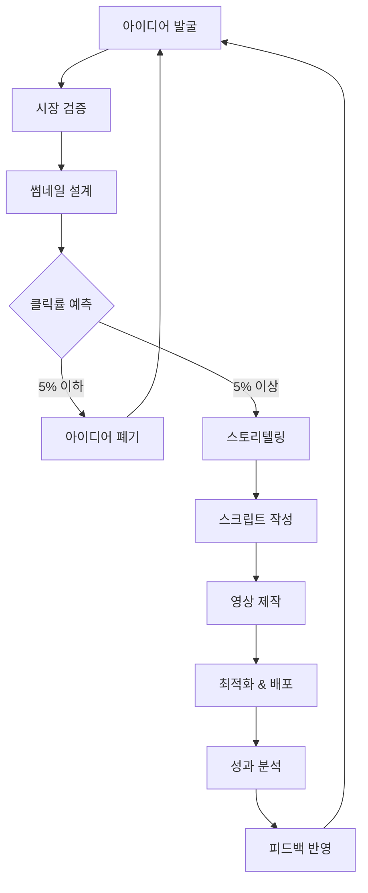

# 🎬 컨텐츠 제작 파이프라인 설계
## *주언규 메소드 기반 체계적 영상 제작 시스템*

---

## 📋 목차

1. [파이프라인 개요](#파이프라인-개요)
2. [Phase 1: 아이디어 발굴 및 검증](#phase-1-아이디어-발굴-및-검증)
3. [Phase 2: 스토리텔링 및 스크립트](#phase-2-스토리텔링-및-스크립트)
4. [Phase 3: 썸네일 우선 설계](#phase-3-썸네일-우선-설계)
5. [Phase 4: 영상 제작](#phase-4-영상-제작)
6. [Phase 5: 최적화 및 배포](#phase-5-최적화-및-배포)
7. [자동화 시스템 구축](#자동화-시스템-구축)
8. [품질 관리 체크리스트](#품질-관리-체크리스트)

---

## 파이프라인 개요

### 🎯 핵심 원칙

**1. 썸네일 우선 설계 (Thumbnail-First Design)**
- 컨텐츠 기획 전에 썸네일부터 설계
- 클릭 가능성이 낮으면 제작 중단
- 본능적 반응을 유도하는 비주얼 우선

**2. 평범함 기반 타겟팅 (Ordinary-Based Targeting)**
- 내 시청 기록 = 타겟 오디언스 행동 패턴
- 평범한 사람의 니즈에 집중
- 과도한 차별화 시도 지양

**3. 데이터 기반 의사결정 (Data-Driven Decision Making)**
- 모든 결정을 데이터로 검증
- 20가지 지표 기반 최적화
- 감정보다 수치 중심 판단

### 📊 전체 파이프라인 구조



---

## Phase 1: 아이디어 발굴 및 검증

### 1.1 아이디어 소스 매트릭스

| 소스 유형 | 수집 방법 | 수집 주기 | 활용도 |
|----------|----------|----------|--------|
| 내 시청 기록 | YouTube 기록 분석 | 일일 | 90% |
| 경쟁 채널 | 인기 영상 벤치마킹 | 주간 | 70% |
| 트렌드 분석 | Google Trends | 주간 | 60% |
| 커뮤니티 | Reddit, 네이버 카페 | 주간 | 50% |
| 개인 경험 | 일상 관찰 | 수시 | 80% |

### 1.2 아이디어 발굴 프로세스

#### Step 1: 데이터 수집 (15분/일)
```python
# 아이디어 수집 자동화 스크립트 예시
daily_idea_collection = {
    "시청_기록_분석": {
        "시간": "5분",
        "방법": "최근 시청 10개 영상 썸네일 분석",
        "결과": "클릭 유도 요소 3가지 추출"
    },
    "트렌드_키워드": {
        "시간": "5분", 
        "방법": "Google Trends 상위 10개 확인",
        "결과": "관련 키워드 조합 생성"
    },
    "경쟁사_모니터링": {
        "시간": "5분",
        "방법": "타겟 채널 최신 영상 3개 분석", 
        "결과": "성공 패턴 파악"
    }
}
```

#### Step 2: 아이디어 검증 체크리스트
- [ ] **평범함 테스트**: 내가 관심 있는 주제인가?
- [ ] **타겟 테스트**: 나와 비슷한 사람들이 궁금해할까?
- [ ] **시장 테스트**: 관련 검색량이 월 1만 회 이상인가?
- [ ] **경쟁 테스트**: 상위 채널들이 다루지 않은 각도인가?
- [ ] **수익 테스트**: 수익화 연결점이 있는가?

#### Step 3: 아이디어 스코어링
```
💯 아이디어 점수 계산
- 개인 관심도 (25점): 내가 얼마나 관심 있는가?
- 타겟 니즈 (25점): 평범한 사람들의 니즈와 얼마나 일치하는가?
- 시장 크기 (20점): 검색량 및 관심도는 충분한가?
- 경쟁 강도 (15점): 기존 채널들과 차별화 가능한가?
- 수익 가능성 (15점): 수익화 연결점이 명확한가?

총 70점 이상만 제작 진행
```

### 1.3 주간 아이디어 뱅크 구축

#### 아이디어 카테고리 분류
**A. 이득 기반 아이디어**
- "이거 하면 돈 벌어"
- "시간 단축하는 방법"
- "건강해지는 비법"

**B. 궁금증 기반 아이디어**
- "이게 진짜야?"
- "뒷이야기가 궁금한"
- "결과를 예측할 수 없는"

**C. 공감 기반 아이디어**
- "나만 그런 게 아니었어"
- "모든 사람이 겪는 문제"
- "세대별 공통 경험"

**D. 본능 기반 아이디어**
- "시각적으로 임팩트 있는"
- "감정적 반응을 유도하는"
- "즉각적 관심을 끄는"

---

## Phase 2: 스토리텔링 및 스크립트

### 2.1 주언규식 스토리텔링 구조

#### 기본 구조: HOOK-PROBLEM-SOLUTION-CTA
```
🎣 HOOK (0-15초): 본능적 관심 유도
❓ PROBLEM (15초-2분): 평범한 사람의 문제 제시
💡 SOLUTION (2분-8분): 구체적 해결책 제공
🎯 CTA (8분-10분): 명확한 행동 유도
```

#### 세부 구성 요소

**HOOK 제작 공식**
```
선택 1: 결과 미리보기
"이 방법으로 3개월 만에 100만원 벌었습니다"

선택 2: 충격적 사실
"99%의 사람이 이 사실을 모르고 있습니다"

선택 3: 개인적 고백
"저도 처음엔 완전 평범한 직장인이었어요"

선택 4: 질문으로 시작
"여러분은 이런 경험 있으신가요?"
```

**PROBLEM 구성 요소**
- 평범한 사람들의 공통 고민
- 구체적 수치와 사례
- 감정적 공감대 형성
- 기존 해결책의 한계

**SOLUTION 구성 요소**
- 단계별 구체적 방법
- 실제 적용 사례
- 예상 결과 및 기대효과
- 주의사항 및 팁

**CTA 구성 요소**
- 구체적 행동 지시
- 다음 영상 예고
- 구독 및 알림 설정 유도
- 댓글 참여 유도

### 2.2 스크립트 작성 프로세스

#### Step 1: 핵심 메시지 정의 (5분)
```
📝 메시지 정의 템플릿
주제: [구체적 주제]
타겟: [평범한 00세 0성이 가진 00 고민]
핵심 메시지: [한 문장으로 요약한 해결책]
기대 효과: [시청 후 얻을 수 있는 것]
```

#### Step 2: 아웃라인 작성 (10분)
```
📑 아웃라인 템플릿
HOOK (30초):
- 어텐션 그랩퍼: [충격적 사실/질문/결과]
- 개인적 스토리: [관련 경험담]

PROBLEM (90초):
- 문제 상황 설명: [평범한 사람들의 고민]
- 기존 해결책의 한계: [왜 다른 방법들이 안 되는지]

SOLUTION (6분):
- 해결책 1: [구체적 방법]
- 해결책 2: [구체적 방법]  
- 해결책 3: [구체적 방법]
- 실제 적용 사례: [성공 사례]

CTA (30초):
- 행동 유도: [구체적으로 무엇을 할지]
- 다음 영상 예고: [다음에 다룰 내용]
```

#### Step 3: 디테일 스크립트 작성 (30분)

**스크립트 작성 규칙**
- 구어체 사용 (문어체 금지)
- 한 문장 최대 20자 이내
- 3초마다 시각적 전환점 제공
- 숫자와 구체적 사례 포함
- 감정 표현 명시 [놀람], [안타까움], [기쁨]

### 2.3 스크립트 검증 체크리스트

- [ ] **15초 테스트**: 첫 15초에 명확한 훅이 있는가?
- [ ] **평범함 테스트**: 평범한 사람이 공감할 수 있는가?
- [ ] **구체성 테스트**: 모호한 표현 없이 구체적인가?
- [ ] **실행성 테스트**: 시청자가 바로 실행할 수 있는가?
- [ ] **감정 테스트**: 감정적 몰입을 유도하는가?

---

## Phase 3: 썸네일 우선 설계

### 3.1 썸네일 설계 우선순위

```
🎨 썸네일 제작 순서
1. 썸네일 설계 (30분)
2. 클릭률 예측 (10분)
3. A/B 테스트 버전 제작 (20분)
4. 최종 검증 (10분)
총 70분 → 영상 제작보다 먼저!
```

### 3.2 썸네일 구성 요소 체계

#### A. 메인 오브젝트 (60% 면적)
- **인물**: 감정이 드러나는 표정
- **물건**: 호기심을 유발하는 아이템
- **결과**: 변화 전후 비교
- **숫자**: 임팩트 있는 수치

#### B. 텍스트 오버레이 (20% 면적)
```
✅ 효과적인 텍스트 공식
- 핵심 키워드 3-5자
- 대비 강한 색상 (흰색 vs 검은색)
- 굵은 폰트 (최소 72pt)
- 그림자 효과 적용
```

#### C. 배경 및 레이아웃 (20% 면적)
- 단순하고 깔끔한 배경
- 3분할법 적용
- 시선 집중을 방해하지 않는 색상

### 3.3 썸네일 제작 자동화 프로세스

#### Template 기반 제작 시스템
```
📁 썸네일 템플릿 라이브러리
├── 이득형 (Benefit Type)
│   ├── 돈_버는_방법.psd
│   ├── 시간_단축.psd
│   └── 건강_개선.psd
├── 궁금증형 (Curiosity Type)
│   ├── 충격적_사실.psd
│   ├── 뒷이야기.psd
│   └── 예측불가.psd
├── 공감형 (Empathy Type)
│   ├── 나만_그런게_아냐.psd
│   ├── 세대공감.psd
│   └── 일상공감.psd
└── 본능형 (Instinct Type)
    ├── 시각적_임팩트.psd
    ├── 감정적_반응.psd
    └── 즉각적_관심.psd
```

#### AI 기반 썸네일 최적화
```python
# 썸네일 성능 예측 시스템
thumbnail_scorer = {
    "색상_대비": calculate_contrast_ratio(),
    "얼굴_감정": detect_facial_emotion(),
    "텍스트_가독성": measure_text_readability(),
    "시선_집중도": calculate_attention_heatmap(),
    "클릭률_예측": predict_ctr_based_on_history()
}

# 70점 이상만 제작 진행
if thumbnail_scorer.total_score >= 70:
    proceed_to_production()
else:
    redesign_thumbnail()
```

### 3.4 A/B 테스트 시스템

#### 테스트 변수 설정
- **표정**: 놀람 vs 미소 vs 진지함
- **색상**: 빨강 vs 파랑 vs 노랑
- **텍스트**: 있음 vs 없음
- **구성**: 좌측 vs 우측 vs 중앙

#### 테스트 결과 분석
```
📊 A/B 테스트 결과 예시
버전 A: 클릭률 8.2%
버전 B: 클릭률 12.1%
→ 버전 B 채택 (47% 개선)

성공 요인 분석:
- 표정: 놀람 표정이 효과적
- 색상: 빨간색 배경이 주목도 높음
- 텍스트: 숫자 포함 시 클릭률 상승
```

---

## Phase 4: 영상 제작

### 4.1 제작 환경 설정

#### 기본 장비 구성
```
📹 필수 장비 (최소 구성)
- 카메라: 스마트폰 (iPhone 12 이상)
- 조명: LED 링 라이트 (최소 2개)
- 마이크: 핀 마이크 or USB 마이크
- 편집: DaVinci Resolve (무료)

🎬 권장 장비 (업그레이드)
- 카메라: Sony A7III or Canon EOS R
- 조명: Godox SL-60W (3점 조명)
- 마이크: Rode PodMic
- 편집: Premiere Pro + After Effects
```

#### 촬영 공간 설정
- **배경**: 단순하고 깔끔 (흰색 or 회색 권장)
- **조명**: 3점 조명 (키라이트, 필라이트, 백라이트)
- **음향**: 흡음재 설치 (담요나 커튼 활용 가능)

### 4.2 촬영 프로세스

#### Pre-Production (30분)
```
✅ 촬영 전 체크리스트
□ 스크립트 최종 검토
□ 썸네일 참조 이미지 준비
□ 촬영 각도 및 구도 설정
□ 조명 및 음향 테스트
□ 예상 촬영 시간 계획 (1시간 이내)
```

#### Production (60분)
```
🎬 촬영 순서
1. 테스트 촬영 (5분)
2. 인트로 촬영 (15분)
3. 메인 콘텐츠 촬영 (30분)
4. 아웃트로 촬영 (10분)

📝 촬영 팁
- 한 씬당 최소 3테이크
- 실수해도 계속 진행 (편집에서 해결)
- 감정 표현 과장되게
- 시선은 카메라 렌즈에 고정
```

#### Post-Production (120분)
```
✂️ 편집 프로세스
1. 러프 컷 (30분): 전체 흐름 구성
2. 파인 컷 (45분): 세부 편집
3. 색보정 (15분): 일관된 톤앤매너
4. 오디오 믹싱 (15분): 음성 최적화
5. 자막 작업 (15분): 가독성 높은 자막
```

### 4.3 편집 자동화 시스템

#### Template 기반 편집
```
📁 편집 템플릿 라이브러리
├── 인트로_템플릿.prproj
├── 아웃트로_템플릿.prproj
├── 전환효과_프리셋.zip
├── 색보정_LUT.cube
└── 자막_스타일.prtl
```

#### AI 기반 편집 도구 활용
- **자동 자막**: YouTube 자동 자막 → 수정
- **씬 감지**: Adobe Sensei 활용
- **색보정**: DaVinci Resolve 자동 균형
- **음향 개선**: Adobe Podcast 잡음 제거

---

## Phase 5: 최적화 및 배포

### 5.1 메타데이터 최적화

#### 제목 최적화 공식
```
🎯 제목 작성 공식
[감정 유발 키워드] + [구체적 숫자] + [타겟 키워드] + [결과 제시]

예시:
"놀라운 15분으로 유튜브 구독자 1000명 만드는 비법"
   ↑        ↑           ↑              ↑
감정유발   숫자      타겟키워드      결과제시
```

#### 설명란 최적화 구조
```
📝 설명란 템플릿
🎯 영상 요약 (3줄)
- 핵심 내용 요약
- 주요 혜택 제시
- 시청 권장 대상

📋 타임스탬프
00:00 인트로
01:30 문제 상황
03:00 해결책 1
05:30 해결책 2
...

🔗 관련 링크
- 언급된 도구: [링크]
- 추가 자료: [링크]
- 이전 영상: [링크]

📱 소셜 미디어
Instagram: @username
Twitter: @username

#태그 #키워드 #모음
```

#### 태그 전략
```
🏷️ 태그 구성 전략
1. 메인 키워드 (5개): 핵심 주제
2. 롱테일 키워드 (10개): 구체적 검색어
3. 브랜드 키워드 (3개): 채널 관련
4. 트렌드 키워드 (2개): 현재 인기 검색어

총 20개 이내 권장
```

### 5.2 업로드 최적화

#### 최적 업로드 시간 분석
```python
# 타겟 오디언스 활동 시간 분석
optimal_upload_times = {
    "평일": {
        "오전": "09:00-11:00 (출근길)",
        "점심": "12:00-13:00 (점심시간)",
        "저녁": "19:00-22:00 (퇴근 후)"
    },
    "주말": {
        "오전": "10:00-12:00 (여유로운 시간)",
        "오후": "14:00-17:00 (휴식 시간)",
        "저녁": "20:00-23:00 (집에서 휴식)"
    }
}

# 개인별 최적화 시간은 Analytics 데이터로 확인
```

#### 스케줄링 시스템
```
📅 업로드 스케줄 예시
월: 19:00 (주간 계획 영상)
수: 20:00 (메인 콘텐츠)
금: 19:30 (주간 리뷰 영상)

일관성이 성장의 핵심!
```

### 5.3 초기 성과 부스팅

#### 첫 1시간 전략
```
⚡ 골든 아워 (업로드 후 1시간)
- 개인 SNS 공유 (즉시)
- 가족/친구들에게 공유 (15분 이내)
- 관련 커뮤니티 공유 (30분 이내)
- 이전 영상에 댓글로 홍보 (1시간 이내)
```

#### 첫 24시간 전략
```
📈 24시간 부스팅 계획
0-1시간: 개인 네트워크 활용
1-6시간: SNS 및 커뮤니티 확산
6-12시간: 유료 광고 시작 (필요 시)
12-24시간: 성과 모니터링 및 대응
```

---

## 자동화 시스템 구축

### 6.1 콘텐츠 기획 자동화

#### AI 아이디어 생성 시스템
```python
# GPT 기반 아이디어 생성기
def generate_content_ideas(target_audience, trending_keywords, personal_interests):
    prompt = f"""
    타겟: {target_audience}
    트렌드 키워드: {trending_keywords}
    개인 관심사: {personal_interests}
    
    위 정보를 바탕으로 클릭률 높은 유튜브 영상 아이디어 10개를 생성하세요.
    각 아이디어는 다음 형식으로:
    1. 제목 (감정 유발 + 구체적 숫자 포함)
    2. 썸네일 설명
    3. 예상 클릭률 (%)
    4. 제작 난이도 (상/중/하)
    """
    
    return openai.chat.completions.create(
        model="gpt-4",
        messages=[{"role": "user", "content": prompt}]
    )
```

#### 경쟁 채널 모니터링 자동화
```python
# 경쟁사 분석 자동화
def monitor_competitor_channels():
    competitor_data = []
    for channel in competitor_list:
        recent_videos = get_recent_videos(channel, days=7)
        for video in recent_videos:
            data = {
                "title": video.title,
                "views": video.view_count,
                "upload_date": video.upload_date,
                "thumbnail_url": video.thumbnail,
                "engagement_rate": calculate_engagement(video)
            }
            competitor_data.append(data)
    
    # 높은 성과의 영상 패턴 분석
    high_performing = filter(lambda x: x["engagement_rate"] > 5, competitor_data)
    return analyze_success_patterns(high_performing)
```

### 6.2 제작 프로세스 자동화

#### 썸네일 A/B 테스트 자동화
```python
# 자동 A/B 테스트 시스템
def automated_thumbnail_testing(video_id, thumbnail_variants):
    test_results = {}
    
    for i, thumbnail in enumerate(thumbnail_variants):
        # 24시간씩 각 썸네일 테스트
        upload_thumbnail(video_id, thumbnail)
        time.sleep(86400)  # 24시간 대기
        
        metrics = get_video_metrics(video_id, hours=24)
        test_results[f"variant_{i}"] = {
            "ctr": metrics.click_through_rate,
            "views": metrics.view_count,
            "thumbnail": thumbnail
        }
    
    # 최고 성과 썸네일 선택
    best_variant = max(test_results.values(), key=lambda x: x["ctr"])
    upload_thumbnail(video_id, best_variant["thumbnail"])
    
    return test_results
```

#### 스크립트 자동 생성
```python
# 스크립트 템플릿 기반 자동 생성
def generate_script(topic, target_audience, video_length=10):
    template = load_script_template("standard_template.json")
    
    script_sections = {
        "hook": generate_hook(topic, target_audience),
        "problem": generate_problem_section(topic, target_audience),
        "solution": generate_solution_section(topic, video_length * 0.6),
        "cta": generate_cta_section(topic)
    }
    
    return compile_script(template, script_sections)
```

### 6.3 배포 및 최적화 자동화

#### 메타데이터 자동 최적화
```python
# SEO 최적화 자동화
def optimize_metadata(video_content, target_keywords):
    # 제목 최적화
    optimized_title = generate_seo_title(
        content=video_content,
        keywords=target_keywords,
        max_length=60
    )
    
    # 설명 자동 생성
    description = generate_description(
        content=video_content,
        keywords=target_keywords,
        include_timestamps=True
    )
    
    # 태그 자동 생성
    tags = generate_tags(
        content=video_content,
        target_keywords=target_keywords,
        max_tags=20
    )
    
    return {
        "title": optimized_title,
        "description": description,
        "tags": tags
    }
```

#### 성과 모니터링 자동화
```python
# 실시간 성과 모니터링
def automated_performance_monitoring():
    while True:
        for video in recent_uploads:
            metrics = get_video_metrics(video.id)
            
            # 성과 기준 미달 시 알림
            if metrics.ctr < 3.0 and metrics.hours_since_upload > 24:
                send_alert(f"Low CTR Alert: {video.title} - {metrics.ctr}%")
                suggest_optimizations(video.id, metrics)
            
            # 바이럴 징후 감지
            if metrics.view_velocity > video.expected_velocity * 2:
                send_alert(f"Viral Alert: {video.title} - Boost promotion!")
                increase_promotion_budget(video.id)
        
        time.sleep(3600)  # 1시간마다 체크
```

---

## 품질 관리 체크리스트

### 7.1 제작 전 체크리스트

#### 기획 단계
- [ ] **아이디어 검증**: 70점 이상 스코어 달성
- [ ] **타겟 검증**: 평범한 사람의 니즈와 일치
- [ ] **경쟁 분석**: 상위 채널 벤치마킹 완료
- [ ] **수익 연결**: 수익화 방안 명확히 설정

#### 썸네일 단계
- [ ] **클릭률 예측**: 5% 이상 예측값
- [ ] **A/B 테스트**: 최소 2개 버전 준비
- [ ] **모바일 최적화**: 스마트폰에서 가독성 확인
- [ ] **감정 자극**: 4가지 카테고리 중 최소 2개 만족

#### 스크립트 단계
- [ ] **15초 훅**: 강력한 도입부 준비
- [ ] **평범함 관점**: 평범한 사람 시선으로 작성
- [ ] **구체성**: 모호한 표현 제거
- [ ] **실행 가능성**: 즉시 적용 가능한 내용

### 7.2 제작 중 체크리스트

#### 촬영 단계
- [ ] **음질 확인**: 배경 소음 없이 명확한 음성
- [ ] **화질 확인**: 선명하고 안정적인 영상
- [ ] **조명 확인**: 얼굴이 밝고 자연스럽게 보임
- [ ] **표정 연기**: 감정이 과장되게 표현됨

#### 편집 단계
- [ ] **3초 룰**: 3초마다 시각적 변화
- [ ] **자막 품질**: 오타 없고 가독성 높음
- [ ] **음향 믹싱**: 일정한 볼륨과 깔끔한 음질
- [ ] **템포 조절**: 지루하지 않은 편집 리듬

### 7.3 배포 전 체크리스트

#### 메타데이터
- [ ] **제목 최적화**: 감정 유발 + 숫자 + 키워드
- [ ] **설명 최적화**: 타임스탬프와 관련 링크 포함
- [ ] **태그 최적화**: 20개 이내 관련 키워드
- [ ] **썸네일 최종**: 최고 성과 버전 선택

#### 기술적 요소
- [ ] **해상도**: 1920x1080 이상
- [ ] **비트레이트**: 적절한 화질과 용량 균형
- [ ] **종횡비**: 16:9 비율 준수
- [ ] **자막 파일**: SRT 파일 별도 준비

### 7.4 배포 후 체크리스트

#### 첫 24시간
- [ ] **성과 모니터링**: 시간별 지표 확인
- [ ] **댓글 응답**: 초기 댓글에 적극 응답
- [ ] **SNS 홍보**: 개인 네트워크 활용
- [ ] **문제 대응**: 음성/영상 이슈 즉시 수정

#### 첫 1주일
- [ ] **지표 분석**: 20가지 지표 종합 분석
- [ ] **피드백 수집**: 댓글과 반응 패턴 분석
- [ ] **개선점 도출**: 다음 영상 반영사항 정리
- [ ] **성공 요인**: 잘된 부분 패턴화

---

## 🚀 실행 가이드

### 첫 달 목표
- 영상 4개 제작 (주 1개)
- 썸네일 A/B 테스트 완료
- 기본 자동화 시스템 구축
- 평균 클릭률 3% 달성

### 3개월 목표  
- 영상 12개 누적
- 클릭률 5% 안정적 달성
- 구독자 100명 달성
- 수익화 모델 검증

### 6개월 목표
- 클릭률 10% 달성
- 월 수익 100만원 달성
- 완전 자동화 시스템 구축
- 확장 전략 수립

이 파이프라인을 통해 **체계적이고 지속 가능한 유튜브 성장**을 달성할 수 있습니다. 핵심은 썸네일 우선 설계와 평범함을 활용한 차별화, 그리고 데이터 기반의 지속적 최적화입니다.


