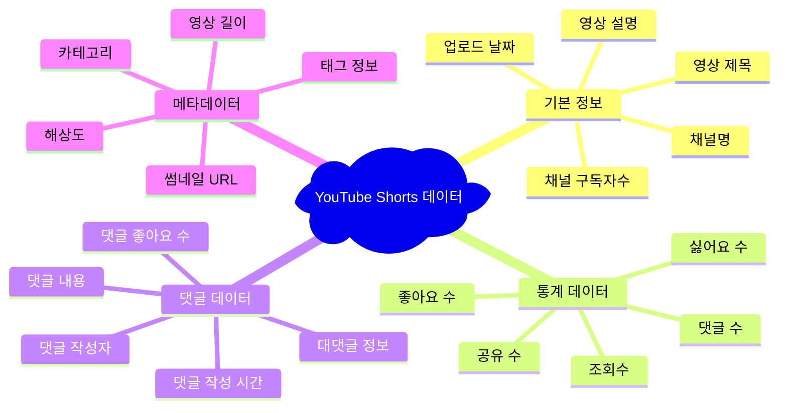
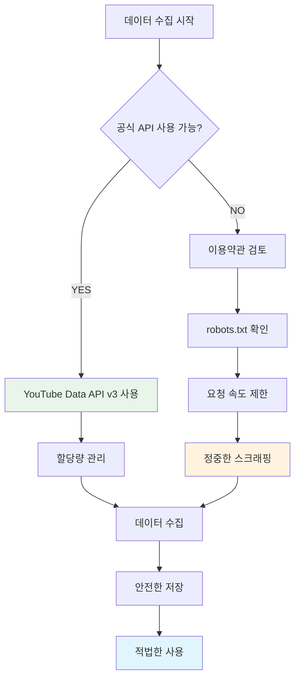

# YouTube Shorts 데이터 수집 완전 가이드

Created: 2024년 12월
Tags: YouTube Shorts, Data Collection, API, Web Scraping, Content Analysis
Author: AI Assistant

---

## 📋 **목차**

1. [개요 및 수집 가능한 데이터](#개요-및-수집-가능한-데이터)
2. [법적 고려사항](#법적-고려사항)
3. [방법별 상세 가이드](#방법별-상세-가이드)
4. [통합 솔루션](#통합-솔루션)
5. [실제 구현 예제](#실제-구현-예제)
6. [데이터 활용 전략](#데이터-활용-전략)

---

## 🎯 **개요 및 수집 가능한 데이터**

### **수집 가능한 주요 데이터**



### **데이터 수집 방법 비교**

| 방법 | 난이도 | 안전성 | 완성도 | 비용 | 추천도 |
|------|--------|--------|--------|------|-------|
| **YouTube Data API v3** | 중간 | ⭐⭐⭐⭐⭐ | ⭐⭐⭐⭐ | 무료* | ⭐⭐⭐⭐⭐ |
| **yt-dlp** | 쉬움 | ⭐⭐⭐⭐ | ⭐⭐⭐⭐ | 무료 | ⭐⭐⭐⭐ |
| **Selenium 스크래핑** | 어려움 | ⭐⭐ | ⭐⭐⭐ | 무료 | ⭐⭐ |
| **통합 솔루션** | 중간 | ⭐⭐⭐⭐ | ⭐⭐⭐⭐⭐ | 무료* | ⭐⭐⭐⭐⭐ |

*무료 할당량 존재

---

## ⚖️ **법적 고려사항**

### **✅ 권장되는 방법**



### **🚫 피해야 할 행위**

- ❌ 대량의 자동화된 요청 (DDoS와 유사한 행위)
- ❌ YouTube의 보안 시스템 우회 시도
- ❌ 개인정보 무단 수집 및 활용
- ❌ 상업적 목적의 무단 재배포
- ❌ API 키 무단 공유 또는 악용

### **✅ 모범 사례**

- ✅ 공식 API 우선 사용
- ✅ 요청 간격 적절히 조절 (1초 이상)
- ✅ 수집 목적 명확히 정의
- ✅ 데이터 보안 및 프라이버시 보호
- ✅ 이용약관 정기적 검토

---

## 🛠️ **방법별 상세 가이드**

### **방법 1: YouTube Data API v3 (권장)**

#### **📋 사전 준비**

1. Google Cloud Console 프로젝트 생성
2. YouTube Data API v3 활성화
3. API 키 생성
4. 할당량 설정 (일일 10,000 단위)

#### **🔧 기본 구현**

```python
from googleapiclient.discovery import build
import requests
import json
from datetime import datetime
import re

class YouTubeDataCollector:
    def __init__(self, api_key):
        self.api_key = api_key
        self.youtube = build('youtube', 'v3', developerKey=api_key)
    
    def extract_video_id(self, url):
        """YouTube URL에서 video ID 추출"""
        patterns = [
            r'(?:youtube\.com/shorts/)([^&\n?#]+)',
            r'(?:youtube\.com/watch\?v=)([^&\n?#]+)',
            r'(?:youtu\.be/)([^&\n?#]+)'
        ]
        
        for pattern in patterns:
            match = re.search(pattern, url)
            if match:
                return match.group(1)
        return None
    
    def get_video_details(self, video_id):
        """영상 기본 정보 수집"""
        try:
            response = self.youtube.videos().list(
                part='snippet,statistics,contentDetails',
                id=video_id
            ).execute()
            
            if not response['items']:
                return None
            
            video = response['items'][0]
            snippet = video['snippet']
            statistics = video['statistics']
            
            return {
                'video_id': video_id,
                'title': snippet.get('title', ''),
                'description': snippet.get('description', ''),
                'channel_title': snippet.get('channelTitle', ''),
                'channel_id': snippet.get('channelId', ''),
                'published_at': snippet.get('publishedAt', ''),
                'tags': snippet.get('tags', []),
                'category_id': snippet.get('categoryId', ''),
                'view_count': int(statistics.get('viewCount', 0)),
                'like_count': int(statistics.get('likeCount', 0)),
                'comment_count': int(statistics.get('commentCount', 0)),
                'duration': video['contentDetails'].get('duration', ''),
            }
        except Exception as e:
            print(f"Error getting video details: {e}")
            return None
    
    def get_video_comments(self, video_id, max_results=100):
        """댓글 수집"""
        comments = []
        try:
            response = self.youtube.commentThreads().list(
                part='snippet,replies',
                videoId=video_id,
                maxResults=min(max_results, 100),
                order='relevance'
            ).execute()
            
            for item in response['items']:
                comment = item['snippet']['topLevelComment']['snippet']
                comment_data = {
                    'comment_id': item['id'],
                    'text': comment['textDisplay'],
                    'author': comment['authorDisplayName'],
                    'author_channel_id': comment.get('authorChannelId', {}).get('value', ''),
                    'like_count': comment['likeCount'],
                    'published_at': comment['publishedAt'],
                    'updated_at': comment['updatedAt'],
                }
                
                # 대댓글 처리
                if 'replies' in item:
                    replies = []
                    for reply in item['replies']['comments']:
                        reply_snippet = reply['snippet']
                        replies.append({
                            'reply_id': reply['id'],
                            'text': reply_snippet['textDisplay'],
                            'author': reply_snippet['authorDisplayName'],
                            'like_count': reply_snippet['likeCount'],
                            'published_at': reply_snippet['publishedAt'],
                        })
                    comment_data['replies'] = replies
                
                comments.append(comment_data)
            
            return comments
        except Exception as e:
            print(f"Error getting comments: {e}")
            return []
    
    def get_channel_info(self, channel_id):
        """채널 정보 수집"""
        try:
            response = self.youtube.channels().list(
                part='snippet,statistics',
                id=channel_id
            ).execute()
            
            if not response['items']:
                return None
            
            channel = response['items'][0]
            snippet = channel['snippet']
            statistics = channel['statistics']
            
            return {
                'channel_id': channel_id,
                'title': snippet.get('title', ''),
                'description': snippet.get('description', ''),
                'custom_url': snippet.get('customUrl', ''),
                'published_at': snippet.get('publishedAt', ''),
                'subscriber_count': int(statistics.get('subscriberCount', 0)),
                'video_count': int(statistics.get('videoCount', 0)),
                'view_count': int(statistics.get('viewCount', 0)),
            }
        except Exception as e:
            print(f"Error getting channel info: {e}")
            return None

# 사용 예제
api_key = "YOUR_API_KEY"
collector = YouTubeDataCollector(api_key)

shorts_url = "https://www.youtube.com/shorts/VIDEO_ID"
video_id = collector.extract_video_id(shorts_url)

if video_id:
    # 영상 정보 수집
    video_details = collector.get_video_details(video_id)
    
    # 댓글 수집
    comments = collector.get_video_comments(video_id, max_results=50)
    
    # 채널 정보 수집
    if video_details and video_details['channel_id']:
        channel_info = collector.get_channel_info(video_details['channel_id'])
    
    # 결과 출력
    print(json.dumps({
        'video': video_details,
        'comments': comments,
        'channel': channel_info
    }, indent=2, ensure_ascii=False))
```

---

### **방법 2: yt-dlp 라이브러리**

#### **📦 설치**

```bash
pip install yt-dlp
```

#### **🔧 구현**

```python
import yt_dlp
import json
from datetime import datetime

class YtDlpCollector:
    def __init__(self):
        self.ydl_opts = {
            'quiet': True,
            'no_warnings': True,
            'extract_flat': False,
            'writeinfojson': False,
            'writesubtitles': False,
            'writeautomaticsub': False,
        }
    
    def extract_video_info(self, url):
        """yt-dlp를 사용한 영상 정보 추출"""
        try:
            with yt_dlp.YoutubeDL(self.ydl_opts) as ydl:
                info = ydl.extract_info(url, download=False)
                
                return {
                    'video_id': info.get('id', ''),
                    'title': info.get('title', ''),
                    'description': info.get('description', ''),
                    'uploader': info.get('uploader', ''),
                    'uploader_id': info.get('uploader_id', ''),
                    'upload_date': info.get('upload_date', ''),
                    'duration': info.get('duration', 0),
                    'view_count': info.get('view_count', 0),
                    'like_count': info.get('like_count', 0),
                    'comment_count': info.get('comment_count', 0),
                    'tags': info.get('tags', []),
                    'categories': info.get('categories', []),
                    'thumbnail': info.get('thumbnail', ''),
                    'webpage_url': info.get('webpage_url', ''),
                    'format_note': info.get('format_note', ''),
                    'fps': info.get('fps', 0),
                    'width': info.get('width', 0),
                    'height': info.get('height', 0),
                }
        except Exception as e:
            print(f"Error extracting with yt-dlp: {e}")
            return None

# 사용 예제
collector = YtDlpCollector()
video_info = collector.extract_video_info("https://www.youtube.com/shorts/VIDEO_ID")

if video_info:
    print(json.dumps(video_info, indent=2, ensure_ascii=False))
```

---

### **방법 3: Selenium 웹 스크래핑 (비권장)**

#### **⚠️ 주의사항**
- 브라우저 자원 소모가 크고 속도가 느림
- YouTube의 봇 탐지에 걸릴 위험
- UI 변경 시 코드 수정 필요
- 법적 리스크 존재

#### **🔧 구현 (참고용)**

```python
from selenium import webdriver
from selenium.webdriver.common.by import By
from selenium.webdriver.support.ui import WebDriverWait
from selenium.webdriver.support import expected_conditions as EC
from selenium.webdriver.chrome.options import Options
import time
import json

class SeleniumCollector:
    def __init__(self, headless=True):
        self.options = Options()
        if headless:
            self.options.add_argument('--headless')
        self.options.add_argument('--no-sandbox')
        self.options.add_argument('--disable-dev-shm-usage')
        self.options.add_argument('--disable-blink-features=AutomationControlled')
        self.options.add_experimental_option("excludeSwitches", ["enable-automation"])
        self.options.add_experimental_option('useAutomationExtension', False)
    
    def scrape_shorts_data(self, url):
        """Selenium을 사용한 Shorts 데이터 스크래핑"""
        driver = webdriver.Chrome(options=self.options)
        
        try:
            # 사람처럼 행동하기 위한 설정
            driver.execute_script("Object.defineProperty(navigator, 'webdriver', {get: () => undefined})")
            
            driver.get(url)
            wait = WebDriverWait(driver, 15)
            
            # 페이지 로딩 대기
            time.sleep(3)
            
            # 제목 추출
            try:
                title_element = wait.until(
                    EC.presence_of_element_located((By.CSS_SELECTOR, "h1.ytd-watch-metadata"))
                )
                title = title_element.text
            except:
                title = "제목을 찾을 수 없음"
            
            # 조회수, 좋아요 등 통계 정보 추출
            try:
                stats_selector = "#info-container #info span"
                stats_elements = driver.find_elements(By.CSS_SELECTOR, stats_selector)
                stats_text = [elem.text for elem in stats_elements if elem.text]
            except:
                stats_text = []
            
            # 댓글 로딩을 위한 스크롤
            driver.execute_script("window.scrollTo(0, document.body.scrollHeight);")
            time.sleep(2)
            
            # 댓글 추출
            try:
                comment_elements = driver.find_elements(By.CSS_SELECTOR, "#content-text")
                comments = []
                for elem in comment_elements[:20]:  # 상위 20개만
                    if elem.text.strip():
                        comments.append(elem.text.strip())
            except:
                comments = []
            
            return {
                'title': title,
                'stats': stats_text,
                'comments': comments,
                'url': url,
                'scraped_at': time.strftime('%Y-%m-%d %H:%M:%S')
            }
            
        except Exception as e:
            print(f"스크래핑 오류: {e}")
            return None
        
        finally:
            driver.quit()

# 사용 예제 (권장하지 않음)
# collector = SeleniumCollector(headless=True)
# data = collector.scrape_shorts_data("https://www.youtube.com/shorts/VIDEO_ID")
```

---

## 🎯 **통합 솔루션 (권장)**

### **최적화된 데이터 수집기**

```python
import requests
import yt_dlp
from googleapiclient.discovery import build
import re
import time
import json
from datetime import datetime
from typing import Dict, List, Optional

class YouTubeShortsAnalyzer:
    """YouTube Shorts 데이터 수집을 위한 통합 클래스"""
    
    def __init__(self, api_key: Optional[str] = None, rate_limit: float = 1.0):
        self.api_key = api_key
        self.rate_limit = rate_limit  # 요청 간 대기 시간(초)
        self.last_request_time = 0
        
        if api_key:
            self.youtube = build('youtube', 'v3', developerKey=api_key)
        
        self.ydl_opts = {
            'quiet': True,
            'no_warnings': True,
            'extract_flat': False,
        }
    
    def _rate_limit_check(self):
        """API 요청 속도 제한"""
        current_time = time.time()
        time_diff = current_time - self.last_request_time
        
        if time_diff < self.rate_limit:
            time.sleep(self.rate_limit - time_diff)
        
        self.last_request_time = time.time()
    
    def extract_video_id(self, url: str) -> Optional[str]:
        """YouTube URL에서 video ID 추출"""
        patterns = [
            r'(?:youtube\.com/shorts/)([^&\n?#]+)',
            r'(?:youtube\.com/watch\?v=)([^&\n?#]+)',
            r'(?:youtu\.be/)([^&\n?#]+)',
            r'(?:youtube\.com/embed/)([^&\n?#]+)'
        ]
        
        for pattern in patterns:
            match = re.search(pattern, url)
            if match:
                return match.group(1)
        return None
    
    def collect_with_yt_dlp(self, url: str) -> Optional[Dict]:
        """yt-dlp를 사용한 기본 정보 수집"""
        self._rate_limit_check()
        
        try:
            with yt_dlp.YoutubeDL(self.ydl_opts) as ydl:
                info = ydl.extract_info(url, download=False)
                
                return {
                    'basic_info': {
                        'video_id': info.get('id', ''),
                        'title': info.get('title', ''),
                        'description': info.get('description', ''),
                        'uploader': info.get('uploader', ''),
                        'uploader_id': info.get('uploader_id', ''),
                        'upload_date': info.get('upload_date', ''),
                        'duration': info.get('duration', 0),
                        'view_count': info.get('view_count', 0),
                        'like_count': info.get('like_count', 0),
                        'comment_count': info.get('comment_count', 0),
                        'tags': info.get('tags', []),
                        'categories': info.get('categories', []),
                        'thumbnail': info.get('thumbnail', ''),
                    },
                    'technical_info': {
                        'format_note': info.get('format_note', ''),
                        'fps': info.get('fps', 0),
                        'width': info.get('width', 0),
                        'height': info.get('height', 0),
                        'filesize': info.get('filesize', 0),
                    }
                }
        except Exception as e:
            print(f"yt-dlp 오류: {e}")
            return None
    
    def collect_with_api(self, video_id: str) -> Optional[Dict]:
        """YouTube Data API를 사용한 상세 정보 수집"""
        if not self.api_key:
            return None
        
        self._rate_limit_check()
        
        try:
            # 영상 정보
            video_response = self.youtube.videos().list(
                part='snippet,statistics,contentDetails',
                id=video_id
            ).execute()
            
            if not video_response['items']:
                return None
            
            video = video_response['items'][0]
            snippet = video['snippet']
            statistics = video['statistics']
            
            # 댓글 수집
            comments = self._collect_comments(video_id)
            
            # 채널 정보
            channel_info = self._collect_channel_info(snippet['channelId'])
            
            return {
                'video_details': {
                    'video_id': video_id,
                    'title': snippet.get('title', ''),
                    'description': snippet.get('description', ''),
                    'channel_title': snippet.get('channelTitle', ''),
                    'channel_id': snippet.get('channelId', ''),
                    'published_at': snippet.get('publishedAt', ''),
                    'tags': snippet.get('tags', []),
                    'category_id': snippet.get('categoryId', ''),
                    'view_count': int(statistics.get('viewCount', 0)),
                    'like_count': int(statistics.get('likeCount', 0)),
                    'comment_count': int(statistics.get('commentCount', 0)),
                    'duration': video['contentDetails'].get('duration', ''),
                },
                'comments': comments,
                'channel_info': channel_info
            }
        except Exception as e:
            print(f"API 오류: {e}")
            return None
    
    def _collect_comments(self, video_id: str, max_results: int = 50) -> List[Dict]:
        """댓글 수집"""
        comments = []
        try:
            response = self.youtube.commentThreads().list(
                part='snippet,replies',
                videoId=video_id,
                maxResults=min(max_results, 100),
                order='relevance'
            ).execute()
            
            for item in response['items']:
                comment = item['snippet']['topLevelComment']['snippet']
                comment_data = {
                    'comment_id': item['id'],
                    'text': comment['textDisplay'],
                    'author': comment['authorDisplayName'],
                    'like_count': comment['likeCount'],
                    'published_at': comment['publishedAt'],
                    'reply_count': item['snippet']['totalReplyCount']
                }
                
                # 대댓글 처리 (있는 경우)
                if 'replies' in item and item['snippet']['totalReplyCount'] > 0:
                    replies = []
                    for reply in item['replies']['comments'][:5]:  # 상위 5개 대댓글만
                        reply_snippet = reply['snippet']
                        replies.append({
                            'text': reply_snippet['textDisplay'],
                            'author': reply_snippet['authorDisplayName'],
                            'like_count': reply_snippet['likeCount'],
                            'published_at': reply_snippet['publishedAt'],
                        })
                    comment_data['replies'] = replies
                
                comments.append(comment_data)
            
        except Exception as e:
            print(f"댓글 수집 오류: {e}")
        
        return comments
    
    def _collect_channel_info(self, channel_id: str) -> Optional[Dict]:
        """채널 정보 수집"""
        try:
            response = self.youtube.channels().list(
                part='snippet,statistics',
                id=channel_id
            ).execute()
            
            if not response['items']:
                return None
            
            channel = response['items'][0]
            snippet = channel['snippet']
            statistics = channel['statistics']
            
            return {
                'channel_id': channel_id,
                'title': snippet.get('title', ''),
                'description': snippet.get('description', ''),
                'published_at': snippet.get('publishedAt', ''),
                'subscriber_count': int(statistics.get('subscriberCount', 0)),
                'video_count': int(statistics.get('videoCount', 0)),
                'view_count': int(statistics.get('viewCount', 0)),
            }
        except Exception as e:
            print(f"채널 정보 수집 오류: {e}")
            return None
    
    def comprehensive_analysis(self, url: str) -> Dict:
        """종합적인 데이터 수집 및 분석"""
        video_id = self.extract_video_id(url)
        if not video_id:
            return {"error": "올바르지 않은 YouTube URL입니다."}
        
        result = {
            'url': url,
            'video_id': video_id,
            'collected_at': datetime.now().isoformat(),
            'data_sources': []
        }
        
        # yt-dlp로 기본 정보 수집
        yt_dlp_data = self.collect_with_yt_dlp(url)
        if yt_dlp_data:
            result.update(yt_dlp_data)
            result['data_sources'].append('yt-dlp')
        
        # API로 상세 정보 수집 (API 키가 있는 경우)
        if self.api_key:
            api_data = self.collect_with_api(video_id)
            if api_data:
                result.update(api_data)
                result['data_sources'].append('youtube_api')
        
        # 데이터 품질 평가
        result['data_quality'] = self._assess_data_quality(result)
        
        return result
    
    def _assess_data_quality(self, data: Dict) -> Dict:
        """수집된 데이터의 품질 평가"""
        quality_score = 0
        max_score = 10
        
        # 기본 정보 존재 여부 (4점)
        if data.get('basic_info', {}).get('title'):
            quality_score += 1
        if data.get('basic_info', {}).get('view_count', 0) > 0:
            quality_score += 1
        if data.get('basic_info', {}).get('description'):
            quality_score += 1
        if data.get('basic_info', {}).get('uploader'):
            quality_score += 1
        
        # API 데이터 존재 여부 (3점)
        if data.get('video_details'):
            quality_score += 2
        if data.get('comments'):
            quality_score += 1
        
        # 추가 데이터 (3점)
        if data.get('channel_info'):
            quality_score += 1
        if data.get('technical_info'):
            quality_score += 1
        if len(data.get('data_sources', [])) > 1:
            quality_score += 1
        
        return {
            'score': quality_score,
            'max_score': max_score,
            'percentage': round((quality_score / max_score) * 100, 1),
            'grade': self._get_quality_grade(quality_score, max_score)
        }
    
    def _get_quality_grade(self, score: int, max_score: int) -> str:
        """품질 점수를 등급으로 변환"""
        percentage = (score / max_score) * 100
        if percentage >= 90:
            return 'A+'
        elif percentage >= 80:
            return 'A'
        elif percentage >= 70:
            return 'B+'
        elif percentage >= 60:
            return 'B'
        else:
            return 'C'

# 사용 예제
if __name__ == "__main__":
    # API 키가 있는 경우
    analyzer = YouTubeShortsAnalyzer(api_key="YOUR_API_KEY", rate_limit=1.0)
    
    # API 키가 없는 경우
    # analyzer = YouTubeShortsAnalyzer(rate_limit=1.0)
    
    shorts_url = "https://www.youtube.com/shorts/YOUR_VIDEO_ID"
    result = analyzer.comprehensive_analysis(shorts_url)
    
    # 결과 출력
    print(json.dumps(result, indent=2, ensure_ascii=False))
    
    # 품질 평가 출력
    quality = result.get('data_quality', {})
    print(f"\n데이터 품질: {quality.get('grade')} ({quality.get('percentage')}%)")
```

---

## 💾 **실제 구현 예제**

### **배치 처리 시스템**

```python
import csv
import time
from typing import List
import logging

class BatchShortsProcessor:
    """여러 Shorts URL을 일괄 처리하는 시스템"""
    
    def __init__(self, api_key: str = None, output_format: str = 'json'):
        self.analyzer = YouTubeShortsAnalyzer(api_key=api_key, rate_limit=2.0)
        self.output_format = output_format
        self.logger = self._setup_logger()
    
    def _setup_logger(self):
        """로깅 설정"""
        logging.basicConfig(
            level=logging.INFO,
            format='%(asctime)s - %(levelname)s - %(message)s',
            handlers=[
                logging.FileHandler('shorts_collection.log'),
                logging.StreamHandler()
            ]
        )
        return logging.getLogger(__name__)
    
    def process_url_list(self, urls: List[str], output_file: str = None) -> List[Dict]:
        """URL 리스트 일괄 처리"""
        results = []
        total_urls = len(urls)
        
        self.logger.info(f"Processing {total_urls} URLs...")
        
        for i, url in enumerate(urls, 1):
            self.logger.info(f"Processing {i}/{total_urls}: {url}")
            
            try:
                result = self.analyzer.comprehensive_analysis(url)
                results.append(result)
                
                # 성공률 계산
                successful = len([r for r in results if 'error' not in r])
                success_rate = (successful / i) * 100
                
                self.logger.info(f"Success rate: {success_rate:.1f}% ({successful}/{i})")
                
            except Exception as e:
                self.logger.error(f"Error processing {url}: {e}")
                results.append({
                    'url': url,
                    'error': str(e),
                    'collected_at': datetime.now().isoformat()
                })
            
            # 진행률 표시
            if i % 10 == 0 or i == total_urls:
                self.logger.info(f"Progress: {i}/{total_urls} ({(i/total_urls)*100:.1f}%)")
        
        # 결과 저장
        if output_file:
            self._save_results(results, output_file)
        
        return results
    
    def _save_results(self, results: List[Dict], filename: str):
        """결과 저장"""
        if self.output_format == 'json':
            with open(f"{filename}.json", 'w', encoding='utf-8') as f:
                json.dump(results, f, ensure_ascii=False, indent=2)
        
        elif self.output_format == 'csv':
            self._save_as_csv(results, f"{filename}.csv")
        
        self.logger.info(f"Results saved to {filename}.{self.output_format}")
    
    def _save_as_csv(self, results: List[Dict], filename: str):
        """CSV 형태로 저장"""
        if not results:
            return
        
        # CSV 헤더 정의
        headers = [
            'url', 'video_id', 'title', 'uploader', 'upload_date',
            'view_count', 'like_count', 'comment_count', 'duration',
            'subscriber_count', 'data_quality_score', 'collected_at'
        ]
        
        with open(filename, 'w', newline='', encoding='utf-8') as f:
            writer = csv.DictWriter(f, fieldnames=headers)
            writer.writeheader()
            
            for result in results:
                if 'error' in result:
                    continue
                
                row = {
                    'url': result.get('url', ''),
                    'video_id': result.get('video_id', ''),
                    'title': result.get('basic_info', {}).get('title', ''),
                    'uploader': result.get('basic_info', {}).get('uploader', ''),
                    'upload_date': result.get('basic_info', {}).get('upload_date', ''),
                    'view_count': result.get('basic_info', {}).get('view_count', 0),
                    'like_count': result.get('basic_info', {}).get('like_count', 0),
                    'comment_count': result.get('basic_info', {}).get('comment_count', 0),
                    'duration': result.get('basic_info', {}).get('duration', 0),
                    'subscriber_count': result.get('channel_info', {}).get('subscriber_count', 0),
                    'data_quality_score': result.get('data_quality', {}).get('score', 0),
                    'collected_at': result.get('collected_at', ''),
                }
                writer.writerow(row)

# 사용 예제
if __name__ == "__main__":
    # URL 리스트 준비
    shorts_urls = [
        "https://www.youtube.com/shorts/VIDEO_ID_1",
        "https://www.youtube.com/shorts/VIDEO_ID_2",
        "https://www.youtube.com/shorts/VIDEO_ID_3",
        # ... 더 많은 URL
    ]
    
    # 배치 프로세서 초기화
    processor = BatchShortsProcessor(
        api_key="YOUR_API_KEY",  # 선택사항
        output_format='csv'  # 'json' 또는 'csv'
    )
    
    # 일괄 처리 실행
    results = processor.process_url_list(
        urls=shorts_urls,
        output_file='shorts_analysis_results'
    )
    
    print(f"총 {len(results)}개 URL 처리 완료")
```

---

## 📊 **데이터 활용 전략**

### **수집된 데이터 분석 예제**

```python
import pandas as pd
import matplotlib.pyplot as plt
import seaborn as sns
from datetime import datetime, timedelta
import numpy as np

class ShortsDataAnalyzer:
    """수집된 Shorts 데이터 분석 클래스"""
    
    def __init__(self, data_file: str):
        if data_file.endswith('.json'):
            self.df = self._load_from_json(data_file)
        elif data_file.endswith('.csv'):
            self.df = pd.read_csv(data_file)
        else:
            raise ValueError("지원되지 않는 파일 형식입니다.")
    
    def _load_from_json(self, json_file: str) -> pd.DataFrame:
        """JSON 데이터를 DataFrame으로 변환"""
        with open(json_file, 'r', encoding='utf-8') as f:
            data = json.load(f)
        
        rows = []
        for item in data:
            if 'error' in item:
                continue
            
            row = {
                'video_id': item.get('video_id', ''),
                'title': item.get('basic_info', {}).get('title', ''),
                'uploader': item.get('basic_info', {}).get('uploader', ''),
                'upload_date': item.get('basic_info', {}).get('upload_date', ''),
                'view_count': item.get('basic_info', {}).get('view_count', 0),
                'like_count': item.get('basic_info', {}).get('like_count', 0),
                'comment_count': item.get('basic_info', {}).get('comment_count', 0),
                'duration': item.get('basic_info', {}).get('duration', 0),
                'subscriber_count': item.get('channel_info', {}).get('subscriber_count', 0),
            }
            rows.append(row)
        
        return pd.DataFrame(rows)
    
    def generate_performance_report(self) -> Dict:
        """성과 분석 리포트 생성"""
        report = {}
        
        # 기본 통계
        report['basic_stats'] = {
            'total_videos': len(self.df),
            'avg_views': self.df['view_count'].mean(),
            'avg_likes': self.df['like_count'].mean(),
            'avg_comments': self.df['comment_count'].mean(),
            'total_views': self.df['view_count'].sum(),
        }
        
        # 상위 성과 영상
        report['top_performers'] = {
            'most_viewed': self.df.nlargest(5, 'view_count')[['title', 'view_count']].to_dict('records'),
            'most_liked': self.df.nlargest(5, 'like_count')[['title', 'like_count']].to_dict('records'),
            'most_commented': self.df.nlargest(5, 'comment_count')[['title', 'comment_count']].to_dict('records'),
        }
        
        # 참여율 분석
        self.df['engagement_rate'] = (self.df['like_count'] + self.df['comment_count']) / self.df['view_count'] * 100
        report['engagement'] = {
            'avg_engagement_rate': self.df['engagement_rate'].mean(),
            'high_engagement_threshold': self.df['engagement_rate'].quantile(0.8),
            'top_engagement_videos': self.df.nlargest(5, 'engagement_rate')[['title', 'engagement_rate']].to_dict('records'),
        }
        
        # 채널별 분석
        channel_stats = self.df.groupby('uploader').agg({
            'view_count': ['count', 'mean', 'sum'],
            'like_count': 'mean',
            'engagement_rate': 'mean'
        }).round(2)
        
        report['channel_analysis'] = channel_stats.to_dict()
        
        return report
    
    def create_visualizations(self, output_dir: str = './charts'):
        """데이터 시각화 생성"""
        import os
        os.makedirs(output_dir, exist_ok=True)
        
        plt.style.use('seaborn-v0_8')
        
        # 1. 조회수 분포
        plt.figure(figsize=(12, 6))
        plt.hist(self.df['view_count'], bins=30, alpha=0.7, color='skyblue')
        plt.xlabel('조회수')
        plt.ylabel('영상 수')
        plt.title('조회수 분포')
        plt.ticklabel_format(style='plain', axis='x')
        plt.savefig(f'{output_dir}/view_count_distribution.png', dpi=300, bbox_inches='tight')
        plt.close()
        
        # 2. 조회수 vs 좋아요 수 상관관계
        plt.figure(figsize=(10, 8))
        plt.scatter(self.df['view_count'], self.df['like_count'], alpha=0.6)
        plt.xlabel('조회수')
        plt.ylabel('좋아요 수')
        plt.title('조회수 vs 좋아요 수 상관관계')
        
        # 추세선 추가
        z = np.polyfit(self.df['view_count'], self.df['like_count'], 1)
        p = np.poly1d(z)
        plt.plot(self.df['view_count'], p(self.df['view_count']), "r--", alpha=0.8)
        
        plt.savefig(f'{output_dir}/views_vs_likes.png', dpi=300, bbox_inches='tight')
        plt.close()
        
        # 3. 상위 채널별 성과
        top_channels = self.df.groupby('uploader')['view_count'].sum().nlargest(10)
        
        plt.figure(figsize=(12, 8))
        top_channels.plot(kind='barh')
        plt.xlabel('총 조회수')
        plt.title('상위 10개 채널별 총 조회수')
        plt.tight_layout()
        plt.savefig(f'{output_dir}/top_channels.png', dpi=300, bbox_inches='tight')
        plt.close()

# 사용 예제
analyzer = ShortsDataAnalyzer('shorts_analysis_results.csv')
report = analyzer.generate_performance_report()
analyzer.create_visualizations()

print("분석 리포트:")
print(json.dumps(report, indent=2, ensure_ascii=False))
```

---

## 🎯 **프로젝트 템플릿**

### **완전한 프로젝트 구조**

```
youtube_shorts_analyzer/
├── src/
│   ├── __init__.py
│   ├── collectors/
│   │   ├── __init__.py
│   │   ├── api_collector.py
│   │   ├── ytdlp_collector.py
│   │   └── unified_collector.py
│   ├── analyzers/
│   │   ├── __init__.py
│   │   ├── data_analyzer.py
│   │   └── visualization.py
│   ├── utils/
│   │   ├── __init__.py
│   │   ├── url_parser.py
│   │   ├── rate_limiter.py
│   │   └── data_validator.py
│   └── config/
│       ├── __init__.py
│       └── settings.py
├── data/
│   ├── raw/
│   ├── processed/
│   └── results/
├── logs/
├── tests/
│   ├── test_collectors.py
│   ├── test_analyzers.py
│   └── test_utils.py
├── requirements.txt
├── README.md
├── main.py
└── config.yaml
```

### **requirements.txt**

```txt
google-api-python-client==2.108.0
yt-dlp==2023.10.13
pandas==2.1.3
matplotlib==3.8.1
seaborn==0.13.0
requests==2.31.0
pyyaml==6.0.1
python-dotenv==1.0.0
tqdm==4.66.1
selenium==4.15.2
beautifulsoup4==4.12.2
lxml==4.9.3
numpy==1.25.2
plotly==5.17.0
```

### **config.yaml**

```yaml
# YouTube API 설정
youtube_api:
  key: ${YOUTUBE_API_KEY}
  quota_limit: 10000
  requests_per_second: 10

# 수집 설정
collection:
  rate_limit: 1.0  # 초
  max_comments: 100
  max_retries: 3
  timeout: 30

# 데이터 설정
data:
  output_format: "json"  # json, csv, both
  output_directory: "./data/results"
  log_directory: "./logs"

# 분석 설정
analysis:
  create_visualizations: true
  chart_directory: "./data/charts"
  report_format: "markdown"  # json, markdown, html
```

### **main.py**

```python
#!/usr/bin/env python3
"""
YouTube Shorts 데이터 수집 및 분석 메인 스크립트
"""

import argparse
import yaml
import os
from dotenv import load_dotenv
from src.collectors.unified_collector import YouTubeShortsAnalyzer
from src.analyzers.data_analyzer import ShortsDataAnalyzer

def load_config(config_path: str = "config.yaml") -> dict:
    """설정 파일 로드"""
    load_dotenv()  # .env 파일에서 환경 변수 로드
    
    with open(config_path, 'r', encoding='utf-8') as f:
        config = yaml.safe_load(f)
    
    # 환경 변수로 API 키 설정
    if 'YOUTUBE_API_KEY' in os.environ:
        config['youtube_api']['key'] = os.environ['YOUTUBE_API_KEY']
    
    return config

def main():
    parser = argparse.ArgumentParser(description='YouTube Shorts 데이터 수집 및 분석')
    parser.add_argument('--urls', nargs='+', help='분석할 YouTube Shorts URL 목록')
    parser.add_argument('--url-file', help='URL이 포함된 텍스트 파일')
    parser.add_argument('--output', default='shorts_analysis', help='출력 파일명')
    parser.add_argument('--config', default='config.yaml', help='설정 파일 경로')
    parser.add_argument('--analyze-only', help='기존 데이터 파일 분석만 수행')
    
    args = parser.parse_args()
    
    # 설정 로드
    config = load_config(args.config)
    
    if args.analyze_only:
        # 기존 데이터 분석만 수행
        analyzer = ShortsDataAnalyzer(args.analyze_only)
        report = analyzer.generate_performance_report()
        
        if config['analysis']['create_visualizations']:
            analyzer.create_visualizations(config['analysis']['chart_directory'])
        
        print("분석 완료!")
        return
    
    # URL 준비
    urls = []
    if args.urls:
        urls.extend(args.urls)
    
    if args.url_file:
        with open(args.url_file, 'r', encoding='utf-8') as f:
            urls.extend([line.strip() for line in f if line.strip()])
    
    if not urls:
        print("분석할 URL을 제공해주세요.")
        return
    
    # 데이터 수집
    analyzer = YouTubeShortsAnalyzer(
        api_key=config['youtube_api'].get('key'),
        rate_limit=config['collection']['rate_limit']
    )
    
    print(f"{len(urls)}개 URL 수집 시작...")
    
    results = []
    for i, url in enumerate(urls, 1):
        print(f"Processing {i}/{len(urls)}: {url}")
        result = analyzer.comprehensive_analysis(url)
        results.append(result)
    
    # 결과 저장
    output_dir = config['data']['output_directory']
    os.makedirs(output_dir, exist_ok=True)
    
    if config['data']['output_format'] in ['json', 'both']:
        with open(f"{output_dir}/{args.output}.json", 'w', encoding='utf-8') as f:
            json.dump(results, f, ensure_ascii=False, indent=2)
    
    if config['data']['output_format'] in ['csv', 'both']:
        # CSV 저장 로직 (이전 예제 참조)
        pass
    
    print(f"수집 완료! 결과: {output_dir}/{args.output}")

if __name__ == "__main__":
    main()
```

---

## 📈 **성능 최적화 팁**

### **1. API 할당량 관리**

```python
class QuotaManager:
    """YouTube API 할당량 관리"""
    
    def __init__(self, daily_quota: int = 10000):
        self.daily_quota = daily_quota
        self.used_quota = 0
        self.operations_cost = {
            'videos.list': 1,
            'commentThreads.list': 1,
            'channels.list': 1,
            'search.list': 100,  # 비용이 높음
        }
    
    def check_quota(self, operation: str, count: int = 1) -> bool:
        """할당량 확인"""
        cost = self.operations_cost.get(operation, 1) * count
        return (self.used_quota + cost) <= self.daily_quota
    
    def use_quota(self, operation: str, count: int = 1):
        """할당량 사용"""
        cost = self.operations_cost.get(operation, 1) * count
        self.used_quota += cost
        
        remaining = self.daily_quota - self.used_quota
        print(f"Quota used: {cost}, Remaining: {remaining}")
```

### **2. 에러 처리 및 재시도**

```python
import time
from functools import wraps

def retry_on_error(max_retries: int = 3, delay: float = 1.0):
    """에러 시 재시도 데코레이터"""
    def decorator(func):
        @wraps(func)
        def wrapper(*args, **kwargs):
            for attempt in range(max_retries):
                try:
                    return func(*args, **kwargs)
                except Exception as e:
                    if attempt == max_retries - 1:
                        raise e
                    
                    wait_time = delay * (2 ** attempt)  # 지수적 백오프
                    print(f"Attempt {attempt + 1} failed: {e}")
                    print(f"Retrying in {wait_time} seconds...")
                    time.sleep(wait_time)
            
            return None
        return wrapper
    return decorator
```

---

## 🔧 **문제 해결 가이드**

### **자주 발생하는 문제들**

#### **1. API 할당량 초과**
```
Error: quotaExceeded
```
**해결 방법:**
- 하루 대기 후 재시도
- 여러 API 키 로테이션 사용
- yt-dlp만 사용하여 기본 정보 수집

#### **2. 비공개/삭제된 영상**
```
Error: Video unavailable
```
**해결 방법:**
- URL 유효성 사전 검증
- 에러 처리로 스킵하고 계속 진행

#### **3. 지역 제한 영상**
```
Error: Video not available in your country
```
**해결 방법:**
- VPN 사용 (주의: 이용약관 확인)
- 해당 영상 스킵하고 진행

### **디버깅 도구**

```python
import logging
from datetime import datetime

def setup_detailed_logging():
    """상세한 로깅 설정"""
    logging.basicConfig(
        level=logging.DEBUG,
        format='%(asctime)s - %(name)s - %(levelname)s - %(message)s',
        handlers=[
            logging.FileHandler(f'debug_{datetime.now().strftime("%Y%m%d_%H%M%S")}.log'),
            logging.StreamHandler()
        ]
    )

def validate_url(url: str) -> bool:
    """URL 유효성 검증"""
    patterns = [
        r'https?://(?:www\.)?youtube\.com/shorts/[A-Za-z0-9_-]+',
        r'https?://(?:www\.)?youtube\.com/watch\?v=[A-Za-z0-9_-]+',
        r'https?://youtu\.be/[A-Za-z0-9_-]+'
    ]
    
    return any(re.match(pattern, url) for pattern in patterns)
```

---

## 📝 **마무리 및 권장사항**

### **🎯 최종 권장 사항**

1. **공식 API 우선 사용**: YouTube Data API v3를 기본으로 사용
2. **속도 제한 준수**: 요청 간 적절한 간격 유지 (1-2초)
3. **에러 처리 강화**: 다양한 예외 상황에 대한 대비책 마련
4. **데이터 백업**: 수집된 데이터의 정기적인 백업 및 버전 관리
5. **법적 준수**: YouTube 이용약관 및 관련 법규 준수

### **🚀 다음 단계 발전 방향**

1. **실시간 모니터링**: 특정 채널이나 키워드의 실시간 Shorts 수집
2. **자동 분석**: AI를 활용한 콘텐츠 트렌드 자동 분석
3. **대시보드 구축**: 웹 기반 실시간 분석 대시보드 개발
4. **예측 모델**: 조회수/성과 예측 머신러닝 모델 개발

### **📚 추가 학습 자료**

- [YouTube Data API v3 공식 문서](https://developers.google.com/youtube/v3)
- [yt-dlp GitHub 저장소](https://github.com/yt-dlp/yt-dlp)
- [YouTube 개발자 정책](https://developers.google.com/youtube/terms/developer-policies)
- [Google API 할당량 관리](https://developers.google.com/youtube/v3/getting-started#quota)

---

*이 가이드는 YouTube Shorts 데이터 수집을 위한 포괄적인 방법론을 제시하며, 법적 준수와 기술적 최적화를 모두 고려한 실용적인 솔루션을 제공합니다.*

**⚠️ 중요 면책 조항**: 데이터 수집 전 반드시 YouTube 이용약관을 확인하고, 수집된 데이터는 개인적/교육적 목적으로만 사용하시기 바랍니다.

