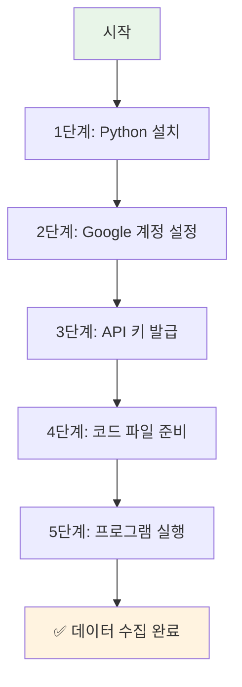

# 초보자용 YouTube API 완전 가이드
## 코딩을 모르는 사람도 따라할 수 있는 단계별 설명

Created: 2024년 12월  
Tags: YouTube API, 초보자 가이드, 단계별 설명, Python 설치
Author: AI Assistant

---

## 🎯 **이 가이드로 할 수 있는 것**

- YouTube Shorts 링크만 있으면 **영상 정보를 자동으로 수집**
- **제목, 설명, 조회수, 좋아요 수, 댓글 내용** 등 모든 정보 추출
- **Excel 파일로 저장**하여 분석 가능
- **완전 무료**로 사용 (Google 제공 무료 할당량 내에서)

---

## 📋 **전체 과정 개요**



**예상 소요 시간**: 약 30-45분 (처음 설정 시)  
**필요한 것**: 컴퓨터, 인터넷 연결, Google 계정

---

## 🖥️ **1단계: Python 설치하기**

### **1-1. Python이 무엇인가요?**
- Python은 프로그래밍 언어입니다
- 우리가 만들 프로그램이 Python으로 작성되어 있어서 필요합니다
- **무료**이고 **안전**합니다

### **1-2. Windows에서 Python 설치**

#### **설치 방법:**
1. **웹브라우저**에서 https://www.python.org 접속
2. **"Downloads"** 클릭
3. **"Download Python 3.12.x"** (버전은 달라질 수 있음) 클릭
4. 다운로드된 파일을 **더블클릭**하여 실행

#### **설치할 때 중요한 설정:**
```
⚠️ 매우 중요: 설치 시 반드시 체크해야 할 항목
┌─────────────────────────────────────┐
│ ☑️ Add Python to PATH               │  ← 이것을 꼭 체크하세요!
│ ☐ Install launcher for all users   │
└─────────────────────────────────────┘
```

5. **"Install Now"** 클릭
6. 설치 완료 후 **"Close"** 클릭

### **1-3. Mac에서 Python 설치**

#### **방법 1: 공식 홈페이지**
1. https://www.python.org 접속
2. "Downloads" → "Download Python 3.12.x" 클릭
3. 다운로드된 `.pkg` 파일 실행
4. 안내에 따라 설치

#### **방법 2: Homebrew (추천)**
1. **터미널** 앱 실행
2. 아래 명령어 복사해서 붙여넣기:
```bash
/bin/bash -c "$(curl -fsSL https://raw.githubusercontent.com/Homebrew/install/HEAD/install.sh)"
```
3. 설치 완료 후:
```bash
brew install python
```

### **1-4. 설치 확인하기**

#### **Windows:**
1. **"시작"** 버튼 클릭
2. **"cmd"** 또는 **"명령 프롬프트"** 검색하여 실행
3. 아래 명령어 입력:
```
python --version
```
4. `Python 3.12.x` 같은 메시지가 나오면 성공!

#### **Mac:**
1. **"터미널"** 앱 실행 (Spotlight에서 "터미널" 검색)
2. 아래 명령어 입력:
```bash
python3 --version
```
3. `Python 3.12.x` 같은 메시지가 나오면 성공!

---

## 🔑 **2단계: Google Cloud Console 설정**

### **2-1. Google 계정 준비**
- Gmail 계정이 필요합니다
- 없으시면 https://accounts.google.com 에서 무료로 만드세요

### **2-2. Google Cloud Console 접속**
1. 웹브라우저에서 https://console.cloud.google.com 접속
2. Google 계정으로 로그인

### **2-3. 새 프로젝트 만들기**

#### **화면 설명:**
```
┌─────────────────────────────────────────┐
│ Google Cloud Console                     │
│ ┌─────────────────┐                     │
│ │ 프로젝트 선택 ▼ │  ← 여기를 클릭     │
│ └─────────────────┘                     │
└─────────────────────────────────────────┘
```

#### **단계별 진행:**
1. 화면 상단의 **"프로젝트 선택"** 드롭다운 클릭
2. 팝업창에서 **"새 프로젝트"** 클릭
3. **프로젝트 이름** 입력 (예: "YouTube-Data-Collection")
4. **"만들기"** 클릭
5. 프로젝트 생성까지 **1-2분** 대기

---

## 🔐 **3단계: YouTube Data API 활성화 및 API 키 발급**

### **3-1. API 라이브러리에서 YouTube Data API 찾기**

1. 좌측 메뉴에서 **"API 및 서비스"** → **"라이브러리"** 클릭
2. 검색창에 **"YouTube Data API v3"** 입력
3. **"YouTube Data API v3"** 클릭
4. **"사용 설정"** 클릭

### **3-2. API 키 만들기**

1. 좌측 메뉴에서 **"API 및 서비스"** → **"사용자 인증 정보"** 클릭
2. 상단의 **"+ 사용자 인증 정보 만들기"** 클릭
3. **"API 키"** 선택
4. API 키가 생성됩니다 (예: `AIzaSyDxxxxxxxxxxxxxxxxxxxxxxxxxxxxx`)

### **3-3. API 키 보안 설정 (선택사항)**

```
⚠️ 보안 알림
생성된 API 키는 다른 사람과 공유하지 마세요!
```

1. 생성된 API 키 옆의 **"편집"** (연필 모양) 클릭
2. **"API 제한사항"** 섹션에서 **"키 제한"** 선택
3. **"YouTube Data API v3"** 체크
4. **"저장"** 클릭

### **3-4. API 키 복사하여 안전한 곳에 저장**

```
📝 메모장에 저장해두세요:
API 키: AIzaSyDxxxxxxxxxxxxxxxxxxxxxxxxxxxxx
생성일: 2024년 12월 XX일
```

---

## 📁 **4단계: 프로그램 파일 준비**

### **4-1. 작업 폴더 만들기**

#### **Windows:**
1. **바탕화면**에서 오른쪽 클릭
2. **"새로 만들기"** → **"폴더"** 클릭
3. 폴더 이름: **"YouTube_Data_Collector"**

#### **Mac:**
1. **Finder** 실행
2. **바탕화면** 또는 **문서** 폴더로 이동
3. 오른쪽 클릭 → **"새 폴더"**
4. 폴더 이름: **"YouTube_Data_Collector"**

### **4-2. 필요한 라이브러리 설치**

#### **Windows:**
1. **"시작"** → **"cmd"** 또는 **"명령 프롬프트"** 실행
2. 아래 명령어 복사해서 붙여넣기:
```cmd
pip install google-api-python-client pandas openpyxl
```

#### **Mac:**
1. **"터미널"** 실행
2. 아래 명령어 복사해서 붙여넣기:
```bash
pip3 install google-api-python-client pandas openpyxl
```

3. 설치 중 에러가 나면 이 명령어 시도:
```bash
python3 -m pip install google-api-python-client pandas openpyxl
```

### **4-3. 메인 프로그램 파일 만들기**

1. **메모장** (Windows) 또는 **TextEdit** (Mac) 실행
2. 아래 코드를 **완전히 복사**해서 붙여넣기:

```python
#!/usr/bin/env python3
# -*- coding: utf-8 -*-
"""
YouTube Shorts 데이터 수집기 - 초보자용
사용법: 이 파일을 실행하고 안내에 따라 진행하세요.
"""

import re
import pandas as pd
from datetime import datetime
import json

try:
    from googleapiclient.discovery import build
    print("✅ Google API 라이브러리 로드 성공")
except ImportError:
    print("❌ Google API 라이브러리가 설치되지 않았습니다.")
    print("다음 명령어를 실행하세요: pip install google-api-python-client")
    input("계속하려면 Enter를 누르세요...")
    exit()

class YouTubeShortsCollector:
    def __init__(self):
        self.api_key = None
        self.youtube = None
        self.results = []
    
    def setup_api_key(self):
        """API 키 설정"""
        print("\n" + "="*60)
        print("🔑 YouTube Data API 키 설정")
        print("="*60)
        
        while True:
            api_key = input("\n📋 API 키를 입력하세요: ").strip()
            
            if not api_key:
                print("❌ API 키를 입력해주세요.")
                continue
            
            if not api_key.startswith('AIza'):
                print("❌ 올바르지 않은 API 키 형식입니다.")
                print("💡 API 키는 'AIza'로 시작해야 합니다.")
                continue
            
            try:
                # API 키 테스트
                youtube = build('youtube', 'v3', developerKey=api_key)
                # 간단한 테스트 요청
                test_response = youtube.videos().list(
                    part='snippet',
                    id='dQw4w9WgXcQ'  # 테스트용 비디오 ID
                ).execute()
                
                self.api_key = api_key
                self.youtube = youtube
                print("✅ API 키가 정상적으로 설정되었습니다!")
                break
                
            except Exception as e:
                print(f"❌ API 키 오류: {e}")
                print("💡 API 키를 다시 확인해주세요.")
                continue
    
    def extract_video_id(self, url):
        """YouTube URL에서 비디오 ID 추출"""
        patterns = [
            r'(?:youtube\.com/shorts/)([^&\n?#]+)',
            r'(?:youtube\.com/watch\?v=)([^&\n?#]+)',
            r'(?:youtu\.be/)([^&\n?#]+)'
        ]
        
        for pattern in patterns:
            match = re.search(pattern, url)
            if match:
                return match.group(1)
        return None
    
    def get_video_info(self, video_id):
        """비디오 정보 수집"""
        try:
            # 비디오 기본 정보
            video_response = self.youtube.videos().list(
                part='snippet,statistics,contentDetails',
                id=video_id
            ).execute()
            
            if not video_response['items']:
                return None
            
            video = video_response['items'][0]
            snippet = video['snippet']
            statistics = video['statistics']
            
            # 댓글 수집
            comments = self.get_comments(video_id)
            
            # 채널 정보
            channel_info = self.get_channel_info(snippet['channelId'])
            
            return {
                'video_id': video_id,
                'title': snippet.get('title', ''),
                'description': snippet.get('description', '')[:500] + '...' if len(snippet.get('description', '')) > 500 else snippet.get('description', ''),
                'channel_title': snippet.get('channelTitle', ''),
                'published_at': snippet.get('publishedAt', ''),
                'view_count': int(statistics.get('viewCount', 0)),
                'like_count': int(statistics.get('likeCount', 0)),
                'comment_count': int(statistics.get('commentCount', 0)),
                'duration': video['contentDetails'].get('duration', ''),
                'tags': ', '.join(snippet.get('tags', [])),
                'category_id': snippet.get('categoryId', ''),
                'subscriber_count': channel_info.get('subscriber_count', 0) if channel_info else 0,
                'comments': comments
            }
            
        except Exception as e:
            print(f"❌ 비디오 정보 수집 오류: {e}")
            return None
    
    def get_comments(self, video_id, max_comments=20):
        """댓글 수집"""
        comments = []
        try:
            response = self.youtube.commentThreads().list(
                part='snippet',
                videoId=video_id,
                maxResults=max_comments,
                order='relevance'
            ).execute()
            
            for item in response['items']:
                comment = item['snippet']['topLevelComment']['snippet']
                comments.append({
                    'author': comment['authorDisplayName'],
                    'text': comment['textDisplay'],
                    'like_count': comment['likeCount'],
                    'published_at': comment['publishedAt']
                })
            
        except Exception as e:
            print(f"⚠️ 댓글 수집 중 오류 (건너뜀): {e}")
        
        return comments
    
    def get_channel_info(self, channel_id):
        """채널 정보 수집"""
        try:
            response = self.youtube.channels().list(
                part='statistics',
                id=channel_id
            ).execute()
            
            if response['items']:
                stats = response['items'][0]['statistics']
                return {
                    'subscriber_count': int(stats.get('subscriberCount', 0))
                }
        except:
            pass
        return None
    
    def collect_data(self):
        """데이터 수집 메인 함수"""
        print("\n" + "="*60)
        print("📊 YouTube Shorts 데이터 수집 시작")
        print("="*60)
        print("💡 팁: 'q' 입력 시 수집을 종료하고 결과를 저장합니다.")
        
        while True:
            print(f"\n현재 수집된 영상: {len(self.results)}개")
            url = input("\n🔗 YouTube Shorts URL을 입력하세요 (종료: q): ").strip()
            
            if url.lower() == 'q':
                break
            
            if not url:
                print("❌ URL을 입력해주세요.")
                continue
            
            video_id = self.extract_video_id(url)
            if not video_id:
                print("❌ 올바르지 않은 YouTube URL입니다.")
                continue
            
            print(f"🔍 영상 정보 수집 중... (ID: {video_id})")
            
            video_info = self.get_video_info(video_id)
            if video_info:
                self.results.append(video_info)
                print(f"✅ 수집 완료: {video_info['title'][:50]}...")
                print(f"   📊 조회수: {video_info['view_count']:,}")
                print(f"   👍 좋아요: {video_info['like_count']:,}")
                print(f"   💬 댓글: {video_info['comment_count']:,}")
            else:
                print("❌ 영상 정보를 가져올 수 없습니다.")
    
    def save_results(self):
        """결과 저장"""
        if not self.results:
            print("\n❌ 저장할 데이터가 없습니다.")
            return
        
        print(f"\n💾 {len(self.results)}개 영상 데이터 저장 중...")
        
        # Excel 파일로 저장
        try:
            # 기본 정보 데이터프레임
            basic_data = []
            for item in self.results:
                basic_data.append({
                    '영상 ID': item['video_id'],
                    '제목': item['title'],
                    '채널명': item['channel_title'],
                    '업로드 날짜': item['published_at'],
                    '조회수': item['view_count'],
                    '좋아요 수': item['like_count'],
                    '댓글 수': item['comment_count'],
                    '구독자 수': item['subscriber_count'],
                    '태그': item['tags'],
                    '설명': item['description']
                })
            
            # 댓글 데이터프레임
            comment_data = []
            for item in self.results:
                for comment in item['comments']:
                    comment_data.append({
                        '영상 ID': item['video_id'],
                        '영상 제목': item['title'],
                        '댓글 작성자': comment['author'],
                        '댓글 내용': comment['text'],
                        '댓글 좋아요': comment['like_count'],
                        '댓글 작성일': comment['published_at']
                    })
            
            # 파일명 생성
            timestamp = datetime.now().strftime("%Y%m%d_%H%M%S")
            filename = f"YouTube_Shorts_Data_{timestamp}.xlsx"
            
            # Excel 파일 저장
            with pd.ExcelWriter(filename, engine='openpyxl') as writer:
                pd.DataFrame(basic_data).to_excel(writer, sheet_name='영상정보', index=False)
                if comment_data:
                    pd.DataFrame(comment_data).to_excel(writer, sheet_name='댓글정보', index=False)
            
            print(f"✅ Excel 파일 저장 완료: {filename}")
            
            # JSON 파일도 저장 (백업용)
            json_filename = f"YouTube_Shorts_Data_{timestamp}.json"
            with open(json_filename, 'w', encoding='utf-8') as f:
                json.dump(self.results, f, ensure_ascii=False, indent=2)
            
            print(f"✅ JSON 파일 저장 완료: {json_filename}")
            
        except Exception as e:
            print(f"❌ 파일 저장 오류: {e}")

def main():
    """메인 함수"""
    print("🎬 YouTube Shorts 데이터 수집기")
    print("=" * 60)
    print("📝 이 프로그램으로 할 수 있는 것:")
    print("   • YouTube Shorts 영상 정보 수집")
    print("   • 제목, 조회수, 좋아요, 댓글 등 상세 정보")
    print("   • Excel 파일로 자동 저장")
    print("=" * 60)
    
    collector = YouTubeShortsCollector()
    
    # API 키 설정
    collector.setup_api_key()
    
    # 데이터 수집
    collector.collect_data()
    
    # 결과 저장
    collector.save_results()
    
    print("\n🎉 프로그램 실행 완료!")
    print("📁 생성된 파일을 확인해보세요.")
    input("\n종료하려면 Enter를 누르세요...")

if __name__ == "__main__":
    main()
```

3. 파일을 저장할 때:
   - **Windows**: `youtube_collector.py` 이름으로 저장
   - **Mac**: `youtube_collector.py` 이름으로 저장
   - **중요**: 파일 형식을 **"모든 파일"** 또는 **"Python 파일"**로 선택

### **4-4. 파일 저장 위치 확인**
```
📁 폴더 구조 확인:
YouTube_Data_Collector/
└── youtube_collector.py  ← 이 파일이 있어야 합니다
```

---

## 🚀 **5단계: 프로그램 실행하기**

### **5-1. 명령 프롬프트/터미널에서 폴더로 이동**

#### **Windows:**
1. **"시작"** → **"cmd"** 실행
2. 아래 명령어 입력 (바탕화면에 폴더를 만든 경우):
```cmd
cd Desktop\YouTube_Data_Collector
```

#### **Mac:**
1. **"터미널"** 실행
2. 아래 명령어 입력 (바탕화면에 폴더를 만든 경우):
```bash
cd Desktop/YouTube_Data_Collector
```

### **5-2. 프로그램 실행**

#### **Windows:**
```cmd
python youtube_collector.py
```

#### **Mac:**
```bash
python3 youtube_collector.py
```

### **5-3. 프로그램 사용법**

#### **첫 실행 시 화면:**
```
🎬 YouTube Shorts 데이터 수집기
============================================================
📝 이 프로그램으로 할 수 있는 것:
   • YouTube Shorts 영상 정보 수집
   • 제목, 조회수, 좋아요, 댓글 등 상세 정보
   • Excel 파일로 자동 저장
============================================================

🔑 YouTube Data API 키 설정
============================================================

📋 API 키를 입력하세요: 
```

1. **3단계**에서 복사해둔 API 키를 붙여넣기
2. **Enter** 키 누르기

#### **데이터 수집 화면:**
```
📊 YouTube Shorts 데이터 수집 시작
============================================================
💡 팁: 'q' 입력 시 수집을 종료하고 결과를 저장합니다.

현재 수집된 영상: 0개

🔗 YouTube Shorts URL을 입력하세요 (종료: q): 
```

3. YouTube Shorts URL 붙여넣기 (예: `https://www.youtube.com/shorts/abcd1234`)
4. **Enter** 키 누르기
5. 더 많은 URL 추가하거나 **'q'** 입력하여 종료

#### **결과 저장:**
```
💾 3개 영상 데이터 저장 중...
✅ Excel 파일 저장 완료: YouTube_Shorts_Data_20241215_143022.xlsx
✅ JSON 파일 저장 완료: YouTube_Shorts_Data_20241215_143022.json

🎉 프로그램 실행 완료!
📁 생성된 파일을 확인해보세요.
```

---

## 📊 **6단계: 결과 파일 확인하기**

### **6-1. 생성되는 파일들**

```
📁 YouTube_Data_Collector/
├── youtube_collector.py
├── YouTube_Shorts_Data_20241215_143022.xlsx  ← Excel 파일
└── YouTube_Shorts_Data_20241215_143022.json  ← JSON 백업 파일
```

### **6-2. Excel 파일 내용**

#### **"영상정보" 시트:**
| 영상 ID | 제목 | 채널명 | 업로드 날짜 | 조회수 | 좋아요 수 | 댓글 수 | 구독자 수 | 태그 | 설명 |
|---------|------|--------|-------------|---------|-----------|---------|-----------|------|------|
| abcd1234 | 재미있는 쇼츠 영상 | 인기채널 | 2024-12-15 | 1,250,000 | 45,000 | 1,200 | 500,000 | 재미,웃김,viral | 이 영상은... |

#### **"댓글정보" 시트:**
| 영상 ID | 영상 제목 | 댓글 작성자 | 댓글 내용 | 댓글 좋아요 | 댓글 작성일 |
|---------|-----------|-------------|-----------|-------------|-------------|
| abcd1234 | 재미있는 쇼츠 영상 | 사용자123 | 정말 재미있어요! | 15 | 2024-12-15 |

---

## ⚠️ **문제 해결 가이드**

### **자주 발생하는 오류와 해결 방법**

#### **1. "pip가 인식되지 않습니다" 오류**
```
'pip'은(는) 내부 또는 외부 명령, 실행할 수 있는 프로그램, 또는
배치 파일이 아닙니다.
```
**해결 방법:**
- Python 재설치 시 **"Add Python to PATH"** 체크 확인
- 또는 `python -m pip install 패키지명` 사용

#### **2. "ModuleNotFoundError" 오류**
```
ModuleNotFoundError: No module named 'googleapiclient'
```
**해결 방법:**
```bash
pip install google-api-python-client pandas openpyxl
```

#### **3. "API 키 오류" 메시지**
```
❌ API 키 오류: The request cannot be completed because you have exceeded your quota.
```
**해결 방법:**
- 일일 할당량 초과 → 다음 날 다시 시도
- 또는 새 Google 계정으로 다른 API 키 발급

#### **4. "영상을 가져올 수 없습니다" 오류**
**가능한 원인:**
- 비공개 영상
- 지역 제한 영상
- 삭제된 영상

**해결 방법:**
- 다른 공개 영상 URL로 시도

#### **5. Excel 파일이 열리지 않는 경우**
**해결 방법:**
- Microsoft Excel 또는 Google Sheets에서 열기
- LibreOffice Calc (무료) 사용

---

## 💡 **사용 팁과 주의사항**

### **✅ 효과적인 사용법**

1. **URL 수집 준비**
   - 분석하고 싶은 Shorts URL을 미리 메모장에 정리
   - 한 번에 10-20개씩 처리 권장

2. **정기적인 백업**
   - 생성된 Excel 파일을 안전한 곳에 백업
   - 중요한 데이터는 여러 장소에 보관

3. **API 할당량 관리**
   - 하루에 약 100-200개 영상 정보 수집 가능
   - 할당량 초과 시 다음 날 다시 시도

### **⚠️ 주의사항**

1. **API 키 보안**
   ```
   🚨 절대 하지 말아야 할 것:
   • API 키를 다른 사람과 공유
   • API 키를 공개 게시판에 올리기
   • API 키를 이메일로 전송
   ```

2. **이용약관 준수**
   - 수집한 데이터는 개인적 용도로만 사용
   - 상업적 목적으로 재배포 금지
   - YouTube 이용약관 준수

3. **적정한 사용량**
   - 대량 수집보다는 필요한 만큼만
   - 서버에 과부하를 주지 않도록 적당한 간격으로 사용

---

## 🎯 **다음 단계 및 발전 방향**

### **기본 사용에 익숙해진 후:**

1. **데이터 분석**
   - Excel의 차트 기능으로 조회수 분석
   - 댓글 키워드 분석으로 트렌드 파악

2. **자동화 개선**
   - URL 목록을 파일에서 읽어오기
   - 정기적 자동 수집 설정

3. **추가 기능**
   - 경쟁사 분석
   - 트렌드 키워드 분석
   - 성과 리포트 자동 생성

### **학습 자료**

- **YouTube Data API 공식 문서**: https://developers.google.com/youtube/v3
- **Python 기초 학습**: https://www.python.org/about/gettingstarted/
- **Excel 데이터 분석**: Microsoft Learn 또는 YouTube 튜토리얼

---

## 📞 **도움이 필요할 때**

### **자주 묻는 질문**

**Q: 프로그램이 멈춘 것 같아요**
A: 네트워크 연결을 확인하고, Ctrl+C로 종료 후 다시 실행해보세요.

**Q: 더 많은 댓글을 수집하고 싶어요**
A: 코드에서 `max_comments=20` 부분을 더 큰 숫자로 변경하세요.

**Q: 다른 형태의 YouTube URL도 가능한가요?**
A: 네, Shorts, 일반 영상, 공유 링크 모두 지원합니다.

### **추가 지원**

이 가이드를 따라 하면서 문제가 생기면:
1. 오류 메시지를 정확히 복사해두세요
2. 어느 단계에서 문제가 발생했는지 기록하세요
3. 필요시 문의하시면 도움을 드릴 수 있습니다

---

**🎉 축하합니다!** 이제 YouTube Shorts 데이터를 자동으로 수집할 수 있는 나만의 도구를 가지게 되었습니다. 이 도구를 활용하여 콘텐츠 분석, 트렌드 연구, 마케팅 인사이트 도출 등 다양한 목적으로 활용해보세요!
