# AI 스타트업 전체 비즈니스 로직 시각화

> 이 문서는 AI 기반 스타트업의 Phase 1(마케팅 에이전시)에서 Phase 2(AI Agent 플랫폼)로의 진화 과정과 핵심 비즈니스 로직을 시각적으로 분석합니다.

---

## 🎯 전체 비즈니스 아키텍처 개요

### 핵심 컨셉
- **Phase 1**: AI 마케팅 에이전시 & 콘텐츠 팩토리 (18개월)
- **Phase 2**: Personal AI Agent 플랫폼 (B2C + B2B) (3년)
- **전환 전략**: 검증된 노하우 → 플랫폼 확장 → 시장 리더십

---

## 1. Phase별 접근법 비교 (Business Phase Comparison)

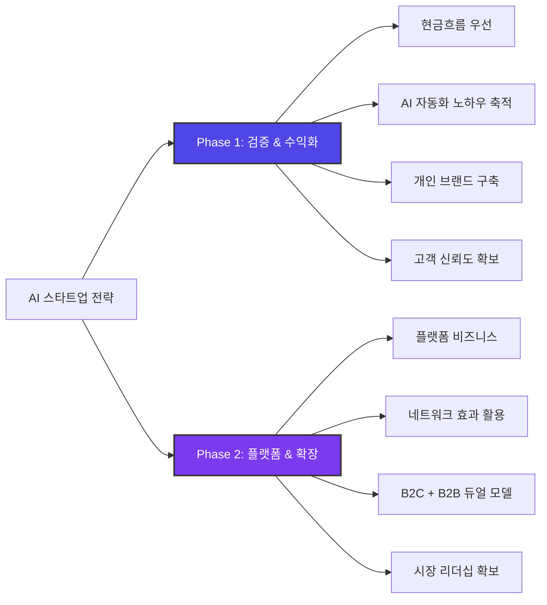

---

## 2. 비즈니스 모델 갭 맵핑 (Business Model Gap Mapping)

### 2.1 전체 갭 맵핑 (Phase 1 vs Phase 2)

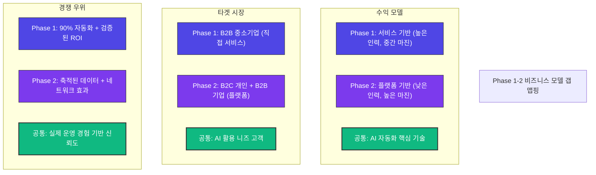

### 2.2 갭 해소 포지셔닝 맵

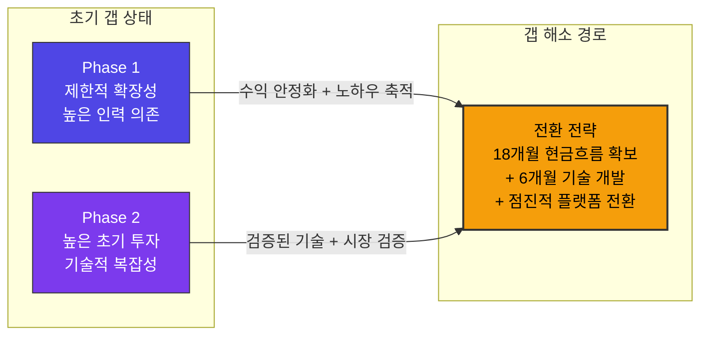

---

## 3. 시간 기대치 타임라인 비교 (Timeline Expectation)

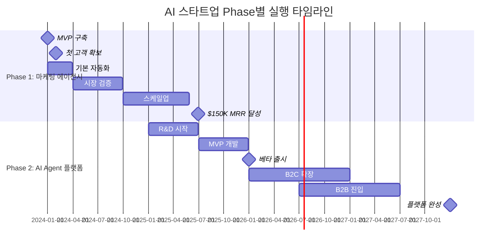

---

## 4. 의사결정 프로세스 순서도 (Strategic Decision Flow)

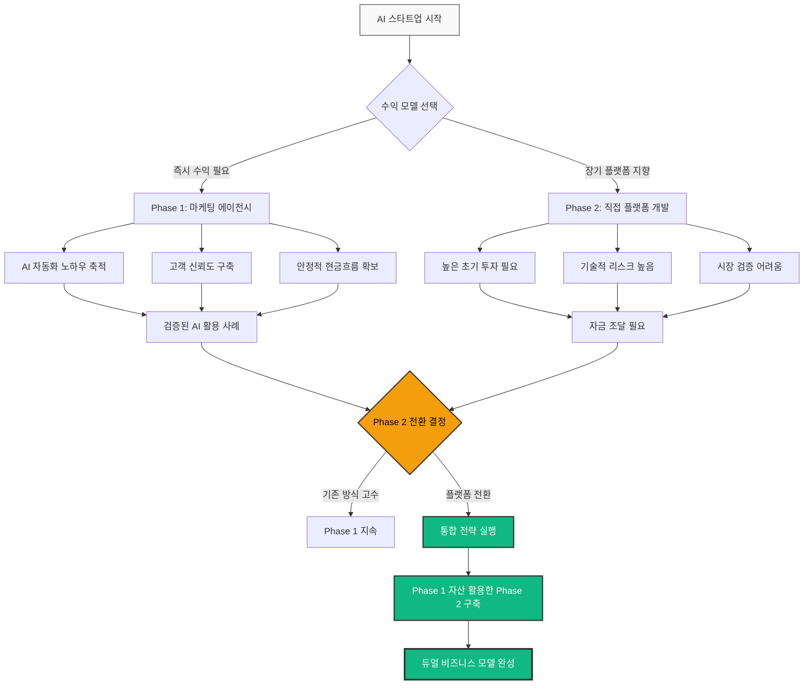

---

## 5. 비즈니스 모델 계층 구조 (Business Model Hierarchy)

### 5.1. 계층 구조 플로우차트

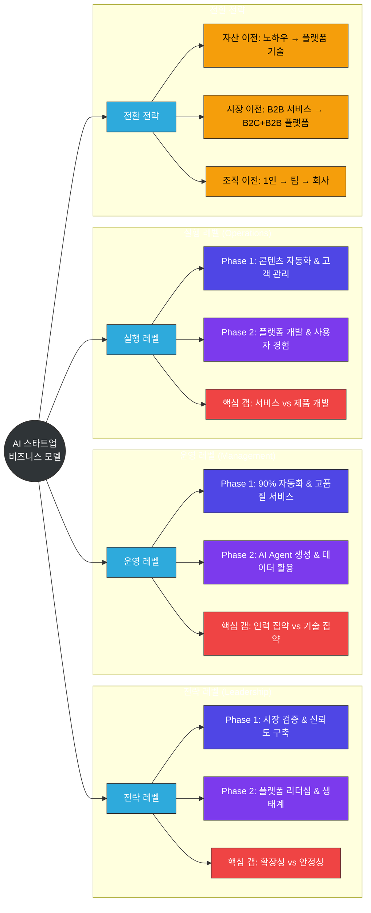

---

## 6. Phase 전환 상태 다이어그램 (Phase Transition State)

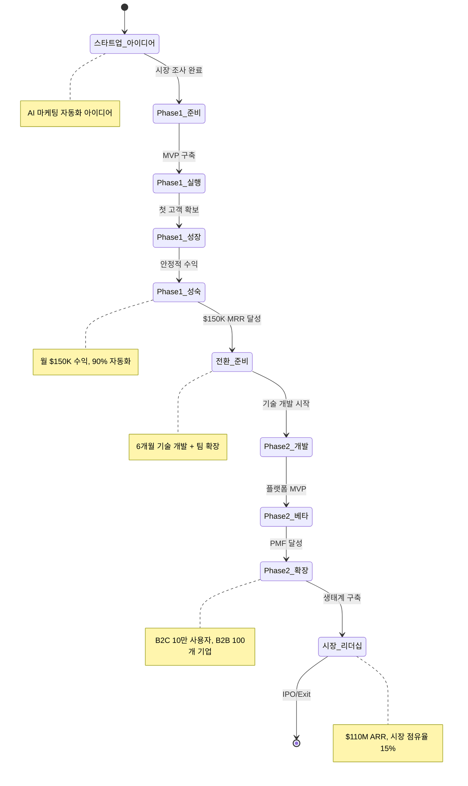

---

## 7. 수익 모델 아키텍처 (Revenue Model Architecture)

```mermaid
graph TD
    A["듀얼 수익 모델"] --> B["Phase 1: 서비스 수익"]
    A --> C["Phase 2: 플랫폼 수익"]
    A --> D["Phase 1+2: 시너지 수익"]
    A --> E["지속 가능성 전략"]
    
    subgraph "Phase 1 서비스 수익"
        B --> B1["Done-for-You Agency<br>$2K-10K/월 (70%)"]
        B --> B2["Consulting & Strategy<br>$200/시간 (20%)"]
        B --> B3["SaaS Tools<br>$99-999/월 (10%)"]
    end
    
    subgraph "Phase 2 플랫폼 수익"
        C --> C1["B2C 구독<br>$29-199/월"]
        C --> C2["B2B 플랫폼<br>$5K-50K/월"]
        C --> C3["성과 기반 과금<br>절감액의 30%"]
        C --> C4["마켓플레이스<br>거래 수수료 15%"]
    end
    
    subgraph "시너지 수익"
        D --> D1["Phase 1 고객의 Phase 2 업그레이드"]
        D --> D2["Phase 2 데이터를 활용한 Phase 1 서비스"]
        D --> D3["통합 패키지 할인 제공"]
    end
    
    subgraph "지속 가능성"
        E --> E1["네트워크 효과<br>사용자↑ → 가치↑"]
        E --> E2["데이터 모트<br>더 나은 AI 모델"]
        E --> E3["생태계 확장<br>API, 파트너십"]
    end
    
    style A fill:#f5f5f5,stroke:#333,stroke-width:2px
    style D1 fill:#10B981,color:#ffffff,stroke:#333,stroke-width:2px
    style D2 fill:#10B981,color:#ffffff,stroke:#333,stroke-width:2px
    style D3 fill:#10B981,color:#ffffff,stroke:#333,stroke-width:2px
```

---

## 8. 경쟁 우위 생태계 (Competitive Advantage Ecosystem)

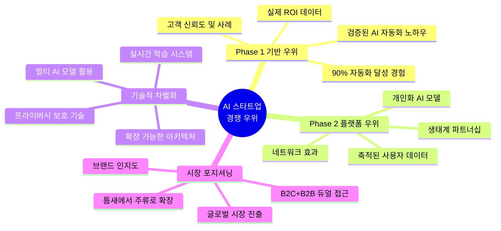

---

## 9. 전환 전후 SWOT 비교 (Phase Transition SWOT)

### Phase 1 SWOT 분석

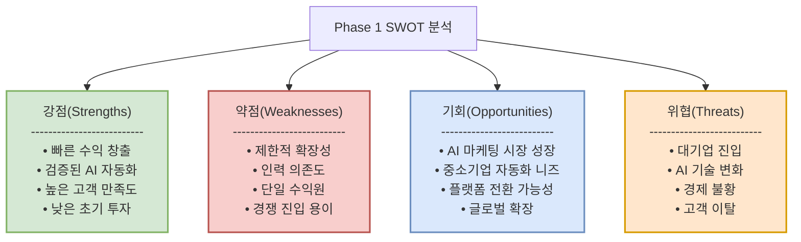

### Phase 2 SWOT 분석 (전환 후)

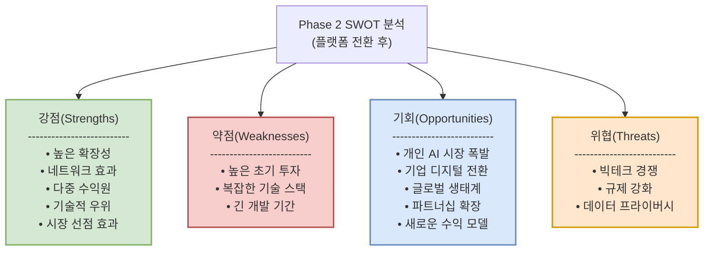

---

## 10. 실행 로드맵과 전환점 시각화 (Implementation Roadmap)

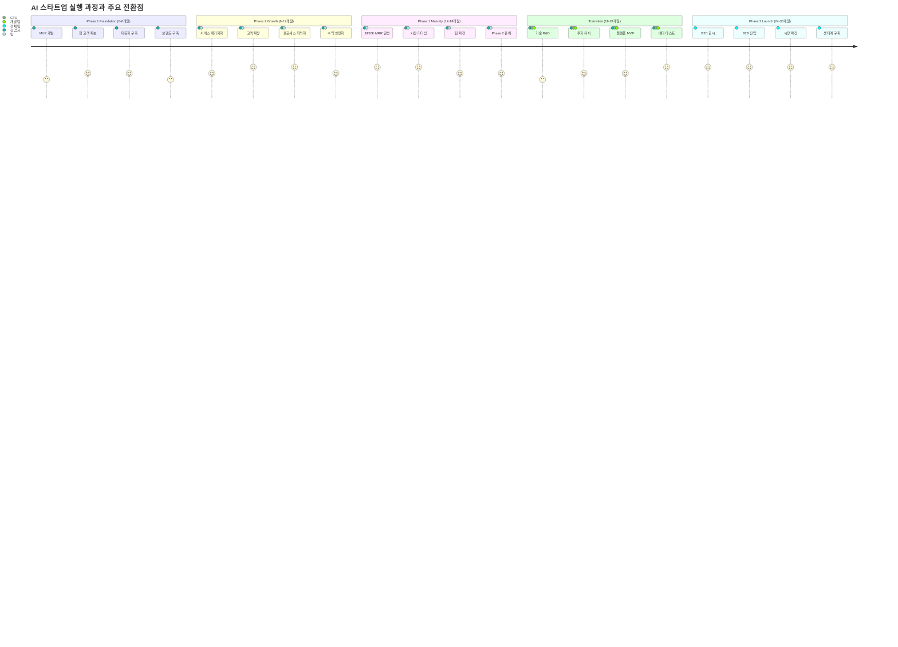

---

## 11. 핵심 성공 지표 상호작용 (Key Success Metrics Interaction)

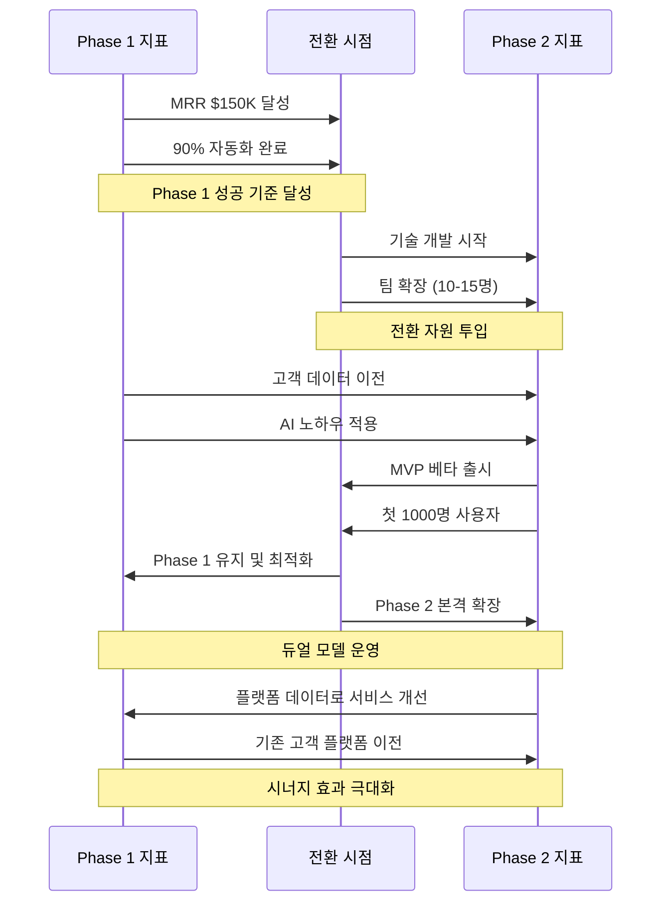

---

## 12. 추가 전략적 시각화

### 12.1 시장 포지셔닝 사분면

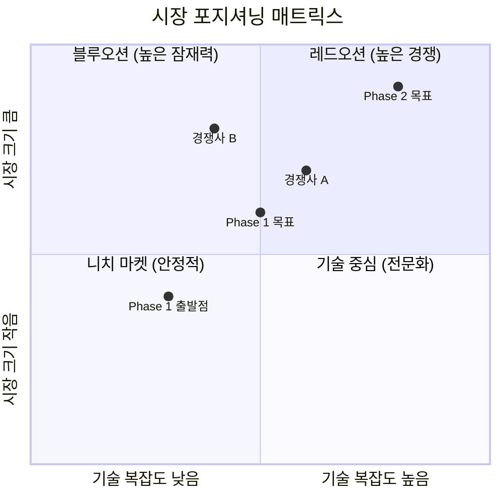

### 12.2 기술 스택 진화

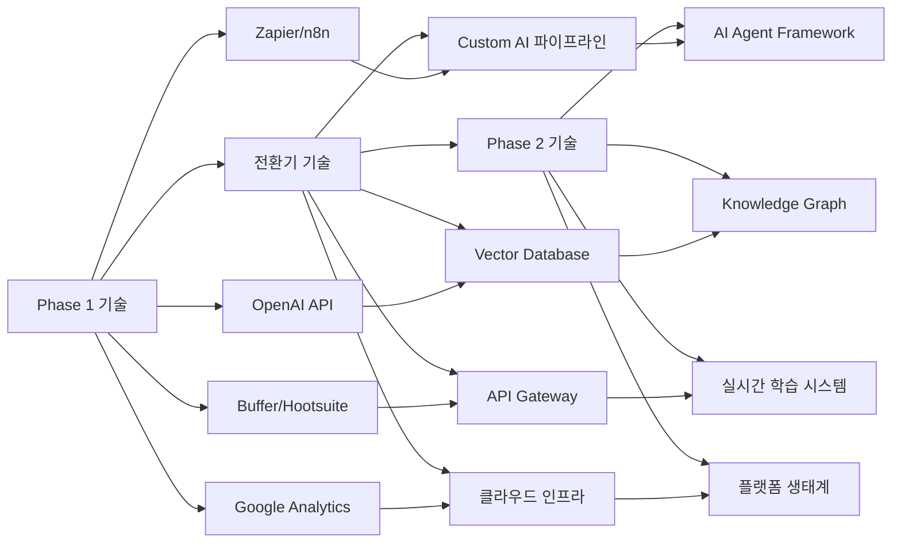

---

## 13. 갭 해결 경로 맵 (Strategic Gap Resolution)

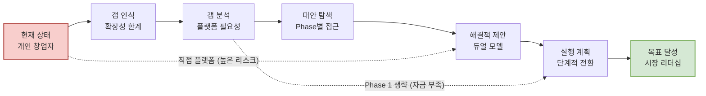

---

## 14. 핵심 용어 통일표 (Key Terminology Alignment)

| 용어 | Phase 1 정의 | Phase 2 정의 | 통합 정의 |
|------|-------------|-------------|----------|
| **AI 자동화** | 마케팅 업무의 90% 자동 처리 | 개인/기업 업무의 지능적 자동화 | 반복 업무를 AI가 학습하여 자율 실행 |
| **고객 가치** | 시간 절약 + 비용 절감 + ROI 향상 | 생산성 + 개인 성장 + 문제 해결 | 인간의 핵심 업무 집중을 위한 AI 지원 |
| **플랫폼** | 내부 도구 및 워크플로우 | 사용자가 AI Agent를 생성/사용하는 생태계 | AI 기반 문제 해결을 위한 통합 환경 |
| **확장성** | 고객 수 증가에 따른 수익 증가 | 사용자 증가가 전체 가치 증대로 연결 | 네트워크 효과를 통한 기하급수적 성장 |
| **성공 지표** | MRR, 고객 만족도, 자동화율 | ARR, 사용자 증가, 네트워크 효과 | 지속 가능한 가치 창출과 시장 영향력 |

---

## 15. 실행 우선순위 매트릭스

### 즉시 실행 (이번 주)
- [ ] **LinkedIn 콘텐츠 전략** 30일분 기획
- [ ] **첫 자동화 워크플로우** 구축 (Zapier + GPT)
- [ ] **타겟 고객 50명** 리스트 작성
- [ ] **YouTube 채널** 개설 및 첫 영상 기획

### 단기 실행 (1개월 내)
- [ ] **베타 고객 2명** 확보 및 서비스 제공
- [ ] **기본 서비스 패키지** 3개 정의
- [ ] **핵심 자동화 도구** 스택 완성
- [ ] **개인 브랜드** 신뢰도 구축

### 중기 실행 (3-6개월)
- [ ] **월 $15K MRR** 달성
- [ ] **5-8명 고객** 안정적 확보
- [ ] **자동화 수준 85%** 달성
- [ ] **Phase 2 기술 연구** 시작

### 장기 실행 (6-18개월)
- [ ] **월 $150K MRR** 달성
- [ ] **팀 확장** (5-8명)
- [ ] **Phase 2 MVP** 개발 완료
- [ ] **시장 리더십** 확보

---

## 📊 핵심 성공 지표 대시보드

### Phase 1 목표 (18개월)
| 지표 | 현재 | 6개월 목표 | 12개월 목표 | 18개월 목표 |
|------|-----|-----------|------------|------------|
| **MRR** | $0 | $15K | $60K | $150K |
| **고객 수** | 0 | 5명 | 12명 | 25명 |
| **자동화율** | 0% | 70% | 85% | 90% |
| **팀 규모** | 1명 | 2명 | 3명 | 5명 |
| **브랜드 인지도** | 낮음 | 중간 | 높음 | 업계 리더 |

### Phase 2 목표 (3년)
| 지표 | Year 1 | Year 2 | Year 3 |
|------|--------|--------|--------|
| **ARR** | $3M | $25M | $110M |
| **B2C 사용자** | 5K | 25K | 100K |
| **B2B 고객** | 5개 | 25개 | 100개 |
| **플랫폼 가치** | 기본 | 확장 | 생태계 |
| **시장 지위** | 진입 | 성장 | 리더 |

---

## 🚀 최종 실행 권장사항

### 성공 확률을 높이는 핵심 전략

1. **검증된 접근법**: Phase 1에서 확실한 성공 후 Phase 2 진행
2. **고객 중심**: 모든 단계에서 고객 가치 우선
3. **데이터 기반**: 의사결정은 실제 데이터와 성과로
4. **자동화 우선**: 처음부터 90% 자동화를 목표로
5. **장기 비전**: Phase 2를 염두에 둔 Phase 1 구축

### 핵심 차별화 요소

- **실제 운영 경험**: 직접 사용하며 검증된 시스템만 제공
- **90% 자동화**: 업계 최고 수준의 자동화 달성
- **듀얼 모델**: B2B 서비스에서 B2C+B2B 플랫폼으로 진화
- **네트워크 효과**: 사용자가 많을수록 더 가치 있는 플랫폼

이 시각화된 비즈니스 로직을 통해 AI 스타트업의 전체적인 전략과 실행 계획을 명확하게 파악하고, 각 단계별로 최적의 의사결정을 내릴 수 있습니다.

---

> 이 문서는 미팅분석 로직시각화 템플릿 v2.0을 기반으로 AI 스타트업의 전체 비즈니스 모델을 구조적으로 분석한 결과입니다. 모든 다이어그램은 Mermaid.js 문법을 사용하여 구현되었습니다.

