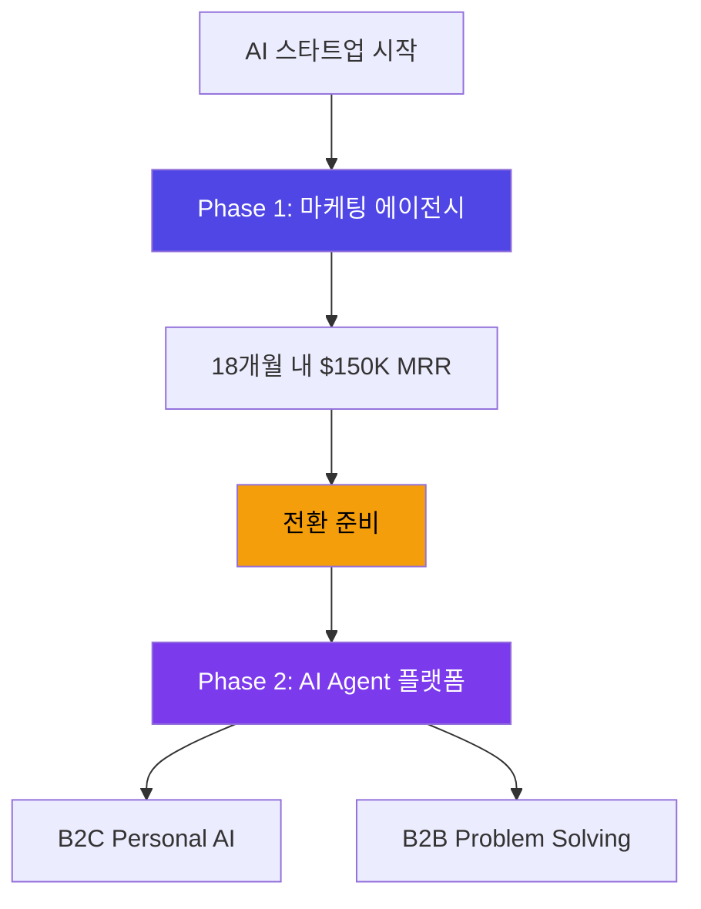
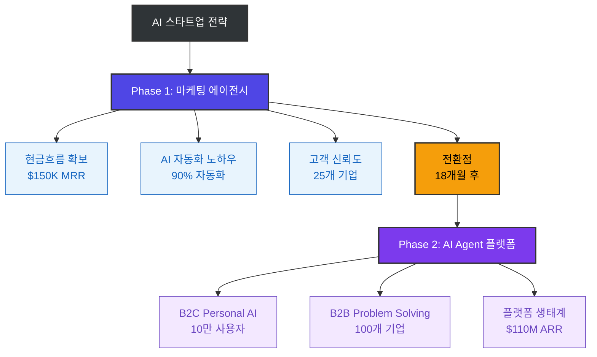
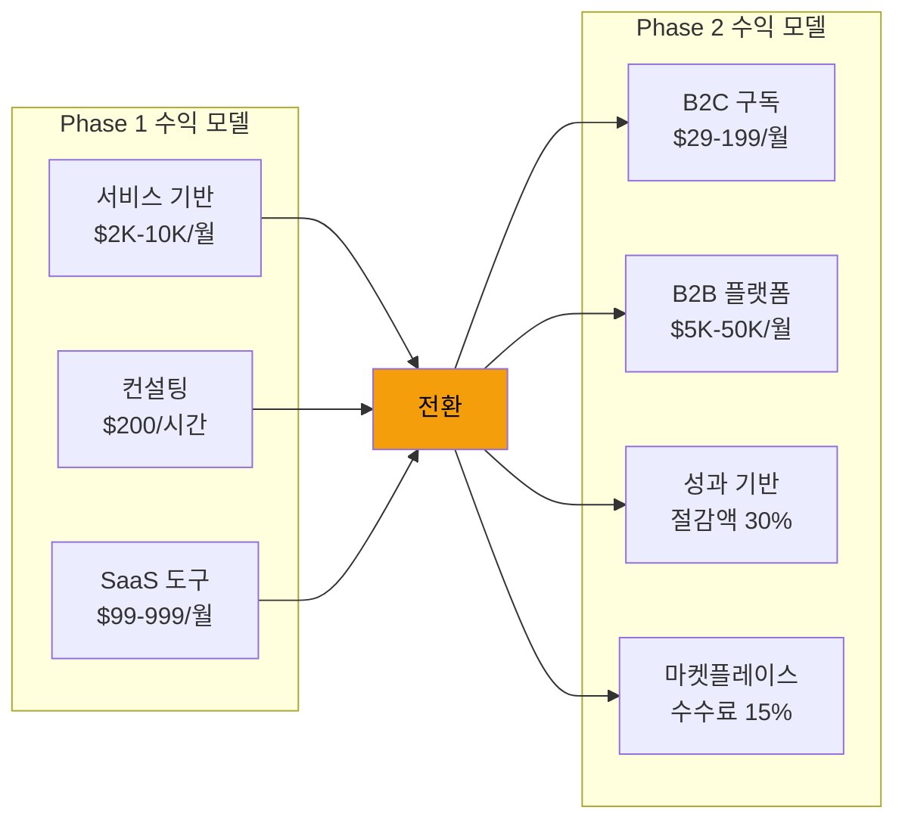
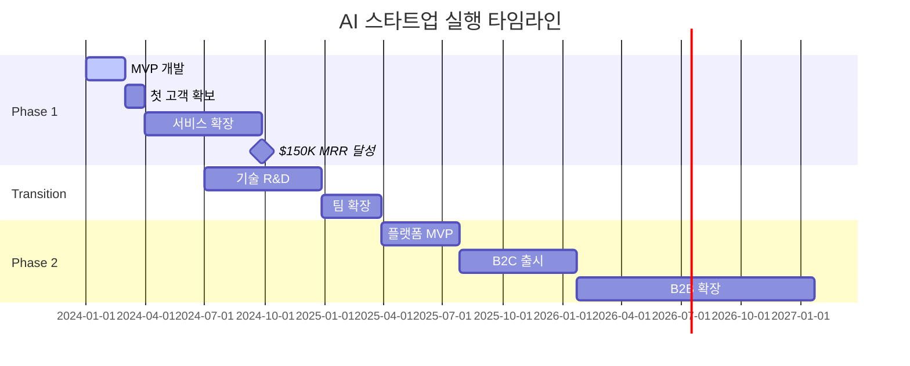
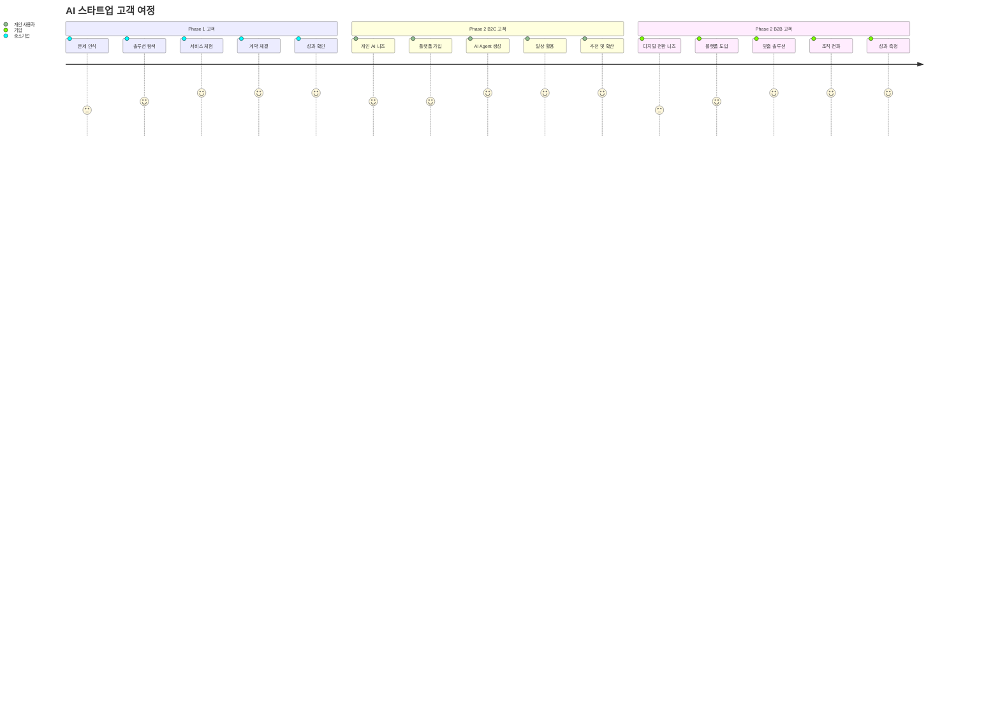

# Figma 자동화 스크립트 가이드

## 🤖 Python으로 Figma에 자동 다이어그램 생성

### 1. 필요한 라이브러리 설치
```bash
pip install requests
pip install python-figma
pip install mermaid-py
```

### 2. Figma API 설정
```python
import requests
import json

# Figma API 설정
FIGMA_TOKEN = "your_figma_personal_access_token"
FIGMA_FILE_KEY = "your_figma_file_key"

headers = {
    "X-Figma-Token": FIGMA_TOKEN,
    "Content-Type": "application/json"
}
```

### 3. 다이어그램 자동 생성 스크립트
```python
def create_business_model_diagram():
    """AI 스타트업 비즈니스 모델 다이어그램 자동 생성"""
    
    # Phase 1 컴포넌트 생성
    phase1_data = {
        "name": "Phase 1: AI 마케팅 에이전시",
        "type": "RECTANGLE",
        "fills": [{"type": "SOLID", "color": {"r": 0.31, "g": 0.27, "b": 0.90}}],
        "x": 100,
        "y": 100,
        "width": 300,
        "height": 150
    }
    
    # Phase 2 컴포넌트 생성
    phase2_data = {
        "name": "Phase 2: AI Agent 플랫폼",
        "type": "RECTANGLE", 
        "fills": [{"type": "SOLID", "color": {"r": 0.49, "g": 0.24, "b": 0.93}}],
        "x": 500,
        "y": 100,
        "width": 300,
        "height": 150
    }
    
    # 연결선 생성
    connection_data = {
        "name": "Phase Transition",
        "type": "LINE",
        "strokeWeight": 3,
        "strokes": [{"type": "SOLID", "color": {"r": 0.96, "g": 0.62, "b": 0.04}}]
    }
    
    return [phase1_data, phase2_data, connection_data]

def upload_to_figma(components):
    """생성한 컴포넌트를 Figma에 업로드"""
    
    url = f"https://api.figma.com/v1/files/{FIGMA_FILE_KEY}/nodes"
    
    payload = {
        "children": components
    }
    
    response = requests.post(url, headers=headers, json=payload)
    
    if response.status_code == 200:
        print("✅ 다이어그램이 성공적으로 생성되었습니다!")
        return response.json()
    else:
        print(f"❌ 오류 발생: {response.text}")
        return None

# 실행
if __name__ == "__main__":
    components = create_business_model_diagram()
    result = upload_to_figma(components)
```

### 4. Mermaid를 SVG로 변환 후 Figma 삽입
```python
import subprocess
import base64

def mermaid_to_figma(mermaid_code):
    """Mermaid 코드를 SVG로 변환 후 Figma에 삽입"""
    
    # Mermaid CLI로 SVG 생성
    mermaid_file = "temp_diagram.mmd"
    svg_file = "temp_diagram.svg"
    
    with open(mermaid_file, 'w') as f:
        f.write(mermaid_code)
    
    # Mermaid CLI 실행
    subprocess.run([
        "mmdc", "-i", mermaid_file, "-o", svg_file, "-t", "neutral"
    ])
    
    # SVG를 Base64로 인코딩
    with open(svg_file, 'rb') as f:
        svg_content = f.read()
        svg_base64 = base64.b64encode(svg_content).decode()
    
    # Figma에 이미지로 업로드
    upload_image_to_figma(svg_base64)

def upload_image_to_figma(image_base64):
    """Base64 이미지를 Figma에 업로드"""
    
    url = f"https://api.figma.com/v1/images"
    
    payload = {
        "image": image_base64,
        "format": "SVG"
    }
    
    response = requests.post(url, headers=headers, json=payload)
    
    if response.status_code == 200:
        print("✅ 이미지가 성공적으로 업로드되었습니다!")
        return response.json()
    else:
        print(f"❌ 업로드 실패: {response.text}")
        return None

# 사용 예시
mermaid_code = """
graph LR
    A[Phase 1: AI 마케팅 에이전시] --> B[Phase 2: AI Agent 플랫폼]
    A --> A1[월 $150K MRR]
    A --> A2[90% 자동화]
    B --> B1[B2C Personal AI]
    B --> B2[B2B Problem Solving]
    
    style A fill:#4F46E5,color:#ffffff
    style B fill:#7C3AED,color:#ffffff
"""

mermaid_to_figma(mermaid_code)
```

## 🔧 **방법 3: No-Code 자동화** (가장 실용적)

### Zapier/Make.com 워크플로우
```
1. Notion/Markdown 파일 감지
2. Mermaid 코드 추출  
3. Mermaid 온라인 도구로 SVG 생성
4. Figma API로 이미지 삽입
5. 자동 정렬 및 스타일링
```

### 구체적인 워크플로우:
```
Trigger: Notion 페이지 업데이트
↓
Action 1: Mermaid 코드 추출 (Regex)
↓  
Action 2: Mermaid Live Editor API 호출
↓
Action 3: SVG 다운로드
↓
Action 4: Figma API - 이미지 업로드
↓
Action 5: 자동 레이아웃 적용
```

## 🛠 **방법 4: Figma 플러그인 개발** (커스터마이징)

### 간단한 Figma 플러그인 코드:
```typescript
// manifest.json
{
  "name": "AI Startup Diagram Generator",
  "id": "your-plugin-id",
  "api": "1.0.0",
  "main": "code.js",
  "ui": "ui.html"
}

// code.ts
figma.showUI(__html__, { width: 400, height: 600 });

figma.ui.onmessage = msg => {
  if (msg.type === 'generate-diagram') {
    const { mermaidCode } = msg;
    
    // Mermaid 코드를 파싱하여 Figma 노드 생성
    const nodes = parseMermaidToFigmaNodes(mermaidCode);
    
    // 현재 페이지에 노드 추가
    for (const nodeData of nodes) {
      const rect = figma.createRectangle();
      rect.name = nodeData.name;
      rect.x = nodeData.x;
      rect.y = nodeData.y;
      rect.resize(nodeData.width, nodeData.height);
      rect.fills = nodeData.fills;
      
      figma.currentPage.appendChild(rect);
    }
    
    figma.closePlugin();
  }
};

function parseMermaidToFigmaNodes(mermaidCode: string) {
  // Mermaid 코드를 파싱하여 Figma 노드 데이터로 변환
  // 실제 구현에서는 더 복잡한 파싱 로직 필요
  return [
    {
      name: "Phase 1",
      x: 0,
      y: 0, 
      width: 200,
      height: 100,
      fills: [{type: "SOLID", color: {r: 0.31, g: 0.27, b: 0.90}}]
    }
    // ... 더 많은 노드들
  ];
}
```

## 🚀 **즉시 실행 가능한 방법**

### 가장 빠른 방법 (5분 내):
1. **Figma 열기** → `Plugins` → `Community`
2. **"Mermaid"** 검색 → 플러그인 설치
3. **작성한 Mermaid 코드 복사** → 플러그인에 붙여넣기
4. **Generate** 클릭 → 완성!

### 예시 코드 (바로 사용 가능):


이 코드를 Figma의 Mermaid 플러그인에 붙여넣으면 바로 시각적인 다이어그램이 생성됩니다! 

### 완성된 비즈니스 모델 다이어그램 (실제 사용 예시):


### 추가 시각화 예시들:

#### 1. 수익 모델 비교 다이어그램:


#### 2. 타임라인 실행 계획:


#### 3. 고객 여정 시각화:


어떤 방법을 시도해보시겠나요? 플러그인 사용이 가장 간단하고 빠릅니다.


