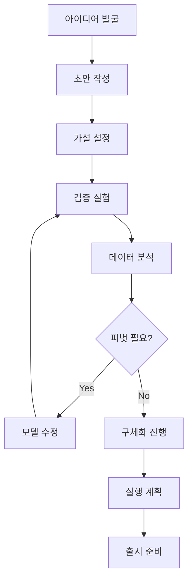

# 비즈니스 모델 단계별 구체화 프로세스

## 개요
스타트업 비즈니스 모델을 초안부터 실행 가능한 구체적 계획까지 체계적으로 발전시키는 단계별 프로세스입니다. Figma를 활용한 시각적 작업과 실무 검증을 결합한 실용적 가이드입니다.

---

## 🎯 전체 프로세스 개요



---

## 1단계: 아이디어 발굴 및 정리 (1-2일)

### 1.1 브레인스토밍 세션

#### **FigJam 워크보드 설정**
```
워크보드 구성:
├── 🧠 문제 정의 영역
├── 💡 솔루션 아이디어 영역  
├── 👥 타겟 고객 영역
├── 💰 수익 모델 영역
└── 🎯 우선순위 매트릭스
```

#### **아이디어 수집 템플릿**
| 영역 | 질문 | 스티키 노트 색상 |
|------|------|------------------|
| **문제** | 어떤 문제를 해결하나? | 🔴 빨강 |
| **고객** | 누가 이 문제를 겪나? | 🟡 노랑 |
| **솔루션** | 어떻게 해결할 것인가? | 🔵 파랑 |
| **경쟁** | 기존 해결책은 무엇인가? | 🟠 주황 |
| **기회** | 왜 지금이 적기인가? | 🟢 초록 |

### 1.2 아이디어 평가 및 선별

#### **평가 매트릭스**
```
스코어링 시스템 (1-10점):
├── 시장 크기: 충분한 TAM이 있는가?
├── 실현 가능성: 기술적으로 구현 가능한가?
├── 차별화: 경쟁사 대비 우위가 있는가?
├── 수익성: 지속 가능한 수익 모델인가?
└── 팀 역량: 우리가 잘할 수 있는가?
```

#### **우선순위 결정**
- **높은 임팩트 + 낮은 복잡성**: 최우선 실행
- **높은 임팩트 + 높은 복잡성**: 장기 계획
- **낮은 임팩트 + 낮은 복잡성**: 빠른 실험
- **낮은 임팩트 + 높은 복잡성**: 제외

---

## 2단계: 초안 작성 (2-3일)

### 2.1 기본 BMC 초안 작성

#### **Figma 작업 순서**
1. **템플릿 선택**: 업종별 맞춤 템플릿 사용
2. **핵심 블록부터**: 가치 제안 → 고객 세그먼트 → 문제 → 솔루션
3. **연관 블록**: 채널 → 수익원 → 비용 구조
4. **지원 블록**: 핵심 활동 → 핵심 자원 → 파트너

#### **블록별 작성 가이드**

##### **가치 제안 (Value Proposition)**
```
작성 프레임워크:
"[타겟 고객]을 위해 [핵심 문제]를 [고유한 방식]으로 해결하여 [구체적 혜택]을 제공한다."

예시: 
"바쁜 직장인을 위해 건강한 식단 관리의 어려움을 AI 맞춤 식단 추천으로 해결하여 시간 절약과 건강 개선을 동시에 제공한다."
```

##### **고객 세그먼트 (Customer Segments)**
```
세분화 기준:
├── 인구통계학적: 나이, 성별, 소득, 직업
├── 지리적: 지역, 도시 규모, 기후
├── 심리적: 가치관, 라이프스타일, 성격
├── 행동적: 사용 패턴, 충성도, 혜택 추구
└── 니즈 기반: 해결하려는 문제, 원하는 결과
```

##### **문제 정의 (Problem)**
```
문제 우선순위 (Must-have vs Nice-to-have):
🔥 Must-have: 반드시 해결해야 하는 핵심 고통점
⭐ Nice-to-have: 있으면 좋은 불편함
❓ Edge case: 특수한 상황의 문제
```

### 2.2 초안 검토 및 보완

#### **논리적 일관성 체크**
```
체크리스트:
✅ 가치 제안이 고객 문제와 일치하는가?
✅ 수익원이 고객이 지불할 의향과 연결되는가?
✅ 채널이 타겟 고객에게 도달 가능한가?
✅ 핵심 활동이 가치 제안 실현에 필요한가?
✅ 비용 구조가 수익 모델과 균형을 이루는가?
```

---

## 3단계: 가설 설정 및 검증 계획 (1일)

### 3.1 핵심 가설 도출

#### **가설 유형별 분류**
```
고객 가설:
- "20-30대 직장인은 점심 메뉴 선택에 평균 10분을 소비한다"
- "월 소득 400만원 이상 직장인은 편의성에 프리미엄을 지불한다"

문제 가설:
- "직장인의 70%는 건강한 식단 관리가 어렵다고 느낀다"
- "기존 식단 앱의 복잡성이 사용 중단의 주요 원인이다"

솔루션 가설:
- "AI 추천 시스템이 수동 입력보다 50% 더 정확하다"
- "3분 내 주문 완료가 가능하면 사용률이 3배 증가한다"
```

#### **가설 우선순위 설정**
```
Risk-Impact 매트릭스:
├── 높은 리스크 + 높은 영향: 즉시 검증 필요
├── 높은 리스크 + 낮은 영향: 대안 준비
├── 낮은 리스크 + 높은 영향: 빠른 실행
└── 낮은 리스크 + 낮은 영향: 나중에 검증
```

### 3.2 검증 실험 설계

#### **실험 유형별 방법론**

##### **고객 인터뷰**
```
인터뷰 가이드:
1. 워밍업 (5분): 일반적인 일상 질문
2. 문제 탐색 (15분): 현재 경험하는 고통점
3. 솔루션 반응 (10분): 아이디어에 대한 피드백
4. 지불 의향 (5분): 가격 민감도 파악
5. 마무리 (5분): 추가 질문 및 연락처
```

##### **MVP 테스트**
```
MVP 유형별 선택:
├── 랜딩 페이지: 수요 검증
├── 프로토타입: 사용성 검증  
├── 컨시어지 MVP: 수동 서비스 제공
├── 마법사 오즈: 백엔드 자동화 가정
└── 스모크 테스트: 기능별 관심도 측정
```

---

## 4단계: 검증 실험 실행 (1-2주)

### 4.1 고객 개발 프로세스

#### **고객 발견 (Customer Discovery)**
```
주간 목표:
Week 1: 
- 20명 고객 인터뷰
- 문제 가설 검증
- 페르소나 구체화

실행 체크리스트:
✅ 인터뷰 대상자 섭외 (LinkedIn, 지인 소개)
✅ 인터뷰 스크립트 준비
✅ 결과 정리 템플릿 작성
✅ 매일 3-4명씩 인터뷰 진행
✅ 패턴 분석 및 인사이트 도출
```

#### **고객 검증 (Customer Validation)**
```
Week 2:
- MVP 프로토타입 제작
- 사용성 테스트 15명
- 지불 의향 검증

검증 메트릭:
├── 문제 공감도: 85% 이상이 "심각한 문제"라고 답해야
├── 솔루션 만족도: 80% 이상이 "사용하겠다"고 답해야  
├── 지불 의향: 60% 이상이 제시 가격에 지불 의향 있어야
└── 추천 의향: NPS 점수 50 이상
```

### 4.2 데이터 수집 및 분석

#### **정성적 데이터 분석**
```
코딩 시스템:
├── 긍정적 반응: 😊 강한 관심, 😐 보통 관심
├── 부정적 반응: 😕 우려 사항, 😞 강한 반대
├── 행동 패턴: 🎯 사용 시나리오, 🚫 사용 안 하는 이유
└── 개선 제안: 💡 기능 요청, 🔧 UX 개선점
```

#### **정량적 데이터 분석**
```
메트릭 대시보드 (Figma로 시각화):
├── 전환율: 랜딩 페이지 → 가입 → 사용
├── 참여도: 사용 시간, 기능 사용 빈도
├── 만족도: 별점, NPS, 재사용 의향
└── 수익성: CAC, LTV, Payback Period
```

---

## 5단계: 데이터 기반 개선 (3-5일)

### 5.1 인사이트 도출

#### **패턴 분석 워크숍**
```
FigJam 분석 보드:
├── 📊 데이터 요약 (정량적 결과)
├── 💬 고객 목소리 (주요 인용구)
├── 🔍 패턴 발견 (반복되는 테마)
├── ❗ 놀라운 발견 (예상과 다른 결과)
└── 💡 액션 아이템 (구체적 개선 방안)
```

#### **가설 검증 결과 정리**
```
결과 분류:
✅ 검증됨 (Validated): 가설이 데이터로 입증됨
❓ 불확실 (Uncertain): 추가 검증 필요
❌ 기각됨 (Invalidated): 가설이 틀렸음
🔄 수정 필요 (Needs Pivot): 방향 전환 필요
```

### 5.2 비즈니스 모델 개선

#### **피벗 vs 퍼시스트 결정**
```
의사결정 프레임워크:
├── 핵심 가설 검증률 < 60%: 피벗 고려
├── 고객 만족도 < 7/10: 솔루션 개선 필요
├── 시장 크기 예상 < 50%: 타겟 재정의
└── 수익성 달성 시기 > 24개월: 모델 재검토
```

#### **개선 우선순위 설정**
```
Impact-Effort 매트릭스:
├── 높은 임팩트 + 낮은 노력: Quick Wins
├── 높은 임팩트 + 높은 노력: Major Projects  
├── 낮은 임팩트 + 낮은 노력: Fill-ins
└── 낮은 임팩트 + 높은 노력: Thankless Tasks
```

---

## 6단계: 구체화 및 상세 계획 (1주)

### 6.1 최종 비즈니스 모델 완성

#### **상세 BMC 작성**
```
블록별 상세화 수준:
├── 가치 제안: 3가지 핵심 혜택 + 측정 지표
├── 고객 세그먼트: 1차/2차 타겟 + 페르소나
├── 채널: 인지→관심→구매→유지 단계별 전략
├── 수익원: 가격 모델 + 수익 예측 + 성장 시나리오
└── 비용 구조: 고정비/변동비 + 손익분기점
```

#### **재무 모델 연동**
```
Figma + 스프레드시트 연동:
├── 고객 획득 비용 (CAC)
├── 고객 생애 가치 (LTV)  
├── 월 경상 수익 (MRR)
├── 연간 반복 수익 (ARR)
└── 현금 소진 기간 (Runway)
```

### 6.2 Go-to-Market 전략

#### **출시 로드맵**
```
출시 3단계:
├── Alpha (내부 테스트): 팀 + 친구들
├── Beta (비공개): 선별된 얼리어답터
└── GA (공개 출시): 전체 타겟 시장
```

#### **채널별 실행 계획**
```
채널 전략 매트릭스:
├── 디지털 마케팅: SEO, SEM, SNS 광고
├── 콘텐츠 마케팅: 블로그, 웨비나, 가이드
├── 파트너십: 전략적 제휴, 리셀러
└── 직접 영업: 아웃바운드, 인바운드
```

---

## 7단계: 실행 계획 수립 (2-3일)

### 7.1 구현 로드맵

#### **MVP 개발 계획**
```
개발 스프린트 (2주 단위):
Sprint 1-2: 핵심 기능 개발
├── 사용자 등록/로그인
├── 기본 기능 구현
└── 데이터베이스 설계

Sprint 3-4: 핵심 경험 완성
├── 사용자 플로우 구현
├── 결제 시스템 연동
└── 기본 분석 도구

Sprint 5-6: 출시 준비
├── 성능 최적화
├── 보안 강화
└── 운영 도구 구축
```

#### **팀 빌딩 계획**
```
역할별 채용 우선순위:
1순위: CTO (기술 개발)
2순위: VP of Marketing (고객 획득)
3순위: Lead Designer (사용자 경험)
4순위: VP of Sales (매출 성장)
```

### 7.2 자금 조달 계획

#### **자금 조달 단계별 전략**
```
자금 조달 로드맵:
├── Pre-seed ($50K-200K): 창업자, 친구, 가족
├── Seed ($200K-2M): 엔젤, 초기 단계 VC
├── Series A ($2M-15M): 성장 단계 VC
└── Series B+ ($15M+): 후기 단계 VC, PE
```

#### **투자 피치 준비**
```
피치덱 구성 (10-12슬라이드):
1. 문제 정의
2. 솔루션 소개
3. 시장 크기 및 기회
4. 제품 데모
5. 비즈니스 모델
6. 견인력 (Traction)
7. 경쟁 분석
8. 팀 소개
9. 재무 예측
10. 자금 사용 계획
```

---

## 8단계: 출시 준비 및 실행 (1-2주)

### 8.1 출시 전 체크리스트

#### **제품 준비도 점검**
```
기술적 준비:
✅ 기능 테스트 완료
✅ 성능 최적화
✅ 보안 점검
✅ 백업 시스템 구축
✅ 모니터링 도구 설정

운영 준비:
✅ 고객 지원 체계
✅ 결제 시스템 테스트
✅ 법적 문서 준비
✅ 개인정보보호 정책
✅ 이용약관 작성
```

#### **마케팅 준비**
```
런칭 캠페인:
├── 프리런칭: 대기자 명단 구축
├── 소프트런칭: 제한된 사용자 대상
├── 그랜드런칭: 전체 공개
└── 포스트런칭: 초기 사용자 피드백 수집
```

### 8.2 성과 측정 및 개선

#### **핵심 지표 (KPI) 설정**
```
단계별 핵심 지표:
├── 출시 1개월: 사용자 확보, 기본 사용성
├── 출시 3개월: 사용자 유지, 피드백 반영
├── 출시 6개월: 수익 창출, 제품-시장 적합성
└── 출시 12개월: 성장 가속, 스케일링
```

#### **지속적 개선 프로세스**
```
개선 사이클 (2주 단위):
1. 데이터 수집 및 분석
2. 가설 수립 및 실험 설계
3. A/B 테스트 실행
4. 결과 분석 및 적용
5. 다음 실험 계획
```

---

## 실무 활용 템플릿

### 📋 진행 상황 추적 템플릿

#### **주간 체크인 (매주 금요일)**
```
이번 주 달성:
✅ 완료된 작업
🔄 진행 중인 작업
❌ 미완료 작업

다음 주 계획:
🎯 주요 목표 (3개)
📅 중요 일정
⚠️ 리스크 요인

블로커 및 해결책:
🚫 현재 막혀있는 부분
💡 해결 방안
🤝 필요한 도움
```

#### **월간 리뷰 (매월 말)**
```
정량적 성과:
├── 고객 수: 목표 vs 실제
├── 수익: 예상 vs 실제  
├── 비용: 계획 vs 실제
└── 핵심 지표 달성률

정성적 학습:
├── 이번 달 가장 큰 학습
├── 예상과 다른 결과
├── 고객 피드백 요약
└── 다음 달 우선순위
```

### 🎯 의사결정 프레임워크

#### **피벗 결정 매트릭스**
| 지표 | 현재 상태 | 목표 | 달성률 | 액션 |
|------|-----------|------|--------|------|
| 고객 만족도 | 6.2/10 | 8.0/10 | 78% | 개선 필요 |
| 시장 반응 | 중간 | 높음 | 60% | 포지셔닝 재검토 |
| 수익성 | 손실 | 손익분기 | 30% | 모델 수정 |
| 팀 역량 | 부족 | 충분 | 70% | 채용 가속화 |

---

## 성공 사례 및 실패 사례

### 🚀 성공 사례: 에어비앤비

#### **초기 가설 및 검증**
```
초기 가설: "여행자들이 호텔 대신 개인 집에 머물고 싶어할 것"
검증 방법: 시리얼 박스 판매로 숙박 서비스 자금 조달
핵심 학습: 개인적 경험과 커뮤니티가 핵심 차별화 요소
피벗: B2B → C2C → 글로벌 플랫폼
```

### ⚠️ 실패 사례: 쿠아도라

#### **피벗 실패 요인**
```
문제: 시장 검증 없이 기술 중심 개발
결과: 고객 니즈와 제품 기능 불일치
교훈: 가설 검증의 중요성
```

---

## 도구 및 리소스

### 🛠️ 필수 도구 스택
- **설계**: Figma, FigJam
- **검증**: Google Forms, Typeform
- **분석**: Google Analytics, Mixpanel  
- **협업**: Slack, Notion
- **개발**: GitHub, Vercel

### 📚 추천 도서
1. **린 스타트업** - 에릭 리스
2. **블루오션 전략** - 김위찬, 르네 마보안
3. **비즈니스 모델 제너레이션** - 알렉산더 오스터왈더
4. **제로 투 원** - 피터 틸

---

## 결론 및 다음 단계

이 프로세스를 통해 체계적이고 검증된 비즈니스 모델을 구축할 수 있습니다. 핵심은 **가설-검증-학습-개선**의 반복 사이클을 빠르게 돌리는 것입니다.

### 🎯 즉시 실행 가능한 액션 아이템

**오늘 할 일:**
1. Figma 계정 생성 및 첫 번째 BMC 템플릿 다운로드
2. 첫 번째 고객 인터뷰 대상자 3명 연락

**이번 주 할 일:**
1. 초기 BMC 초안 완성
2. 핵심 가설 5개 도출
3. 첫 번째 고객 인터뷰 3회 진행

**이번 달 목표:**
1. 검증된 BMC 완성
2. MVP 프로토타입 제작
3. 첫 번째 유료 고객 확보

---

*작성일: 2025년 9월 13일*
*최종 수정: 2025년 9월 13일*
*버전: 1.0*

