# 미팅 분석 로직 시각화 템플릿

> 이 템플릿은 미팅이나 대화에서 발생한 관점 차이, 합의점, 의사결정 과정을 시각적으로 분석하기 위한 구조를 제공합니다. 필요에 따라 섹션을 추가하거나 제거할 수 있습니다.

## 🛠️ 사용 방법
1. 각 섹션의 설명을 읽고 분석하려는 미팅에 맞게 내용을 수정합니다.
2. 필요한 다이어그램을 선택하고 데이터를 업데이트합니다.
3. 미팅 특성에 맞지 않는 섹션은 삭제해도 됩니다.
4. 다이어그램 코드는 ```mermaid 태그 사이에 작성합니다.

---

## 1. 접근법/관점 비교 (Approach Comparison)

> 이 섹션에서는 미팅 참가자들의 서로 다른 접근법이나 관점을 비교합니다. 각 당사자의 주요 입장과 핵심 관점을 시각화합니다.

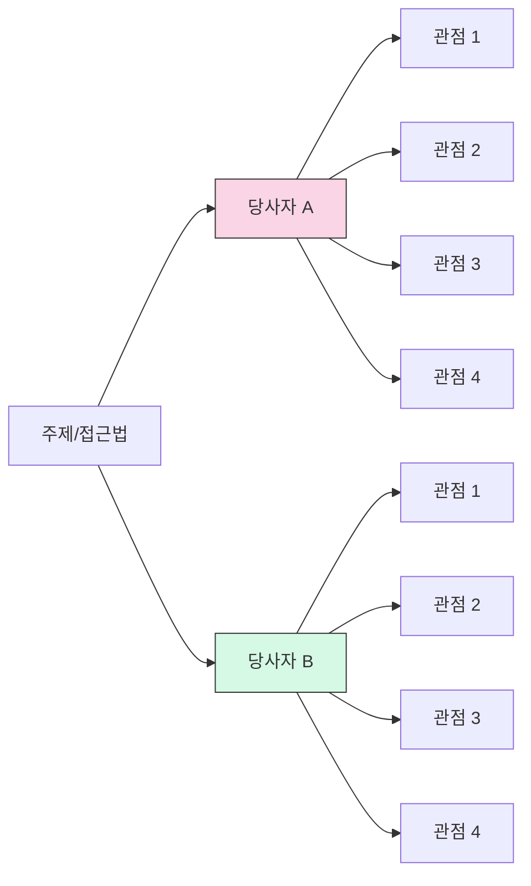

## 2. 주요 차이점 사분면 맵핑 (Gap Quadrant Mapping)

> 이 다이어그램은 주요 관점들을 두 가지 축을 기준으로 배치합니다. 예: 단기-장기, 전략적-실행적, 비용-효과 등

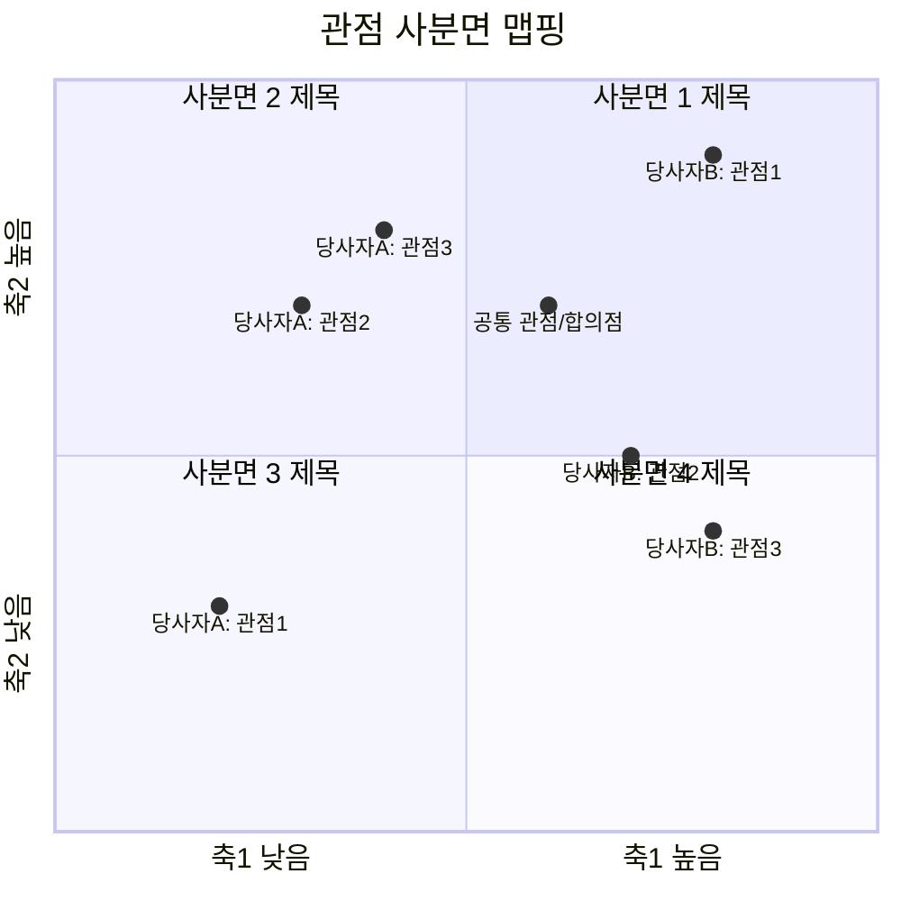

## 3. 타임라인 비교 (Timeline Comparison)

> 서로 다른 당사자들의 시간 기대치나 프로세스 단계를 비교합니다. 각 단계의 예상 소요 시간을 시각화합니다.

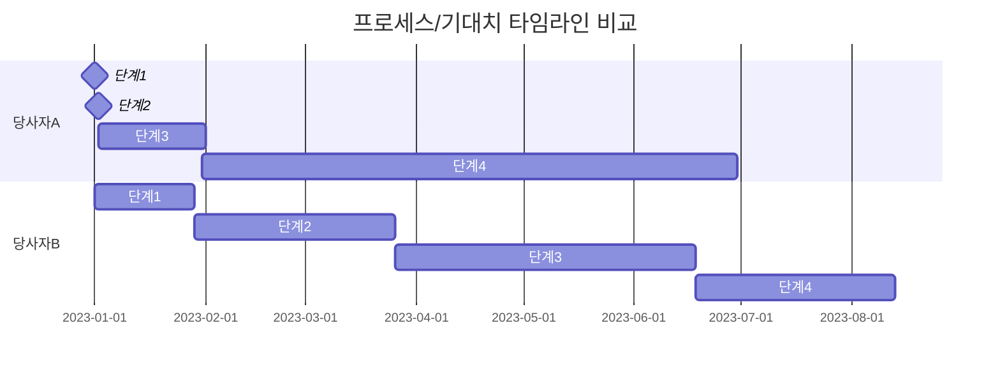

## 4. 의사결정 프로세스 순서도 (Decision Process Flow)

> 논의된 의사결정 프로세스를 순서도로 표현합니다. 서로 다른 접근법과 합의점을 시각화합니다.

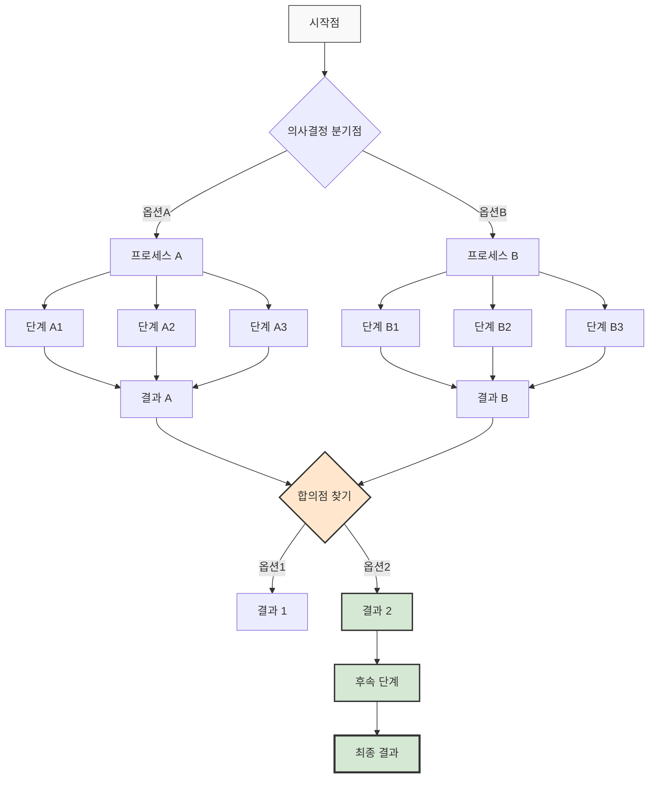

## 5. 계층 구조 마인드맵 (Hierarchy Mindmap)

> 논의된 주제를 계층적으로 구조화합니다. 주요 주제와 하위 주제, 관련 관점을 시각화합니다.

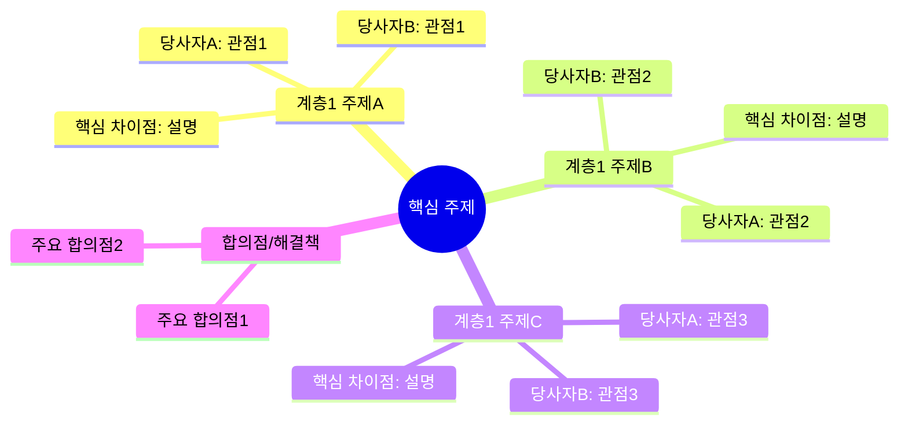

## 6. 논의 과정 상태 다이어그램 (Discussion State Diagram)

> 미팅/대화의 흐름을 상태 변화로 시각화합니다. 주요 전환점과 의견 변화를 표현합니다.

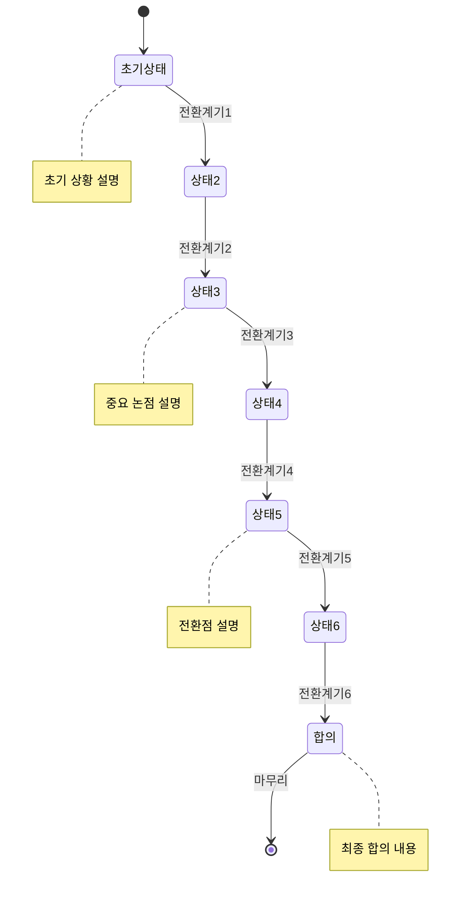

## 7. 해결책/대안 비교 매트릭스 (Solution Comparison Matrix)

> 논의된 다양한 옵션/해결책을 표 형태로 비교합니다. 각 옵션의 장단점과 평가 기준을 정리합니다.

| 옵션/해결책 | 기준1 | 기준2 | 기준3 | 기준4 | 종합 평가 |
|------------|-------|-------|-------|-------|----------|
| **옵션 A** | ⭐⭐⭐⭐⭐ | ⭐⭐⭐⭐⭐ | ⭐⭐⭐⭐⭐ | ⭐⭐⭐⭐ | 최적 옵션 |
| **옵션 B** | ⭐⭐ | ⭐⭐⭐⭐⭐ | ⭐⭐⭐ | ⭐⭐ | 차선책 |
| **옵션 C** | ⭐⭐⭐⭐⭐ | ⭐⭐ | ⭐⭐ | ⭐⭐⭐ | 부분적 적합 |
| **옵션 D** | ⭐⭐⭐ | ⭐⭐⭐ | ⭐⭐ | ⭐⭐ | 복잡함 |

## 8. 협력/실행 모델 아키텍처 (Collaboration Model)

> 합의된 협력 방식이나 실행 모델의 구조를 시각화합니다. 역할, 자원, 목표를 명확히 합니다.

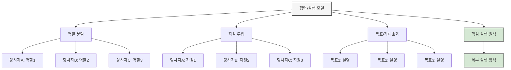

## 9. SWOT 분석 (SWOT Analysis)

> 논의 결과나 합의된 방향에 대한 SWOT 분석을 시각화합니다. 의사결정 전후를 비교할 수도 있습니다.

### 상황/옵션 분석 SWOT

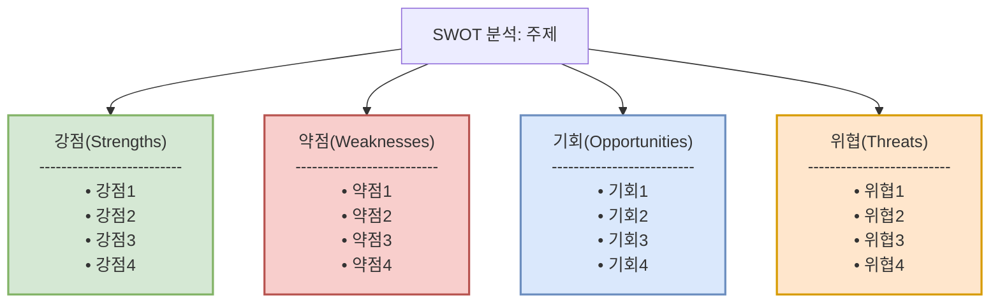

### SWOT 비교 테이블 (선택적)

| 구분 | 옵션A / 전 상태 | 옵션B / 후 상태 |
|------|----------------|----------------|
| **강점<br>(Strengths)** | • 강점1<br>• 강점2<br>• 강점3 | • 강점1<br>• 강점2<br>• 강점3<br>• 강점4 |
| **약점<br>(Weaknesses)** | • 약점1<br>• 약점2<br>• 약점3<br>• 약점4 | • 약점1<br>• 약점2 |
| **기회<br>(Opportunities)** | • 기회1<br>• 기회2 | • 기회1<br>• 기회2<br>• 기회3<br>• 기회4 |
| **위협<br>(Threats)** | • 위협1<br>• 위협2<br>• 위협3<br>• 위협4 | • 위협1<br>• 위협2 |

## 10. 대화 흐름과 전환점 시각화 (Conversation Flow)

> 미팅/대화의 진행 과정과 참가자들의 만족도/동의 수준 변화를 시각화합니다.

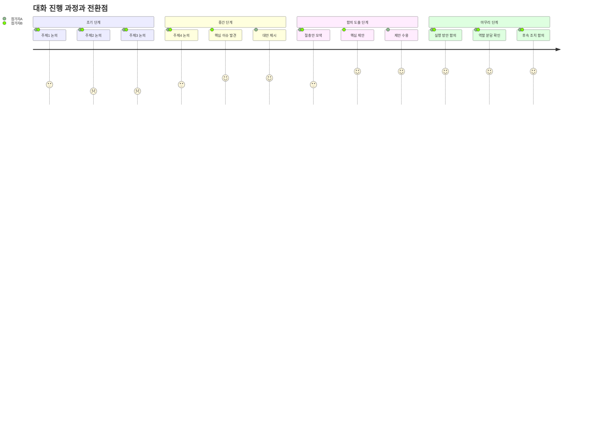

## 11. 참가자 간 상호작용 시퀀스 (Interaction Sequence)

> 미팅 참가자들 간의 주요 상호작용과 정보/아이디어 교환을 시간 순서대로 시각화합니다. 메시지 흐름과 합의점을 명확히 보여줍니다.

### 시퀀스 다이어그램 코드

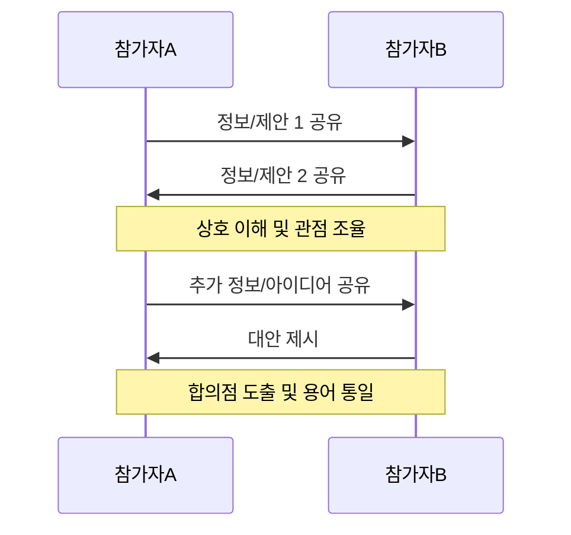

### 시각적 시퀀스 다이어그램

이 다이어그램은 코드로 생성된 다이어그램 외에도 참가자 간 정보 흐름을 더 시각적으로 표현할 수 있습니다:

```
┌─────────────┐                  ┌─────────────┐
│  참가자A    │                  │  참가자B    │
└──────┬──────┘                  └──────┬──────┘
       │                                │
       │   정보/제안 1 공유             │
       │────────────────────────────────>
       │                                │
       │   정보/제안 2 공유             │
       │<────────────────────────────────
       │                                │
       │         상호 이해 및 관점 조율         │
       ├────────────────────────────────┤
       │                                │
       │   추가 정보/아이디어 공유         │
       │────────────────────────────────>
       │                                │
       │   대안 제시                     │
       │<────────────────────────────────
       │                                │
       │         합의점 도출 및 용어 통일         │
       ├────────────────────────────────┤
       │                                │
┌──────┴──────┐                  ┌──────┴──────┐
│  참가자A    │                  │  참가자B    │
└─────────────┘                  └─────────────┘
```

### 실제 사례 (김우진-엄여진 통화 분석)

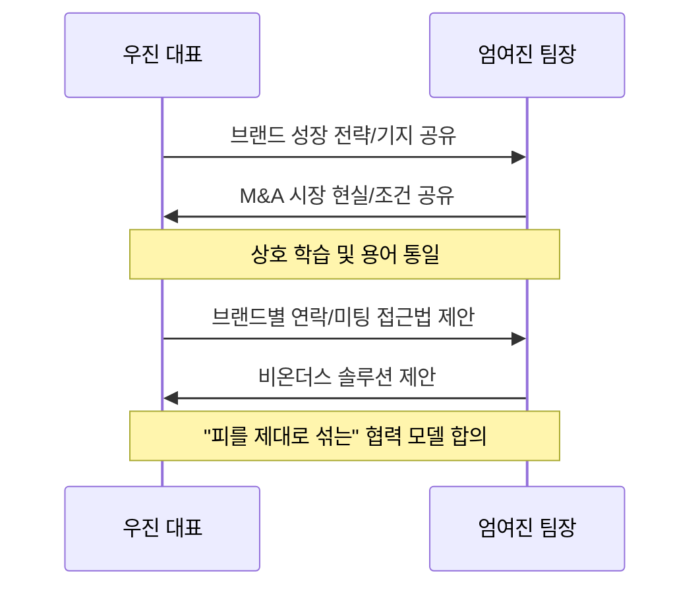

이 시퀀스 다이어그램은 다음과 같은 상황을 시각화할 때 특히 유용합니다:
- 복잡한 협상이나 대화 흐름
- 각 참가자의 주요 기여와 제안
- 상호작용을 통한 아이디어 발전 과정
- 최종 합의에 이르는 단계적 과정

시퀀스 다이어그램은 시간 순서를 중심으로 상호작용을 보여주므로, 대화의 진행 흐름과 중요한 전환점을 명확하게 파악할 수 있습니다.

---

## 추가 다이어그램 옵션

필요에 따라 다음 다이어그램을 추가할 수 있습니다:

### 관계도 (Relationship Diagram)

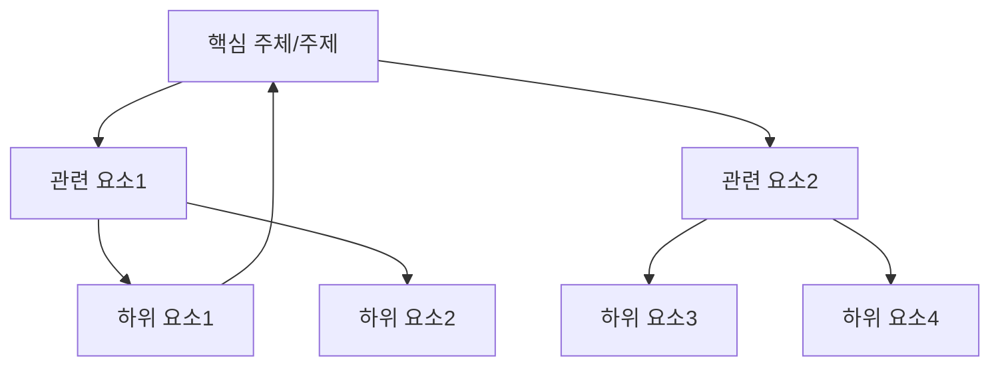

### 프로세스 순환도 (Process Cycle)

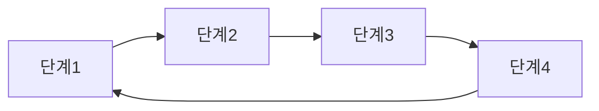

### 피쉬본 다이어그램 (Cause-Effect)

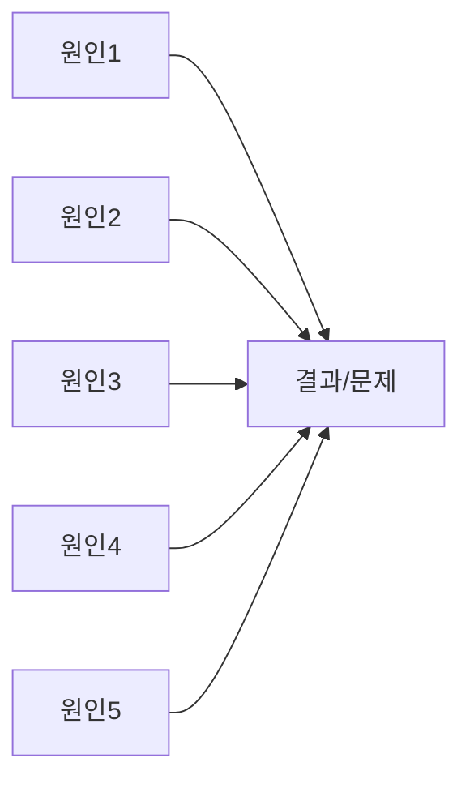

---

## 📋 템플릿 사용 팁

1. **선택적 활용**: 모든 다이어그램을 사용할 필요는 없습니다. 분석 목적에 맞는 다이어그램만 선택하세요.
2. **색상 활용**: 다이어그램에 색상을 추가하면 시각적 이해도가 높아집니다.
3. **레벨 구분**: 복잡한 미팅은 Lv1(실행), Lv2(관리), Lv3(전략) 관점으로 구분하면 효과적입니다.
4. **통합 분석**: 여러 다이어그램의 결과를 종합하여 핵심 인사이트를 도출하세요.
5. **정기적 활용**: 정기 미팅에 동일한 템플릿을 사용하면 시간에 따른 변화를 추적할 수 있습니다.

---

> 이 템플릿은 '슈퍼디스코-부국캐피탈 갭분석 시각화' 문서를 기반으로 일반화되었습니다.
> 모든 다이어그램은 Mermaid.js 문법을 사용합니다 (https://mermaid.js.org/). 