# 미팅분석 로직시각화 템플릿 v2.0

> 이 템플릿은 미팅이나 대화에서 발생한 관점 차이, 합의점, 의사결정 과정을 시각적으로 분석하기 위한 구조를 제공합니다. 필요에 따라 섹션을 추가하거나 제거할 수 있습니다.

## 🛠️ 사용 방법
1. 각 섹션의 설명을 읽고 분석하려는 미팅에 맞게 내용을 수정합니다.
2. 필요한 다이어그램을 선택하고 데이터를 업데이트합니다.
3. 미팅 특성에 맞지 않는 섹션은 삭제해도 됩니다.
4. 다이어그램 코드는 ```mermaid 태그 사이에 작성합니다.
5. 특수문자(특히 작은따옴표)는 렌더링 문제를 일으킬 수 있으니 가능한 피합니다.
6. 복잡한 다이어그램은 표 형태의 백업 데이터를 함께 제공하는 것이 좋습니다.

---

## 1. 접근법/관점 비교 (Approach Comparison)

> 이 섹션에서는 미팅 참가자들의 서로 다른 접근법이나 관점을 비교합니다. 각 당사자의 주요 입장과 핵심 관점을 시각화합니다.

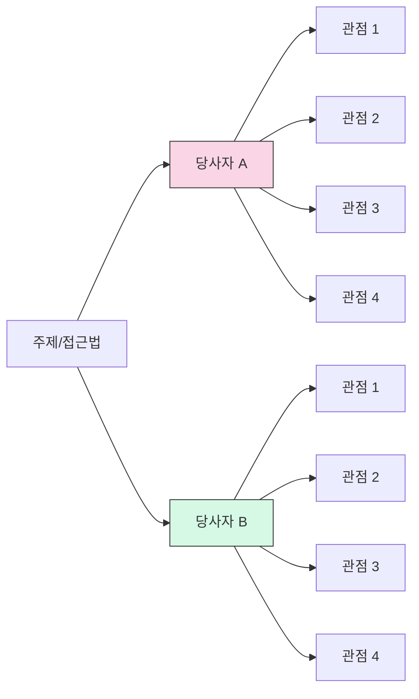
```mermaid
graph LR
    A[주제/접근법] --> B[당사자 A]
    A --> C[당사자 B]
    
    B --> B1["관점 1"]
    B --> B2["관점 2"]
    B --> B3["관점 3"]
    B --> B4["관점 4"]
    
    C --> C1["관점 1"]
    C --> C2["관점 2"]
    C --> C3["관점 3"]
    C --> C4["관점 4"]
    
    style B fill:#f9d5e5,stroke:#333,stroke-width:1px
    style C fill:#d5f9e5,stroke:#333,stroke-width:1px
```

## 2. 주요 갭 맵핑 (Gap Mapping)

> 이 섹션에서는 서로 다른 관점들을 2차원 좌표계에 맵핑합니다. 각 포지션의 좌표값과 의미를 명확하게 설명합니다.

### 2.1 전체 갭 맵핑 (통합 뷰)

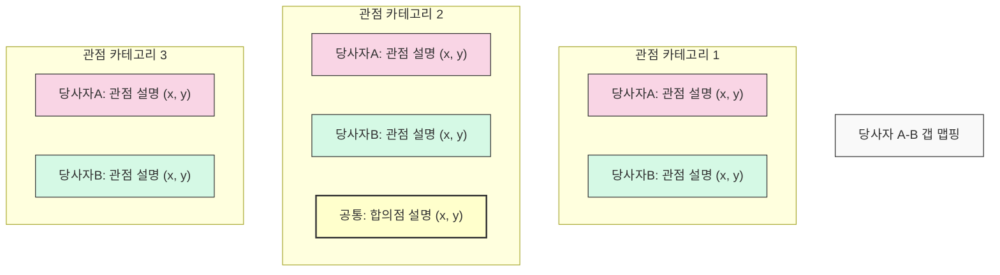
```mermaid
graph TD
    title["당사자 A-B 갭 맵핑"]
    
    subgraph "관점 카테고리 1"
        S1["당사자A: 관점 설명 (x, y)"]
        S2["당사자B: 관점 설명 (x, y)"]
    end
    
    subgraph "관점 카테고리 2"
        M1["당사자A: 관점 설명 (x, y)"]
        M2["당사자B: 관점 설명 (x, y)"]
        M3["공통: 합의점 설명 (x, y)"]
    end
    
    subgraph "관점 카테고리 3"
        E1["당사자A: 관점 설명 (x, y)"]
        E2["당사자B: 관점 설명 (x, y)"]
    end
    
    style S1 fill:#f9d5e5,stroke:#333,stroke-width:1px
    style S2 fill:#d5f9e5,stroke:#333,stroke-width:1px
    style M1 fill:#f9d5e5,stroke:#333,stroke-width:1px
    style M2 fill:#d5f9e5,stroke:#333,stroke-width:1px
    style M3 fill:#ffffcc,stroke:#333,stroke-width:2px
    style E1 fill:#f9d5e5,stroke:#333,stroke-width:1px
    style E2 fill:#d5f9e5,stroke:#333,stroke-width:1px
    
    classDef default fill:#f9f9f9,stroke:#333,stroke-width:1px
```

### 2.2 레벨별 분리 뷰 - 2차원 맵핑

> 관점 레벨별로 구분하여 2차원 그래프로 표현합니다. 이렇게 보면 각 레벨에서의 관점 차이를 더 명확하게 이해할 수 있습니다.

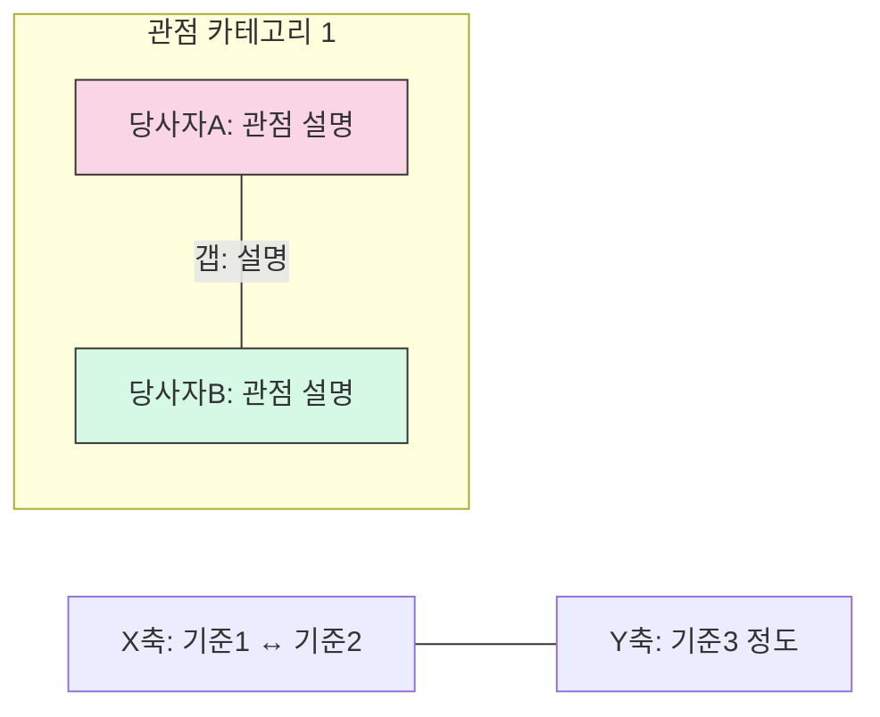
```mermaid
graph LR
    X["X축: 기준1 ↔ 기준2"] --- Y["Y축: 기준3 정도"]
    
    subgraph "관점 카테고리 1"
        S1["당사자A: 관점 설명"]
        S2["당사자B: 관점 설명"]
    end
    
    style S1 fill:#f9d5e5,stroke:#333,stroke-width:1px
    style S2 fill:#d5f9e5,stroke:#333,stroke-width:1px
    
    S1 --- |"갭: 설명"| S2
```

**좌표 위치 설명:**
- **당사자A (x, y)**: 설명
  - 세부 설명
  - 세부 설명
  
- **당사자B (x, y)**: 설명
  - 세부 설명
  - 세부 설명

### 2.3 갭 해소 포지셔닝 맵

> 이 그래프는 초기 갭 상태와 해결책을 통한 갭 해소 경로를 보여줍니다.

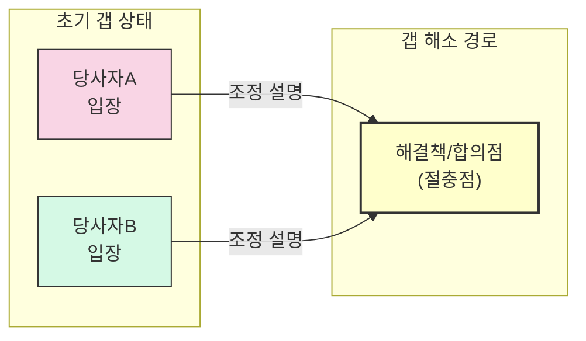
```mermaid
graph LR
    subgraph "초기 갭 상태"
        A["당사자A<br>입장"]
        B["당사자B<br>입장"]
    end
    
    subgraph "갭 해소 경로"
        M["해결책/합의점<br>(절충점)"]
    end
    
    A --> |"조정 설명"| M
    B --> |"조정 설명"| M
    
    style A fill:#f9d5e5,stroke:#333,stroke-width:1px
    style B fill:#d5f9e5,stroke:#333,stroke-width:1px
    style M fill:#ffffcc,stroke:#333,stroke-width:2px
```

## 3. 시간 기대치 타임라인 비교 (Timeline Expectation)

> 서로 다른 당사자들의 시간 기대치나 프로세스 단계를 비교합니다. 각 단계의 예상 소요 시간을 시각화합니다.

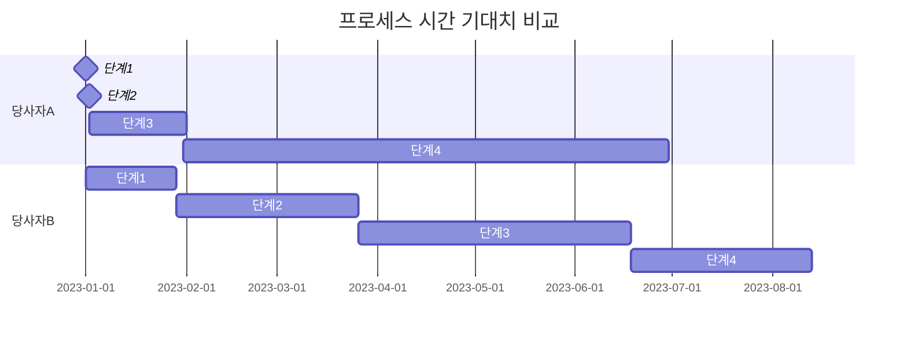
```mermaid
gantt
    title 프로세스 시간 기대치 비교
    dateFormat  YYYY-MM-DD
    section 당사자A
    단계1:milestone, 2023-01-01, 0d
    단계2:milestone, 2023-01-02, 0d
    단계3:       2023-01-02, 30d
    단계4:       2023-01-31, 150d
    
    section 당사자B
    단계1:        2023-01-01, 28d
    단계2:        2023-01-29, 56d
    단계3:        2023-03-26, 84d
    단계4:        2023-06-18, 56d
```

## 4. 의사결정 프로세스 순서도 (Decision Process Flow)

> 논의된 의사결정 프로세스를 순서도로 표현합니다. 서로 다른 접근법과 합의점을 시각화합니다.

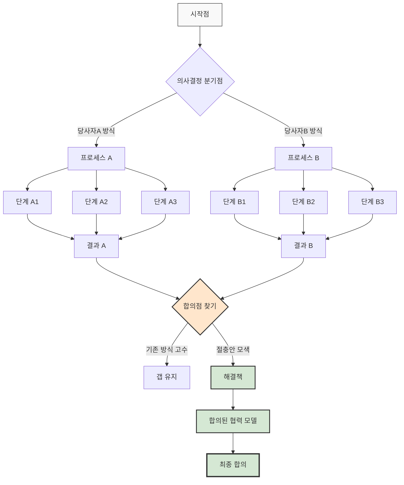
```mermaid
flowchart TD
    A[시작점] --> B{의사결정 분기점}
    
    B -->|당사자A 방식| C[프로세스 A]
    B -->|당사자B 방식| D[프로세스 B]
    
    C --> E[단계 A1]
    C --> F[단계 A2]
    C --> G[단계 A3]
    
    D --> H[단계 B1]
    D --> I[단계 B2]
    D --> J[단계 B3]
    
    E --> K[결과 A]
    F --> K
    G --> K
    
    H --> L[결과 B]
    I --> L
    J --> L
    
    K --> M{합의점 찾기}
    L --> M
    
    M -->|기존 방식 고수| N[갭 유지]
    M -->|절충안 모색| O[해결책]
    
    O --> P[합의된 협력 모델]
    P --> Q[최종 합의]
    
    style A fill:#f9f9f9,stroke:#333,stroke-width:1px
    style M fill:#ffe6cc,stroke:#333,stroke-width:2px
    style O fill:#d5e8d4,stroke:#333,stroke-width:2px
    style P fill:#d5e8d4,stroke:#333,stroke-width:2px
    style Q fill:#d5e8d4,stroke:#333,stroke-width:3px
```

## 5. 갭 계층 구조 (Gap Hierarchy)

### 5.1. 계층 구조 플로우차트

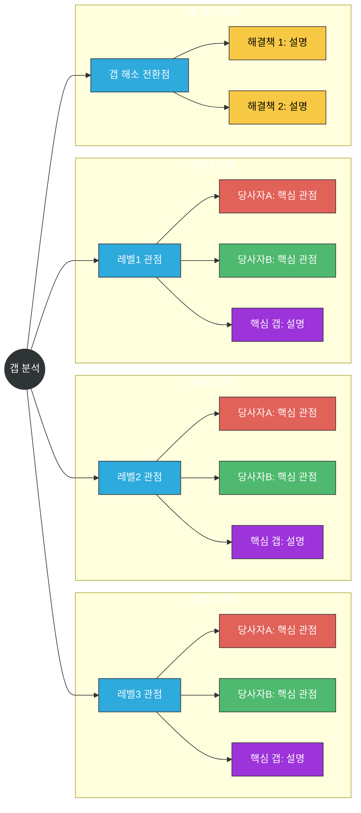
```mermaid
graph LR
    root((갭 분석)) --> L3[레벨3 관점]
    root --> L2[레벨2 관점]
    root --> L1[레벨1 관점]
    root --> GR[갭 해소 전환점]
    
    subgraph "레벨3 관점"
        L3 --> L3_A[당사자A: 핵심 관점]
        L3 --> L3_B[당사자B: 핵심 관점]
        L3 --> L3_C[핵심 갭: 설명]
    end
    
    subgraph "레벨2 관점"
        L2 --> L2_A[당사자A: 핵심 관점]
        L2 --> L2_B[당사자B: 핵심 관점]
        L2 --> L2_C[핵심 갭: 설명]
    end
    
    subgraph "레벨1 관점"
        L1 --> L1_A[당사자A: 핵심 관점]
        L1 --> L1_B[당사자B: 핵심 관점]
        L1 --> L1_C[핵심 갭: 설명]
    end
    
    subgraph "갭 해소 방안"
        GR --> GR_A[해결책 1: 설명]
        GR --> GR_B[해결책 2: 설명]
    end
    
    classDef default fill:#f5f5f5,stroke:#333,stroke-width:1px
    classDef root fill:#2f3437,color:#ffffff,stroke:#333,stroke-width:2px
    classDef level fill:#2eaadc,color:#ffffff,stroke:#333,stroke-width:1px
    classDef partyA fill:#e16259,color:#ffffff,stroke:#333,stroke-width:1px
    classDef partyB fill:#4fba6f,color:#ffffff,stroke:#333,stroke-width:1px
    classDef gap fill:#9d34da,color:#ffffff,stroke:#333,stroke-width:1px
    classDef resolution fill:#f7c844,color:#000000,stroke:#333,stroke-width:1px
    
    class root root
    class L1,L2,L3,GR level
    class L1_A,L2_A,L3_A partyA
    class L1_B,L2_B,L3_B partyB
    class L1_C,L2_C,L3_C gap
    class GR_A,GR_B resolution
```

### 5.2. 계층 구조 마인드맵

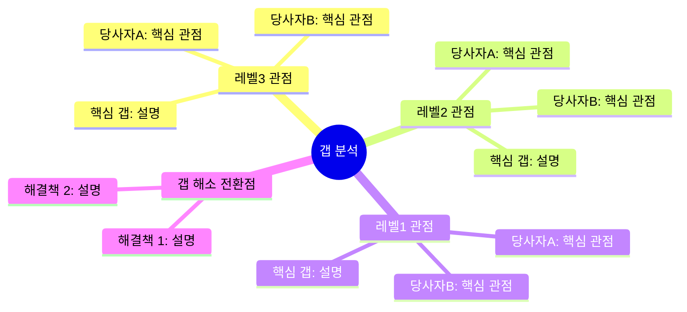
```mermaid
mindmap
  root((갭 분석))
    레벨3 관점
      당사자A: 핵심 관점
      당사자B: 핵심 관점
      핵심 갭: 설명
    레벨2 관점
      당사자A: 핵심 관점
      당사자B: 핵심 관점
      핵심 갭: 설명
    레벨1 관점
      당사자A: 핵심 관점
      당사자B: 핵심 관점
      핵심 갭: 설명
    갭 해소 전환점
      해결책 1: 설명
      해결책 2: 설명
```

### 5.3 계층 구조 마인드맵 (표 형태)

| 계층 | 당사자A | 당사자B | 핵심 갭 |
|------|---------|---------|---------|
| **레벨3 관점** | 핵심 관점 설명 | 핵심 관점 설명 | 갭 설명 |
| **레벨2 관점** | 핵심 관점 설명 | 핵심 관점 설명 | 갭 설명 |
| **레벨1 관점** | 핵심 관점 설명 | 핵심 관점 설명 | 갭 설명 |
| **갭 해소 전환점** | 해결책 관점 | 해결책 관점 | 합의점 설명 |

## 6. 갭 해소 과정 상태 다이어그램 (Gap Resolution State Diagram)

> 미팅/대화의 흐름을 상태 변화로 시각화합니다. 주요 전환점과 갭 해소 과정을 표현합니다.

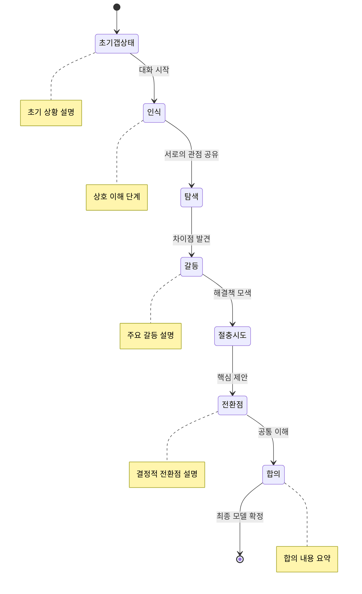
```mermaid
stateDiagram-v2
    [*] --> 초기갭상태
    초기갭상태 --> 인식: 대화 시작
    인식 --> 탐색: 서로의 관점 공유
    탐색 --> 갈등: 차이점 발견
    갈등 --> 절충시도: 해결책 모색
    절충시도 --> 전환점: 핵심 제안
    전환점 --> 합의: 공통 이해
    합의 --> [*]: 최종 모델 확정
    
    note right of 초기갭상태: 초기 상황 설명
    note right of 인식: 상호 이해 단계
    note right of 갈등: 주요 갈등 설명
    note right of 전환점: 결정적 전환점 설명
    note right of 합의: 합의 내용 요약
```

## 7. 갭 해소 솔루션 구조 (Gap Resolution Solution)

> 이 섹션에서는 갭 해소를 위한 솔루션 구조를 시각화합니다. 각 영역별 해결책을 명확하게 보여줍니다.

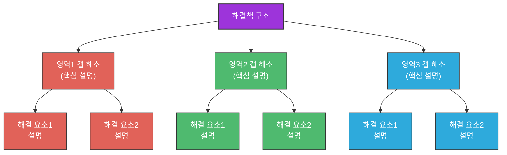
```mermaid
graph TD
    A["해결책 구조"] --> B["영역1 갭 해소<br>(핵심 설명)"]
    A --> C["영역2 갭 해소<br>(핵심 설명)"]
    A --> D["영역3 갭 해소<br>(핵심 설명)"]
    
    B --> B1["해결 요소1<br>설명"]
    B --> B2["해결 요소2<br>설명"]
    
    C --> C1["해결 요소1<br>설명"]
    C --> C2["해결 요소2<br>설명"]
    
    D --> D1["해결 요소1<br>설명"]
    D --> D2["해결 요소2<br>설명"]
    
    classDef main fill:#9d34da,color:#ffffff,stroke:#333,stroke-width:2px
    classDef area1 fill:#e16259,color:#ffffff,stroke:#333,stroke-width:1px
    classDef area2 fill:#4fba6f,color:#ffffff,stroke:#333,stroke-width:1px
    classDef area3 fill:#2eaadc,color:#ffffff,stroke:#333,stroke-width:1px
    
    class A main
    class B,B1,B2 area1
    class C,C1,C2 area2
    class D,D1,D2 area3
```

### 갭 해소 솔루션 세부 내용

| 영역 | 솔루션 요소 | 설명 |
|------|------------|------|
| **영역1 갭 해소** | 해결 요소1 | 자세한 설명 |
| | 해결 요소2 | 자세한 설명 |
| **영역2 갭 해소** | 해결 요소1 | 자세한 설명 |
| | 해결 요소2 | 자세한 설명 |
| **영역3 갭 해소** | 해결 요소1 | 자세한 설명 |
| | 해결 요소2 | 자세한 설명 |

## 8. 협력 모델 아키텍처 (Collaboration Architecture)

> 합의된 협력 방식이나 실행 모델의 구조를 시각화합니다. 역할, 자원, 목표를 명확히 합니다.

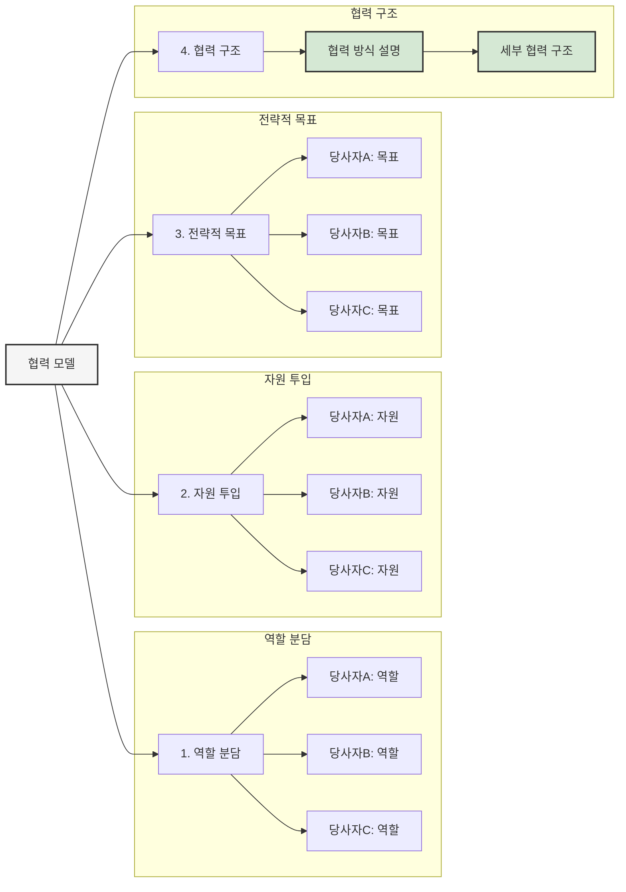
```mermaid
graph LR
    A[협력 모델] --> B["1. 역할 분담"]
    A --> C["2. 자원 투입"]
    A --> D["3. 전략적 목표"]
    A --> E["4. 협력 구조"]
    
    subgraph "역할 분담"
        B --> B1["당사자A: 역할"]
        B --> B2["당사자B: 역할"]
        B --> B3["당사자C: 역할"]
    end
    
    subgraph "자원 투입"
        C --> C1["당사자A: 자원"]
        C --> C2["당사자B: 자원"]
        C --> C3["당사자C: 자원"]
    end
    
    subgraph "전략적 목표"
        D --> D1["당사자A: 목표"]
        D --> D2["당사자B: 목표"]
        D --> D3["당사자C: 목표"]
    end
    
    subgraph "협력 구조"
        E --> E1["협력 방식 설명"]
        E1 --> E2["세부 협력 구조"]
    end
    
    style A fill:#f5f5f5,stroke:#333,stroke-width:2px
    style E1 fill:#d5e8d4,stroke:#333,stroke-width:2px
    style E2 fill:#d5e8d4,stroke:#333,stroke-width:2px
```

또는 마인드맵 형태로도 표현할 수 있습니다:

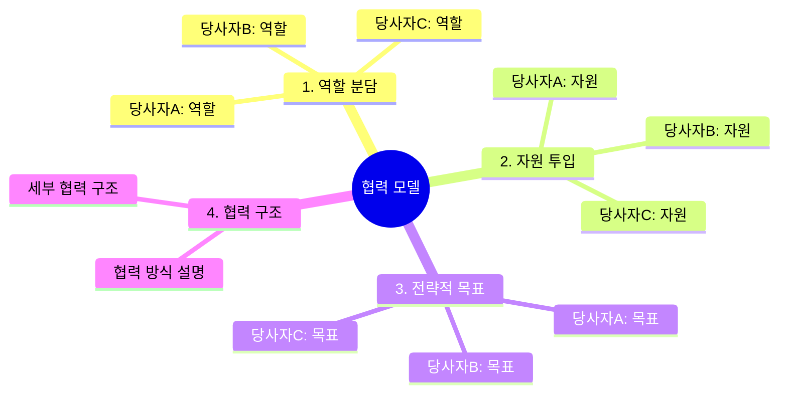
```mermaid
mindmap
  root((협력 모델))
    1. 역할 분담
      당사자A: 역할
      당사자B: 역할
      당사자C: 역할
    2. 자원 투입
      당사자A: 자원
      당사자B: 자원
      당사자C: 자원
    3. 전략적 목표
      당사자A: 목표
      당사자B: 목표
      당사자C: 목표
    4. 협력 구조
      협력 방식 설명
      세부 협력 구조
```

## 9. 갭 해소 전후 SWOT 비교 (Gap Resolution SWOT Comparison)

### 갭 해소 전 (Before Resolution)

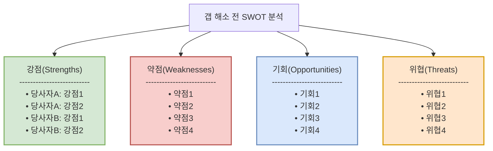
```mermaid
graph TD
    SWOT["갭 해소 전 SWOT 분석"] --> S["강점(Strengths)<br>--------------------------<br>• 당사자A: 강점1<br>• 당사자A: 강점2<br>• 당사자B: 강점1<br>• 당사자B: 강점2"]
    SWOT --> W["약점(Weaknesses)<br>--------------------------<br>• 약점1<br>• 약점2<br>• 약점3<br>• 약점4"]
    SWOT --> O["기회(Opportunities)<br>--------------------------<br>• 기회1<br>• 기회2<br>• 기회3<br>• 기회4"]
    SWOT --> T["위협(Threats)<br>--------------------------<br>• 위협1<br>• 위협2<br>• 위협3<br>• 위협4"]
    
    style S fill:#d5e8d4,stroke:#82b366,stroke-width:2px
    style W fill:#f8cecc,stroke:#b85450,stroke-width:2px
    style O fill:#dae8fc,stroke:#6c8ebf,stroke-width:2px
    style T fill:#ffe6cc,stroke:#d79b00,stroke-width:2px
```

### 갭 해소 후 (After Resolution)

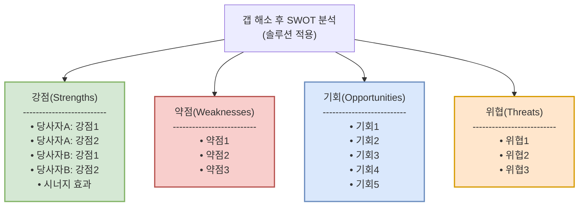
```mermaid
graph TD
    SWOT["갭 해소 후 SWOT 분석<br>(솔루션 적용)"] --> S["강점(Strengths)<br>--------------------------<br>• 당사자A: 강점1<br>• 당사자A: 강점2<br>• 당사자B: 강점1<br>• 당사자B: 강점2<br>• 시너지 효과"]
    SWOT --> W["약점(Weaknesses)<br>--------------------------<br>• 약점1<br>• 약점2<br>• 약점3"]
    SWOT --> O["기회(Opportunities)<br>--------------------------<br>• 기회1<br>• 기회2<br>• 기회3<br>• 기회4<br>• 기회5"]
    SWOT --> T["위협(Threats)<br>--------------------------<br>• 위협1<br>• 위협2<br>• 위협3"]
    
    style S fill:#d5e8d4,stroke:#82b366,stroke-width:2px
    style W fill:#f8cecc,stroke:#b85450,stroke-width:2px
    style O fill:#dae8fc,stroke:#6c8ebf,stroke-width:2px
    style T fill:#ffe6cc,stroke:#d79b00,stroke-width:2px
```

### SWOT 비교 테이블

| 구분 | 갭 해소 전 | 갭 해소 후 (솔루션 적용) |
|------|-----------|-------------------------|
| **강점<br>(Strengths)** | • 당사자A: 강점1<br>• 당사자A: 강점2<br>• 당사자B: 강점1<br>• 당사자B: 강점2 | • 당사자A: 강점1 (향상됨)<br>• 당사자A: 강점2<br>• 당사자B: 강점1 (향상됨)<br>• 당사자B: 강점2<br>• 시너지 효과<br>• 추가 강점 |
| **약점<br>(Weaknesses)** | • 약점1<br>• 약점2<br>• 약점3<br>• 약점4 | • 약점1<br>• 약점2<br>• 약점3 |
| **기회<br>(Opportunities)** | • 기회1<br>• 기회2<br>• 기회3<br>• 기회4 | • 기회1<br>• 기회2<br>• 기회3<br>• 기회4<br>• 기회5 |
| **위협<br>(Threats)** | • 위협1<br>• 위협2<br>• 위협3<br>• 위협4 | • 위협1<br>• 위협2<br>• 위협3 |
```

## 10. 대화 흐름과 전환점 시각화 (Conversation Flow and Turning Point)

> 미팅/대화의 진행 과정과 참가자들의 만족도/동의 수준 변화를 시각화합니다.

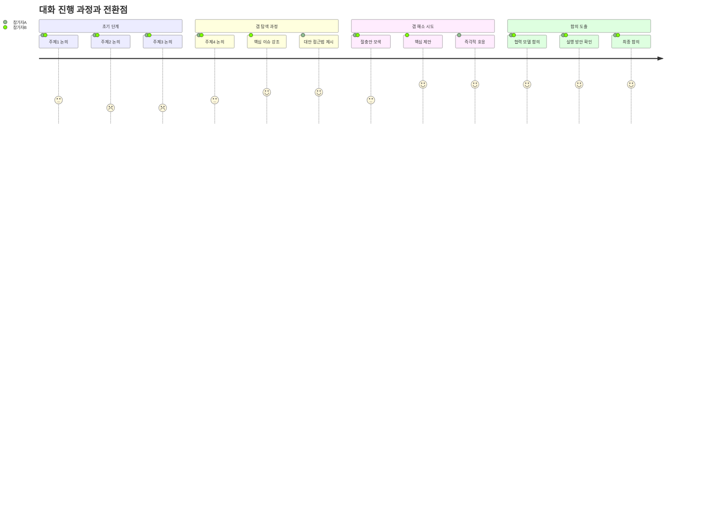
```mermaid
journey
    title 대화 진행 과정과 전환점
    section 초기 단계
      주제1 논의: 3: 참가자A, 참가자B
      주제2 논의: 2: 참가자A, 참가자B
      주제3 논의: 2: 참가자A, 참가자B
    section 갭 탐색 과정
      주제4 논의: 3: 참가자A, 참가자B
      핵심 이슈 강조: 4: 참가자B
      대안 접근법 제시: 4: 참가자A
    section 갭 해소 시도
      절충안 모색: 3: 참가자A, 참가자B
      핵심 제안: 5: 참가자B
      즉각적 호응: 5: 참가자A
    section 합의 도출
      협력 모델 합의: 5: 참가자A, 참가자B
      실행 방안 확인: 5: 참가자A, 참가자B
      최종 합의: 5: 참가자A, 참가자B
```

## 11. 참가자 간 상호작용 시퀀스 (Interaction Sequence)

> 미팅 참가자들 간의 주요 상호작용과 정보/아이디어 교환을 시간 순서대로 시각화합니다.

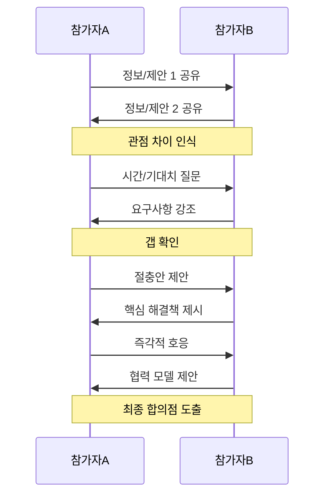
```mermaid
sequenceDiagram
    participant A as 참가자A
    participant B as 참가자B
    
    A->>B: 정보/제안 1 공유
    B->>A: 정보/제안 2 공유
    Note over A,B: 관점 차이 인식
    
    A->>B: 시간/기대치 질문
    B->>A: 요구사항 강조
    Note over A,B: 갭 확인
    
    A->>B: 절충안 제안
    B->>A: 핵심 해결책 제시
    
    A->>B: 즉각적 호응
    B->>A: 협력 모델 제안
    
    Note over A,B: 최종 합의점 도출
```

### 시각적 시퀀스 다이어그램

```
┌─────────────┐                  ┌─────────────┐
│  참가자A    │                  │  참가자B    │
└──────┬──────┘                  └──────┬──────┘
       │                                │
       │   정보/제안 1 공유             │
       │────────────────────────────────>
       │                                │
       │   정보/제안 2 공유             │
       │<────────────────────────────────
       │                                │
       │         관점 차이 인식          │
       ├────────────────────────────────┤
       │                                │
       │   시간/기대치 질문             │
       │────────────────────────────────>
       │                                │
       │   요구사항 강조                │
       │<────────────────────────────────
       │                                │
       │         갭 확인                │
       ├────────────────────────────────┤
       │                                │
       │   절충안 제안                  │
       │────────────────────────────────>
       │                                │
       │   핵심 해결책 제시             │
       │<────────────────────────────────
       │                                │
       │   즉각적 호응                  │
       │────────────────────────────────>
       │                                │
       │   협력 모델 제안               │
       │<────────────────────────────────
       │                                │
       │         최종 합의점 도출        │
       ├────────────────────────────────┤
       │                                │
```

### 핵심 갭 비교표

| 영역 | 참가자A | 참가자B | 갭 해소 방안 |
|------|---------|---------|-------------|
| **영역1** | 관점 설명 | 관점 설명 | 해결책 설명 |
| **영역2** | 관점 설명 | 관점 설명 | 해결책 설명 |
| **영역3** | 관점 설명 | 관점 설명 | 해결책 설명 |
| **영역4** | 관점 설명 | 관점 설명 | 해결책 설명 |
| **영역5** | 관점 설명 | 관점 설명 | 해결책 설명 |

## 12. 추가 시각화 옵션

### 12.1 사분면 맵핑 (Quadrant Mapping)

> 2차원 좌표 시스템을 사용하여 관점이나 제안을 시각화합니다.

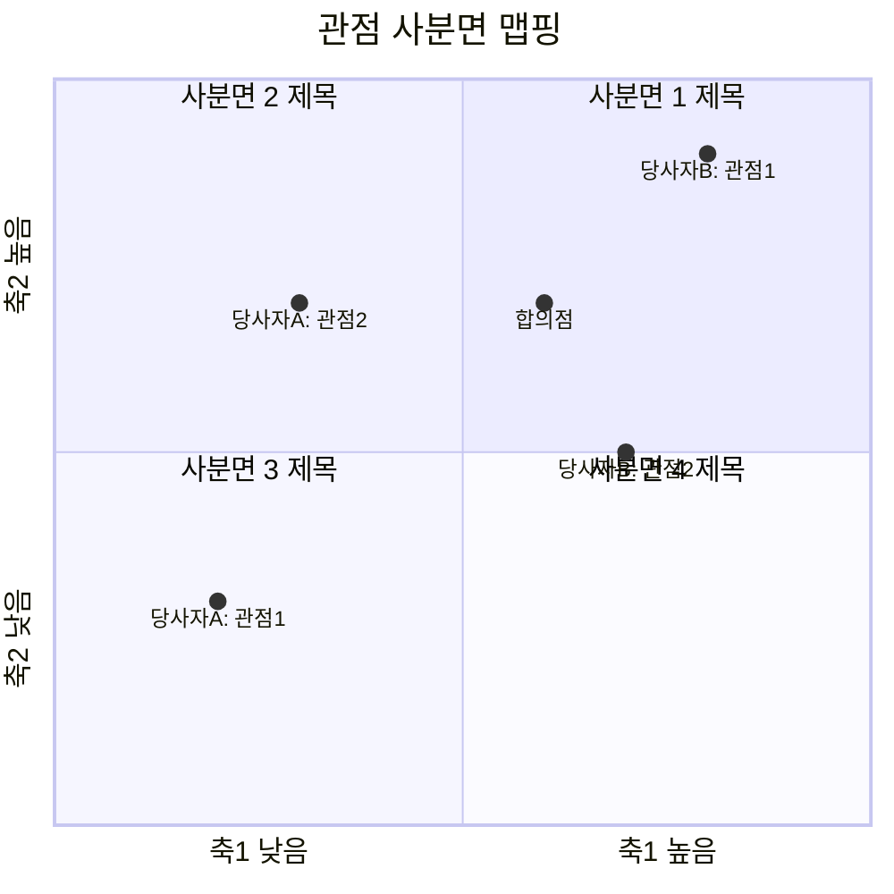
```mermaid
quadrantChart
    title 관점 사분면 맵핑
    x-axis 축1 낮음 --> 축1 높음
    y-axis 축2 낮음 --> 축2 높음
    quadrant-1 "사분면 1 제목"
    quadrant-2 "사분면 2 제목"
    quadrant-3 "사분면 3 제목"
    quadrant-4 "사분면 4 제목"
    "당사자A: 관점1": [0.2, 0.3]
    "당사자A: 관점2": [0.3, 0.7]
    "당사자B: 관점1": [0.8, 0.9]
    "당사자B: 관점2": [0.7, 0.5]
    "합의점": [0.6, 0.7]
```

### 12.2 관계도 (Relationship Diagram)

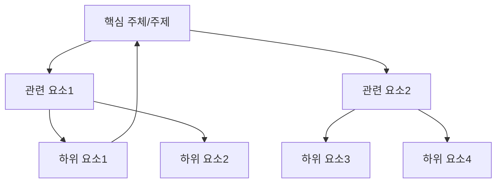
```mermaid
graph TD
    A[핵심 주체/주제] --> B[관련 요소1]
    A --> C[관련 요소2]
    B --> D[하위 요소1]
    B --> E[하위 요소2]
    C --> F[하위 요소3]
    C --> G[하위 요소4]
    D --> A
```

### 12.3 피쉬본 다이어그램 (Cause-Effect)

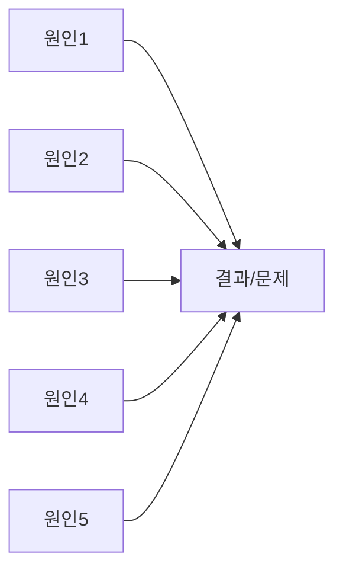
```mermaid
graph LR
    A[원인1] --> M[결과/문제]
    B[원인2] --> M
    C[원인3] --> M
    D[원인4] --> M
    E[원인5] --> M
```

### 12.4 방사형 차트 (Radar Chart)

방사형 차트는 Mermaid에서 직접 지원하지 않지만, 다음과 같이 ASCII 아트로 표현할 수 있습니다:

```
              전략적 접근
                  │
                  │
                  │
                  │
                  │
 혁신성 ──────────┼────────── 구조적 안정성
                  │
                  │
                  │
                  │
                  │
              실행적 접근

  ● 당사자A   ■ 당사자B   ★ 합의점
```

또는 표 형식으로 레이더 차트 데이터를 제공할 수 있습니다:

| 영역 | 당사자A (1-10) | 당사자B (1-10) | 합의점 (1-10) |
|------|---------------|---------------|--------------|
| 전략적 접근 | 8 | 9 | 8.5 |
| 구조적 안정성 | 9 | 6 | 7.5 |
| 실행적 접근 | 5 | 8 | 7 |
| 혁신성 | 6 | 9 | 8 |
| 리스크 허용도 | 4 | 7 | 5.5 |

## 13. 갭 해결 경로 맵 (Gap Resolution Path Map)

> 이 맵은 초기 갭 상태에서 최종 합의로 가는 주요 단계와 경로를 시각화합니다.

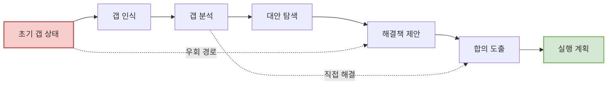
```mermaid
graph LR
    A[초기 갭 상태] --> B[갭 인식]
    B --> C[갭 분석]
    C --> D[대안 탐색]
    D --> E[해결책 제안]
    E --> F[합의 도출]
    F --> G[실행 계획]
    
    style A fill:#f8cecc,stroke:#b85450,stroke-width:2px
    style G fill:#d5e8d4,stroke:#82b366,stroke-width:2px
    
    A -.-> |"우회 경로"| E
    C -.-> |"직접 해결"| F
```

## 14. 용어 통일표 (Terminology Alignment)

> 미팅에서 합의된 주요 용어 및 정의를 정리합니다. 서로 다른 용어 사용에서 오해를 방지합니다.

| 용어 | 당사자A 정의 | 당사자B 정의 | 합의된 정의 |
|------|-------------|-------------|------------|
| **용어1** | 당사자A의 이해 | 당사자B의 이해 | 최종 합의된 정의 |
| **용어2** | 당사자A의 이해 | 당사자B의 이해 | 최종 합의된 정의 |
| **용어3** | 당사자A의 이해 | 당사자B의 이해 | 최종 합의된 정의 |
| **용어4** | 당사자A의 이해 | 당사자B의 이해 | 최종 합의된 정의 |
| **용어5** | 당사자A의 이해 | 당사자B의 이해 | 최종 합의된 정의 |

---

## 📋 템플릿 사용 팁 (v2.0 업데이트)

1. **선택적 활용**: 모든 다이어그램을 사용할 필요는 없습니다. 분석 목적에 맞는 다이어그램만 선택하세요.

2. **색상 활용**: 다이어그램에 색상을 추가하면 시각적 이해도가 높아집니다. classDef와 class를 활용하여 일관된 스타일을 적용하세요.

3. **레벨 구분**: 복잡한 미팅은 Lv1(실행), Lv2(관리), Lv3(전략) 관점으로 구분하면 효과적입니다.

4. **특수문자 주의**: 마인드맵과 같은 특정 다이어그램에서는 작은따옴표(')나 특수문자가 렌더링 문제를 일으킬 수 있으니 가능한 피하세요.

5. **백업 표현 제공**: 복잡한 다이어그램은 표 형태의 백업 데이터를 함께 제공하면 렌더링 문제가 발생해도 정보를 확인할 수 있습니다.

6. **최적화된 노드 텍스트**: 다이어그램의 노드 텍스트는 간결하게 유지하고, 필요시 라인 브레이크(br)를 사용하세요.

7. **일관된 용어 사용**: 문서 전체에서 동일한 용어와 개념을 일관되게 사용하세요.

8. **갭 분석 중심**: 모든 다이어그램에서 관점 차이(갭)와 해소 방안을 명확히 보여주는 데 중점을 두세요.

9. **통합 분석**: 여러 다이어그램의 결과를 종합하여 핵심 인사이트를 도출하세요.

10. **정기적 활용**: 정기 미팅에 동일한 템플릿을 사용하면 시간에 따른 변화를 추적할 수 있습니다.

---

> 이 템플릿은 '슈퍼디스코-부국캐피탈 갭분석 시각화' 문서를 기반으로 개선되었습니다.
> 모든 다이어그램은 Mermaid.js 문법을 사용합니다 (https://mermaid.js.org/).
> 템플릿 v2.0은 렌더링 문제 해결, 시각화 개선, 백업 데이터 제공 등의 개선사항을 포함합니다.